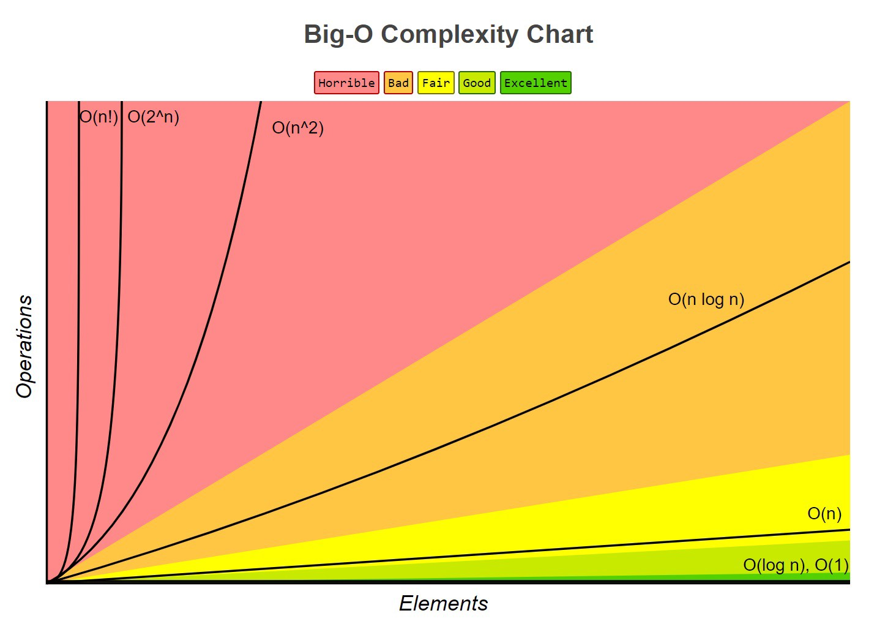
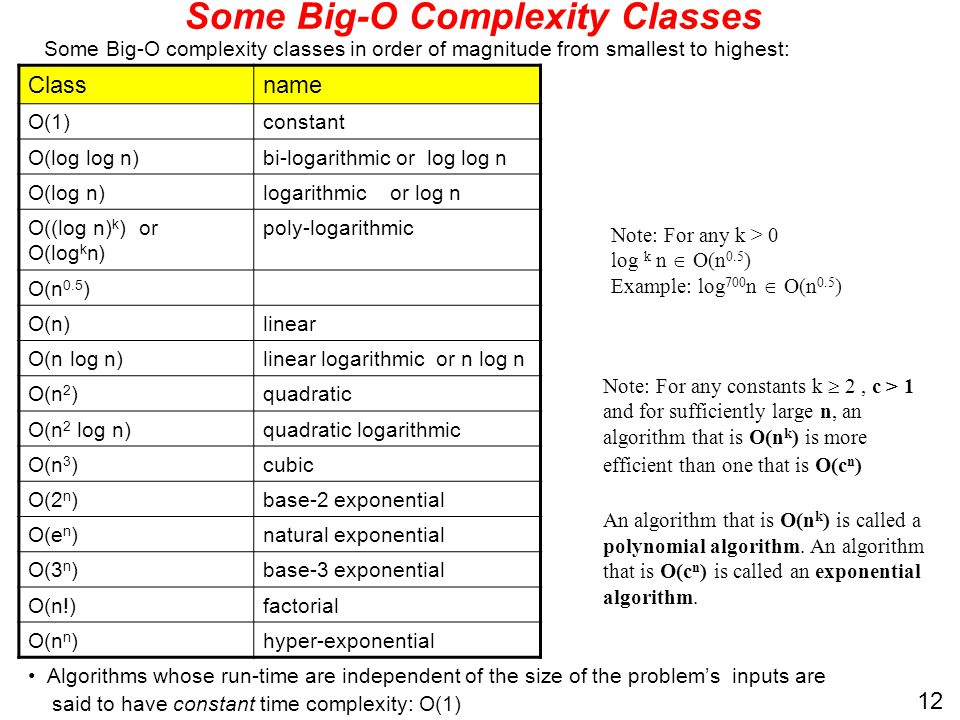
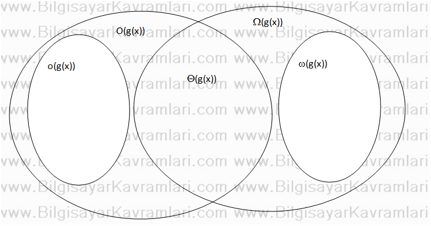

 
[Source Wiki - Programming Paradigm](http://www.wikizero.biz/index.php?q=aHR0cHM6Ly9lbi53aWtpcGVkaWEub3JnL3dpa2kvUHJvZ3JhbW1pbmdfcGFyYWRpZ20)

[Source Wiki - List of Algorithms](http://www.wikizero.biz/index.php?q=aHR0cHM6Ly9lbi53aWtpcGVkaWEub3JnL3dpa2kvTGlzdF9vZl9hbGdvcml0aG1z)

[Big-O Cheatsheet](http://bigocheatsheet.com/)


[Big-O good video tutorial](https://www.youtube.com/watch?v=D6xkbGLQesk)

### __English__


- __Typical steps in the development of algorithms:__

1. Problem definition
2. Development of a model
3. Specification of the algorithm
4. Designing an algorithm
5. Checking the correctness of the algorithm
6. Analysis of algorithm
7. Implementation of algorithm
8. Program testing
9. Documentation preparation


- __Algoritmaların Sınıflandırılması__

 By Implementation

 1. Recursion
 2. Logical (Mantıksal)
 3. Serial, Parallel or Distributed
 4. Deterministic (parametreleri iyi bilinen, belli ibr gidişle aynı sonucu veren ve içinde olasılık barındırmayan modeller, stokastik modeller tam tersidir.) or Non-Determininistic
 5. Exact or Approximate


By Design Paradigm

1. Brute-force or Exhaustive (Kapsamlı) Search
2. Divide and Conquer (Bil ve Fethet) : Merge Sorting, Quicksort
3. Search and Enumeration
4. Randomized Algorithm
5. Reduction of Complexity : This technique involves solving a difficult problem by transforming it into a better-known problem for which we have (hopefully) asymptotically optimal algorithms. 
6. Back Tracking


By Field of Study

Every field of science has its own problems and needs efficient algorithms. Related problems in one field are often studied together. Some example classes are 

1. search algorithms, 
2. sorting algorithms, 
3. merge algorithms, 
4. numerical algorithms, 
5. graph algorithms, 
6. string algorithms, 
7. computational geometric algorithms, 
8. combinatorial algorithms, 
9. medical algorithms, 
10. machine learning, 
11. cryptography, 
12. data compression algorithms and parsing techniques.

Fields tend to overlap with each other, and algorithm advances in one field may improve those of other, sometimes completely unrelated, fields. For example, dynamic programming was invented for optimization of resource consumption in industry but is now used in solving a broad range of problems in many fields.


Optimization Problems

- Linear Programming
- Dynamic Programming: When a problem shows optimal substructures—meaning the optimal solution to a problem can be constructed from optimal solutions to subproblems—and overlapping subproblems, meaning the same subproblems are used to solve many different problem instances, a quicker approach called dynamic programming avoids recomputing solutions that have already been computed. For example, Floyd–Warshall algorithm, the shortest path to a goal from a vertex in a weighted graph can be found by using the shortest path to the goal from all adjacent vertices. Dynamic programming and memoization go together. The main difference between dynamic programming and divide and conquer is that subproblems are more or less independent in divide and conquer, whereas subproblems overlap in dynamic programming. 
- The Greedy Algorithm: The most popular use of greedy algorithms is for finding the minimal spanning tree where finding the optimal solution is possible with this method. Huffman Tree, Kruskal, Prim, Sollin are greedy algorithms that can solve this optimization problem.
- The Heuristic Algorithm : In optimization problems, heuristic algorithms can be used to find a solution close to the optimal solution in cases where finding the optimal solution is impractical. 


By Complexity

1. Constant time: if the time needed by the algorithm is the same, regardless of the input size. E.g. an access to an array element.
2. Linear time: if the time is proportional to the input size. E.g. the traverse of a list.
3. Logarithmic time: if the time is a logarithmic function of the input size. E.g. binary search algorithm.
4. Polynomial time: if the time is a power of the input size. E.g. the bubble sort algorithm has quadratic time complexity.
5. Exponential time: if the time is an exponential function of the input size. E.g. Brute-force search.


### Computational Complexity


- __Karmaşıklık Sınıfları (Complexity Classes)__
* Küçük-o (small-o)
* Büyük-O (big-o) - En Kötü Durum Analizi (örneğin lineer arama yani sırasız listede aramada en kötü durum bütün sayıları gezmektir)
* Teta (Theta Θ) - (örneğin lineer arama yani sırasız listede aramada ortalama durum örneğin 100 rakam için 50. ci rakamda aradığımızı bulma durumudur.)
* Büyük omega (big-Ω ) - En iyi Durum Analizi (örneğin lineer arama yani sırasız listede aramada en iyi durum ilk sayıda aradığımızı bulmaktır)
* Küçük omega(small-ω )


* O(1): O(1) describes an algorithm that will always execute in the same time (or space) regardless of the size of the input data set.

``` C#
bool IsFirstElementNull(IList<string> elements)
{
    return elements[0] == null;
}

```

* O(N)

``` C#
bool ContainsValue(IList<string> elements, string value)
{
    foreach (var element in elements)
    {
        if (element == value) return true;
    }

    return false;
}
```

* O(N^2)

``` C#
bool ContainsDuplicates(IList<string> elements)
{
    for (var outer = 0; outer < elements.Count; outer++)
    {
        for (var inner = 0; inner < elements.Count; inner++)
        {
            // Don't compare with self
            if (outer == inner) continue;

            if (elements[outer] == elements[inner]) return true;
        }
    }

    return false;
}

```

* O(2^N)

``` C #

int Fibonacci(int number)
{
    if (number <= 1) return number;

    return Fibonacci(number - 2) + Fibonacci(number - 1);
}

```


### __Turkish__


- [Hesapsal Karmaşıklık Kuramı P=NP ](https://youreads.net/baslik/hesapsal-karmasiklik-kurami--37872)

- [Wiki - NP Karmaşıklık](http://www.wikizero.biz/index.php?q=aHR0cHM6Ly90ci53aWtpcGVkaWEub3JnL3dpa2kvTlAtY29tcGxldGU) : NP, belirsiz Turing Makinesi ile çokterimli (polinomsal) zamanda çözülebilen karar problemlerini içeren karmaşıklık sınıfıdır. Bu sınıftaki problemler belirli Turing Makinesi ile çokterimli zamanda doğrulanabilirler ve bu şekilde doğrulanabilen her problem NP sınıfındadır. Bu nedenle NP, (belirli Turing Makinesi ile) çokterimli zamanda doğrulanabilen problemlerin sınıfı olarak da tanımlanabilir.

Belirli Turing makinesi aynı zamanda belirsiz Turing makinesi olduğundan, P sınıfındaki bütün problemler aynı zamanda NP'dedir.

    * NP-Hard : En az her bir NP problem kadar zor olan problemlerin bulunduğu sınıfa NP-Zor (NP-hard) denir. Daha resmi bir şekilde,

    * NP-Complete : NP-Tam (NP-complete), hem NP olup hem NP-Zor olan problemlerin sınıfıdır. Dolayısıyla bu sınıftaki problemler NP sınıfının en zor problemleridir. Yukarıdaki tanımdan yola çıkarak, herhangi biri çokterimli zamanda çözülebilirse, bütün hepsi çok terimli zamanda çözülebilir.


- [Wiki - Linear Zaman](http://www.wikizero.biz/index.php?q=aHR0cHM6Ly90ci53aWtpcGVkaWEub3JnL3dpa2kvTGluZWVyX3phbWFu) : Lineer zamanda çalışan bir algoritma, bir Turing makinesinin girişin uzunluğunun en fazla n katı tane adımda çözebildiği bir problemdir. Lineer zaman, polinomsal zamanın bir alt kümesidir.

- [Wiki - Sabit Zaman](http://www.wikizero.biz/index.php?q=aHR0cHM6Ly90ci53aWtpcGVkaWEub3JnL3dpa2kvU2FiaXRfemFtYW4) : Sabit zamanda çalışan bir algoritma bir Turing makinesinin girdi uzunluğundan bağımsız olarak n tane adımda çözebildiği bir problemdir. Sabit zaman polinomsal zamanın bir alt kümesidir.


- [Wiki - Polinamsal Zaman](http://www.wikizero.biz/index.php?q=aHR0cHM6Ly90ci53aWtpcGVkaWEub3JnL3dpa2kvUG9saW5vbXNhbF96YW1hbg) : 


Polinomsal zamanda çalışan bir algoritma, bir Turing makinesinin girişin uzunluğuna göre en fazla bir polinom tane adımda çözebildiği bir problemdir.

Polinomsal zaman, daha basit bazı zamanlara ayrılabilir:

    * Sabit zaman
    * Lineer zaman
    * İkinci derece zaman vs.


[Wiki Üstel Zaman](http://www.wikizero.biz/index.php?q=aHR0cHM6Ly90ci53aWtpcGVkaWEub3JnL3dpa2kvJUMzJTlDc3RlbF96YW1hbg)

[Wiki Logaritmeik Zaman](http://www.wikizero.biz/index.php?q=aHR0cHM6Ly90ci53aWtpcGVkaWEub3JnL3dpa2kvTG9nYXJpdG1pa196YW1hbg) Örneğin İkili Arama algoritması Logaritmik zamanda çalışır. Logaritmik zamanda çalışan bir algoritma, bir Turing makinesinin girişin uzunluğu n ise en fazla log(n) civarı adımda çözebildiği bir problemdir. Örneğin, ikili arama algoritması logaritmik zamanda çalışır.


[Big-O Cheatsheet](http://bigocheatsheet.com/)


- __Algorima Nedir?__
Bir sorunu çözmek veya belirlenmiş bir amaca ulaşmak için tasarlanan yola, takip edilen işlem basamaklarına algoritma denir. Algoritmalar açıkça belirtilmiş bir başlangıcı ve  sonu olan işlemler kümesidir. Amaca ulaşmak için işlenecek çözüm yolları ve sıralamaları belirlenir ve algoritma bu sırayı takip ederek en mantıklı çözüme ulaşır. İlk algoritma, El-Harezmi’nin ‘Hisab-el Cebir ve El Mukabala’ kitabında sunulmuştur ve algoritma kelimesi de El-Harezmi’nin isminden gelmiştir. Algoritma terimi genellikle matematikte ve bilgisayar bilimlerinde karşımıza çıkmaktadır.


- __Algoritmada 3 temel bileşenimiz vardır.__

1. Değişkenler: Dışarıdan girilen ve bizim oluşturduğumuz değerleri tutan elemanlardır.
2. Algoritma:  Kısaca gerekli adımların mantıksal bir sıra ile yazılmasıdır.
3. Akış Diyagramı: Birbirine oklar gösterilerek algoritmaları ve şemaları birbirine bağlayan kutulara denir.

Her algoritma aşağıdaki kriterleri sağlamalıdır.

1. Girdi (Input)   : Sıfır veya daha fazla değer dışarıdan verilmeli.
2. Çıktı  (Output)  : En azından bir değer üretilmeli.
3. Açıklık, Kesinlik (Definiteness)  : Her işlem (komut) açık olmalı ve farklı anlamlar içermemeli.
4. Sonluluk (Finiteness): Her türlü olasılık için algoritma sonlu adımda bitmeli.
5. Etkinlik, Verimlilik (Effectiveness)  : Her komut kişinin kalem ve kağıt ile yürütebileceği kadar basit olmalıdır.


###  __Algortima Çeşitleri__

1. Arama (search) Algoritmaları,
2. Sıralama (sorting) Algoritmaları,
3. Veri tabanı Algoritmaları,
4. Sıkıştırma Algoritmaları,
5. Dinamik Programlama Algoritmaları,
6. Şifreleme Algoritmaları,
7. Optimizasyon Algoritmaları,
8. Genetik Algoritmalar,
9. Kök bulma algoritmaları,

- Bir Fonksyonun Büyüme Hızı (Big-O)




[Big-O Cheatsheet](http://bigocheatsheet.com/)

- Asimptotik analiz : Asimptotik analiz (asymptotic analysis), bir algoritmanın çalışma performansının (runtime performance) sınırlarını matematiksel olarak belirlemek için kullanılan bir yöntemdir. Algoritma adımlarının çalışması için gerekli sürenin (zaman karmaşıklığı) alt ve üst sınırlarının matematiksel olarak ifade edilmesini sağlayan bir algoritma analizi metodudur. [kaynak](http://bilgioloji.com/pages/yazilim/kod/program/algoritma/analiz/algoritmalarin-asimptotik-analizi-ne-demektir/)

__Neden?__
Bir program çalıştırıldığında küçük n'ler (girdiler) için kaynak kullanımı kritik bir anlam ifade etmez. Genelde karmaşıklığın büyük n'ler için (öyle ki n sonsuza giderken) analizi yapılır. Bu da onun asimptotik davranışıdır.

__Gösterim__
Algoritmaların asimptotik analizi, Büyük O notasyonu ile ifade edilir.


Fonksiyonun büyüme hızını matematikte big-o olarak ifade edilen fonksiyon gösterir.

Big-O aslında bir algoritmanın çalışacağı en kötü durumu ifade eder.  Diğer durumlar ortalama ve en iyi durumdur.

Big-O için genel kurallar

* Sabit değerler yok sayılır. örneğin 5n -> O(n) olarak alınır
* Büyüme hızlerı şu şekildedir.

1 < log n < n (lineer durum) < n log n < n^2 < n^3 < 2^n < n! 

sağa doğru durum kötüleşir.

yani log n , n (lineer) den daha iyi bir durumdur.

ayrıca n^2, 2^n  den daha iyi bir durumdur.


Polinom  (n^2, n^3 vb üstel durumlarda) zamanda çözülebilen algoritmalara uysal (tractable), polinom zamandan daha hızlı büyüyen algorştmalara uysal olmayan (untracktable) ismi verilir.




- __Karmaşıklık Sınıfları (Complexity Classes)__
* Küçük-o (small-o)
* Büyük-O (big-o) - En Kötü Durum Analizi (örneğin lineer arama yani sırasız listede aramada en kötü durum bütün sayıları gezmektir)
* Teta (Theta Θ) - (örneğin lineer arama yani sırasız listede aramada ortalama durum örneğin 100 rakam için 50. ci rakamda aradığımızı bulma durumudur.)
* Büyük omega (big-Ω ) - En iyi Durum Analizi (örneğin lineer arama yani sırasız listede aramada en iyi durum ilk sayıda aradığımızı bulmaktır)
* Küçük omega(small-ω )

yer karmaşıklığı hafızada tutulacak yere göre hesaplanır. zaman karmaşıklığından farklı hesaplanır. örneğin 100 elamnlı bir sayı dizisi için 100 birimlik bir yer lazımdır en kötü durum için tabi en iyi durum içinde 100 elemanlık yer lazımdır. bu örnek için zaman karmaşıklığı kaç elemana bakarak sonuca ulaştığıdır.




[Kaynak: Bilgisayar Kavramları](http://bilgisayarkavramlari.sadievrenseker.com/2010/06/17/karmasiklik-siniflari-complexity-classes/)


- __Koddan karmaşıklık analizi__
* iki for içiçe ise n^2
* iki for altalta ise 2n
* içiçe iki for olsa ve bunlardan biri sarmlayan for un i inci elemanına göre dönse ozaman n(n+1)/2 den o(n2) olarak çıkar.

Aslında burada dışarıdaki le içerideki for ları toplam dönüş sayılarına göre karar veriliyor. aşağıdaki örnekden daha farklı for lar için daha farklı karmaşıklık değerleri de çıkacaktır.

örnek

```C#

for(i=0;i<n;n++){

    for(j=i;j<n;n++)
    {


    }


}

```

* ortalama bir iş yapan her satır 1 olarak kabül edilir. sabit bu rakamlar dikkate alınmaz
* eğer her adımda iş öncekinin yarısı kadar azalıyorsa ozaman logn olur. iş her adımda örneğin karesel artıyorsa 2 katı, 3 katı şeklinde ozaman örneğin 2^n, 2^3 gibi olur.
her seferinde iş bir önceki durumun yarısı kadar azalıyorsa ozaman log2n.


örnekte içerdeki for üstteki her zaman i nin yarısı kadar çalışıyor. yani dışarınaki döngü n kadar dönecekse içerideki döngü yarısı kadar dönmüş olacak.

yani bu durumda Big-O O(nlog2n) olacaktır. yani bir n (iç for) log2n (dış for) kadar dönmüş olacak.

burada normalde log2n logn olarak yazılır sadece log 2 tabanında demetir. 

diğer bir durumu şöyle düşünelim i/2 değilde i/3 olsaydı o zamanda nlog3n şeklinde yazacaktık.


örnek 

```C#

for(i=0;i<n;i=i/2)
{
    for(j=i;j<n;n++)
    {


    }


}

```

diğer örnekler


* O(1): O(1) describes an algorithm that will always execute in the same time (or space) regardless of the size of the input data set.

``` C#
bool IsFirstElementNull(IList<string> elements)
{
    return elements[0] == null;
}

```

* O(N)

``` C#
bool ContainsValue(IList<string> elements, string value)
{
    foreach (var element in elements)
    {
        if (element == value) return true;
    }

    return false;
}
```

* O(N^2)

``` C#
bool ContainsDuplicates(IList<string> elements)
{
    for (var outer = 0; outer < elements.Count; outer++)
    {
        for (var inner = 0; inner < elements.Count; inner++)
        {
            // Don't compare with self
            if (outer == inner) continue;

            if (elements[outer] == elements[inner]) return true;
        }
    }

    return false;
}

```

* O(2^N)

``` C #

int Fibonacci(int number)
{
    if (number <= 1) return number;

    return Fibonacci(number - 2) + Fibonacci(number - 1);
}

```


