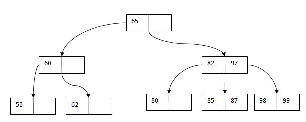
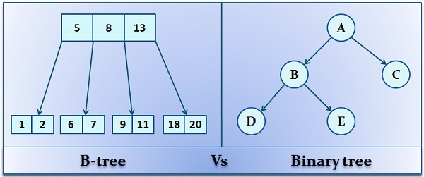

## English

[Wiki Search Algorithms](http://www.wikizero.biz/index.php?q=aHR0cHM6Ly9lbi53aWtpcGVkaWEub3JnL3dpa2kvU2VhcmNoX2FsZ29yaXRobQ)

In computer science, a search algorithm is any algorithm which solves the search problem, namely, to retrieve information stored within some data structure, or calculated in the search space of a problem domain, either with discrete or continuous values. Specific applications of search algorithms include:

1. Problems in combinatorial optimization, such as:
    * The vehicle routing problem, a form of shortest path problem
    * The knapsack problem: Given a set of items, each with a weight and a value, determine the number of each item to include in a collection so that the total weight is less than or equal to a given limit and the total value is as large as possible.
    * The nurse scheduling problem
2. Problems in constraint satisfaction, such as:
    * The map coloring problem
    * Filling in a sudoku or crossword puzzle
3. In game theory and especially combinatorial game theory, choosing the best move to make next (such as with the minmax algorithm)
4. Finding a combination or password from the whole set of possibilities
5. Factoring an integer (an important problem in cryptography)
6. Optimizing an industrial process, such as a chemical reaction, by changing the parameters of the process (like temperature, pressure, and pH)
7. Retrieving a record from a database
8. Finding the maximum or minimum value in a list or array
9. Checking to see if a given value is present in a set of values

## Turkçe

Türkçe en iyi kaynaklardan birisi Dr. Şadi Evren Şeker Hocamızın  [Bilgisayar Kavramları sayfası](http://bilgisayarkavramlari.sadievrenseker.com/2009/11/23/arama-algoritmalari-search-algorithms/)

Yapısal olarak arama algoritmalarını iki grupta toplamak mümkündür.

1. Uninformed Search (Bilmeden arama)
2. Informed Search (Bilerek arama)

Arama işleminin bilmeyerek yapılması demek, arama algoritmasının, probleme özgü kolaylıkları barındırmaması demektir. Yani her durumda aynı şekilde çalışan algoritmalara uninformed search (bilmeden arama) ismi verilir. Bu aramaların bazıları şunlardır:

- Listeler (diziler (array)) üzerinde çalışan arama algoritmaları:

1. Doğrusal Arama (Linear Search)
2. İkili arama (binary search)
3. Interpolasyon Araması (Ara değer araması, Interpolation Search)

Şekiller (graflar (Graphs) ) üzerinde çalışan algoritmalar

5. Sabit Maliyetli Arama (Uniform Cost Search)
6. Floyd Warshall algoritması
7. Prim’s Algoritması
8. Kruskal Algoritması
9. Dijkstra Algoritması
10. Bellman Ford Algoritması
11. İkili arama ağacı (Binary Search Tree)
12. Prüfer dizilimi
13. Ağaçlarda Sığ öncelikli arama (breadth first search)
14. Şekillerde (Graph) sığ öncelikli arama (Breadth First Search, BFS)
15. Derin öncelikli arama (depth first search)
16. Derin Limitli Arama (Depth Limited Search) Algoritması
17. Yinelemeli Derinleşen Derin Öncelikli Arama Algoritması (Iterative Deepining Depth First Search, IDDFS)
18. Patricia Ağaçları
19. Trie Ağaçları (metin ağaçları, trie trees)
20. B-ağaçları (B-Tree)

Metin arama algoritmaları (bir yazı içerisinde belirli bir dizgiyi (string) arayan algoritmalar)

1. Hor spool Arama Algoritması
2. Knuth-Morris Prat arama algoritması
3. Boyer-Moore Arama algoritması
4. Kaba Kuvvet Metin Arama Algoritması (Brute Force Text Search, Linear Text Search)
5. DFA Metin Arama Algoritması
6. Ters Parça Algoritması (Reverse Factor Algorithm)

Arama işleminin bilerek yapılması ise, algoritmanın probleme ait bazı özellikleri bünyesinde barındırması ve dolayısıyla arama algoritmasının problem bazlı değişiklik göstermesi demektir. Bu algoritmaların bazıları a aşağıda listelenmiştir:

1. Minimax Ağaçları
2. Simulated Annealing (Benzetimli Tavlama) algoritması
3. Tepe Tırmanma Algoritması (Hill Climbing Algorithm)
4. Arı sürüsü arama algoritması (bees search algorithm)
5. A* Araması (astar search)
6. Geri izleme (backtracking)
7. Işın arama (beam search)

### __1. Doğrusal Arama (Linear Search)__

4 6 12 8 5 15 25 34

Teker teker bütün sayılara bakılır. Örneğin baştan başlanarak 4 aranan sayı mı? değil 6 aranan sayı mı değil 12 aranan sayı mı değil şeklinde bütün sayılar alınır ve aranan sayı bulunana kadar devam eder.

algoritma karmaşıklığı O(n) dir.

### __2. İkili arama (binary search)__

Arama algoritması, yapı olarak parçala fethet (divide and conquere) yaklaşımının bir uygulamasıdır.Bu anlamda problemin log2(n) adımda çözülmesi beklenir. Burada logaritmik fonksiyonların üssel fonksiyonların tersi olduğu ve her adımda problemi iki parçaya böldüğümüzü hatırlayınız.

Sıralanmış rakamlarda arama yapar.

şu şekilde çalışır

1. Problemde aranacak uzayın tam orta noktasına bak
2. Şayet aranan değer bulunduysa bit
3. Şayet bakılan değer aranan değerden büyükse arama işlemini problem uzayının küçük elamanlarında devam ettir.
4. Şayet bakılan değer arana değerden küçükse arama işlemini problem uzayının büyük elemanlarında devam ettir.
5. Şayet bakılan aralık 1 veya daha küçükse aranan değer bulunamadı olarak bitir.

### __3. Interpolasyon Araması (Ara değer araması, Interpolation Search)__

ara değer şu formül kullanılarak hesaplanır. 

orta = soli + ((x-a[sol]) * (sagi – soli) ) / ( a[sag] – a[sol])

- soli = arama alanının başlangıcı
- sagi =  arama alanının sonu
- a[sol] = dizideki sol değeri
- a[sag] = dizideki sag

bu ara değer bulma formülün farklı şekilleride mevcut.

- indexler
1  -  2  -  3  -  4  -  5  -  6  -  7  -  8

- değerler

1  -  3  -  5  -  8  -  10 -  13 -  16 -  19

Şekiller (graflar (Graphs) ) üzerinde çalışan algoritmalar.

- sol index = 1   //arama alanının başlangıcı
- sag index = 8 //arama alanının sonu
- a[sol] = 1 // dizideki sag değeri
- a[sag] = 19 // dizideki sol değeri
- x = 8 // aranan değer

Orta = 1 +((8 - 1) * (8 -1))  / ((19 - 1))

Orta = 1 + 49 / 18 = 3.72 = > 4

yani bizim rakamlarımıza göre 8 değeri 

dolayısıyla a[4] değeri ara değerimiz olmaktadır ve bu değerin aradığımız değer olup olmadığı kontrol edilir. Buna göre a[4] = 8’tir ve aradğımız değere (8) eşittir.

Şayet bulunan orta değeri aranan değerden küçükse aradığımız değer daha sağda olduğu için orta değer, sol olarak kabul edilip işlem tekrarlanır.

Şayet bulunan orta değeri aranan değerden büyükse aradığımız değer daha solda olduğu için orta değer, sağ olarak kabul eidlip işlem tekrarlanır.

## __Graph Algoritmaları __

### __5. Sabit Maliyetli Arama (Uniform Cost Search)__

Bilgisayar bilimlerinde arama algoritmaları için kullanılan bir terimdir. Algoritma ağırlıklı graflar (weighted graphs) üzerinde çalışmaktadır. Ağaçlar da bir graf örneği olduğu için algoritmanın ağaçlar üzerinde çalışması da mümkündür. Algoritma basitçe aşağıdaki şekilde tanımlanabilir:

1. Kök düğümden başla (root node)
2. En düşük maliyetli komşuya git
3. Şayet aranan düğüm bulunduysa bit, bulunmadıysa 2. Adıma geri dön

### __6. Floyd Warshall algoritması__

En kısa yol algoritmalarından biridir.

Algoritmanın kullanım alanları

Floyd-Warshall algoritması aşağıdaki amaçlar için kullanılabilir:

- Yönlü graflarda en kısa yolun bulunması için. (Yukarıda bu durumu gösteren bir örnek bulunmakta)
- Bir düğümden seyahat edilebilecek diğer düğümlerin bulunmasında (transitive closure). Örneğin matrisin ilk halinde gidilemeyen düğümler sonsuz değerine sahiptir. Şayet matris işlendikten sonra hala sonsuz değerine sahip matris elemanı bulunursa bunun anlamı o satır ve sütündakı düğümler arasında gidişin aktarmalı da olsa mümkün olmadığıdır.
- Düzenli ifadelerde (regular expressions) herhangi bir tekrarlı olayın tespiti için kullanılabilir. Kleen yıldızı (kleen’s algorithm) şeklinde tekrar eden ifadelerin bulunmasına yarar. Şayet çıkan matriste bir düğümden diğer düğüme giden yol sonsuz değilse ve diyagona göre simetriği olan yol da sonsuz değilse bir kleen yıldızı üretilebilir.
- Ağ programlamasında özellikle yönlendirici algoritmalarında (routing algorithms) en kısa yolun tayin edilmesinde kullanılabilir.
- Yönsüz bir grafın (undirected graph), iki parçalı graf (bipartite graph) olup olmadığının bulunmasında kullanılabilir. Basitçe graftaki mesafelerin tamamını 1 uzunluğunda kabul edersek (veya mesafe olarak atlanan düğüm sayısını (hop count) kabul edersek) bu durumda bir düğümden gidilebilen bütün komşu düğümlerin mesafesi ya tek ya da çift olmalıdır. Bir düğümün hem tek hem de çift komşusu varsa bipartite değildir denilebilir.

### __7. Prim’s Algoritması__

En Kısa yol bulma algoritmalarından olan Prims algoritması Greedy bir algoritmadır. Öncelikli olarak En kısa yol bulma algoritmalarındaki temel amacı belirtelim. En Kısa yol bulma algoritmalarında ağırlıklı graf kullanılır. İki düğüm arası bir maliyet değeri vardır. Bunu iki şehir arasındaki uzaklık gibi düşünebilirsiniz. Bu tip algoritmalardaki amaç iki düğüm arasındaki en kısa yolu bulma olduğu gibi, tüm düğümleri en kısa yolu kullanarak gezmeyi hedeflemek de olabilir. Prims Algoritmasındaki amaç tüm düğümleri en az maliyet ile dolaşmaktır.

node lar cycle oluşturmayacak şekilde gezilir.

Prims Node lar üzerinden giderken Kruskal edge ler üzerinden gider.

Prims de bir node seçilerek bir sonraki node için en kısa olan tercih edilir.

Kruskal da ise sistem deki tüm edge ler küçükten büyüğe doğru sıralarnır.

amac en kısa yoldan bütün nıde ları gezmektir. (minimum spanning tree)

### __8. Kruskal Algoritması__

Bir asgari tarama ağacı (minimum spanning tree) algoritması olan Dijkstra algoritması, işaretlemiş olduğu komşuluklara en yakın düğümü bünyesine katarak ilerler. 

En kısa yol bulma algoritmalarından bir tanesi olan Kruskal algoritması bir graf yapısı içerisinde tarama ağacı oluşturarak tüm düğümlere ulaşmayı hedefler. Kağıt üzerinde uygularken oldukça efektif olan bu algoritma Prims algoritmasıyla aynı amacı taşır, ancak uygulama olarak düğümleri değil, kenarları inceler.

[örnek için](https://www.algoritmauzmani.com/algoritmalar/kruskal-algoritmasi-nedir-kruskal-algoritmasi-c-kodu/)

Prims Node lar üzerinden giderken Kruskal edge ler üzerinden gider.

Prims de bir node seçilerek bir sonraki node için en kısa olan tercih edilir.

Kruskal da ise sistem deki tüm edge ler küçükten büyüğe doğru sıralarnır.

en küçükten büyüğe doğru yol çizilir, daha önce geçilen edgeler bir daha kullanılmaz.

amac en kısa yoldan bütün nıde ları gezmektir. (minimum spanning tree)

### __9. Dijkstra Algoritması (Shortest Path)__

Amaç ki node arasındaki en kısa yolu bulmaktır.

1. bir node seçilir ve o noda bağlı tüm node lara uzaklıklar kaydedlir.
2. ilk aşamadaki yollardan en kısası seçilir ve ona bağlı node lara olan uzaklıklar kaydedilir.
3. 2ci adım tüm ziyaret edilmemiş nodelar için uygulanır.

böylece ilk noddan diğer node lara olan tüm en kısa yollar çıkarılmış olacaktır.

en zayıf tarafı negatif değerlede çalışmamaktadır.

Bellman-Ford algorithm is a single-source shortest path algorithm, so when you have negative edge weight then it can detect negative cycles in a graph.

The only difference between two is that Bellman Ford is capable also to handle negative weights whereas Dijkstra Algorithm can only handle positives.

### __10. Bellman Ford Algoritması (Shortest Path)__

Bu algoritmanın amacı, bir şekil (graph) üzerindeki, bir kaynaktan (source) bir hedefe(target veya sink) giden en kısa yolu bulmaktır. Bu anlamda, literatürde en kısa yol bulma algoritması (shortest path algorithm) olarak sınıflandırılabilir. Algoritma ağırlıklı şekiller (weighted graph) üzerinde çalışır. Kabaca, bütün düğümler için bütün kenarları dolaşır. Dolayısıyla performansı düğüm sayı ile kenar sayısının çarpımı olarak düşünülebilir. O(v,e)

Algoritma Dijkstra algoritmasında olduğu gibi en küçük değere sahip olan kenardan gitmek yerine bütün graf üzerindeki kenarları test eder. Bu sayede aç gözlü yaklaşımının (greedy approach) handikabına düşmez ve her düğüme sadece bir kere bakarak en kısa yolu bulmuş olur.

Bellman-Ford algorithm is a single-source shortest path algorithm, so when you have negative edge weight then it can detect negative cycles in a graph.

The only difference between two is that Bellman Ford is capable also to handle negative weights whereas Dijkstra Algorithm can only handle positives.

### __11. İkili arama ağacı (Binary Search Tree)__

[B-Tree vs Binary Tree](https://techdifferences.com/difference-between-b-tree-and-binary-tree.html) 

Arama ve bulma aslında aynı kod.

sol küçük rakam, sağ büyük rakam

[Kaynak](http://www.mathcs.emory.edu/~cheung/Courses/171/Syllabus/9-BinTree/BST-delete2.html)

1. Infix : dolaşırken önce sol, sonra düğüm, sonra sağ node ele alınabilir (LNR), veya RNL olabilir. Node un (N) ortada olma durumu. burada örneğin soldan kasıt ilgili nodun solundaki tüm done ları onlarında öncelikle solu olmak koşuluyla bitirmek anlamına geliyor. Root node 56, sol 26 ve sağ 190, soldaki 26 için ikinci levelde sol değer 18, sağ değer 28 , vs.vs.vs

                                    {56}
                                {26}  -  {200}
                           {18},{28}  -  {190},{213}
                      {12},{24}       -
                        

LNR için örneğin tüm node lar dolaşılarak değerler sırayla yazılır.

LNR = 12,18,24,26,27,28,56,190,200,213 (önce soldan başladığımız için küçükten büyüğe sırlama yapmış olduk)

RNL olsaydı ozaman önce büyükler gelecekti.

bunu yamak için recursive fonksiyonlar kullanılır.

2. Prefix : NLR, NRL

3. Postfix : LRN, RLN

Max ve Min değerleri bulmak şu şekilde: hep solda gidersek en küçük, hep sağ nodelara bakarak gidersek max değer bulunmuş olur.

- __silme işlemleri__

1. Silme işlemiinde ise son leaf ler silinirse bir şeyleri değiştirmeye gerek yok
2. aralarda silme yapılırken silinene node a bağlı sadece tek node varsa ozaman o tek node silinen node un yerine taşınır
3. aralarda silme yapılırken eğer silinen node a bağlı 2 çocuk node varsa o zaman 2 yöntemden biri tercih edilir. 
    - silinen node un sağındaki node ların hep solundan gidilerek en küçük rakama sahip node bulunur, veya
    - silinenen node un solundaki node ların hep sağından gidilerek en büyük rakam bulunur ve bulunan node silinen node yerine yazılır.

ancak arada silme yapılacaksa şu şekilde yapılır.

silinen node un solundakilerden en büyüğü veya sağındakilerin en küçüğü silinene node yerine konulursa ağaç bozulmamış olur, yani kuralına ıuygun şekilde çalışıyor olur.

                                    {56}
                                {26}  -  {200}
                           {18},{28}  -  {190},{213}
                      {12},{24}       -

örneğin 56 yı sileceğimizi düşünelim. Bu durumda sağdakilerin en küçüğü 190 olacaktır. yada solundaki node üzerinde hep solda devam ederek solun en büyük rakamı olan 28 bulunur. 28 veya 190 56 rakamı çıktıktan sonra 56 yerine kullanılırsa sistem bozulmamış olur.

### __12. Prüfer dizilimi__

__Breadth First Search (BFS) vs Depth First Search (DFS)__

- Depth First: Derinliğe öncelik verilir. Yani graph üzerinde gidilebildiği kadar derine gidilir. Aşağıdan yukarı doğru bakılarak gidilir. yani önce çocuklara bakılır.

- breadth First: öncelikle aynı seviyedeki node lerın dolaşılması durumudur. Yani örneğin bi binary tree yapısında oncelikle ilk çocukları gezip sonra il çocukların çcouklarını gezip bu iekilde aşağıya doru gidilmesi durumudur.

BFS|DFS
---|---
BFS Stands for “Breadth First Search”.|DFS stands for “Depth First Search”.
BFS starts traversal from the root node and then explore the search in the level by level manner i.e. as close as possible from the root node.|DFS starts the traversal from the root node and explore the search as far as possible from the root node i.e. depth wise.
Breadth First Search can be done with the help of queue i.e. FIFO implementation.|Depth First Search can be done with the help of Stack i.e. LIFO implementations.
This algorithm works in single stage. The visited vertices are removed from the queue and then displayed at once.|This algorithm works in two stages – in the first stage the visited vertices are pushed onto the stack and later on when there is no vertex further to visit those are popped-off.
BFS is slower than DFS.|DFS is more faster than BFS.
BFS requires more memory compare to DFS.| DFS require less memory compare to BFS.
Applications of BFS - To find Shortest path - Single Source & All pairs shortest paths - In Spanning tree - In Connectivity|Applications of DFS  - Useful in Cycle detection  - In Connectivity testing  - Finding a path between V and W in the graph.- useful in finding spanning trees & forest. 
BFS is useful in finding shortest path.BFS can be used to find the shortest distance between some starting node and the remaining nodes of the graph. | DFS in not so useful in finding shortest path. It is used to perform a traversal of a general graph and the idea of DFS is to make a path as long as possible, and then go back (backtrack) to add branches also as long as possible.

### __13. Ağaçlarda Sığ öncelikli arama (breadth first search)__
### __14. Şekillerde (Graph) sığ öncelikli arama (Breadth First Search, BFS)__
### __15. Derin öncelikli arama (depth first search)__
### __16. Derin Limitli Arama (Depth Limited Search) Algoritması__
### __17. Yinelemeli Derinleşen Derin Öncelikli Arama Algoritması (Iterative Deepining Depth First Search, IDDFS)__
### __18. Patricia Ağaçları__
### __19. Trie Ağaçları (metin ağaçları, trie trees)__
### __20. B-ağaçları (B-Tree)__

- B-Tree, çok yollu bir arama ağacıdır.
- Bir node’un en fazla m çocuğu vardır.
- Her yaprak olmayan node’un (kök hariç) en az m/2 çocuğu
olmalıdır.
- Bir node’taki anahtar, sol alt ağaçtaki tüm anahtarlardan
büyüktür ve sağ alt ağaçtaki tüm anahtarlardan küçüktür. 
- Kök (root) node en az iki tane yaprak olmayan node’a
sahiptir.
- Yaprak ve kök olmayan her node k-1 tane anahtara ve k
adet alt ağaç referansına sahiptir.
(m/2 ≤ k ≤ m)
- k çocuklu bir yaprak olmayan node’u k -1 anahtara
sahiptir.
- Capacity order=d dersek, anahtarlar d ile 2d arasında
olmak zorundadır. Sadece kök 1 ile 2d arasında olabilir.
İşaretçiler ise d+1 ile 2d+1 arasındadır. Yalnız kökün
işaretçileri 2 ile 2d+1 arasında olabilir.
- Bütün yapraklar aynı düzeydedir. 

Anahtar Ekleme:
1. Eğer boş alanı olan bir yaprağa yerleştirilecekse
doğrudan yaprağın ilgili alanına yerleştirilir.
2. Eğer ilgili yaprak doluysa, yaprak ikiye bölünür ve
anahtarların yarısı yeni bir yaprak oluşturur. Eski
yapraktaki en son anahtar bir üst seviyedeki node’
aktarılır ve yeni yaprağı referans olarak gösterir.
3. Eğer kök ve tüm yapraklar doluysa, önce ilgili
yaprak ikiye bölünür ve eski yapraktaki en son
anahtar köke aktarılır. Kök node’da dolu olduğu
için ikiye bölünür ve eski node’daki en son anahtar
kök yapılır.

Arama

Bağacında (Btree) arama işlemi kökten başlar. Aranan sayı kök düğümde bulunamaması halinde arama işlemi kökte bulunan anahtarların sağında solunda veya arasında şeklinde yönlendirilir. Örneğin yukarıdaki B-ağacında 87 anahtarı aranıyor olsun. Arama işlemi için aşağıdaki adımlar gerekir:

1. kök düğüme bakılır. 87 değeri 65’ten büyüktür. Kök düğümde tek anahtar olduğu için 65’in sağındaki gösterici(pointer) takip edilir.

2. 65 sağındaki düğüme gidilir ve ilk anahtar olan 82 ile aranan anahtar olan 87 karşılaştırılır. 87 değeri 82’den büyüktür. Öyleyse ikinci anahtar olan 97 ile karşılaştırılır. 87 bu değerden küçük olduğu için bu düğümde 82 ile 97 arasında bulunan gösterici izlenir.

3. Son olarak 82 ile 97 arasındaki düğüm izlenerek ulaşılan düğümdeki anahtar ile 87 karşılaştırılır. Bu düğümdeki ilk anahtar 85’tir. 87 bu değerden büyüktür. Düğümdeki bir sonraki anahtar alınır ve 87 değeri bulunur.

B-ağaçlarının bir özelliği ağacın her düğümündeki anahtarların sıralı oluşudur. Bu yüzden bir düğümde istenen anahtar aranırken, düğümde bulunan sayılara teker teker bakılır (linear search, doğrusal arama)

[B-Tree vs Binary Tree](https://techdifferences.com/difference-between-b-tree-and-binary-tree.html) 

BASIS FOR COMPARISON|B-TREE|BINARY TREE
--------------------|------|-----------
Essential constraint|A node can have at max M number of child nodes(where M is the order of the tree).|A node can have at max 2 number of subtrees.
Used|It is used when data is stored on disk.|It is used when records and data are stored in RAM.
Height of the tree|LogM N (where m is the order of the M-way tree)|log2 N
Application|Code indexing data structure in many DBMS.|Code optimization, Huffman coding, etc.

Metin arama algoritmaları (bir yazı içerisinde belirli bir dizgiyi (string) arayan algoritmalar)

### __1. Hor spool Arama Algoritması__

Algoritmanın gayesi, bir metin içerisinde verilen bir dizginin (string) aranmasıdır. Literatürde arama yapılan metin için T (ingilizcedeki Text (metin) kelimesinden gelmektedir) ve aranan kelime için P (ingilizcedeki Pattern (örüntü) kelimesinden gelmektedir) kullanılmaktadır.

Algoritmanın diğer metin arama algoritmalarından en büyük farkı, aranan dizgi (pattern) yerine aranılan metin (text) üzerinden işlem yapmasıdır.

arama işlemine başlanan α değerinin ardından gelen harfler eşleştiği sürece, aranan kelimenin (pattern) sonuna kadar eşleştikçe arama işlemi devam eder. Şayet bu aşama uyuşmayan bir harf olursa, zaten aranan kelimenin olmadığı sonucuna varılabilir.

### __2. Knuth-Morris Prat arama algoritması__

Knuth-Morris-Prat algoritması bir kelimenin (yada bir metin parçasının) bir metin içerisinde aranmasını sağlayan algoritmadır. Basitçe bu algoritmada bir kelimenin aranan metinde bakılması ve bakıldığı yerde bulunamaması durumunda nerede olabileceği ile ilgili bir bilginin elde edilmesi hedeflenir.

Algoritma aranan kelimenin, aranan metinde bulunmaması durumunda, kelimenin içerisindeki harflerden yola çıkarak birden fazla ihtimali elemektedir.

Klasik bir metin arama işleminde aranan kelime metindeki bütün ihtimallerde denenir. (örneğin doğrusal arama (linear search) bu şekilde çalışır).  KMP algoritmasında ise aranan metindeki bütün ihtimaller denenmez. Bu durumu anlamak için bir örnek üzerinden algoritmayı inceleyelim:

KMP algoritmasının çalışması.

Örneğin metin olarak:

ŞABCDŞADEFABŞADI

Aranan kelime olarak da :

ŞADI

için KMP algoritmasının nasıl çalıştığını inceleyelim.

Öncelikle metin ve aranan kelime aşağıdaki şekilde ilk harflerinden karşılaştırılmaya başlanır:

ŞABCDŞADEFABŞADI
ŞADI
ilk iki harfin tutmasına karşılık 3. ve 4. harfler tutmamaktadır. Algoritma benzemeyen ilk harf olan 3. harfi bulunca geri kalanını benzetmeye çalışmaktan vaz geçer. Ayrıca bakmış olduğu harflerden hiçbirisi aradığı kelime olmadığı için metinde aradığı kelime boyu kadar kayarak yeniden arama yapar.

ŞABCDŞADEFABŞADI
    ŞADI
Yukarıdaki şekilde 4 harf kayarak D harfinden itibaren arama yapmaya başlar çünkü bir önceki aramada, ilk 4 harf arasında aranan kelimenin ilk harfi olan Ş harfinin bulunmadığını anlamış ve artık bu harflere bakmak gerekmediği sonucuna varmıştır.

4. harf olan D harfi ile başlayan metinde, aranan kelime olan ŞADI karşılaştırılmış ve görülmüştür ki metin uymmamaktadır. Ancak aranan metnin bir parçası olan ŞAD kısmı buradaki aranan harfler arasındadır. dolayısıyla algoritma bu sefer 1 harf kaydırarak ve Ş harflerini alt alta getirerek deneme yapar.

ŞABCDŞADEFABŞADI
     ŞADI
Karşılaştırma işlemi sonucunda ilk 3 harf tutmasına karşılık son harfte problem vardır ve karşılaştırılan harflerden hiç birisi aradığımız kelimenin baş harfi olan Ş ile başlamamaktadır. Bu durumda metinde 4 harf daha hareket edilerek bir sonraki karşılaştırma işlemi yapılır:

ŞABCDŞADEFABŞADI
         ŞADI
Karşılaştırmada başarı olmamasına karşılık son harf Ş harfidir ve dolayısıyla bu harfi yakalamak için 3 harf daha kaydırılır:

ŞABCDŞADEFABŞADI
            ŞADI
Bu kez başarı elde edilmiş ve aranan kelime bulunmuştur.

Yukarıdaki örnekte dikkat edilirse toplam 5 karşılaştırma işlemi yapılmıştır. Bu işlem doğrusal arama algoritması ile yapılsaydı 12 karşılaştırma gerekcekti. Bu anlamda KMP algoritmasının daha başarılı olduğu söylenebilir.

Algoritmanın performansı olarak O(n) değeri bulunabilir (n metnin boyutu olarak düşünülürse). Doğrusal arama ile aynı sonucun alındığı algoritma performansı için en kötü durum analizi yapıldığı ve en kötü durumda doğrusal arama ile aynı olacağı unutulmamalıdır.

Daha fazla bilgi için bir benzer algoritma olan boyer moore algoritmasına bakabilirsiniz.

### __3. Boyer-Moore Arama algoritması__

### __4. Kaba Kuvvet Metin Arama Algoritması (Brute Force Text Search, Linear Text Search)__

Bilgisayar bilimlerinde bir metnin içerisinde başka bir metnin aranması için kullanılan en ilkel ve dolayısıyla en düşük performanslı arama algoritmasıdır (search algorithm). Algoritma hedef metinde, aranan metni harf harf bulmaya çalışır. Bu yapısından dolayı diziler üzerinde kullanılan doğrusal arama (linear search) algoritmasına oldukça benzer ve literatürde doğrusal metin araması (linear text search) ismi de verilmektedir.

### __5. DFA Metin Arama Algoritması__

bu algoritmanın güzel bir anlatımı için Dr. Şadi Evren ŞEKER hocamızın sayfasına bakılabilir
[Bilgisayar Kavramları](http://bilgisayarkavramlari.sadievrenseker.com/2009/11/24/dfa-metin-arama-algoritmasi-dfa-text-search/)

### __6. Ters Parça Algoritması (Reverse Factor Algorithm)__

bu algoritmanın güzel bir anlatımı için Dr. Şadi Evren ŞEKER hocamızın sayfasına bakılabilir
[Bilgisayar Kavramları](http://bilgisayarkavramlari.sadievrenseker.com/2015/04/01/ters-parca-algoritmasi-reverse-factor-algorithm/)

