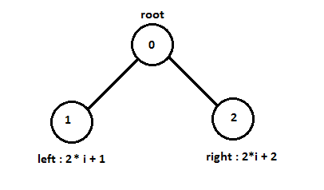
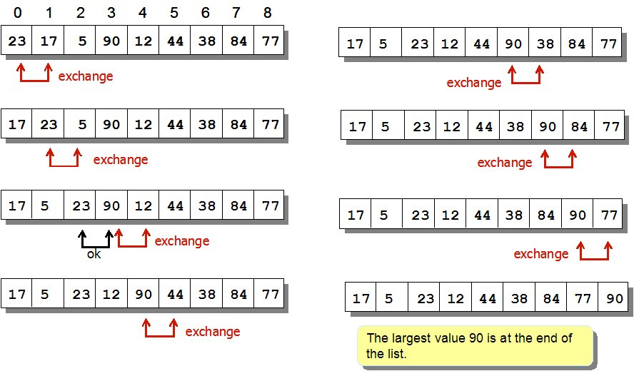

## English

Name|Best|Average|Worst|Memory|Stable|Method|Other notes
----|----|-------|-----|------|------|------|-----------
Quicksort|nlogn variation is n | nlogn|n^2|log n on average, worst case space complexity is n; Sedgewick variation is logn wors case|Typical in-place sort is not stable; stable versions exist.| Partitioning|Quicksort is usually done in-place with O(log n) stack space.|
Merge sort|nlon|nlogn|nlogn|A hybrid block merge sort is O(1) mem.|Yes|Merging| Highly parallelizable (up to O(log n) using the Three Hungarians' Algorithm or, more practically, Cole's parallel merge sort) for processing large amounts of data.|
Insertion sort|n|n^2|n^2|1|Yes|Insertion|O(n + d), in the worst case over sequences that have d inversions.
Selection sort|n^2|n^2|n^2|1|No|Selection|Stable with  O(n) extra space or when using linked lists
Shell Sort|nlogn|Depends on gap sequence|Depends on gap sequence;
best known is n^(4/3)|1|No|Insertion|Small code size, no use of call stack, reasonably fast, useful where memory is at a premium such as embedded and older mainframe applications. There is a worst case O(n(logn)^2) gap sequence but it loses O(n(logn)n) best case time
Binary tree sort | nlogn| nlogn| nlogn(balanced)|n|Yes|Insertion|In-place with theoretically optimal number of writes.
Comb sort|nlogn|n^2|n^2|1|No|Exchanging|Faster than bubble sort on average.

[Source Wikipedia](http://www.wikizero.biz/index.php?q=aHR0cHM6Ly9lbi53aWtpcGVkaWEub3JnL3dpa2kvU29ydGluZ19hbGdvcml0aG0)

## Türkçe

__Kararlılık__ :  Kararlı sıralama algoritmaları sıralanacak dizinin içinde değerleri birbirine eşit olan öğerlerin birbirlerine göre olan konulmlarını korur. Başka bir deyişle, bir sıralama algoritması kararlı olduğunda, eğer R ve S gibi içerdiği değer aynı olan iki öğe bulunduran asıl dizide, R, S' den önce geliyorsa, sıralanmış dizide de R, S'den önce olur.

### __Sıralama Algoritmaları__

Bu konuda görebildiğim en dolu içerik Bilsayar Kavramları sitesi. Büyük oranda oradan ama diğer kaynaklarıda tarayarak buraya koymaya çalıştım. Sadi Evren Şeker hocamıza teşekkürler.

- [Bilgisayar Kavramları - Sıralama Algoritmaları](http://bilgisayarkavramlari.sadievrenseker.com/2008/08/09/siralama-algoritmalari-sorting-algorithms/)

- [Wiki Sıralama Algoritmaları](http://www.wikizero.biz/index.php?q=aHR0cHM6Ly90ci53aWtpcGVkaWEub3JnL3dpa2kvU8SxcmFsYW1hX2FsZ29yaXRtYXPEsQ)

- [Emre şatır Sıralama Algoritmaları](https://emresatir.net/dersler/veri-yapilari-ve-algoritmalar/siralama-algoritmalari/)

1. Seçerek Sıralama (Selection Sort)
2. Hızlı Sıralama Algoritması (Quick Sort Algorithm)
3. Birleştirme Sıralaması (Merge Sort)
4. Yığınlama Sıralaması (Heap Sort)
5. Sayarak Sıralama (Counting Sort)
6. Kabarcık Sıralaması (Baloncuk sıralaması, Bubble Sort)
7. Taban Sıralaması (Radix Sort)
8. Sokma Sıralaması ( Insertion Sort)
9. Sallama Sıralaması (Shaker Sort)
10. Kabuk Sıralması (Shell Sort)
11. Rastgele Sıralama (Bogo Sort)
12. Şanslı Sıralama (Lucky Sort)
13. Serseri Sıralaması (Stooge Sort)
14. Şimşek Sıralaması (Flahs Sort, Bora Sıralaması)
15. Tarak Sıralaması (Comb Sort)
16. Gnome Sıralaması (Gnome Sort)
17. Permütasyon Sıralaması (Permutation Sort)
18. Strand Sort (İplik Sıralaması)

hafızanın kullanımına göre de sıralama algoritmaları :

1. Harici Sıralama (External Sort)
2. Dahili Sıralama (Internal Sort)

## __1. Seçerek Sıralama (Selection Sort)__

her bir adımda kalan sayıların en küçüğü bulunarak ilk elemanla yer değştirilir.

5,7,2,9,6,1,3,7

1. örneğin yukarıdaki sayılar için 8 adımlık fir döngü başlatırlır.
2. ilk adımda 1 ile 5 yer değiştirilir. 
1,7,2,9,6,5,3,7
3. ikinci adımda for dongüsü artık 7 rakamından başlayacaktır yanı ilk eleman 7 dir. 2 sayısı ile yerdeğiştirir.
1,2,7,9,6,5,3,7
4. üçüncü adımda for dongüsü artık 7 rakamından başlayacaktır yanı ilk eleman 7 dir. 3 sayısı ile yerdeğiştirir.
1,2,3,9,6,5,7,7
5. dördüncü adımda for dongüsü artık 9 rakamından başlayacaktır yanı ilk eleman 9 dir. 5 sayısı ile yerdeğiştirir.
1,2,3,5,6,9,7,7
6. beşinici adımda for dongüsü artık 6 rakamından başlayacaktır yanı ilk eleman 6 dir. kalan listede en küçük rakam kendisi olduğu için yer değiştirme olmayacaktır.
1,2,3,5,6,9,7,7
7. altıncı adımda for dongüsü artık 9 rakamından başlayacaktır yanı ilk eleman 9 dir. ilk 7 sayısı ile yerdeğiştirir.
1,2,3,5,6,7,9,7
8. yedinci adımda for dongüsü artık 9 rakamından başlayacaktır yanı ilk eleman 9 dir. 7 sayısı ile yerdeğiştirir.
1,2,3,5,6,7,7,9

## __2. Hızlı Sıralama Algoritması (Quick Sort Algorithm)__

Mantık olara devide and conqure algoritmasıdır. 

Adımları şu şekildedir.

1. Öncelikle diziden bir pivot noktası (partitioning element) seçilir. 
2. Diyelimki pivot olarak ilk rakamı seçtik ozaman bu sayının sağında kalan tüm rakamlarda ilk ve en sonuncusu karşılaştırılır ve pivot rakamdan büyük olanalar sağ en sağa küçük olanlar en sola konulur. daha sonra bir içerideki rakama geçilir.
3. Pivot rakamından büyük olanlar pivotun sağına küçük olanlar pivotun soluna konulur. dizideki rakamların yerlerini değiştirmek çok maliyetli olduğu için bu işi çok hızlı yapmak için geliştirilmiş bir algoritma zaten.
4. daha sonra pivotun sağındakiler ve solundakiler için pivot noktalar seçilerek tüm lite sıralnıncaya kadar işlem devam ettirilir.

0. 5,7,2,(9),6,1,4,7
0. 5,7,2,(6),1,4,7  (orta değer 6 seçilir)
2. 5,2,1,4      7,7 (6 dan küçğk ve büyük olanlar)
3. 5,(2),1,4        (2 den büyük ve küçğk olanlar)
4. 1,    4,5      

daha sonra her bir parçanın arasına orta değerler eklenerek birletirme yapılırsa

5. 1,(2),4,5,(6),7,7,(9)

## __3. Birleştirme Sıralaması (Merge Sort)__
Basitçe sıralanacak olan diziyi ikişer elemanı kalan parçalara inene kadar sürekli olarak ikiye böler. Sonra bu parçaları kendi içlerinde sıralayarak birleştirir. Sonuçta elde edilen dizi sıralı dizinin kendisidir. Bu açıdan bir parçala fethet (divide and conquere) yaklaşımıdır.

zaman karmaşıklığı divide and coquere yaklaşımında logaritmik seviyeye iner. buda hızlı çalıştığı anlamına gelir.

burada merge-sort da devamlı ikiye bölünerek parçalara ayırma olduğu için log2 tabanında bir karmaşıklığa sahiptir. eğer 3 e bölünerek gidilseydi log3, 4 olsaydı log4 şeklinde olacaktı.

merge-sort da parçalara ayırma yapıldıktan sonra parçalar her birleştirmede sıraya dizilir.

5,7,2,9,6,1,3,7

1. 5,7,2,9 - 6,1,3,7
2. 5,7 - 2,9 - 6,1 - 3,7
3. 5 - 7 - 2 - 9 - 6 - 1 - 3 - 7
4. 5,7 - 2,9 - 1,6 - 3,7
5. 2,5,7,9 - 1,3,6,7
6. 1,2,3,5,7,7,9

## __4. Yığınlama Sıralaması (Heap Sort)__

Binary Search Tree lerden farklılıklaır şu şekildedir.

1. BST de çocuk ile ebeveynşler arasında  ilişki söz knusudur. örneğin büyük eleman ebeveynin sağına, küçük eleman solune gelir.

ancak Heap larda böyle bir iliişki yoktur

2. BST de aşağı ve yukarı doğru arama yapılırken pointer lar kullanılır. yani ebeveynler çocuklarını pointer yardımıyla bilir.

Heap larda ise diziler yardımıyla tutulur. örneğin max heap da herhzaman en üst değer en üstte durur. Her bir node  da iki çocuk olur sol ve sağ. seçilen bir node un index(i) i kullanılarak node un sol çocuğunu bulmak için (2*i)+1 sağ çocuk için (2*i)+2  formülü kullanılır.

Algoritmanın karmaşıklığı O(nlogn) dir. yani eleman sayısı kadar logn lik bir işlem yapar. her adımda incelenek parça sayısı azalır.

[Bilgisayar Kavramları Heap Tree 1 ](http://bilgisayarkavramlari.sadievrenseker.com/2008/08/09/yigin-agaci-heap/)

[Bilgisayar Kavramları Heap Sort](http://bilgisayarkavramlari.sadievrenseker.com/2008/08/09/yiginlama-siralamasi-heap-sort/)

Algoritmanın Çalışması Örnek Naimasyon

Kayhan Ayar - Videolu Anlatım.

[Kayhan Ayar Video](https://www.youtube.com/watch?v=imJdyG__4SQ)

## __5. Sayarak Sıralama (Counting Sort)__

normalde sıralama algoritmalarının O(n) zamanda sıralamayacağı aslında ispatlanmış. Ancak Sayarak sıralama algoritması hafızada fazldan bie dizi daha tutarak sıralamayı O(n) zamanda bitirebilmektedir.

5,7,2,9,6,1,3,7

- Dizi indisi:	    0	1	2	3	4	5	6	7	8	9

- Değeri (sayma):	0	1	1	1	0	1	1	2	0	1

sayma sayılarından hangisinden kaçtane yazacağını bütün listeyi bir kez geçerek yazdıktan sonra 

0 dan 0 tane, 1 den 1 tane, 2 den bir tane, .... 7 den 2 tane ve 9 dan 1 tane olacak şekilde elde etmiş oluyoruz.

## __6. Kabarcık Sıralaması (Baloncuk sıralaması, Bubble Sort)__

Kabarcık Sıralaması (ing. Bubble Sort) algoritması aynı Seçmeli Sıralama (ing. Selection Sort) algoritması gibi temelde kaba kuvvet (ing. brute force) yaklaşımına dayanır. 

Algoritmanın saf hali her durumda O(n^2)’de çalışır fakat aşağıda da açıklayacağımız gibi, algoritmaya küçük bir ekleme ile iyi bir geliştirme yapılabilir. Bu durumda algoritma en iyi durumda (ing. best-case) doğrusal (ing. linear) bir zaman karmaşıklığına erişebilir.(yani zaman karmaşıklığı O(n) olur.) 

5,7,2,9,6,1,3

1. adım: 5,2,7,6,1,3,9
2. adım: 2,5,6,1,3,7,9
3. adım: 2,5,1,3,6,7,9
4. adım: 2,1,3,5,6,7,9
5. adım: 1,2,3,5,6,7,9
6. adım: 1,2,3,5,6,7,9

- birinci iyileştirme:  Dizi şayet sıralıysa elemanların yer değiştirmesini gerektiren if koşuluna hiç girilmez. Bu durumda kodumuzda bulunan if’e hiç girmiyorsak dizi sıralıdır ve daha fazla döngünün dönmesine gerek yoktur.

- ikinci iyileştirme: Yukarıdaki döngü dikkat edilirse n boyutundaki bir dizi için n x n = n2 kere döner.  Aslında buna gerek yoktur. Sebebi dizinin her geçişinden sonra (pass) belirli değerlerin sabit şekilde sona atılması ve bu değerlerin üzerinden tekrar geçilmesine gerek olmamasıdır.

## __7. Taban Sıralaması (Radix Sort)__

## __8. Ekleme Sıralaması ( Insertion Sort)__

33 44 21 83 56 73 22  olsun. Bu sayıları sıralamaya ilk sayıdan başlıyoruz (yani 33).

1. ilk geçişte (pass) sadece 33 sayısı sıralanmış oluyor (yani hiçbirşey yapmıyoruz):

33| 44 21 83 56 73 22 ( | işareti o anda kadar sıraladığımız sayıları gösteriyor. Bu işaretin “|” solundaki sayılar sıralanmış kabul ediyoruz. Ve her geçişte bir sağındaki sayıyı alıyoruz)

2. ikinci geçişte sıralayacağımız sayı 44. 33 ile 44’ü karşılaştırıyoruz 33 küçük dolayısıyla yer değiştirmiyorlar:

33 44 | 21 83 56 73 22

3. üçüncü geçişte sıradaki sayı 21. 21 ile 44 karşılaştırılıyor ve 21 küçük olduğu için 44 ile yer değiştiriyorlar :

33 21 44 | 83 56 73 22 (geçişimiz henüz bitmedi çünkü 21, 33’ten de küçük:)

21 33 44 | 83 56 73 22 (şimdi 3. geçişi tamamladık ve bir sonraki sayı 83’ü alabiliriz:)

4. dördüncü geçişte 83 var:

21 33 44 83 | 56 73 22 ( bu geçiş çabuk bitti çünkü 83, 44’ten büyük ve sadece bunu görmemiz durmamız için yeterli sonuçta 56’ya kadar sıralamış olduk)

5. Beşinci geçişte 56’yı sıralayacağız:

21 33 44 56 83 | 73 22 ( burada 56 ile 83 karşılaştırıldı ve 56 sayısı 83’ün soluna kaydırıldı. Bunun sebebi 56’nın 83’ten küçük olması. Bu geçişte burada bitti çünkü 56, 44’ten büyüktür)

6. Altıncı geçişte sıra 73’te

21 33 44 56 73 83 | 22 ( sıralamamız yine tek adımda bitiyor çünkü 73, 83’ten küçük ve 56’dan büyük)

7. Yedinci geçişte 22 sayısını yerleştireceğiz ve adım adım 22’den küçük olan bir sayı görene kadar 22’yi dizide kaydırıyoruz:

21 33 44 56 73 22 83 |

21 33 44 56 22 73 83 |

21 33 44 22 56 73 83 |

21 33 22 44 56 73 83 |

21 22 33 44 56 73 83 |

Sonuçta işaretimiz “|” dizinin sonuna ulaştı ve dizimiz sıralanmış oldu.

## __9. Sallama Sıralaması (Shaker Sort)__

## __10. Kabuk Sıralması (Shell Sort)__

Kabuk Sıralaması algoritmasının zaman karmaşıklığı analizi çok basit değildir çünkü seçilen aralık atlama ve azaltma sayılarının (kaynaklarda “increment sequence” olarak geçiyor) algoritmanın çalışması üzerinde büyük etkisi vardır. Algoritma en iyi durumda doğru atlama ve azaltma sayıları seçilerek Araya Sokma Sıralaması gibi O(n) zamanda çalışabilir. Ancak önemli olan nokta ise algoritmanın en kötü durumda bile, doğru atlama ve azaltma sayıları ile O(n3/2) zamanında çalışabileceğinin gösterilmiş olmasıdır. Fakat bizim aşağıda anlatacağımız yöntem basitlik açısından O(n2)’de çalışan bir yöntemdir.

 Algoritma performansı O(n2)’dir. 

5,7,2,9,6,1,3

Sıralama işlemi için öncelikle bir atlama miktarı belirlenir. Atlama miktarının belirlenmesi için çok çeşitli yollar bulunmasına karşılık en basit yöntem elimizdeki sayıların yarısından başlamaktır. Yani yukarıdaki örnekte elimizde 7 sayı olduğuna göre 3 atlama miktarı ile başlanabilir.

Sırasıyla her sayı kendinden 3 sonraki sayı ile karşılaştırılır ve bu sayılar kendi aralarında sıralanır. Bu sıralamayı daha rahat göstermek için aşağıdaki kolon gösterimi kullanılabilir:

5,7,2

9,6,1

3

Her kolon kendi içinde sıralanınca aşağıdaki sayılar elde edilir:

3,6,1

5,7,2

9

Yukarkıdaki örnekte de görüldüğü üzere sayıları sıralama işleminin 3te biri bitirilmiştir. Ardından atlama miktarı yarıya indirilir (bu örnek için 3/2 = 1 olur)

Bu durumda bütün sayılar tek bir doğrultuda sıralanır.

3,6,1,5,7,2,9

1,2,3,5,6,7,9

Yukarıdaki sıralamada örneğin kabarcık sıralaması (bubble sort) kullanılırsa dizinin orjinal haline göre (yani kabuk sıralamasının 3 atlamalı sıralama işlemi yapılmamış haline göre) çok daha başarılı olduğu görülür.

## __11. Rastgele Sıralama (Bogo Sort)__

Bilgisayar bilimlerinde özellikle eğitim amacıyla kullanılan bir sıralama algoritmasıdır. Algoritmanın çalışması oldukça basittir, bogosort, verilen bir diziyi sıralamak için rast gele bir dizilim üretir ve sıralı olup olmadığına bakar, şayet sıralıysa algoritma sona erer, şayet sıralı değilse rastgele olarak yeni bir dizilim elde eder, ta ki sayılar sıralanana kadar sayıları rastgele dizmeye devam eder.

Bu algoritma basitçe bir dizinin sıralı olana kadar rastgele dizilmesi olarak ifade edilebilir. Algoritmaya rastgele sıralama (random sort) veya maymun sıralaması (monkey sort) veya çifteli tüfek sıralaması (shotgun sort) anlamında isimlerde verilmektedir.

## __12. Şanslı Sıralama (Lucky Sort)__

## __13. Serseri Sıralaması (Stooge Sort)__

## __14. Şimşek Sıralaması (Flahs Sort, Bora Sıralaması)__

## __15. Tarak Sıralaması (Comb Sort)__

- Worst complexity: n^2
- Average complexity: n*log(n)
- Best complexity: n

Algoritma, çıkışı itibariyle kabarcık sıralaması (bubble sort) ve hızlı sıralama (quick sort) karışımı olarak düşünülebilir.

Kabarcık sıralamasında, sayılar sürekli olarak bir yanındaki sayı ile karşılaştırılır ve istenen sıraya göre yer değiştirme işlemi (swapping) yapılır. Tarak sıralamasında da benzer bir yaklaşım vardır ancak karşılaştırma ve yer değiştirme işlemleri hemen yan yana olan sayılar arasında değil de daha uzaktaki sayılar arasında yapılır. Yani kabarcık sıralaması bu anlamda aslında tarak sıralamasının özel bir örneği (mesafenin 1 olduğu ) olarak düşünülebilir. Tarak sıralamasında mesafe herhangi bir sayı olabilir.

Tarak sıralaması tıpkı kendisi gibi karşılaştırmalı bir sıralama algoritması olan Kabarcık sıralamasından daha iyidir. Kabarcık sıralamasında sayılar bir yanındaki sayı ile karşılaştırılır ve ona göre yer değişimi yapılır.Karşılaştırma mesafesi 1’dir. Tarak sıralaması da aynı bu mantıkla çalışır ama yer değişimi yanındaki sayılar ile değilde daha uzaktaki sayılar ile yapılır.Bu uzaklık büyük bir sayı ile başlar ve her seferinde “shrink factor” dediğimiz 1.247330950103979 -çoğunlukla daha kolay olsun diye 1.3’e yuvarlanır- sayısı oranınca ta ki algoritma basitçe kabarcık sıralamadaki uzaklığa yani 1 olana kadar küçültülür. 

Örnek olarak aşağıdaki şekilde verilmiş bir sayı dizisini ele alalım:

2,6,8,1,3,7,4,9,0,5

10/1.24 = 8,06 yani 8 olacak. (1.34 her döngüde kalan rakam sayısına bölünerek 8 rakamı güncellenecek)

Bu durumda 0. elemandan başlayan algoritmamız, 0. eleman ile boşluk miktarı ilerisindeki elemanı karşılaştıracak ve 8. eleman ilk elemandan küçük olduğu için (9. sırada 0 var) yer değiştirme (swapping) işlemi yapılacaktır.

0 <-> 8

0 6 8 1 3 7 4 9 2 5

Ardından sıradaki elemana bakıyoruz yani 1 ile 8 fazlası olan 9 karşılaştırılıyor ve yine 9. sıradaki sayı, 1. sıradaki sayıdan küçük olduğu için, yer değiştirme (swapping) işlemi yapılıyor.

1 <-> 9

0 5 8 1 3 7 4 9 2 6

Ardından dizinin sonuna ulaşıldığı için bu defa yeni boşluk (gap) hesaplanıyor : 8/1,24 = 6 olarak bulunuyor.

A[0] = 0 ve A[6] = 7 olduğu için değişme olmuyor,

A[1] = 5 ve A[7] = 9 olduğu için yine değişme olmuyor,

A[2] = 8 ve A[8] = 2 olduğu için küçük olanı öne alıyoruz ve değiştirme işlemi yapılıyor:

2 <-> 8

0 5 2 1 3 7 4 9 8 6

Dizinin sonuna kadar olan sayılarda bir değişme olmuyor ve yeni boşluk değeri hesaplanıyor, 6/1,24 = 4 olur:

A[0] = 0 ve A[4] = 3 değişme olmaz,

A[1] = 5 ve A[5] = 7 değişme olmaz

A[2] = 2 ve A[6] = 4 değişme olmaz

A[3] = 1 ve A[7] = 9 değişme olmaz

A[4] = 3 ve A[8] = 8 değişme olmaz

A[5] = 7 ve A[9] = 6 olduğu için yer değiştirirlirler:

5 <-> 9

0 5 2 1 3 6 4 9 8 7

Dizinin sonuna ulaştığımız için yeni atlama değeri (gap) hesaplanır: 4/1,24 = 3

A[0] = 0 , A[3] = 1 değişme olmaz,

A[1] = 5 , A[4] = 3 olduğu için yer değiştirirler:

1 <-> 4

0 3 2 1 5 6 4 9 8 7

A[2] = 2 ve A[5] = 6 değişme olmaz

A[3] = 1 ve A[6] = 4 değişme olmaz

A[4] = 5 ve A[7] = 9 değişme olmaz

A[5] = 6 ve A[8] = 8 değişme olmaz

A[6] = 4 ve A[9] = 7 değişme olmaz

Dizinin sonunda yeni boşluk değeri hesaplanır (gap) : 3/1,24 = 2

A[0] = 0 ve A[2] = 2 değişme olmaz

A[1] = 3 ve A[3] = 1 yer değiştirilir:

1<->3

0 1 2 3 5 6 4 9 8 7

A[2] = 2 ve A[4] = 5 değişme olmaz

A[3] = 1 ve A[5] = 6 değişme olmaz

A[4] = 5 ve A[6] = 4 yer değiştirilir

4 <-> 6

0 1 2 3 4 6 5 9 8 7

A[5] = 6 ve A[7] = 9 değişme olmaz

A[6] = 5 ve A[8] = 8 değişme olmaz

A[7] = 9 ve A[9] = 7 yer değiştirilir:

7 <-> 9

0 1 2 3 4 6 5 7 8 9

## __16. Gnome Sıralaması (Gnome Sort)__

## __17. Permütasyon Sıralaması (Permutation Sort)__

## __18. Strand Sort (İplik Sıralaması)__
