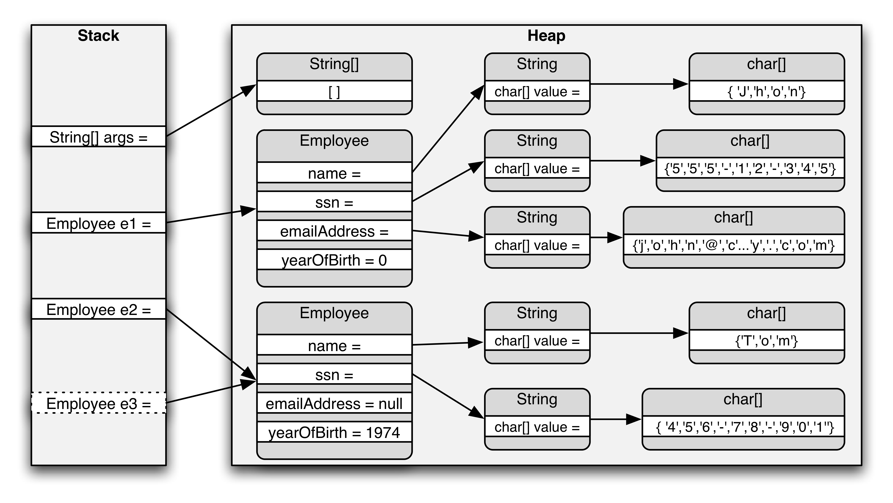

# Data Structures And Algorithms Analysis

## English 

- __Memory : Stack vs Heap__

[Source](https://www.gribblelab.org/CBootCamp/)

[Good Explanation Video -  C# - Java](https://www.youtube.com/watch?v=clOUdVDDzIM&spfreload=5)

__The Stack__

What is the stack? It's a special region of your computer's memory that stores temporary variables created by each function (including the main() function). The stack is a "LIFO" (last in, first out) data structure, that is managed and optimized by the CPU quite closely. Every time a function declares a new variable, it is "pushed" onto the stack. Then every time a function exits, all of the variables pushed onto the stack by that function, are freed (that is to say, they are deleted). Once a stack variable is freed, that region of memory becomes available for other stack variables.

The advantage of using the stack to store variables, is that memory is managed for you. You don't have to allocate memory by hand, or free it once you don't need it any more. What's more, because the CPU organizes stack memory so efficiently, reading from and writing to stack variables is very fast.

A key to understanding the stack is the notion that when a function exits, all of its variables are popped off of the stack (and hence lost forever). Thus stack variables are local in nature. This is related to a concept we saw earlier known as variable scope, or local vs global variables. A common bug in C programming is attempting to access a variable that was created on the stack inside some function, from a place in your program outside of that function (i.e. after that function has exited).

Another feature of the stack to keep in mind, is that there is a limit (varies with OS) on the size of variables that can be stored on the stack. This is not the case for variables allocated on the heap.

To summarize the stack:

the stack grows and shrinks as functions push and pop local variables
there is no need to manage the memory yourself, variables are allocated and freed automatically
the stack has size limits
stack variables only exist while the function that created them, is running

__The Heap__

The heap is a region of your computer's memory that is not managed automatically for you, and is not as tightly managed by the CPU. It is a more free-floating region of memory (and is larger). To allocate memory on the heap, you must use malloc() or calloc(), which are built-in C functions. Once you have allocated memory on the heap, you are responsible for using free() to deallocate that memory once you don't need it any more. If you fail to do this, your program will have what is known as a memory leak. That is, memory on the heap will still be set aside (and won't be available to other processes). As we will see in the debugging section, there is a tool called valgrind that can help you detect memory leaks.

Unlike the stack, the heap does not have size restrictions on variable size (apart from the obvious physical limitations of your computer). Heap memory is slightly slower to be read from and written to, because one has to use pointers to access memory on the heap. We will talk about pointers shortly.

Unlike the stack, variables created on the heap are accessible by any function, anywhere in your program. Heap variables are essentially global in scope.

__Stack vs Heap Pros and Cons__

Stack:

- Stored in computer RAM just like the heap.
- Variables created on the stack will go out of scope and are automatically deallocated.
- Much faster to allocate in comparison to variables on the heap.
- Implemented with an actual stack data structure.
- Stores local data, return addresses, used for parameter passing.
- Can have a stack overflow when too much of the stack is used (mostly from infinite or too deep recursion, very large allocations).
- Data created on the stack can be used without pointers.
- You would use the stack if you know exactly how much data you need to allocate before compile time and it is not too big.
- Usually has a maximum size already determined when your program starts.

Heap:

- Stored in computer RAM just like the stack.
- In C++, variables on the heap must be destroyed manually and never fall out of scope. The data is freed with delete, delete[], or free.
- Slower to allocate in comparison to variables on the stack.
- Used on demand to allocate a block of data for use by the program.
- Can have fragmentation when there are a lot of allocations and deallocations.
- In C++ or C, data created on the heap will be pointed to by pointers and allocated with new or malloc respectively.
- Can have allocation failures if too big of a buffer is requested to be allocated.
- You would use the heap if you don't know exactly how much data you will need at run time or if you need to allocate a lot of data.
Responsible for memory leaks.

__Typical steps in the development of algorithms:__

1. Problem definition
2. Development of a model
3. Specification of the algorithm
4. Designing an algorithm
5. Checking the correctness of the algorithm
6. Analysis of algorithm
7. Implementation of algorithm
8. Program testing
9. Documentation preparation

__Hash Table And Hash Functions__

TODO: I will add some content

__Boxing and Unboxing__

TODO: I will add some content

### __Classifying Algorithms__

 __By Implementation__

 1. Recursion
 2. Logical (Mantıksal)
 3. Serial, Parallel or Distributed
 4. Deterministic (parametreleri iyi bilinen, belli ibr gidişle aynı sonucu veren ve içinde olasılık barındırmayan modeller, stokastik modeller tam tersidir.) or Non-Determininistic
 5. Exact or Approximate

__By Design Paradigm__

1. Brute-force or Exhaustive (Kapsamlı) Search
2. Divide and Conquer (Bil ve Fethet) : Merge Sorting, Quicksort
3. Search and Enumeration
4. Randomized Algorithm
5. Reduction of Complexity : This technique involves solving a difficult problem by transforming it into a better-known problem for which we have (hopefully) asymptotically optimal algorithms. 
6. Back Tracking

__By Field of Study__

Every field of science has its own problems and needs efficient algorithms. Related problems in one field are often studied together. Some example classes are 

1. search algorithms, 
2. sorting algorithms, 
3. merge algorithms, 
4. numerical algorithms, 
5. graph algorithms, 
6. string algorithms, 
7. computational geometric algorithms, 
8. combinatorial algorithms, 
9. medical algorithms, 
10. machine learning, 
11. cryptography, 
12. data compression algorithms and parsing techniques.

Fields tend to overlap with each other, and algorithm advances in one field may improve those of other, sometimes completely unrelated, fields. For example, dynamic programming was invented for optimization of resource consumption in industry but is now used in solving a broad range of problems in many fields.

__Optimization Problems__

- Linear Programming
- Dynamic Programming: When a problem shows optimal substructures—meaning the optimal solution to a problem can be constructed from optimal solutions to subproblems—and overlapping subproblems, meaning the same subproblems are used to solve many different problem instances, a quicker approach called dynamic programming avoids recomputing solutions that have already been computed. For example, Floyd–Warshall algorithm, the shortest path to a goal from a vertex in a weighted graph can be found by using the shortest path to the goal from all adjacent vertices. Dynamic programming and memoization go together. The main difference between dynamic programming and divide and conquer is that subproblems are more or less independent in divide and conquer, whereas subproblems overlap in dynamic programming. 
- The Greedy Algorithm: The most popular use of greedy algorithms is for finding the minimal spanning tree where finding the optimal solution is possible with this method. Huffman Tree, Kruskal, Prim, Sollin are greedy algorithms that can solve this optimization problem.
- The Heuristic Algorithm : In optimization problems, heuristic algorithms can be used to find a solution close to the optimal solution in cases where finding the optimal solution is impractical. 

## Turkçe

### __Veri Yapıları__

[link](http://hanmurat.com/blog/algoritma-analizi-ders-notlari/)

[veri yapıları](http://hanmurat.com/blog/veri-yapilari-ders-notlari/)

[Bilgisayar Kavramları - C ile Video Ders](https://www.youtube.com/watch?v=r3uOBb3BM-0&list=PLh9ECzBB8tJN9bckI6FbWB03HkmogKrFT) 

[Bilgisayar Kavramları - Python ile Video Ders](https://www.youtube.com/playlist?list=PLh9ECzBB8tJOoFYmIIiwFjgXDCD9uiD_i)

[Güzel Kaynak](http://www.mathcs.emory.edu/~cheung/Courses/171/Syllabus/)

- __FIFO and LIFO__

- First In, First Out (Queue, Heap): Aynı gerçek hayattaki kuyruklar gibi, sıraya ilk giren ilk otöbüse binendir.

- Last In, First Out (Stack) : bir depoyu doldurmak gibidir. depo boşaltılırkende en önce en son girenler çıkacaktır. Buna örnek olarak 

- __Memory : Stack vs Heap__

[Source](https://www.gribblelab.org/CBootCamp/)

[Good Explanation Video -  C# - Java](https://www.youtube.com/watch?v=clOUdVDDzIM&spfreload=5)

kendi Heap (queue) kodumuzu yazmak istediğimizde ya arraylari kullanarak her seferinde ilk çıkan yerine arrayi tekrar düzenleyeceğiz ki bu çok verimli değil Yada   Binary Heap yazacağız. İkili heap ler [Sıralama Algoritmalrında](SortingAlgorithms.md) Yığınlama Sıralaması (Heap Sort) başlığında anlatıldı.

Ayrıca [Bilgisayar Kavramları Videosu](https://www.youtube.com/watch?v=HYLiT2wffUE) da izlenebilir ya da [buradan](http://bilgisayarkavramlari.sadievrenseker.com/2008/08/09/yigin-agaci-heap/) okunabilir.

- __Hash Table ve Hash Fonksiyonu__

[Algoritma Uzmanı Anlatım](https://www.algoritmauzmani.com/veri-yapilari/hashing-nedir-veri-yapilari/)

[Bilgisayar Kavramları - Hashtable ve Hash Fonksiyonu](https://www.youtube.com/watch?v=_TCkO3DnVs4)

[Hashtable Youtube Video](https://www.youtube.com/watch?v=0fGeIVgyAgY)

[C# koleksiyonlar hakkında](https://www.srdrylmz.com/c-koleksiyonlar/)

C# daki Dictionary ler aslında bir hashtable dır.
Veriyi Dictionary e atarken sistemin bizden aldığı key i nereye yzacağı ve biz ararken nasıl bulunacağı kısmını C# halletmektedir. Ancak bunu bşr kendimiz yapmak isteseydik sadece array kullanarak bunu yapmak ve arrayda aranılan değeri daha hızlı bulmak için bir hash leme algoritması kullanmamız ve bunu bir fonksiyonla çağırmamız gerekecekti. bu fonksiyona hash fonksiyonu denmektedir.

aslında amaç array ler de hzılı veri bulmak için uygun anahtarları oluşturmak ve kaynakları en verimli şekilde kullanmaya çalışmaktır.
arrayın hangi index inde hangi verinin olduğunu bulmak için bir yöntem geliştirmektir.

oluşturulan hash değeri tek yönlüdür yani hash den veri elde edilemez. sadece değerden hash a erişim vardır.

oluşturulan 2 hash değeri aynı olursa ozaman çakışma olur buna da collision denir.

Bilinen hash fonksiyonları.

- MD5 (Message Digest 5) [link](http://bilgisayarkavramlari.sadievrenseker.com/2008/04/30/md5-message-digest-mesaj-ozet/)
- SHA-1 (Secure Hashing Algorithm) [Link] (http://bilgisayarkavramlari.sadievrenseker.com/2009/11/02/secure-hasing-algorithm-sha/)

__Boxing ve Unboxing Kavramları__

Boxing , Stack’te bulunan değer türlerinin heap bulunan referans tiplerine dönüştürmektir.

Unboxing, ise heap da bulunana değer tipinin tekar eski değer tipine dönüştürülmesidir.

[Burak Selim Şenyurt - Boxing ve Unboxing Kritiği](https://buraksenyurt.com/post/Boxing-ve-Unboxing-Performans-Kritigi-bsenyurt-com-dan
)

__C# daki Ienum, ICollection ve IList sınıfları__

[Bütün Liste Tipleri - Güzel Anlatım Collection, List, IEnumarable, Queu, Stack...vs](http://zetcode.com/lang/csharp/collections/)

[Microoft Docs - Liste Tipleri](https://docs.microsoft.com/en-us/dotnet/standard/collections/commonly-used-collection-types)

- Karşılaştırma

__The Original Collections: System.Collections namespace__

The original collection classes are largely considered deprecated by developers and by Microsoft itself. In fact they indicate that for the most part you should always favor the generic or concurrent collections, and only use the original collections when you are dealing with legacy .NET code.

Because these collections are out of vogue, let's just briefly mention the original collection and their generic equivalents:

1. ArrayList
    - A dynamic, contiguous collection of objects.
    - Favor the generic collection List<T> instead.
2. Hashtable
    - Associative, unordered collection of key-value pairs of objects.
    - Favor the generic collection Dictionary<TKey,TValue> instead.
3. Queue
    - First-in-first-out (FIFO) collection of objects.
    - Favor the generic collection Queue<T> instead.
4. SortedList
    - Associative, ordered collection of key-value pairs of objects.
    - Favor the generic collection SortedList<T> instead.
5. Stack
    - Last-in-first-out (LIFO) collection of objects.
    - Favor the generic collection Stack<T> instead.
In general, the older collections are non-type-safe and in some cases less performant than their generic counterparts. Once again, the only reason you should fall back on these older collections is for backward compatibility with legacy code and libraries only.

__The Concurrent Collections: System.Collections.Concurrent namespace__

The concurrent collections are new as of .NET 4.0 and are included in the System.Collections.Concurrent namespace. These collections are optimized for use in situations where multi-threaded read and write access of a collection is desired.

The concurrent queue, stack, and dictionary work much as you'd expect. The bag and blocking collection are more unique. Below is the summary of each with a link to a blog post I did on each of them.

1. ConcurrentQueue
    - Thread-safe version of a queue (FIFO).
2. ConcurrentStack
    - Thread-safe version of a stack (LIFO).
3. ConcurrentBag
    - Thread-safe unordered collection of objects.
    - Optimized for situations where a thread may be bother reader and writer.
4. ConcurrentDictionary
    - Thread-safe version of a dictionary.
    - Optimized for multiple readers (allows multiple readers under same lock).
5. BlockingCollection
    - Wrapper collection that implement producers & consumers paradigm.
    - Readers can block until items are available to read.
    - Writers can block until space is available to write (if bounded).

C# Queu tipi bulunmaktadır. şu fonksiyonları vardır.

- Enqueue() – adds an element to the end of the Queue
- Dequeue() – removes the oldest element from the Queue
- Peek() – returns the oldest element at the start of the Queue without removing it from the Queue

C# da Stack veri tipi de bulunmaktadır
C# Stacks

Interface|Scenario
---------|--------
IEnumerable, IEnumerable<T> | The only thing you want is to iterate over the elements in a collection. You only need read-only access to that collection.
ICollection, ICollection<T>|You want to modify the collection or you care about its size.
IList, IList<T>|You want to modify the collection and you care about the ordering and / or positioning of the elements in the collection.
List, List<T>|Since in object oriented design you want to depend on abstractions instead of implementations, you should never have a member of your own implementations with the concrete type List/List.

- Dictionary
1. Dictionary is generic type Dictionary<TKey,TValue>
2. Dictionary class is a strong type < TKey,TValue > Hence, you must specify the data types for key and value.
3. There is no need of boxing/unboxing.
4. When you try to access non existing key dictionary, it gives runtime error.
5. Dictionary maintains an order of the stored values.
6. There is no need of boxing/unboxing, so it is faster than Hashtable.
- Hashtable
1. Hashtable is non-generic type.
2. Hashtable is a weakly typed data structure, so you can add keys and values of any object type.
3. Values need to have boxing/unboxing.
4. When you try to access non existing key Hashtable, it gives null values.
5. Hashtable never maintains an order of the stored values.
6. Hashtable needs boxing/unboxing, so it is slower than Dictionary.

### __Algoritmalar__

1. [Sıralama Algoritmaları - Sorting Algorithms](SortingAlgorithms.md)
2. [Arama Algoritmaları - Search algorithms](SearchAlgorithms.md) 
3. merge algorithms, 
4. numerical algorithms, 
5. graph algorithms, 
6. string algorithms, 
7. computational geometric algorithms, 
8. combinatorial algorithms, 
9. medical algorithms, 
10. machine learning, 
11. cryptography, 
12. data compression algorithms and parsing techniques.
