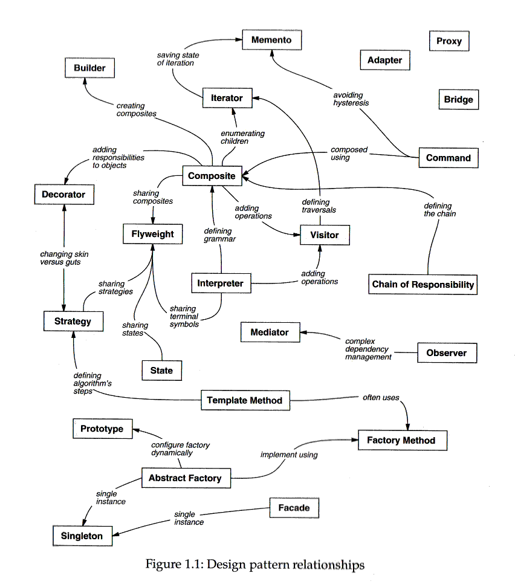

# Design Patterns (Tasarım Desenleri)

## 1. [Creational patterns](CreationalPatterns.md)

### 1.1. Factory Method vs Abstract Factory

### 1.2. Builder

### 1.3. Prototype

### 1.4. Singleton

### 1.5. Lazy initialization

## 2. [Structural patterns](StructuralPatterns.md)

### 2.1. Adapter, Wrapper, or Translator

### 2.2. Bridge	

### 2.3. Composite

### 2.4. Decorator

### 2.5. Decorator

### 2.6. Extension object

### 2.7. Facade

### 2.8. Flyweight

### 2.9. Front controller

### 2.10. Marker

### 2.11. Module

### 2.12. Proxy

### 2.12. Twin

## 3. [Behavioral patterns](BehavioralPatterns.md)

### 3.1. Blackboard

### 3.2. Chain of responsibility

### 3.3. Command

### 3.4. Interpreter

### 3.5. Iterator

### 3.6. Mediator

### 3.7. Memento

### 3.8. Null Object

### 3.9. Observer or Publish/subscribe

### 3.10. Servant

### 3.11. Specification

### 3.12. State

### 3.13. Strategy

### 3.14. Template Method

### 3.15. Visitor

## 4. [Concurrency pattern](ConcurrencyPatterns.md)

In software engineering, concurrency patterns are those types of design patterns that deal with the multi-threaded programming paradigm. 

### 4.1. Active Object

### 4.2. Balking pattern

### 4.3. Barrier

### 4.4. Double-checked locking

### 4.5. Guarded suspension

### 4.6. Leaders/followers pattern

### 4.7. Monitor Object

### 4.8. Nuclear reaction

### 4.9. Reactor pattern

### 4.10. Read write lock pattern

### 4.11. Scheduler pattern

### 4.12. Thread pool pattern

### 4.13. Thread-local storage

## 5. [API Design Patterns](APIDesignPatterns.md)

## References

[Software Design Patterns - Wiki](http://www.wikizero.biz/index.php?q=aHR0cHM6Ly9lbi53aWtpcGVkaWEub3JnL3dpa2kvRGVzaWduX3BhdHRlcm5fKGNvbXB1dGVyX3NjaWVuY2Up)

[Nihat Koçyiğit - Kodcu](https://kodcu.com/2014/08/design-patterns-1-giris-factory-ve-abstract-factory-tasarim-kaliplari-2/
)

[CodeProject - Factory Method vs Abstract Factory](https://www.codeproject.com/Articles/716413/Factory-Method-Pattern-vs-Abstract-Factory-Pattern)

[Vivekcek - Factory Method vs Abstract Factory](https://vivekcek.wordpress.com/2013/03/17/simple-factory-vs-factory-method-vs-abstract-factory-by-example/)