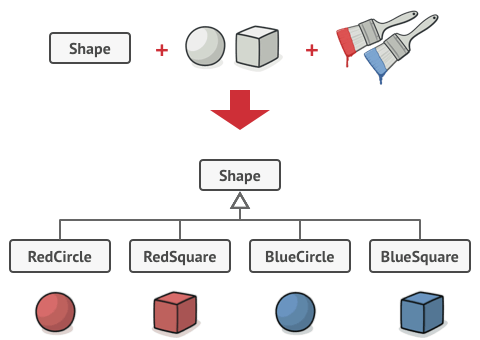
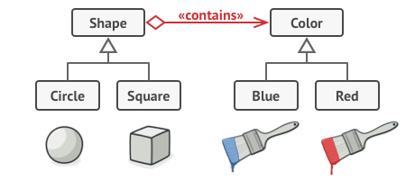
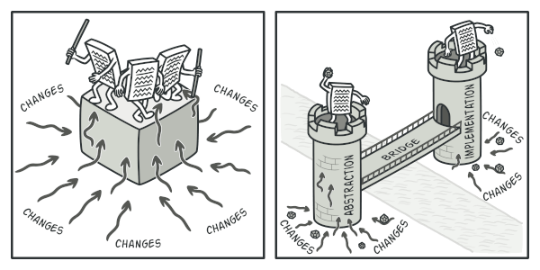
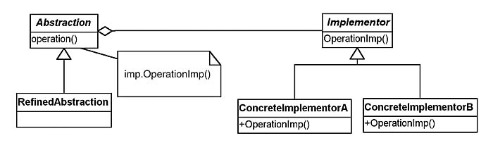

## 2. Structural patterns


Sınıflar arasındaki ilişkileri belirleme önerileri sunar, Nasıl türetilmeli, hangi nesneleri içermeli, sınıflar birbirlerini nasıl bağlı olmalı gibi soruların cevaplarını yanıtlar.

Amaçları itibariyle yapısal kalıplar, sınıflar ve nesnelerin birleştirilerek daha geniş yazılım gruplarının kurulmasına olanak sağlayan öneriler sunar. 

yapısal tasarım kalıpları, varlıklar arasındaki ilişkileri gerçekleştirmenin basit bir yolunu tanımlayarak tasarımı kolaylaştıran tasarım kalıplarıdır.

[İTÜ Bilgişlem Daire Başkanlığı Yapısal (Structural) Tasarım Desenleri](https://bidb.itu.edu.tr/seyir-defteri/blog/2013/09/08/yap%C4%B1sal-kal%C4%B1plar-(structural-patterns))


- Yapısal tasarım desenleri, daha büyük yapılar oluşturmak için sınıfların ve nesnelerin nasıl birleştirilebileceği ile ilgilidir.

- Yapısal tasarım desenleri, ilişkileri tanımlayarak yapıyı basitleştirir.

- Bu örüntüler, sınıfların birbirlerinden nasıl miras aldığı ve diğer sınıflardan nasıl oluştukları üzerine odaklanmaktadır.


### 2.1. Adapter, Wrapper, or Translator

Adaptör kalıp sadece bir sınıfa (class) özel olan arayüzleri diğer sınıflarla uyumlu arayüzler haline getirir. Adaptörler uyumlu olmayan arayüzler sebebiyle birbirleri ile çalışamayan sınıflara da birbirleri ile çalışma imkanı sunarlar.

Farklı interface'lere sahip sınıfların birbiriyle çalışabilmesini sağlamak amacıyla kullanılır. Örnek vermek gerekirse, bir XML dosyasının Document Object Model interface'ini, bir ağaç yapısına dönüştürülmesi için kullanılabilir. 

Faydaları Nedir?

1. Birbiriyle ilişkili olmayan interface'lerin birlikte çalışmasını sağlar. 
2. Kodların yeniden yazılması engeller. 
3. Var olan modül(ler) değiştirilmeden sisteme yeni modüller eklenebilir. 


Bildiğimiz gerçek hayattaki adaptör gibi çalışır.

örneğin Amerika fişlerine uyumlu bir cihazı Türkiye'de kullanamk için kullanığımız adaptör gibi.

Adapter tasarım deseninde 4 temel yapı vardır. Bunlar;

1. Adaptee : Mevcut sisteme uydurulmak istenen nesne.

2. Adapter: Mevcur sisteme uydurma işlemi yapan nesne.

3. Target: İhtiyaç duyulan class veya interface.

4. Client: İşlemleri gerçekleştirdiğimiz ortak sınıf.İstemci , uygulama.


[Kesin Bakılmalı](https://refactoring.guru/design-patterns/adapter)


``` C#


using System;
 
namespace Structural.Adapter
{
  /// <summary>

  /// MainApp startup class for Structural

  /// Adapter Design Pattern.

  /// </summary>

  class MainApp

  {
    /// <summary>

    /// Entry point into console application.

    /// </summary>

    static void Main()
    {
      // Create adapter and place a request

      Target target = new Adapter();
      target.Request();
 
      // Wait for user

      Console.ReadKey();
    }
  }
 
  /// <summary>

  /// The 'Target' class

  /// </summary>

  class Target

  {
    public virtual void Request()
    {
      Console.WriteLine("Called Target Request()");
    }
  }
 
  /// <summary>

  /// The 'Adapter' class

  /// </summary>

  class Adapter : Target

  {
    private Adaptee _adaptee = new Adaptee();
 
    public override void Request()
    {
      // Possibly do some other work

      //  and then call SpecificRequest

      _adaptee.SpecificRequest();
    }
  }
 
  /// <summary>

  /// The 'Adaptee' class

  /// </summary>

  class Adaptee

  {
    public void SpecificRequest()
    {
      Console.WriteLine("Called SpecificRequest()");
    }
  }
}
 
```

### 2.2. Bridge	


Bu tasarım deseni, soyutlama ile gerçekleştirmeyi ayrı sınıf hiyerarşisi içinde ayırmak için kullanılır. Sınıflara daha fazla bir soyutlama ve genişleme imkanı tanır. Desende hem soyutlama kısmı, hem de gerçekleştirme kısmında bir üst sınıfı bulunur. Bu üst sınıfların altındaysa belirli bir sınıf hiyerarşisi bulunur. Bu iki hiyerarşi de birbirlerine bağlıdır. İşte desen, iki kısım arasında köprü gibi bir yapı olarak duran bu bağdan ismini almıştır. Soyutlama kısmında, sistemin daha üst düzey işlemleri bulunur. Gerçekleştirme kısmında ise, bu soyutlama kısmındaki üst düzey işlemlere bağlı daha basit ve bu üst düzey işlemleri detaylandıran işlemler bulunur.  [kaynak](http://www.tasarimdesenleri.com/jsp/tasdesincele/bridge.jsp)


Bir sınıfın yapacağı işlemler belirlenmiş ise ve aynı işi farklı sistemlerde farklı yapılacaksa bu kalıp kullanılır.Bunu da adapter kalıbıyla farklı sistemlerde farklı şekilde kullanılmasını sağlayabiliriz.Köprü oluşumunda abstract factory kalıbı genelde kullanılır.Bu kalıp komplex sınıf yapıların oluşmasına engel olur.Bu da bize kontrolü bize verir.Yani bu şablonla kolay ve esnek yönetilebilir bir sistem sağlar bize.Karmaşık ve bakımı zor olan sistemlerin oluşumunu engeller.







You should typically use the Bridge pattern when[source](https://tutorialedge.net/design-patterns/bridge-design-pattern/):

- You require run-time binding of the implementation.
- both the abstractions and their implementations should be extensible by subclassing.
- changes in the implementation of an abstraction should have no impact on clients; that is, their code should not have to be recompiled
- you want to share an implementation among multiple objects and this fact should be hidden from the client.





Implemantor arayüzü ile operasyonlar tanımlanır ve ConcreteImplemantor lar bu arayüzden türeyerek operasyonları gerçekleştirir. Abstraction abstract sınıfı ise içinde Implemantor arayüzünden referans barındırarak Implemantor daki operasyonları çalıştırır. RefinedAbstraction ise Abstraction u uygulayan gerçek sınıf veya senaryoya göre sınıflardır. Client ise Abstraction ve Implemantor türlerinden nesneleri üreterek yapıyı kullanır.


__Ne zaman kullanılır?__

* Abstractions and implementations should be modified independently.
* Changes in the implementation of an abstraction should have no impact on clients.
* The Bridge pattern is used when a new version of a software or system is brought out, but the older version of the software still running for its existing client. There is no need to change the client code, but the client need to choose which version he wants to use.




__The classes and objects participating in this pattern are:__

- Abstraction   (BusinessObject)
    - defines the abstraction's interface.
    - maintains a reference to an object of type Implementor.
- RefinedAbstraction   (CustomersBusinessObject)
    - extends the interface defined by Abstraction.
- Implementor   (DataObject)
    - defines the interface for implementation classes. This interface doesn't have to correspond exactly to Abstraction's interface; in fact the two interfaces can be quite different. Typically the Implementation interface provides only primitive operations, and Abstraction defines higher-level operations based on these primitives.
- ConcreteImplementor   (CustomersDataObject)
    - implements the Implementor interface and defines its concrete implementation.

[Refactoring Guru- tavsiye olunur](https://refactoring.guru/design-patterns/bridge)

[Kod Kaynak](https://www.dofactory.com/net/bridge-design-pattern)

``` C#
sing System;
 
namespace DoFactory.GangOfFour.Bridge.Structural
{
  /// <summary>

  /// MainApp startup class for Structural

  /// Bridge Design Pattern.

  /// </summary>

  class MainApp

  {
    /// <summary>

    /// Entry point into console application.

    /// </summary>

    static void Main()
    {
      Abstraction ab = new RefinedAbstraction();
 
      // Set implementation and call

      ab.Implementor = new ConcreteImplementorA();
      ab.Operation();
 
      // Change implemention and call

      ab.Implementor = new ConcreteImplementorB();
      ab.Operation();
 
      // Wait for user

      Console.ReadKey();
    }
  }
 
  /// <summary>

  /// The 'Abstraction' class

  /// </summary>

  class Abstraction

  {
    protected Implementor implementor;
 
    // Property

    public Implementor Implementor
    {
      set { implementor = value; }
    }
 
    public virtual void Operation()
    {
      implementor.Operation();
    }
  }
 
  /// <summary>

  /// The 'Implementor' abstract class

  /// </summary>

  abstract class Implementor

  {
    public abstract void Operation();
  }
 
  /// <summary>

  /// The 'RefinedAbstraction' class

  /// </summary>

  class RefinedAbstraction : Abstraction

  {
    public override void Operation()
    {
      implementor.Operation();
    }
  }
 
  /// <summary>

  /// The 'ConcreteImplementorA' class

  /// </summary>

  class ConcreteImplementorA : Implementor

  {
    public override void Operation()
    {
      Console.WriteLine("ConcreteImplementorA Operation");
    }
  }
 
  /// <summary>

  /// The 'ConcreteImplementorB' class

  /// </summary>

  class ConcreteImplementorB : Implementor

  {
    public override void Operation()
    {
      Console.WriteLine("ConcreteImplementorB Operation");
    }
  }
}

```

Sonuç
``` C#
//Output
ConcreteImplementorA Operation
ConcreteImplementorB Operation
```

Gerçek hayat kodu

[Kaynak]()


``` C#
using System;
using System.Collections.Generic;
 
namespace DoFactory.GangOfFour.Bridge.RealWorld
{
  /// <summary>

  /// MainApp startup class for Real-World 

  /// Bridge Design Pattern.

  /// </summary>

  class MainApp

  {
    /// <summary>

    /// Entry point into console application.

    /// </summary>

    static void Main()
    {
      // Create RefinedAbstraction

      Customers customers = new Customers("Chicago");
 
      // Set ConcreteImplementor

      customers.Data = new CustomersData();
 
      // Exercise the bridge

      customers.Show();
      customers.Next();
      customers.Show();
      customers.Next();
      customers.Show();
      customers.Add("Henry Velasquez");
 
      customers.ShowAll();
 
      // Wait for user

      Console.ReadKey();
    }
  }
 
  /// <summary>

  /// The 'Abstraction' class

  /// </summary>

  class CustomersBase

  {
    private DataObject _dataObject;
    protected string group;
 
    public CustomersBase(string group)
    {
      this.group = group;
    }
 
    // Property

    public DataObject Data
    {
      set { _dataObject = value; }
      get { return _dataObject; }
    }
 
    public virtual void Next()
    {
      _dataObject.NextRecord();
    }
 
    public virtual void Prior()
    {
      _dataObject.PriorRecord();
    }
 
    public virtual void Add(string customer)
    {
      _dataObject.AddRecord(customer);
    }
 
    public virtual void Delete(string customer)
    {
      _dataObject.DeleteRecord(customer);
    }
 
    public virtual void Show()
    {
      _dataObject.ShowRecord();
    }
 
    public virtual void ShowAll()
    {
      Console.WriteLine("Customer Group: " + group);
      _dataObject.ShowAllRecords();
    }
  }
 
  /// <summary>

  /// The 'RefinedAbstraction' class

  /// </summary>

  class Customers : CustomersBase

  {
    // Constructor

    public Customers(string group)
      : base(group)
    {
    }
 
    public override void ShowAll()
    {
      // Add separator lines

      Console.WriteLine();
      Console.WriteLine("------------------------");
      base.ShowAll();
      Console.WriteLine("------------------------");
    }
  }
 
  /// <summary>

  /// The 'Implementor' abstract class

  /// </summary>

  abstract class DataObject

  {
    public abstract void NextRecord();
    public abstract void PriorRecord();
    public abstract void AddRecord(string name);
    public abstract void DeleteRecord(string name);
    public abstract void ShowRecord();
    public abstract void ShowAllRecords();
  }
 
  /// <summary>

  /// The 'ConcreteImplementor' class

  /// </summary>

  class CustomersData : DataObject

  {
    private List<string> _customers = new List<string>();
    private int _current = 0;
 
    public CustomersData()
    {
      // Loaded from a database 

      _customers.Add("Jim Jones");
      _customers.Add("Samual Jackson");
      _customers.Add("Allen Good");
      _customers.Add("Ann Stills");
      _customers.Add("Lisa Giolani");
    }
 
    public override void NextRecord()
    {
      if (_current <= _customers.Count - 1)
      {
        _current++;
      }
    }
 
    public override void PriorRecord()
    {
      if (_current > 0)
      {
        _current--;
      }
    }
 
    public override void AddRecord(string customer)
    {
      _customers.Add(customer);
    }
 
    public override void DeleteRecord(string customer)
    {
      _customers.Remove(customer);
    }
 
    public override void ShowRecord()
    {
      Console.WriteLine(_customers[_current]);
    }
 
    public override void ShowAllRecords()
    {
      foreach (string customer in _customers)
      {
        Console.WriteLine(" " + customer);
      }
    }
  }
}

```

Sonuç

``` C#

Output
Jim Jones
Samual Jackson
Allen Good

------------------------
Customer Group: Chicago
Jim Jones
Samual Jackson
Allen Good
Ann Stills
Lisa Giolani
Henry Velasquez
------------------------

```

Diğer bir örnek

[Kaynak](https://www.dotnettricks.com/learn/designpatterns/bridge-design-pattern-dotnet)


```C#
/// <summary>
/// The 'Abstraction' class
/// </summary>
public abstract class Message
{
 public IMessageSender MessageSender { get; set; }
 public string Subject { get; set; }
 public string Body { get; set; }
 public abstract void Send();
}
 
/// <summary>
/// The 'RefinedAbstraction' class
/// </summary>
public class SystemMessage : Message
{
 public override void Send()
 {
 MessageSender.SendMessage(Subject, Body);
 }
}
 
/// <summary>
/// The 'RefinedAbstraction' class
/// </summary>
public class UserMessage : Message
{
 public string UserComments { get; set; }
 
 public override void Send()
 {
 string fullBody = string.Format("{0}\nUser Comments: {1}", Body, UserComments);
 MessageSender.SendMessage(Subject, fullBody);
 }
}
 
/// <summary>
/// The 'Bridge/Implementor' interface
/// </summary>
public interface IMessageSender
{
 void SendMessage(string subject, string body);
}
 
/// <summary>
/// The 'ConcreteImplementor' class
/// </summary>
public class EmailSender : IMessageSender
{
 public void SendMessage(string subject, string body)
 {
 Console.WriteLine("Email\n{0}\n{1}\n", subject, body);
 }
}
 
/// <summary>
/// The 'ConcreteImplementor' class
/// </summary>
public class MSMQSender : IMessageSender
{
 public void SendMessage(string subject, string body)
 {
 Console.WriteLine("MSMQ\n{0}\n{1}\n", subject, body);
 }
}
 
/// <summary>
/// The 'ConcreteImplementor' class
/// </summary>
public class WebServiceSender : IMessageSender
{
 public void SendMessage(string subject, string body)
 {
 Console.WriteLine("Web Service\n{0}\n{1}\n", subject, body);
 }
}
 
/// <summary>
/// Bridge Design Pattern Demo
/// </summary>
class Program
{
 static void Main(string[] args)
 {
 IMessageSender email = new EmailSender();
 IMessageSender queue = new MSMQSender();
 IMessageSender web = new WebServiceSender();
 
 Message message = new SystemMessage();
 message.Subject = "Test Message";
 message.Body = "Hi, This is a Test Message";
 
 message.MessageSender = email;
 message.Send();
 
 message.MessageSender = queue;
 message.Send();
 
 message.MessageSender = web;
 message.Send();
 
 UserMessage usermsg = new UserMessage();
 usermsg.Subject = "Test Message";
 usermsg.Body = "Hi, This is a Test Message";
 usermsg.UserComments = "I hope you are well";
 
 usermsg.MessageSender = email;
 usermsg.Send();
 
 Console.ReadKey();
 }
}

```


### 2.3. Composite

hiyerarşik şekilde tutulması muhtemek sınıfların düzenlenmesinde kullanılır. örnek olarak web ve locak uygulamalarda sıklıkla kullanılan hiyerarşik menüler gibi.

http://www.turkayurkmez.com/composite-design-pattern/

https://buraksenyurt.com/post/Tasarc4b1m-Desenleri-Composite

http://bidb.itu.edu.tr/seyir-defteri/blog/2013/09/08/bile%C5%9Fik-tasar%C4%B1m-kal%C4%B1b%C4%B1-(composite-design-pattern)


http://safakunel.blogspot.com/2013/11/c-composite-tasarm-deseni-pattern.html


### 2.4. Decorator

### 2.5. Extension object

### 2.6. Facade

### 2.7. Flyweight

### 2.8. Front controller

### 2.9. Marker

### 2.10. Module

### 2.11. Proxy

### 2.12. Twin
