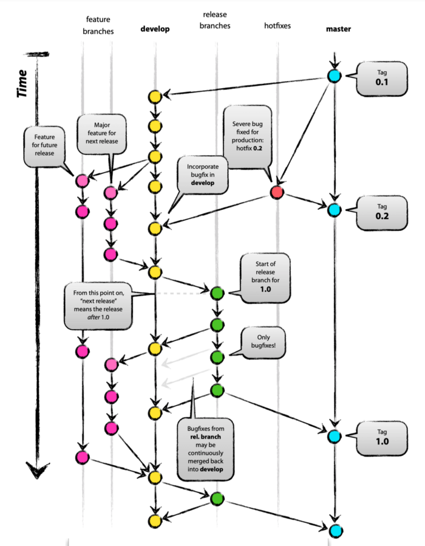
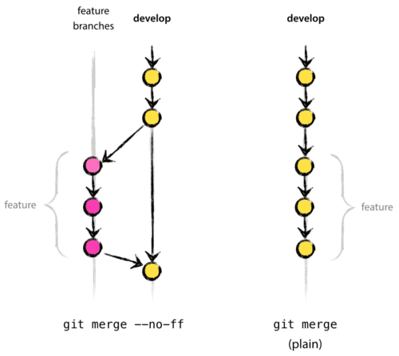

### Git Flow nedir?

Best Practice yada Gelecek değildir. Sadece takım çalışmasında Git üzerinde uygulanan bir teknik ve ya yoldur diyebiliriz.

Git Flow'da toplam 5 adet base branch bulunur. Bunlarda iki tanesi ana (main) branch, diğer üçü yardımcı (supporting) branchlerdir.

**Main Branches**
- The production/master branch
- The develop branch

**Supporting Branches**
- Feature branches
- Release branches
- Hotfix branches

### Faydaları nelerdir?

- Parallel Development
- Collaboration
- Release Staging Area
- Support For Emergency Fixes


### En Temel Haliyle Git Flow

1. develop branch i masterdan oluşturulur
2. release branch i develop branch inden oluşturulur
3. feature branche i develop branchindne oluşturuşlur
4. feature tamamlandığında develop branch ine merge edilir
5. release branch i tamamlandığında develop ve master branche merge edilir
6. acil bir durum olduğunda hotfix branch i master dan create edilir
7. hotfix tamamlandığında develop ve master branche merge edilir




### Örnek Ugulama

bütün işlemlerin local de olduğunu varsayalım


1. Proje Oluşturulur. readme.md doyası eklenir.

```
$ git init
$ touch readme.md
$ echo "git flow test projesi" >> readme.md
$ git add .
$ git commit -m "Proje oluşturuldu" 
```
master da olduğumuz chek edilir 
```
$ git status
# veya
$ git log
```
2. Develop Branch i Master'dan kopyalanarak oluşturlur oluşturulur.

```
$ git checkout -b develop
```

3. develop branch inden bir feature1 branch i oluşturulur

```
$ git checkout -b feature/feature1 develop
```

4. develope branchinden feature2 branchi oluşturulur.

şuan feature1 branch i üzerindeyiz. diyelimki develop branch inde checkout yapmadan ve feature2 branchine checkout yapmadan feture2 branchini oluşturalım.

```
$ git branch feature/feature2 develop
```

5. feature1 ve feature2 de değişiklikler yapıp kendi branch lerine push yapalım

```
$ git checkout feature/feature1
$ echo "feature1 dosyası içeriğidir" >> feature1.txt
$ git add . 
$ git commit -m "feature1 tamamlandı"

$ git checkout feature/feature2
$ echo "feature2 dosyası içeriğidir" >> feature2.txt
$ git add . 
$ git commit -m "feature2 birinci bölüm bitti. daha devam edeceğiz."

```
6. feature1 feature ımızı develope a merge ediyoruz.

burada --no-ff komutu önemli çünnkü feature1 feature ı işi bitince silinecek ancak history sinin developda kalmasını istiyorsak bu flag ı kullanmalıyız.




```
$ git checkout develop
$ git merge --no-ff feature/feature1
$ git branch -d feature/feature1 # branch silindi
```

7. bu arada feature2 ye kod yazılmaya devam ediyor

```
$ git checkout feature/feature2
$ echo "ilk release branchinden önce feature2 ikinci doya içeriği" >> feature22.txt
$ git add .
$ git commit -m "ilk release dan önce feature2 ikinci bölüm eklendi."
```

8. ilk release branch i feature 1 ile oluşturulur. Değişiklikler ve son dakika bug fixleri yapılır. bu arada feature2 halen devam etmektedir.

```
$ git checkout -b release/release-v0.1.0 develop
$ echo "release v0.1.0 da yanlış yapılan bug çözüldü" >> release1_bug1.txt
$ mkdir releasenotes
$ echo "version 0.1.0 notları" >> releasenotes/version1.0.1.txt
$ git add .
$ git commit -m "release v1.0.1 yayına hazırlandı"
```

burada şuna dikkat etmemiz gerkiyor. burada yaptığımız değişiklikler develop branchinde henüz yok. ve bu arada belik başka başka feature branchleri oluşturlup develope merge ediliyor olabilir.

9. release v0.1.0 master a ve develop a merge edilir

```
$ git checkout master
$ git merge --no-ff relase/release-v0.1.0
$ git tag -a "v0.1.0"
```

tam bu noktada şuna dikkat etmek lazım. bu release i yayına vermek zorunda değiliz. yani developer için önemli olan bu paketin yayına hazır halde master branch e ulaşmış olmasını sağlamaktır.


10. release branch inde yaptığımız değişiklileri develop a merge ediyoruz varsa conflictleri çözüyoruz. ve release-v0.1.0 branch ini siliyoruz.

```
$ git checkout develop
$ git merge --no-ff release/release-v0.1.0
$ git branch -d release/release-v0.1.0
```
11. tam bu esnada ilk release imiz olan v0.1.0 ın test ortamına konulduğunu varsayalım. bu noktada istenirse masterda ki bu versiyon tagine ek olarak bir tag daha atılabilir. tamamen bilgi amaçlı.

```
$ git checkout master
$ git checkout v0.1.0
$ git tag -a "v0.1.0-test"
```

13. tam bu esnada feature3 ün ecelopdan alındığını ve başladığını varsayalım.

```
$ git branch feature/feature3 develope
```

14. feature2 işini bitirmş olsun ve release a gönderilsin

buralarda çıkan conflictler çözülmeli haliyle.

```
$ git checkout develop 
$ git merge --no-ff feature/feature2
$ git branch -d feature/feature2
$ git checkout relase/release-v0.2.0
$ echo "version 0.2.0 release notları" >> releasenotes/version.txt
$ git add .
$ git commit -m "version v0.2.0 yayna hazırlarndı"
$ git checkout master
$ git merge --no-ff release/release-v0.2.0
$ git tag -a "v0.2.0"
$ git checkout develop
$ git merge --no-ff release/release-v0.2.0
$ git branch -d release/release-v0.2.0
```

15. master branchi tam bu essnada hemen UAT ye yayına çıkılmalı denildi diyelim ancak aynı zamanda da test ortamından gelen anlık bir hotfix olduğunu varsayalım. bu durumda bu hot fix in anında çözümlenip hem master a hem e develop a merge edilmesi lazım.

```
$ git checkout master
$ git checkout -b hotfix/hotfix1
$ echo "hotfix yapıldı" >> hotfix1.txt
$ git add .
$ git commit -m "hotfix 1 geçildi"
$ git checkout master 
$ git merge --no-ff hotfix/hotfix1
$ git tag -a "v0.2.1"       # dikkat son rakam değişti yani bugfix, hotfix yada basit bir yama yapıldı anlamına gelir.
$ git checkout develop
$ git merge --no-ff hotfix/hotfix1
$ git branch -d hotfix/hotfix1

```
17. tam bu esnada feature3 işini bitirmiş olsun. ne yapılağını artık yazmıyoruz.

18. yeni bir talep geldiğini ve içeriğinin şu şekilde olduğunu varsayalım.

feature1 için yapılan tün kodlar sistemden çıkarılsın, test edildi ve gerek olmadığına karar verildi. Bunu aslında bir bugfix gibi değerlendirebiliriz. Ya da feature, bugfix veya hotfix gibi başka bir branch türü altında değrlendirip. silme işlemlerini yaptıktan sonra aynı bir feature release eder gibi flow dan geçirip master a ulaştırıp daha sonra da tag lemeleiyiz.


**Yazı Dizisi 1**

- https://medium.com/@osa_/release-management-with-gitflow-part-i-60f272aa2d18
- https://medium.com/@osa_/release-management-with-gitflow-part-ii-8a874a9cd551
- https://medium.com/@osa_/release-management-with-gitflow-part-iii-813dccb73680 (örnek uygulama mevcut)

**Tek Sayfalık Kaynaklar**

- https://www.atlassian.com/git/tutorials/comparing-workflows/gitflow-workflow (atlassian resmi sayfaı örnek kod)

- http://danielkummer.github.io/git-flow-cheatsheet/ (resimli örnekle ısa ve öz anlatmış)

- https://nvie.com/posts/a-successful-git-branching-model/ (örnek uygulama var)

- http://www.clinicalgenomics.se/development/dev/gitflow/ (gitflow cli ve klasik gir beraber örneklenmiş)

-https://zellwk.com/blog/git-flow/#:~:text=Release%20branches%20can%20be%20created,will%20also%20start%20from%20develop%20