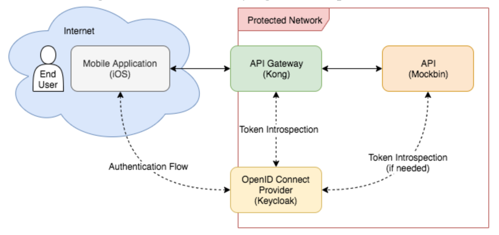

## __identity management__

http://syncope.apache.org/docs/reference-guide.html#architecture

https://www.keycloak.org/about.html

https://evolveum.com/about-us/references/tubitak/

- Identity Management
Tools and practices to keep identity data consistent and synchronized across repositories, data formats and models.

- Access Management
Systems, protocols and technologies supporting user authentication (how Users are let accessing a given system) and authorization (which capabilities each user owns on a given system).

Bu Ürünün muaidli ve açık kaynak aynı zamanda bedava olan 3 tane daha çözüm var.
Üçüncü ürünü yani evolveum ürününü Tubitak da desteklemektedir. Ancak bu Ürünün SSO su.

İlk iki ürün ise SSO destekliyor. 

- Identity Management
Tools and practices to keep identity data consistent and synchronized across repositories, data formats and models.

- Access Management
Systems, protocols and technologies supporting user authentication (how Users are let accessing a given system) and authorization (which capabilities each user owns on a given system).

1.	http://syncope.apache.org/docs/reference-guide.html#architecture (Identity Management)
2.	https://www.keycloak.org/about.html (Identity Management and Access Management)
3.	https://evolveum.com/about-us/references/tubitak/ (Access Management)

**Keycloack api management**

- https://www.jerney.io/secure-apis-kong-keycloak-1/
- https://www.jerney.io/secure-apis-kong-keycloak-2/

**KeyCloack Kurulum**

https://medium.com/@hasnat.saeed/setup-keycloak-server-on-ubuntu-18-04-ed8c7c79a2d9

https://github.com/mosip/documentation/wiki/Steps-to-install-Keycloak-standalone-server

https://www.pimwiddershoven.nl/entry/install-keycloak-on-centos-7-with-mysql-backend

