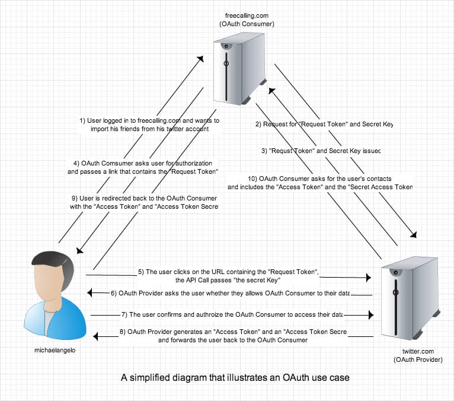
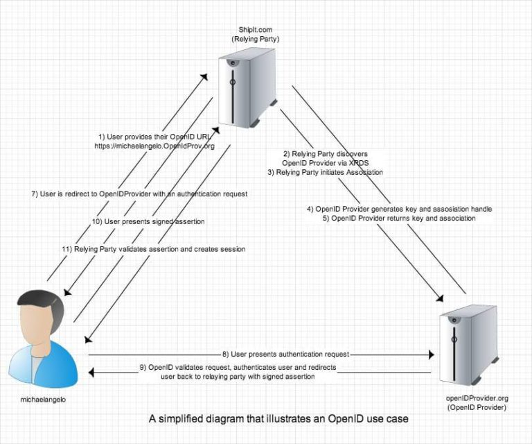
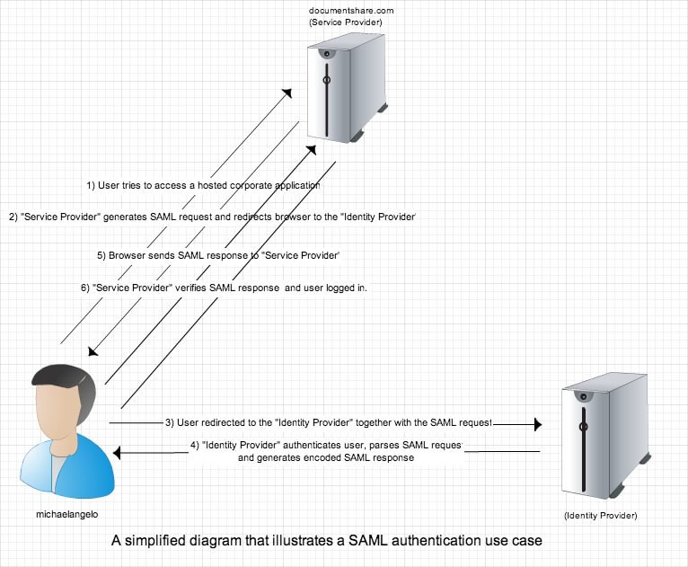

### Saml vs Outh2 vs Openid

- https://www.softwaresecured.com/federated-identities-openid-vs-saml-vs-oauth/

**Oauth**

**OpenId**

**Saml**

- https://www.youtube.com/watch?v=BFkFRnayIYY

- https://www.youtube.com/watch?v=bSAX_Nxr4Tk

- https://www.softwaresecured.com/federated-identities-openid-vs-saml-vs-oauth/

- https://medium.com/@jad.karaki/identity-management-saml-vs-oauth2-vs-openid-connect-c9a06548b4c5 (güzel anlatım)

- https://spin.atomicobject.com/2016/05/30/openid-oauth-saml/ (basit anlatım)

- https://www.ubisecure.com/uncategorized/difference-between-saml-and-oauth/#:~:text=SAML%20 (oauth2 vs Saml)

- https://www.mutuallyhuman.com/blog/choosing-an-sso-strategy-saml-vs-oauth2/

- https://www.okta.com/identity-101/whats-the-difference-between-oauth-openid-connect-and-saml/

- https://medium.com/@jad.karaki/identity-management-saml-vs-oauth2-vs-openid-connect-c9a06548b4c5

- https://www.gluu.org/resources/documents/articles/oauth-vs-saml-vs-openid-connect/

