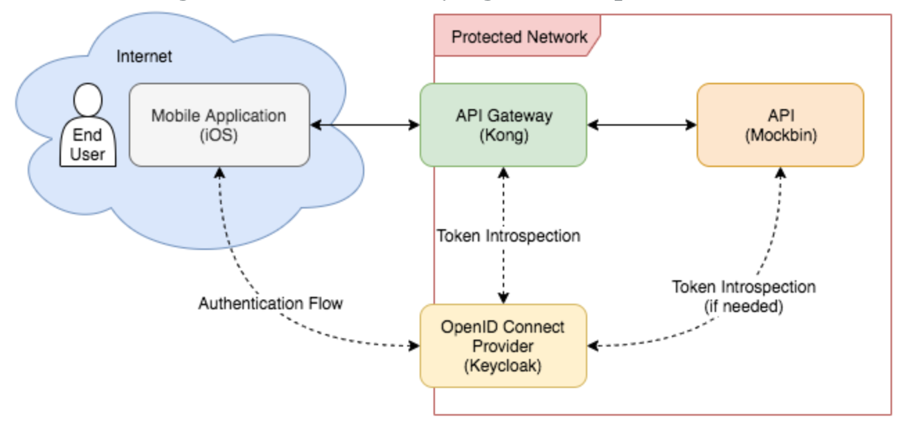

### Video Series

- https://www.youtube.com/watch?v=UWdg0XxzuSA (user, device, think)

- https://www.youtube.com/watch?v=Lr7APvqMGUo (Identity)

- https://www.youtube.com/watch?v=yWSbeiYWc-0 (Authentication))

- https://www.youtube.com/watch?v=OkmehCk4ouQ (Advanced Authentication)

- https://www.youtube.com/watch?v=oo7Z8B9EXoQ (self service)

- https://www.youtube.com/watch?v=g9JysMBSyNU (identity syncranization)

- https://www.youtube.com/watch?v=5Aw47Us-Vlw (stateless vs stateful identity)

- https://www.youtube.com/watch?v=7NaOobOoREA (identity gateway)

- https://www.youtube.com/watch?v=eOpNkBsUJUY (identity workflow)

- https://www.youtube.com/watch?v=wtcDqIYfolQ (directory service)

- https://www.youtube.com/watch?v=bSAX_Nxr4Tk (saml and openid)

- https://www.youtube.com/watch?v=BVDZQbOCv6E (machine to machine)

### Extra

- https://www.youtube.com/watch?v=c-mBhCOemd0

- https://www.youtube.com/watch?v=RupQWmYhrLA (Bilding an effective identity and access management architecture with Keycloak)

- https://www.youtube.com/watch?v=XJYy6Aq-PJ8 (baştan sona keycloack kullanımı )

- https://www.youtube.com/watch?v=duawSV69LDI (baştan sona keycloack kullanımı )

- https://www.keycloak.org/docs/latest/authorization_services/

**Keycloack Api Management**

- https://www.jerney.io/secure-apis-kong-keycloak-1/
- https://www.jerney.io/secure-apis-kong-keycloak-2/

