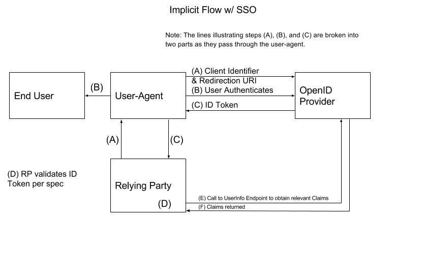
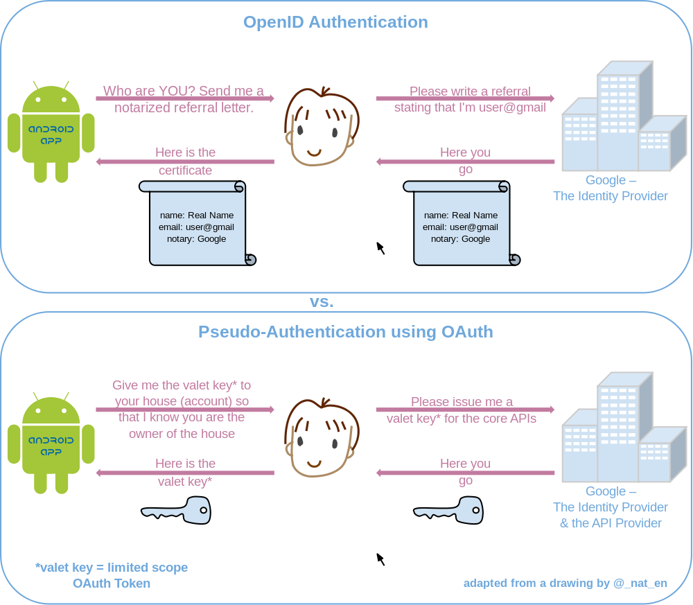

### OAuth2 

Türkçe çok iyi bir kaynak : https://guvenmurat.com/openid-connect-ve-oauth2-nedir/

Çok iyi Türkçe Kaynak : https://medium.com/@thejengo/api-i%CC%87stemcisi-do%C4%9Frulama-y%C3%B6ntemleri-c29e3826daea

[Türkçe java üzerinden temiz anlatm](https://www.youtube.com/watch?v=kp2ZbOCCYNA)

OAuth2 aslında bir protokoldür. Sonradan framework denmeye de başlnamış buarada. Görevi ise bir uygulama üzerindeki bilgilerin, özelliklerin ve methodların görülebilmesi ve gerektiğinde kullanılabilmesi çin diğer bir uygulamaya izin verilmesini sağlamaktır. 

yani örneğin A uygulamsına klogin olurken Facebook'u kullanak istediğimizde Facebook'un A uygulamasının Facebook üzerinden bizimle alakalı verileri istemesi ve Facebook'un da bizim iznimiz ile belli bir süreliğine bunu A uygulamasına vermesi.

Pekşi LOgin olurken OAuth2 kullanılmıyor mu? sadece authorization işi yapıyor demiştik Aouth2 için, peki login işlemi nasıl oluyor? 

Aslında OAuth2 Authentication için oluşturulmamış Hatta tavsiye de edilmiyor. Sebebi ise

- Kullanıcı bilgilerini almak için standar bir yol sunamamsı
- Hemen hemen bütün implementasyonları birbirinden farklı olması
- Özellikle Authenticaiton için genel bir scope sunmuyor olması.

Ancak bu protokolün yetenkerlin gören birileri OpenId yi icat ediyor. Bunlar aslında OAuth2'nin üzerine bir framework geliştirerek ve bunun standartlarını koyarak bir authentication mekanizması oluşturmuşlardır.

Özet olarak 

OAuth2 bir API ye eriim zini vermek veya belli bir bilgiye erişim izni vermek için kullanılır. yani (delegeated) authorization için

OpenId ise, login yapmak ve kendi hesabımızın diğer sistemleri içinde kullanılabilir hale getirmek için kullanılır.

OAuth2 deki en önmli ve belkide en fazla kafa karışıklığına asebep olan başlık  Connect Flow veya Grand type konusudur.

https://oauth.net/2/grant-types/

**Oauth2 Terminoloji**

- **Resource Owner:** the entity that can grant access to a protected resource. Typically this is the end-user.
- **Client:** an application requesting access to a protected resource on behalf of the Resource Owner.
- **Resource Server:** the server hosting the protected resources. This is the API you want to access.
- **Authorization Server:** the server that authenticates the Resource Owner and issues Access Tokens after getting proper authorization. In this case, Auth0.
- **User Agent:** the agent used by the Resource Owner to interact with the Client, for example a browser or a native application

**Farklı uygulama tipleri için flow lar**

- Web Application (with dedicated server-side component): OAuth2 Authorization Code Grant (with Confidential Client), OIDC Authorization Code Flow (with Confidential Client)
- Desktop Native Application: Authorization Code Grant (with Public Client and PKCE), OIDC Authorization Code Flow (with Public Client and PKCE)
- Mobile Native Application: Authorization Code Grant (with Public Client and PKCE), OIDC Authorization Code Flow (with Public Client and PKCE)
- SPA App: OAuth2 Implicit Grant, OIDC Implicit Flow (Authorization Code Grant or OIDC Authorization Code Flow with Public Client could be used, note commentary below)
- Javascript application: OAuth2 Implicit Grant, OIDC Implicit Flow (Authorization Code Grant or OIDC Authorization Code Flow with Public Client could be used, note commentary below)

Anytime you have a system that isn’t concerned with the end user identity (and just needs to authenticate the system), use the OAuth2 Client Credential Grant.

### OAuth2 Spec

https://tools.ietf.org/html/rfc6749

https://medium.com/@robert.broeckelmann/when-to-use-which-oauth2-grants-and-oidc-flows-ec6a5c00d864

3 tip client için uygundurlar

- native applications (across a variety of devices including desktop, phone, tablet, etc) — typically, a public client.
- user-agent-based applications (JavaScript-based applications and SPA apps for our purposes) — typically, a public client.
- web applications (traditional web application architecture) — typically, a confidential client

[Auth0 dan dah detaylı anlatım](https://auth0.com/docs/flows/concepts/auth-code)

__1. OAuth2 — Authorization Code Grant__

**Kullanım Örneği:** Uygulamanın genelde son kullanıcı bilgilerine ulaşmak için kulladığı durumlar.

Sunucu taraflı çalışan wen uygulamalaları bazı bilgileri gizli tutmaak itedği durumlarda, mobil uygulamlarda public cliewntla ve PKCE ile birlikte kullanbilir.

[Auth0 dan Authorization Code Flow with Proof Key for Code Exchange (PKCE)](https://auth0.com/docs/flows/concepts/auth-code-pkce)

__2. OAuth2 — Implicit Grant__

**Kullanım Örneği:** Uygulamanın genelde son kullanıcı bilgilerine ulaşmak için kulladığı durumlar.

SPA, javascript uyuglamlaır için uygundur.

__3. OAuth2 — Resource Owner Password Credential Grant__

imlicit secret key ile birlikte tek çağırmada token a ulaşabiliyor ancak login mekanizması yok. yani UI üeridne kullanıcı adı ve şifre gibi bir şey kukllanılamıyor. Ayrıca Two-Factor-Authrnticaiton gibi özellikleride yok. Resource Owner Password Credential Grant_ bu açıkları kapatmaktadır.

**Kullanım Örneği:** Uygulamanın genelde son kullanıcı bilgilerine ulaşmak için kulladığı durumlar.

Kullanıcın kendi kullanıcı adı ve şifresiyle login olması gerektiği durumlarda.

[Auth0 dan detaylı anlatım](https://auth0.com/docs/flows/concepts/client-credentials) 

__4. OAuth2 — Client Credential Grant__

Önceki 3 taneden farklı 2 uygulam ayada sisteminde authenticaiton mekanızlasının kurugulabilmesidir.

[Auth0 dan Device Authorization Flow Detaylı Anlatım](https://auth0.com/docs/flows/concepts/device-auth)

### OpenID Connect Spec

https://openid.net/specs/openid-connect-core-1_0.html

__1. OIDC — Authorization Code Flow__

[Şuraya da bir bakılsa iyi olur](https://medium.com/@robert.broeckelmann/saml2-vs-jwt-understanding-openid-connect-part-2-f361ca867baa)

Oauth da detayları anlatıldı.

Ancak şuna dikkat edilmeli SSO desteği var.

__2. OIDC — Implicit Flow__

Ouath2 de anlatildiklari dışında, Ayrıca, bir arka uç kaynağına erişmek için erişim belirtecinin istenip istenmeyeceği konusunda bir seçenek vardır (response_type of “id_token” or “id_token token). Gereksinimleriniz bir kaynağa erişim içeriyorsa, “id_token token” kullanın. Son kullanıcı kimlik doğrulaması tek gereksinimse, “id_token” kullanılabilir.

__3. OIDC — Hybrid Flow__

fron end ve back end için ayrı ayrı key lazım olduğunda kullanılır. çok kullanılan bşr teknk değil

[Şuraya da bakılabilir](https://medium.com/@robert.broeckelmann/saml2-vs-jwt-understanding-openid-connect-part-3-b81c5aa9bc20)

**Access Flow kullanım lanaları Diğer Örnekler**

- web uygulamsının backend kısmı için, authorizaiton code flow mantıklıdır.
- native mobil app için authorizaiton code flow with PKCE (Proof Key for Code Exchange)
- javascript (SPA)'ın API backend'i için implicit flow
- Microservice ve API ler için client credentials flow kullanmak

mantıklı olacaktır.

### Kaynaklar

**Seri Makale**

- https://medium.com/@robert.broeckelmann/saml-v2-0-vs-jwt-series-550551f4eb0d
- https://medium.com/@robert.broeckelmann/saml2-vs-jwt-understanding-openid-connect-part-1-fffe0d50f953
- https://medium.com/@robert.broeckelmann/saml2-vs-jwt-understanding-openid-connect-part-2-f361ca867baa
- https://medium.com/@robert.broeckelmann/saml2-vs-jwt-understanding-openid-connect-part-3-b81c5aa9bc20

**Prtik yapmak için linkler**

- https://www.oauth.com/playground/ (kesinlikle bakılmalı)

- https://auth0.com/docs/

**Grafiklerle Anlatım**

- https://medium.com/@darutk/the-simplest-guide-to-oauth-2-0-8c71bd9a15bb (resimli adım adım anlatım kesinlikle bakılmalı)

- https://medium.com/@darutk/diagrams-of-all-the-openid-connect-flows-6968e3990660 (Bütün OpenId Connect Flow ların diagramla gösterimi)

**Youtube**

- https://www.youtube.com/watch?v=yX7aAOFxY68 (derinlemssine oauth2 tavsiye edilir tarik guney)

- https://www.youtube.com/watch?v=CPbvxxslDTU 

- https://www.youtube.com/watch?v=WVCzv50BslE

- https://www.youtube.com/watch?v=GyCL8AJUhww

- https://www.youtube.com/watch?v=996OiexHze0

- https://www.youtube.com/watch?v=LyqeHAkxVyk

- https://www.youtube.com/watch?v=bzGKgC3N7SY

- https://app.pluralsight.com/course-player?clipId=801c04c3-a1b7-42e8-8a16-6da9244bcf75

**resmi oauth2 c# implamentasyon kütüphanesi** 

https://identityserver.io/

https://github.com/IdentityServer/IdentityServer4

identiyserver4 hem openid hem de outh2 implementasyonu sağlamktadır. Ayrıca identity provider olarak da implementasyonu mevcut.

listeye bakılaca olurs adfs, keycloack gibi ürünlerde görülebilir

https://openid.net/developers/certified/

**OAuth 2.0 is not an authentication protocol.**

https://oauth.net/articles/authentication/

https://docs.microsoft.com/en-us/windows-server/identity/identity-and-access

https://www.softwaresecured.com/federated-identities-openid-vs-saml-vs-oauth/
