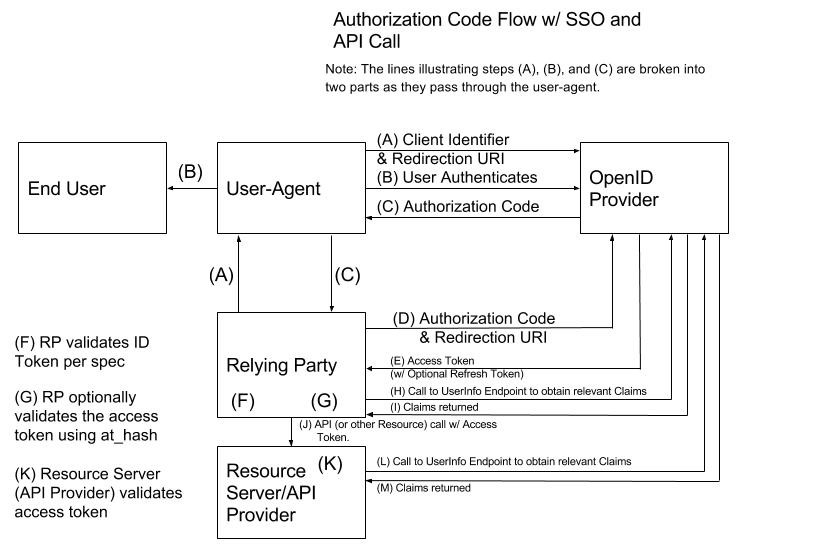
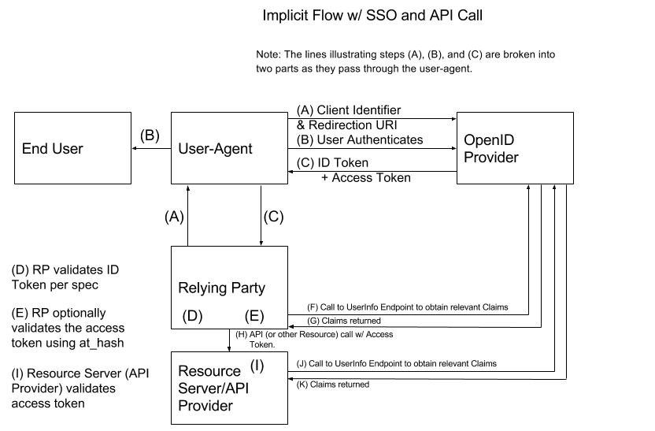
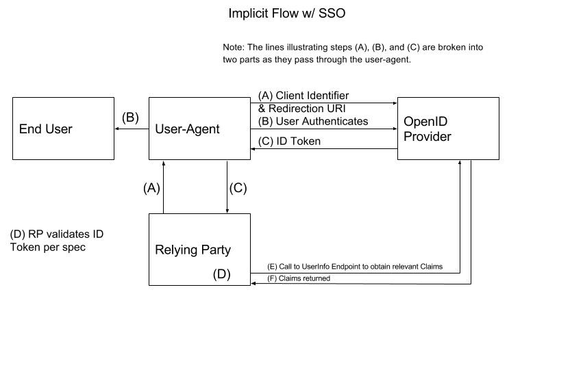
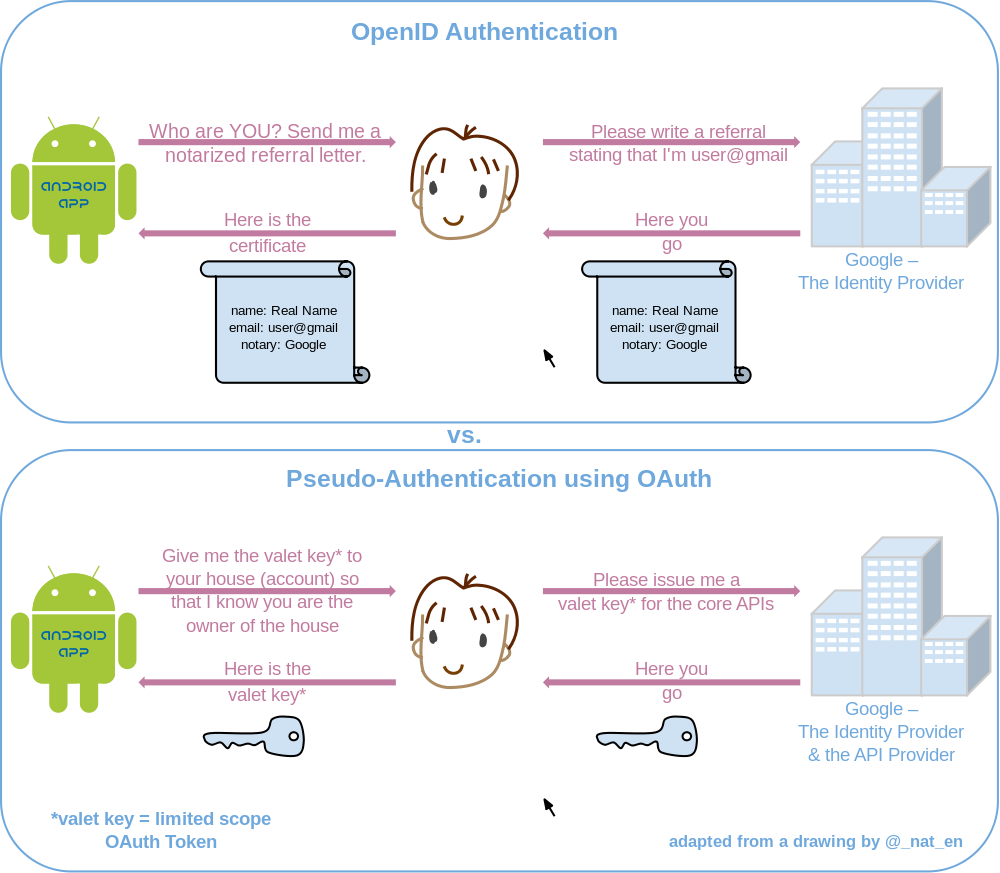
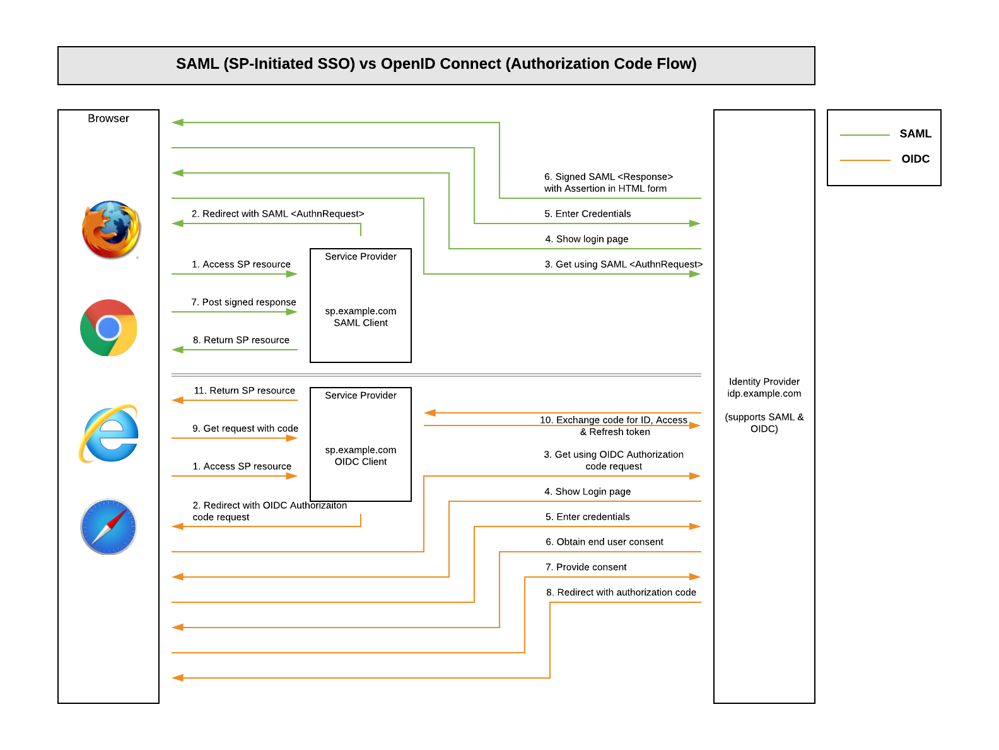
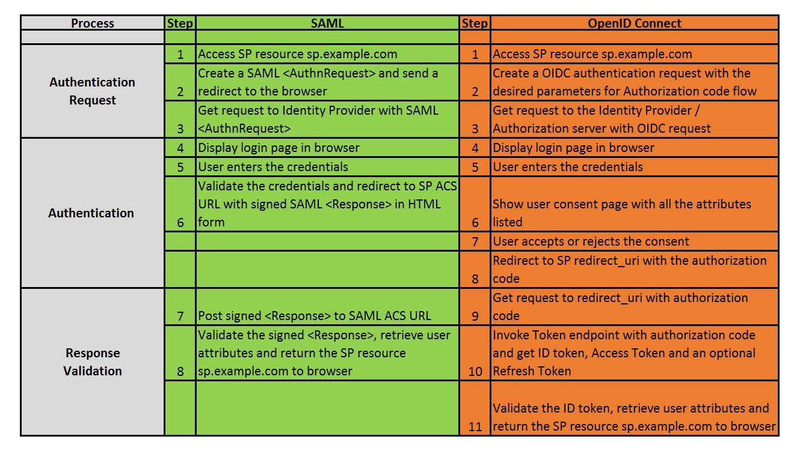

### OpenId

OpenID Connect 1.0 is a simple identity layer on top of the OAuth 2.0 protocol. It enables Clients to verify the identity of the End-User based on the authentication performed by an Authorization Server, as well as to obtain basic profile information about the End-User in an interoperable and REST-like manner.

kaynak : https://openid.net/specs/openid-connect-core-1_0.html

Aslında OAuth2 Authentication için oluşturulmamış Hatta tavsiye de edilmiyor. Sebebi ise

- Kullanıcı bilgilerini almak için standar bir yol sunamamsı
- Hemen hemen bütün implementasyonları birbirinden farklı olması
- Özellikle Authenticaiton için genel bir scope sunmuyor olması.

Ancak bu protokolün yetenkerlin gören birileri OpenId yi icat ediyor. Bunlar aslında OAuth2'nin üzerine bir framework geliştirerek ve bunun standartlarını koyarak bir authentication mekanizması oluşturmuşlardır.

OpenId sisteme şunları dahil etmiştir.

- ID Token (bildiğimiz JWT Token), yani buraya bir standart getirmiş oluyor.
- Kulanıcı bilgilerini alabilmek için UserInfo endpont'i (örneğin google çin www.googleapis.com/outh2/v4/userinfo)
- Standartlarştırılmış scope
- ve Authentication'un implemtasyonu için bir stanadart ortaya komuşlarıdr.

Yani OpenId aslınd OAuth2 yetenklerini kulanarak modern uygulamlardaki authenticaiton problemlerini çözmeyi vaadetmiştir ve bunu başarıyla yapmaktadır.

OpenId ise, login yapmak ve kendi hesabımızın diğer sistemleri içinde kullanılabilir hale getirmek için kullanılır.

https://www.oauth.com/playground/ (kesinlikle bakılmalı)

OpenId aslında direk karşılaştırma yapcaksak Saml in müadili olabilir.

https://www.softwaresecured.com/federated-identities-openid-vs-saml-vs-oauth/

kavramları OpenID ile karşılaştıraca olursak.

**IDP / SP vs. OP / RP**
- SAML' de kullanıcı Service Provider (SP) dan Identity Provider (IdP) a yönlendirilir. OpenId de ise kullanıcı Relying Party (RP)' den OpenId Provider (OP) a yönlendirilir.
- SAML'de SP herzaman websitedir, OpenId' de RP web sitesi veya möobile app de olabilir. bu nedenle daha genereric bir isim olan client olarak adlandırlırılar.

### OpenID Connect Spec

10 dk lık video : https://www.youtube.com/watch?v=WVCzv50BslE

https://openid.net/specs/openid-connect-core-1_0.html

__1. OIDC — Authorization Code Flow__

[Şuraya da bir bakılsa iyi olur](https://medium.com/@robert.broeckelmann/saml2-vs-jwt-understanding-openid-connect-part-2-f361ca867baa)

Oauth da detayları anlatıldı.

Ancak şuna dikkat edilmeli SSO desteği var.

__2. OIDC — Implicit Flow__

Ouath2 de anlatildiklari dışında, Ayrıca, bir arka uç kaynağına erişmek için erişim belirtecinin istenip istenmeyeceği konusunda bir seçenek vardır (response_type of “id_token” or “id_token token). Gereksinimleriniz bir kaynağa erişim içeriyorsa, “id_token token” kullanın. Son kullanıcı kimlik doğrulaması tek gereksinimse, “id_token” kullanılabilir.

__3. OIDC — Hybrid Flow__

fron end ve back end için ayrı ayrı key lazım olduğunda kullanılır. çok kullanılan bşr teknk değil

[Şuraya da bakılabilir](https://medium.com/@robert.broeckelmann/saml2-vs-jwt-understanding-openid-connect-part-3-b81c5aa9bc20)

**Access Flow kullanım lanaları Diğer Örnekler**

- web uygulamsının backend kısmı için, authorizaiton code flow mantıklıdır.
- native mobil app için authorizaiton code flow with PKCE (Proof Key for Code Exchange)
- javascript (SPA)'ın API backend'i için implicit flow
- Microservice ve API ler için client credentials flow kullanmak

mantıklı olacaktır.

**Which OAuth 2.0 Flow Should I Use?**

öncelikle teminolojiyi bilmek lazım,

- Resource Owner: the entity that can grant access to a protected resource. Typically this is the end-user.
- Client: an application requesting access to a protected resource on behalf of the Resource Owner.
- Resource Server: the server hosting the protected resources. This is the API you want to access.
- Authorization Server: the server that authenticates the Resource Owner and issues Access Tokens after getting proper authorization. In this case, Auth0.
- User Agent: the agent used by the Resource Owner to interact with the Client, for example a browser or a native application.

https://medium.com/@robert.broeckelmann/when-to-use-which-oauth2-grants-and-oidc-flows-ec6a5c00d864 (güzel kaynak okunmalı)

- **Web Application** (with dedicated server-side component): OAuth2 Authorization Code Grant (with Confidential Client), OIDC Authorization Code Flow (with Confidential Client)
- **Desktop Native Application:** Authorization Code Grant (with Public Client and PKCE), OIDC Authorization Code Flow (with Public Client and PKCE)
- **Mobile Native Application:** Authorization Code Grant (with Public Client and PKCE), OIDC Authorization Code Flow (with Public Client and PKCE)
- **SPA App:** OAuth2 Implicit Grant, OIDC Implicit Flow (Authorization Code Grant or OIDC Authorization Code Flow with Public Client could be used, note commentary below)
- **Javascript application:** OAuth2 Implicit Grant, OIDC Implicit Flow

**IDP / SP vs. OP / RP**
In SAML, the user is redirected from the Service Provider (SP) to the Identity Provider (IDP) for sign in.

In OpenID Connect, the user is redirected from the Relying Party (RP) to the OpenID Provider (OP) for sign in.

The SAML SP is always a website. The OpenID Connect RP is either a web or mobile application, and is frequently called the “client” because it extends an OAuth 2.0 client.

In both cases, the IDP/OP controls the login to avoid exposing secrets (like passwords) to the website or app.

### OpenId ile SSO

[Resmi spec Linki - Yazlın ve grafikse anlatım](https://openid.net/specs/openid-connect-native-sso-1_0.html)

[Session ve SSO Kavramları Diyagram ile](https://curity.io/resources/architect/sso/sessions-and-sso/index.html)

[Web için SSO](https://curity.io/resources/develop/sso/web-client-sso-with-openid-connect/)

[Mobil için SSO](https://curity.io/resources/develop/sso/sso-for-mobile-apps-with-openid-connect/)

**Resmi openid c# implelemtasyon kutuphanesi**

https://github.com/IdentityModel/IdentityModel.OidcClient

**örnek core app**

https://andrewlock.net/an-introduction-to-openid-connect-in-asp-net-core/

listeye bakılırsa ADFS, Keycloack, Azure Active Directory vb ürünlerde görülebilir.

https://openid.net/certification/

**identityserver4 ile openid**

https://docs.identityserver.io/en/release/quickstarts/3_interactive_login.html

**OpenId sık sorulan sorular**
https://openid.net/connect/faq/

[Why the Future of Identity is OpenID Connect and not SAML](https://apicrazy.com/2014/08/18/why-the-future-of-identity-is-openid-connect-and-not-saml/)

**OpenId vs Saml**

https://medium.com/@awskarthik82/simple-guide-to-saml-vs-oidc-33a3349189c6

