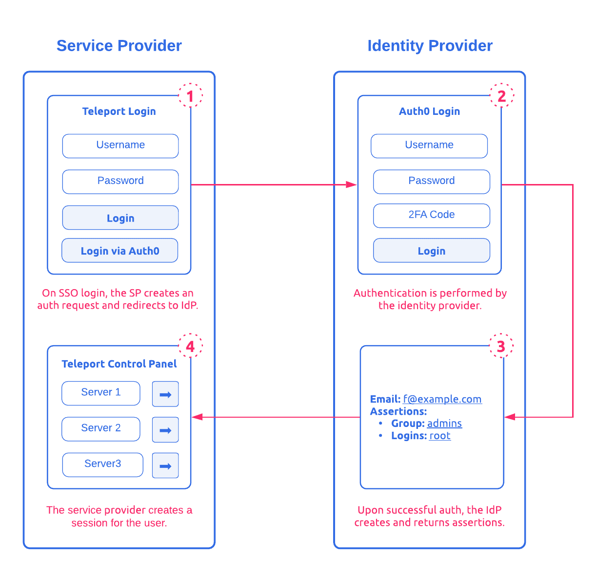

### Saml

İlk çıkış amacı ve halen temelde sunduğu hizmet aslında farklı kaynkları da dizin olark kulanarak SSO hizmeti sunmaktır. 

örnek olarak A firmasının çalışanıyız (IdP) ve Azure Portal (SP - Service Provider) kullanmak istiyoruz  ancak bunu kendi kuruluşumuzun yani A firmasının kullanıcı adı ve şifresyile yapamk istiyoruz. 3 taraflı bir ilişki var. IdP ve SP arasında gidip gelen bilgiye de SAML Assertion deniliyor.

kavramları OpenID ile karşılaştıraca olursak.

**IDP / SP vs. OP / RP**
- SAML' de kullanıcı Service Provider (SP) dan Identity Provider (IdP) a yönlendirilir. OpenId de ise kullanıcı Relying Party (RP)' den OpenId Provider (OP) a yönlendirilir.
- SAML'de SP herzaman websitedir, OpenId' de RP web sitesi veya möobile app de olabilir. bu nedenle daha genereric bir isim olan client olarak adlandırlırılar.

__SAML’in Çalışma Mekanizması__

- Kullanıcı login olmak istediği sitenin linkine tıkladığında, uygulama IP adresi gibi bilgileri kullanarak istemcinin kaynak bilgisini tespit eder ve kullanıcıyı kimlik doğrulamasının yapılabilmesi kimlik sağlayıcıya(identitiy provider) yönlendirir.
- Kullanıcının zaten kimlik sağlayıcısı ile aktif olan bir oturumu mevcut olabilir, yada eğer mevcut oturumu yoksa kimlik sağlayıcıya giriş yaparak yeni oturum alır.
- Kimlik sağlayıcı, XML formatında düzenlenmiş olan ve kullanıcının isim ve email adresini barındıran kimlik doğrulama bilgisini X.509 sertifikası ile imzalayarak servis sağlayıcıya gönderir.
- Kimlik sağlayıcısını zaten tanıyan ve sertifika özetini(certificate fingerprint) tutan servis sağlayıcı sertifika parmak izini kullanarak kimlik doğrulama bilgisinin geçerliliğini denetler.
- Kimlik doğrulamadan sonra kullanıcı kimliği tanımlanmış olur ve kullanıcının uygulamaya erişimine izin verilir.

- https://dzone.com/articles/how-saml-authentication-works (SAML uygulamassı, resimli anlatım)
- https://rtfm.co.ua/en/what-is-saml-an-overview-its-structure-and-requests-tracing-between-a-jenkins-and-okta-sso/ (Jenkins - Okta arasında SAML kurulumu resimli anlatım)
- https://www.youtube.com/watch?v=0fmNoqz6Urw
- https://gravitational.com/blog/how-saml-authentication-works/ (detaylı resimli anlatım)
- https://www.indusface.com/blog/what-is-saml-authentication/ (çok iyi resimli anlatım)

- https://duo.com/blog/the-beer-drinkers-guide-to-saml (detaylı anlatım)

- https://developer.okta.com/docs/concepts/saml/ (okta anlatım)

__Microsoft & AD FS Terminology__
Microsoft’s Active Directory Federation Services has their own terminology and approach to SAML, so it warrants a short explanation. Microsoft AD FS is an identity provider. Think of it as Microsoft’s solution to the Wristband Tent: tricky to understand if you’re new to the world of Wristband Tents, but very customizable.

- Relying Party is the term that Microsoft AD FS uses to mean Service Provider.

- Claims Rules is another term that only Microsoft AD FS uses. Claims Rules are just that: rules you can apply to alter how or when to invoke authentication. For example, an admin could set up a claims rule that only applies when a user comes to AD FS as they’re trying to get to Dropbox. Plus, it prevents them from using a mobile device, allowing that user to log in with a laptop or desktop device but not their Android or iPhone. Some IdPs other than AD FS can create similar rules, but AD FS allows for some of the most robust and complex rule creation.

- ImmutableID is the Microsoft Azure AD equivalent of an ObjectGUID. It’s not specific to AD FS, but it’s worth a mention.

- WS-Fed is similar to SAML and abides by many of the same rules. It’s a protocol specifically created by Microsoft and not widely supported by IdPs other than AD FS.

#### Kaynaklar

- https://helpx.adobe.com/tr/enterprise/kb/perform-a-saml-trace.html (basit ve yalın anlatım)
- https://www.ibm.com/support/knowledgecenter/tr/SSL3JX/admin/SAMLFederatedIdentity/fim_concepts.html (IBM analatımı)