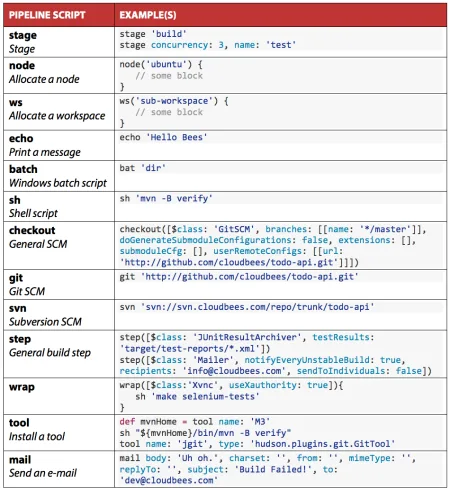
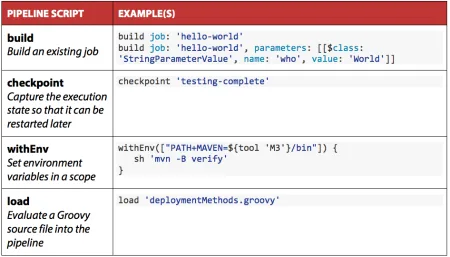
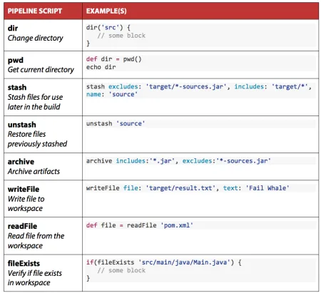
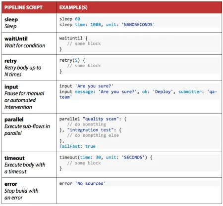
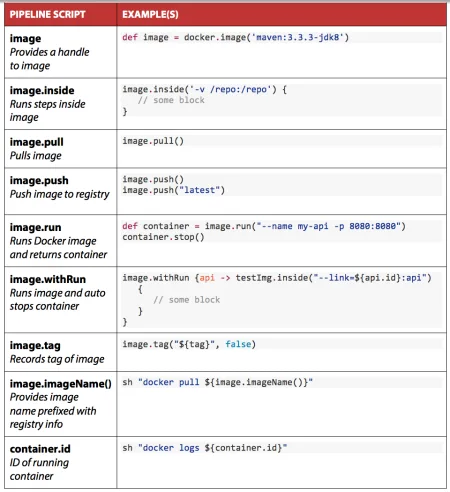

- https://www.cloudbees.com/blog/using-pipeline-plugin-accelerate-continuous-delivery-part-1
- https://www.cloudbees.com/blog/using-pipeline-plugin-accelerate-continuous-delivery-part-2
- https://www.cloudbees.com/blog/using-pipeline-plugin-accelerate-continuous-delivery-part-3

- https://www.jenkins.io/doc/book/pipeline/syntax/ (çok detaylı heme hemen bütün jkeywordleri detaylı örneklerle anlatmış jenkins resmi sayfası)

- https://www.jenkins.io/doc/book/pipeline/getting-started/ (Resmöi sayfa baya detatlı anlatım var)

**Tools**
- https://www.jenkins.io/doc/book/pipeline/development/

**Pipeline Destekleyen Plugin Listesi**
- https://github.com/jenkinsci/pipeline-plugin/blob/master/COMPATIBILITY.md

**Önemli Plugin Listesi**
- https://github.com/jenkinsci/docker-workflow-plugin
- https://github.com/jenkinsci/kubernetes-client-api-plugin
- https://github.com/jenkinsci/kubernetes-cli-plugin

**Pipeline Reference**

- https://www.jenkins.io/pipeline/getting-started-pipelines/ (çok detaylı jenkins offical page)
- https://github.com/jenkinsci/kubernetes-plugin

- Basics

- Advanced

- File System

- Flow Control

- Docker

