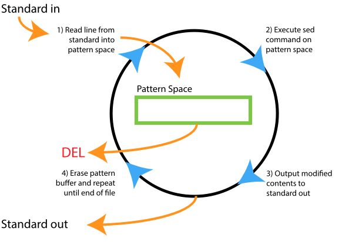
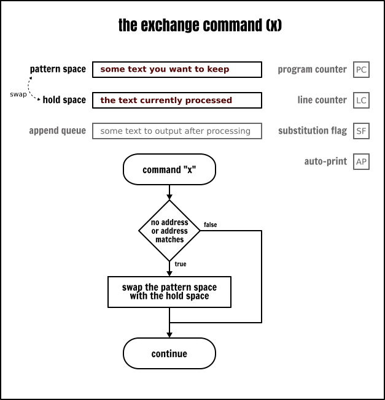
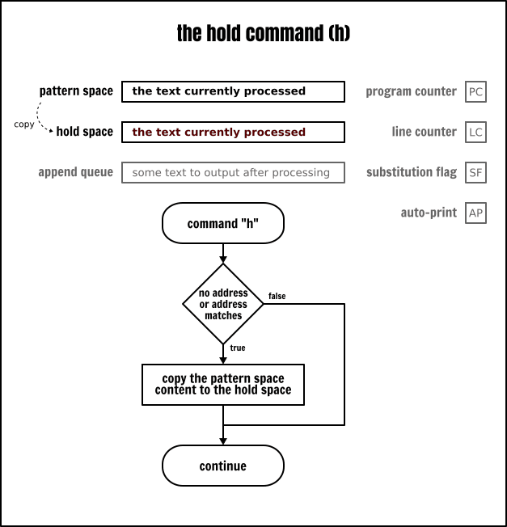
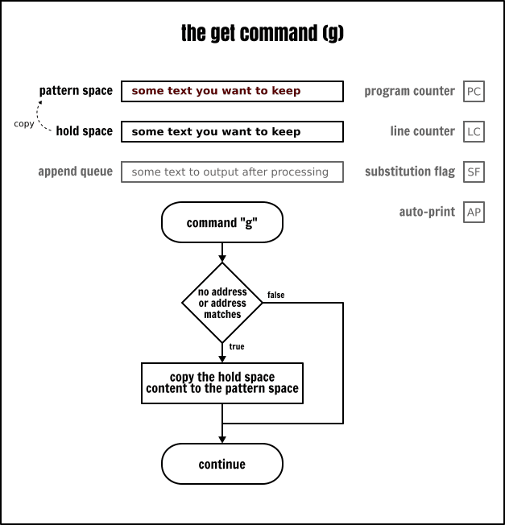
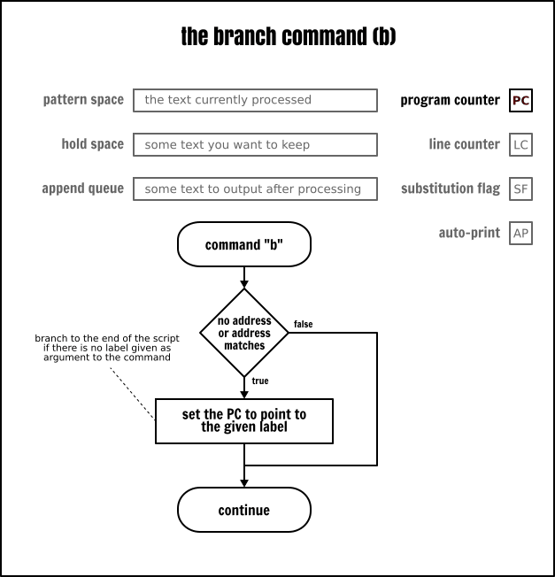
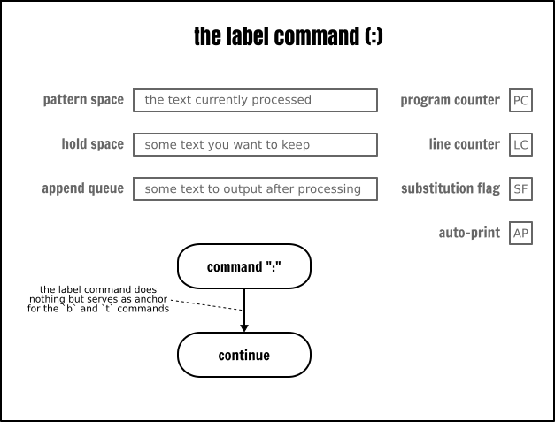
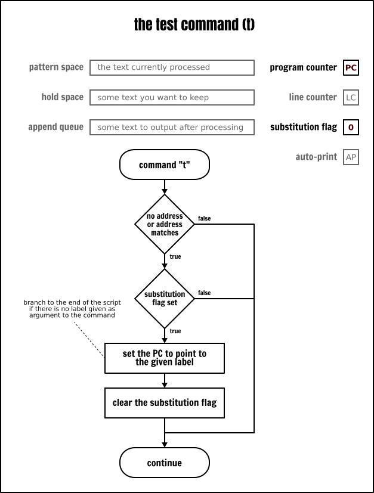
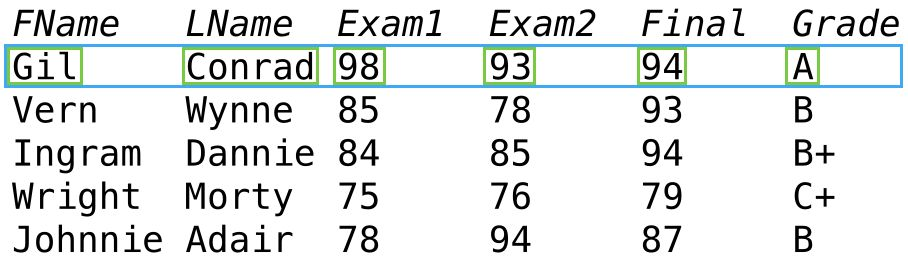

## GREP, SED ve AWK

grep, sed ve awk, üçü de metin işleme ve bulma araçlarıdır. Hepsi aynı yeteneklere sahip araçlar değildir.


- grep (Globally search a Regular Expression and Print): metin bulmak için kullanılır.
- sed (stream editor): grep e ek olarak metin değiştirme (tranfomation) aracıdır.
- awk (its name is derived from the surnames of its authors: Alfred Aho, Peter Weinberger, and Brian Kernighan): aslında bir script dilidir ve diğer ikisinde olmayan ekstra birçok özellik bulunmaktadır.


## GREP

kullanımı şu şekildedir.

```
$ grep [-seçenekler] örüntü dosyalar
```
**Seçenekler**

En iyi sonuçları elde etmek için grep komutuyla kullanabileceğimiz bir dizi parametre vardır, bunlar:


**Pattern selection and interpretation**

- -E, --extended-regexp: extended grep kullanıldığı belirtilir. yada egrep komutu kullanılır. 
- -F, --fixed-strings: Desenler dizelerdir
- -G, --basic-regexp: Desenler temel düzenli ifadelerdir
- -P, --perl-regexep: Desenler Perl ifadeleridir.
- -e, regexp = PATTERNS: Eşleşme kalıpları aranır
- -f. –Dosya (Dosya): Desenlerin dosya olarak kullanılmasını sağlar
- -i, --ignore-case: Büyük harfleri yoksay
- -w, --word-regexp: Tüm kelimeleri eşleştir
- -x, --line-regexp: Tüm satırları eşleştir
- -z, --null-data: 0 byte ile biten veri satırı, yeni satır dahil değil

**Çeşitli**

- -s, --no-messages: Hata iletilerini ortadan kaldır
- -v, --invert-match: Arama kriterlerine uymayan satırları seçin
- -V, --version: Kullanılan grep sürümünü görüntüler

**Output Kontrol**

- -m, --max-count = NUM: Belirli bir satır sayısından sonra aramayı durdurur
- -b, --byte-offset = Çıkış satırlarının yanında byte ofsetini görüntüler.
- -n, --line-number: Satır sayısını yazdır
- -H, --with-filename: dosya ismini çıktı satırlarında gösterir.
- -q, --quiet: Tüm sonuçları bastır
- -d, --directories = Eylem: Dizinlerin nasıl işlendiğini gösterir
- -l, --files-without-match = Yalnızca dosya adlarını satır eklemeden yazdır
- -c, --count: Dosya başına seçilen satırları yazdır
- -o, --only-matching: satırların yalnızca eşleşen boş olmayan kısımlarını göster
- -d, --directories=ACTION:  how to handle directories; ACTION is 'read', 'recurse', or 'skip'
- -D, --devices=ACTION: how to handle devices, FIFOs and sockets; ACTION is 'read' or 'skip'
- -r, --recursive : like --directories=recurse
- -L, --files-without-match : print only names of FILEs with no selected lines
- -l, --files-with-matches : print only names of FILEs with selected lines
- -c, --count: print only a count of selected lines per FILE
- -T, --initial-tab:  make tabs line up (if needed)
- -Z, --null : print 0 byte after FILE name


**Context control**

- -B, --before-context=NUM : print NUM lines of leading context
- -A, --after-context=NUM :  print NUM lines of trailing context
- -C, --context=NUM :-    print NUM lines of output context
- -NUM :- - - -  same as --context=NUM
 - --color(=WHEN),
 - --colour(=WHEN)   use markers to highlight the matching strings; WHEN is 'always', 'never', or 'auto'
- -U, --binary : do not strip CR characters at EOL (MSDOS/Windows)

#### Basit kullanımlar

- **kelimeyi dosyada aramak için**

```
$ grep edit sample.txt
#sonuç

uzun olduğu için bura eklemnmedi. ancak şöyle bir sonuç görüyor olacağız. edit kelimesinin geçtiği paragrafın tamamını getirir. bezı satırlarsa tek kelime de görülebilir. Bu durumda ilgili kelimenin yeni bir satırda tek kelime olmadındandır.

```
arama sonuçlarında bütün metinleri görmek istemiyorsak sadece eşleşen kelimeler için _-o_ parametresi kullanılır

```
$ grep -o edit sample.txt
# sadece 20 tane edit kelimesi görünür. -c parametresi ekleycek olursak 20 rakamını görürüz. -n parametresi eklenirse kelimlerin geçtiği satır numaraları da görülür.
```
sadece eşleşe keilemeler ve satır numarları görünür.

```
# grep -no  edit sample.txt 
```

- **aramayı tersine çevirmek için**

arama sonuçlarında eşleşmeyen satırları görmek için

```
$ grep -v edit sample.txt


```

- Bir klasördeki dosylarda arama yapmak için _-r_ parametresi kullanılır

etc klasöründeki tüm dosylarda 192.168.0. geçen dosyları ve kelimenin geçtiği satır numarlarını renkli görmek için

```
$ grep -nr --color  "192.168.0."  /etc
```


- **birden fazla kelime aramak için**


```
$ grep -win "edit\|program" sample.txt sample2.txt 
```
yada

```
$ grep -win -E "edit|program" sample.txt sample2.txt 
```
-E, --extended-regexp: extended grep kullanıldığı belirtilir yada aşağıdaki egrep komutu kullanılır.


yada 
```
$ egrep -win "edit|program" sample.txt sample2.txt
```

- **kelimlerin eşleştiği dosyların listesi almak için**

```
$ egrep -l "edit" sample.txt sample2.txt
# sonuç
sample.txt
sample2.txt

```


- **Birden fazla dosyada arama yapmak**


Bir klasör içindeki bütün dosylarda aramak

```
$ grep [-seçenekler] örüntü dosyalar
```
örneğe göre aşağıdaki komut yazılabilir

```
$ grep -rnw -e  "test" ~/* 
```
r: recorsive, n: satr sayısını göster, w: tüm kelimleri eşleştir, e: regular expression


Belirli dosyalarda aramak

```
$ grep -nw sample.txt sample2.txt -e  "edit"

# sonuç kısaltılmıştır

sample.txt:15:History[edit]
sample.txt:16:Precursors[edit]
sample.txt:25:Creation[edit]
sample.txt:30:Naming[edit]
sample.txt:39:Commercial and popular uptake[edit]
...
```
eğer iki dosyadaki aranan kelime sayını öğrenmek istiyorsak


```
$ grep -cnw -e  "edit" sample.txt sample2.txt 
# sonuç

sample.txt:17
sample2.txt:17
```

- ** Direk metinde arama yapmak**

```
$ echo "Merhaba Dünya" | grep -in "merhaba"

```


### Regular Expressions

Yaygın Olarak Kullanılan Normal İfade Kalıpları:

- . : Tek bir karakterle eşleşir.
- ^: Satırın başıyla eşleşir.
- $: Satırın sonuyla eşleşir.
- *: Önceki karakterle sıfır veya daha fazla kez eşleşir. yani belirli bir desenle başlayan tüm satırları getirir. ^ karakterinden farklı olarak satır başı değil 
- ? : Önceki karakterle sıfır veya bir kez eşleşir.
- []: Ayarlanmış karakterlerden herhangi biriyle eşleşir.
- (): Regular Expression ları gruplar.
- \: Özel karakterlerle eşleşir. örneğin amaç nokta aramaksa nokta özel işret olduğu için \. şekline aranmalıdıraranmalıdır
- +:: Önceki karakterin bir veya daha fazla oluşumuyla eşleşir.
- {n}: Önceki karakterle tam olarak n kez eşleşir.
- {n, m}: Önceki karakterle en az n kez ve en fazla m kez eşleşir.
- {n,}: Önceki karakterle n kez veya daha fazla eşleşir.

**Örnekler**

- herhangi bir karakterden sonra belli bir kelime aramak


wc ise geçen kelime sayısını verir

```
$ echo "Merhaba Dünya 123;test; 123A: test" | grep -no ".test" | wc
```

- içinde n den z ye kadar harflerin geçtiği kelimeleri bulmak

1 tane geçiyor olmalı o da Dünya kelimesi

```
$ echo "Merhaba Dünya 123;test; 123A: test" | grep -no "D[n-z]" | wc
```

- satırın başında desen aramak için

sonuçta 1 satır var ve o da Mer ile başlıyor

```
$ echo "Merhaba Dünya 123;test; 123A: test" | grep -nio "^mer" | wc

# aysını şöyle de yazılabilir

$ echo "Merhaba Dünya 123;test; 123A: test" | grep -n "^[mM]er" | wc
```

- home klasöründeki klasörleri listelemek

liste komutu (ls) çalıştırıldığında gelen listede klasörlerin başında d yazdığı için alttaki komut işe yarayacaktır.

```
$ ls ~/ -l | grep "^d"
```

- aranan desenin satırın sonunda geçmesini sağlamak 

```
$ echo "Merhaba Dünya 123;test; 123A: test" | grep -no "est$" | wc
```

- belli bir desenin geçtiği kelimelerin bulunduğu satırları listelemelek 

burada * karakteri kullanılır.

```
$ echo "Merhaba Dünya 123;test; 123A: test" | grep -no "te*" | wc
```

-**Aramayı kelime bazında yapmak için**


bütün mertin içinde baş harfi büyük olan kelimeler
```
([A-Z])\w+/g
```


**Resources**
- https://tr.admininfo.info/c-mo-usar-comando-grep-y-tree-linux-ejemplos
- https://www.tutorialspoint.com/unix_commands/grep.htm
- https://unbounded.systems/blog/3-kinds-of-parentheses-are-you-a-regex-master/

## SED

- https://linuxhandbook.com/sed-reference-guide/#a-little-bit-of-theory-on-sed (en iyi kaynak)





sed bir stream editörüdür aynı zamanda ufak bir script dilidir de denilebilir. Bu tanım olarak sed komutunu açıklamkatdır. Çünki text editör (gedit, vim, nano) gibi bir UI yı yoktur. input olarak text'i alır ve bunu output olarak verir.

genel kullanımı şu şekildedir. Options ve Commands aşağıda listelenmiştir.

```
$ sed OPTIONS... [SCRIPT] [INPUTFILE...]
```

daha detyalı kullanım
```
$ [addr]X[options] [SCRIPT] [INPUTFILE...] 
```
Burada X tek bit harflik sed komutudur. addr ile opsiyonel satır adreslemesidir. X bu addr sayesinde sadece belirtilen satılarda çalışmış olur. addr tekbir satır numarsaı veya bir regular expression olabilir. addr için detaylı anlatım : https://www.gnu.org/software/sed/manual/html_node/sed-addresses.html#sed-addresses


örneğin alttaki kod verlen dosyadaki 30 dan 35 e kadarki satırları dosyadan silerek output.txt dosyaına yazar.

```
$ sed '30,35d' input.txt > output.txt
```


**Sed Options**

- -n, --quiet, --silent: Desen boşluğunun otomatik olarak yazdırılmasını engeller.
- -e script, --expression = script Çalıştırılacak komutlara kod komut dosyasını ekleyin. Birden fazla sed opsiyonu tanımla.
- -f script-file, --file = script-file Komut dosyasının içeriğini yürütülecek komutlara ekleyin. Sed komutlarının olduğu bir bash script dosyasını çalıştır.
- --follow-symlinks: Yerinde işlerken sembolik bağları izleyin.
- -i (SUFFIX), --in-place (= SUFFIX) Dosyaları yerinde düzenleyin (bu, SUFFIX sağlanmışsa SUFFIX dosya uzantılı bir yedek oluşturur).
- -l N, --line-length = N "l" komutu için istenen satır kaydırma uzunluğunu, N belirtin.
- --POSIX Tüm GNU uzantılarını devre dışı bırakın.
- -r, --regexp-extended: Kodda genişletilmiş düzenli ifadeler kullanın.
- -s, --separate: Dosyaları tek bir sürekli uzun akış yerine ayrı olarak değerlendirin.
- -u, --unbuffered: Giriş dosyalarından minimum miktarda veri yükleyin ve çıktı arabelleklerini daha sık temizleyin.
- --help Bir yardım mesajı görüntüleyin ve çıkın.
- --version Sürüm bilgilerini verir ve çıkar.

**Sed Commands**

- : = label
- # :  comment
- {....} : Block
- = : - print line number
- a\ :  aktif satıra ekleme yapar
- b label :  -Branch
- c\ : Aktif satırı verilen kelime/cümle ile değiştir.
- d and D : Yazıyı sil.
- g and G : -Get
- h and H : -Hold
- i\ : Aktif satırın yukarısına ekleme yap.
- l:  - Look
- n and N :  -Next
- p and P : Ekrana yazdır.
- q : - Quit
- r filename :  dosyayı okur
- s/..../..../ : bul ve değiştir
- t label :  - Test
- w filename : dosyaya yaz
- x : - eXchange
- y/..../..../ : - Transform


aşağıdaki örneklerde temel bakış commands'lar olacaktır. parametreleri commands'lar üzerinden anlatıyor olacağız.

#### Adresses: Selecting Lines
Adresler sed komutlarının hangi satırlarda çalışacağını belirtir.

- **Satır numarasına göre satır seçimi**


aşağıdkai kodda ilk rakam başlangç sayısını ikincisi ise stap sayısını beliritir. 

```
$ seq 10 | sed -n -e "0~4p"
# sonuç

4
8
```
tek satır almak için 
```
$ seq 10 | sed -n e- "4,5p"
# sonuç

4
5
```

- **Eşleşen kelimeler egöre satır seçimi**

5 ile eşleşen satırı getirdi

```
$ seq 10 | sed -n -e  "/5/p"

# sonuç

5

```

regular expression kullanımı, 4 ile başlayıp sonrası 2,3 veya 4 ile devam edenler

```
$ seq 10 50 | sed -n -e "/^4[2-4]/p"

```
regular espression yazılırken des birçok farklı delimiter ları destekler. örneğin aşağıki yazlımların hepsi aynı sopnu getirir. /home/alice/documents/ ile başlayan satırlar.

örneğin çok path ile ilgili regexp yazılacaksa \%^/home/alice/documents/% kullanımı daha mantıklı görünüyor.

```

$ sed -n '/^\/home\/alice\/documents\//p'
$ sed -n '\%^/home/alice/documents/%p'
$ sed -n '\;^/home/alice/documents/;p'

```
regexp sonuna I eklenirse bu aramnın case sensitive olmadığını belirtir. i ise ekleme komutudur.

```
$ echo -e 'Merhaba Dünya \nmerhaba dünya' | sed -n -e "/merhaba/Ip"
#sonuç
Merhaba Dünya
merhaba dünya
```
örneğin i kullancak olursak

```
$ echo -e 'Merhaba Dünya \nmerhaba dünya' | sed -e "/merhaba/ip"

#sonuç

Merhaba Dünya 
p
merhaba dünya

```

- **Aralık Belirterek Satır Seçimi**


virgülden önceki kısım addr1 ve virgülden sonraki kısım addr2 olark adlandırılır.

alttaki örneklerde belirtilen addr1 ve addr2 kısımları satır numarasıdır, rakamın kendisi değildir. burada zaten herşey text dir rakam değildir.


```
$ seq 10 | sed -n '4,6p'
4
5
6

```

ilk rakam 4 olan ve hemen arkasından 0-9 arası bir rakam gelen satırlar. bu durumda bu listede 4 den sonra br rakam 5 ile tamamlanmış oluyor.


```
$ seq 10 | sed -n '4,/[0-9]/p'
4
5
```
üstteki kod şu şekilde de yazılabilirdi. yukarıda bitiş rakamı regexp olarak yazılmış.

```
$ seq 10 | sed -n "4,5p"
```

örneğin alttaki örnekte başlanğıç olarak ekrana 38 yazıldı. sebebi ise arada 30 rakalmının olması indexi (satır numarasını) kaydırmışytır. 4 rakamına hakikaten 4. satırda rastlamıştır buranın değeri de 33 dür. yani 4 ve 5. satırları yazdırmıştır.

```
$ seq 30 50 | sed -n -e '4,/5/p'

# sonuç
33
34
35


```

başlangç rakamına değer eklyerek bitişi belirtme

```
$ seq 10 | sed -n '6,+2p'
6
7
8

```
bitiş rakamının değerini verilen sayının 2 katını alarak belirtme

```
seq 16 | sed -n '6,~6p'

6
7
8
9
10
11
12


```
#### En çok kullanılan s Komutu

temel kullanımı şu şekildedir 

```
s/regexp/replacement/flags
```

basit bir örnek

```
$ echo "merhaba bugün nasılsın? kötü görünüyorsun" | sed "s/kötü/iyi/"

# sonuç

merhaba bugün nasılsın? iyi görünüyorsun
```
dosya okuyup yazmak için

```
$ sed s/day/night/ <old >new

Or another way (for UNIX beginners),

$ sed s/day/night/ old >new

```

üzerinde çalışatığımız metinde (/) işareti sıkça yer alıyorsa delimiter leri aşağıdaki şekillerde de kullanmak mümkün.

```
sed 's_/usr/local/bin_/common/bin_' <old >new

Some people use colons:

sed 's:/usr/local/bin:/common/bin:' <old >new

Others use the "|" character.

sed 's|/usr/local/bin|/common/bin|' <old >new

```

örneğin, birdeen fazla expression (-e) çalıştırmak

```
$ echo "merhaba / bugün /  nasılsın? kötü / görünüyorsun" | sed  "s:/ bugün: bugün:"

# sonuç

merhaba  bugün /  nasılsın? kötü / görünüyorsun

```
tüm metni düzeltmek için

```
$ echo "merhaba / bugün /  nasılsın? kötü / görünüyorsun" | sed  "s:/ bugün: bugün:" | sed "s:/  nasılsın:nasılsın:" | sed "s:/ görünüyorsun:görünüyorsun:"

# sonuç

merhaba  bugün nasılsın? kötü görünüyorsun

```
yada 

```
$ echo "merhaba / bugün /  nasılsın? kötü / görünüyorsun" | sed -e  "s:/ bugün: bugün:" -e "s:/  nasılsın:nasılsın:" -e"s:/ görünüyorsun:görünüyorsun:"

# sonuç
merhaba  bugün nasılsın? kötü görünüyorsun

```
- **Eşleşen metin olarak ampersent (&) kullanımı**

örneğin buldumuz aradığımızmetnin çevresini parantez ile çevelemk isteyelim

```
$ echo "merhaba bugün nasılsın? kötü görünüyorsun" | sed  "s/kötü/(kötü)/"
merhaba bugün nasılsın? (iyi) görünüyorsun
```
bu durum eğer aradığımızmetni tam olarak bimiyorsak çalışmayacaktır. Üstteki önekte aradığımız kelime belli olduğu için parantez yabilmiştik. Örneğin alttaki koda bakalım. Hangi rakamın geleceği belli değil bu nedenle & karakteri kullanıldı. Sondaki g ise global olduğunu yani tüm metinde arama yapılcağını gösterir. Öteki türlü ik rakamdan sonra dururdu.

```
$ echo "merhaba 0 bugün 1 nasılsın? 2 kötü 3 görünüyorsun" | sed  "s/[0-9]/(&)/g"

# sonuç
merhaba (0) bugün (1) nasılsın? (2) kötü (3) görünüyorsun
```
mesele aynı kodu 2. rakamı seçecek şekild eğiştirelim

```
$ echo "merhaba 0 bugün 1 nasılsın? 2 kötü 3 görünüyorsun" | sed  "s/[0-9]/(&)/2"

# sonuç
merhaba 0 bugün (1) nasılsın? 2 kötü 3 görünüyorsun
```
- **Regular Expression Kullanımı**

konuyla ilgili olarak şu [regular expression](RegularExpression.md) başlığını da okumalısınız.

```
$ echo "123 abc" | sed -r 's/[0-9]+/& &/'
123 123 abc

```

extented regular expression da \ slash kullanmaya gerek yok. Bunun için _-E_ parametresi kullanılır.

```
$ echo echo abcd123 | sed -r 's/([a-z]+) ([a-z]+)/\2 \1/' # Using GNU sed
$ echo abcd123 | sed -E 's/([a-z]+) ([a-z]+)/\2 \1/' # Using Apple Mac OS X
```
If you want to switch two words around, you can remember two patterns and change the order around:

kelimlere yer değiştirme. bu örnek bu şekilde çalıştırılırsa kullanıcıdan 2 veya daha fazla kelime girmesi istenecek .
```
sed 's/\([a-z]*\) \([a-z]*\)/\2 \1/'
```


yada şu şekilde verilen kelimleri test çevi,rebilir.

```
$ echo "123 abc test" | sed 's/\([a-z]*\) \([a-z]*\)/\2 \1/'
123abc  test

```

**Sed recursive midir?**

Sed yalnızca gelen verilerde bulunan kalıplar üzerinde çalışır. Yani, giriş satırı okunur ve bir model eşleştiğinde, değiştirilen çıktı üretilir ve girdi satırının geri kalanı taranır. "S" komutu yeni oluşturulan çıktıyı taramayacaktır. Yani, aşağıdaki gibi ifadeler hakkında endişelenmenize gerek yok:

```
sed 's/loop/loop the loop/g' <old >new
```
İkinci bir "s" komutu yürütülürse, önceki bir komutun sonuçlarını değiştirebilir. Size daha sonra birden fazla komutun nasıl çalıştırılacağına ileride değineceğiz.

- **/1, /2, etc. Specifying which occurrence**

Birden fazla patten kullanarak hangisinin eşleşeceğini belirlemek.


örneğin alttaki örnekte 2. kelime silinecektir. burada amaç aslında verilen ikşi pattern den ikincisinin çalışmasını salamak.

```
$ echo "merhaba nasılsın iyimisin" | sed 's/\([a-zA-Z]*\) \([a-zA-Z]*\) /\1 /'

merhaba iyimisin

```

eğer index belitmeseydik ilk iki kelime silinecekti. buradan şu anlaşılıyor sed default olarka sadece bir kez eşleşeni işliyor. Hepsiniyakalamsı için /g komutunu vermeliyiz.

```
$ echo "merhaba nasılsın iyimisin" | sed 's/\([a-zA-Z]*\) \([a-zA-Z]*\) / /' 
  iyimisin

```


-**global olarak eşleşmelerden belli bir index numarasındakini değiştirmek**


mesela şu örnekte tek bir pattern verilmiş normal şartlada ilk kelimenin silinmesi gerekirken. /2 komutu ile ikinci gelimenin silinmesi sağlanıyor.

```
echo "merhaba bugün nasılsın iyimisin? iyi görünmüyorsun." | sed 's/[a-zA-Z]* //2'
merhaba nasılsın iyimisin? iyi görünmüyorsun.
```

eğer rakam g komutu ile birlikte kullanılırsa ozman belirtilen rakamdan sonra eşleşen tüm kayıtlar silinir.

merhaba atlandı ve 2. kelimeden itibaren eşleşenm kelimeler silindi. silinmeyen kelimlere bakacak olursak "iyimisin?" de soru işraeti var, "görünmüyorsun."da da nokta işareti var. bu arada patterne dikkat edilirse * dan sonra boşluk eklenmiş yani boşluk olmasıd atalep ediliyor.

```
$ echo "merhaba bugün nasılsın iyimisin? iyi görünmüyorsun." | sed 's/[a-zA-Z]* //2g'
merhaba iyimisin?görünmüyorsun.

```

- **sonuçları dosyaya yazmak**

çiftsayı ile başlayan satırlar even adlı dosysy yazılıyor

```
$ echo "2 3 5" | sed -n 's/^[0-9]*[02468] /&/w even'
```

#### Addresses and Ranges of Text

- **Restricting to a line number**

3. satırda eğer rakam bulursa sil yazacak

```
$ echo -e "3 \n 4 \n 5 \n merhaba \n nasılsın \n 6" | sed  '3 s/[0-9]*/sil/'
3 
 4 
sil 5 
 merhaba 
 nasılsın 
 6

```

- **Restricting to a pattern**

Many UNIX utilities like vi and more use a slash to search for a regular expression. Sed uses the same convention, provided you terminate the expression with a slash. 

bütün satılardaki ilk rakam yerine "rakam" yazmak için

```
$ echo -e "123 \n 456 \n789 \n merhaba" | sed '/^[1,7]/ s/[0-9][0-9]*/rakam/'
rakam 
 456 
rakam 
 merhaba

```

- **Restricting to Ranges by patterns** 

You can specify two regular expressions as the range. Assuming a "#" starts a comment, you can search for a keyword, remove all comments until you see the second keyword. In this case the two keywords are "start" and "stop:"

```
sed '/start/,/stop/ s/#.*//'
```
örnek, # ile başlayan satırlarda satırın "start" kelimesiyle başlayıp "stop" kelimesi ile bitmesi durumunda bu satırı silmek için.

```
$ echo -e "# start 123 stop  \n 456 \n789 \n merhaba \n #start sil stop  " | sed '/start/,/stop/ s/#.*//'

 456 
789 
 merhaba 

```

#### seçini tersine çevirmek için

Relationships between d, p, and !
As you may have noticed, there are often several ways to solve the same problem with sed. This is because print and delete are opposite functions, and it appears that "!p" is similar to "d," while "!d" is similar to "p." I wanted to test this, so I created a 20 line test file, and tried every different combination. The following table, which shows the results of by test, demonstrates the difference:

Relations between d, p, and !
```
Sed	    Range	Command	  Results
sed -n	1,10	p	      Print first 10 lines
sed -n	11,$	!p	      Print first 10 lines
sed	    1,10	!d	      Print first 10 lines
sed	    11,$	d	      Print first 10 lines
sed -n	1,10	!p	      Print last 10 lines of my 20-line file
sed -n	11,$	p	      Print last 10 lines of my 20-line file
sed	    1,10	d	      Print last 10 lines of my 20-line file
sed	    11,$	!d	      Print last 10 lines of my 20-line file
sed -n	1,10	d	      Nothing printed
sed -n	1,10	!d	      Nothing printed
sed -n	11,$	d	      Nothing printed
sed -n	11,$	!d	      Nothing printed
sed	    1,10	p	      Print first 10 lines twice, then next 10 lines once
sed	    11,$	!p	      Print first 10 lines twice, then last 10 lines once
sed	    1,10	!p	      Print first 10 lines once, then last 10 lines twice
sed	    11,$	p	      Print first 10 lines once, then last 10 lines twice
```


This table shows that using my 20-line test file, the following commands are identical:
```
sed -n '1,10 p'
sed -n '11,$ !p'
sed '1,10 !d'
sed '11,$ d'
```

It also shows that the "!" command "inverts" the address range, operating on the other lines.


Of course for files longer than 20 lines, you will get more than 10 lines for the last two cases.


#### Groping with {}


alttaki kod # isareti ile başlayıp başlangıçta begin bitişte end yazan satırları siler 


```
$ echo -e "#begin 123 end  \n 456 \n789 \n merhaba \n #begin sil son  \n test" | sed -n '
/begin/,/end/ {
     s/#.*//
     s/[ ^I]*$//
     /^$/ d
     p
}
'
```


aynı kodu sadece belirli satırlarda çalıştırmak istiyorsak şu şekilde de yazabiliriz.

```

$ echo -e "#begin 123 end  \n 456 \n789 \n merhaba \n #begin sil son  \n test" | sed -n '

1,100 {
    /begin/,/end/ {
        s/#.*//
        s/[ ^I]*$//
        /^$/ d
        p
    }
}
'

```


#### Adding, Changing, Inserting new lines / yeni satır ekleme, değiştirme


- Append = listenin sonua eklemek
- Insert = Genelde üste eklemek anlamında ancak index numarsı ile birlikte farklı satırlara da eklenebilir.


**Append**

her WORD kelimesinden sonra "Add this line after every line with WORD" cümlesini eklemek

```
$ echo -e "#begin 123 end  \n 456 \n789 \n WORD \n merhaba \n #begin sil son \n WORD  \n test" | sed '
/WORD/ a\
Add this line after every line with WORD
'
```
**Insert**

insert WORD kelimesinin geçtiği satırın üsütne ekler
```
$ echo -e "#begin 123 end  \n 456 \n789 \n WORD \n merhaba \n #begin sil son \n WORD  \n test" | sed '
/WORD/ i\
Add this line before every line with WORD
'
```

**Change**
 
Change WORD kelimesinin geçtiği satırı yeni satırla değiştirir
```
$ echo -e "#begin 123 end  \n 456 \n789 \n WORD \n merhaba \n #begin sil son \n WORD  \n test" | sed '
/WORD/ c\
Added this line with WORD
'
```

**Hepsi birarada**

```
$ echo -e "#begin 123 end  \n 456 \n789 \n WORD \n merhaba \n #begin sil son \n WORD  \n test" | sed '
/WORD/ {
i\
Add this line before
a\
Add this line after
c\
Change the line to this one
}'
```


#### Birden fazla satırla çalışmak (satır satır çalışmak)


ilk satırda ONE ve ikinc i SATIRDA TWO görürse ekrana yazıyor.
```
$ echo -e "ONE\nTWO" | sed -n '
> /ONE/ {
> # found "ONE" - read in next line
> N
> # look for "TWO" on the second line
> # and print if there.
> /\n.*TWO/ p
> }'
ONE
TWO
```
alttaki örnmek ekrana bir şey yazmayacaktır çünki kurala uymuyor

```
$ echo -e "ONE\nTHREE\nTWO" | sed -n '
/ONE/ {
# found "ONE" - read in next line
N
# look for "TWO" on the second line
# and print if there.
/\n.*TWO/ p
}'

```


```
$ echo -ne "ONE\nTWO\nONE TWO\nTWO" | sed '
> /ONE/ {
> # append a line
> N
> # "ONE TWO" on same line
> s/ONE TWO/TWO/
> # "ONE
> # TWO" on two consecutive lines
> s/ONE\nTWO/TWO/ p
> }'
TWO
TWO
TWO
TWO

```


#### HOLD with h and H

- **pattern buffer (patterne space):** Sed bir dosyaı satır satır okur ve pattern buffer a yazar. Pattern buffer geçici geçici/kısa süreli buffer'dır. Sed e buradaki veriyi yazdır deidğimizde yazdırır.
- **hold buffer (hold space):** Uzun süreli buffer'dır. Bir aramayla bulşduğumuz bir kelime/satır burada tutulur ve daha sonra lazım olduğunda çağırabiliriz. Sed başka bir satırla ilgilenirken önceki bilgileri bu hold buffer da tutar.

Hold buffer / hold space, bir şeyi yakalayabileceğiniz, depolayabileceğiniz ve daha sonra sed başka bir hattı işlerken daha sonra yeniden kullanabileceğiniz uzun vadeli bir depolama gibidir. Hold space i doğrudan işlemezsiniz, bunun yerine, onunla bir şey yapmak istiyorsanız kopyalamanız veya pattern space eklemeniz gerekir. Örneğin, yazdırma komutu p, yalnızca pattern spac e i yazdırır. Aynı şekilde s, pattern space de çalışır.


https://snipcademy.com/shell-scripting-sed

Aşağıdaki örnek incelenecek olursa


1. Sed satırları okuyarak pattern buffer a alır
2. G command yarımıyla bir satır boşluğu hold buffer da işledikten sonra pattern buffer/space e ekler (append). -n komutu yazılmdıysa ekrana veriyi basar.
3. eğer 2 satır işstiyorsak G;G şeklinde yazılmalıdır.


```
$ cat << EOF | sed 'G'
#Linux
        Administration
        Scripting
        Tips and Tricks

#Windows
        Administration

#Database
        Mysql
        Oracle
        Queries
        Procedures
EOF
```

örneğin alttaki komut ile holding buffer ile curent buffer ı exchange eder. yani ekrana metni yazdırır.

```
$ cat << EOF | sed 'x'
One OS to rule them all,
One OS to find them.
One OS to call them all,
And in salvation bind them.
In the bright land of Linux,
EOF
```
üstteki örnekte şu adımlar gerçekleşir.
1. The first line is placed in the pattern space.
2. The contents of the pattern space is exchanged with the contents of the hold buffer, which is empty as of now.
3. The pattern buffer then replaces the current line with its contents which is nothing.
4. Sed then makes its way to the next line, and stores this line into the pattern buffer.
5. The pattern buffer is swapped with the hold buffer, which contains the line preceding it.
6. The line within the pattern buffer is then outputted.
7. Repeat from #4 until reaching the last line.
8. On the last line, the second-to-last line will be in the hold buffer, and swapped with the pattern buffer.
9. Since the last line will be held in the hold buffer, but is never swapped with the pattern buffer, it does not get printed out and sed finishes its execution. Remember that the hold buffer will not get ouputted unless explicitly requested.



**Hold with h or H**

Hold fonksiyonu (h) pattern buffer ı hold buffer a kopyalar. 

Eğer hold buffer ı saklmak ve ileride kullanmak istesek H komutunu kullanmalıyız. Pattern buffer hol buffer a eklenir ve battern bufferla arasına new line \n ekler.




**Get with g or G**

g komutu ise hold buffer ı pattern buffer a yazar. böylece pattern space silinir.

G ise silmeden append yapar. Yeni satır olarak ekleme yapar patterne space e 





```
$ cat << EOF | sed 'G'
One OS to rule them all,
One OS to find them.
One OS to call them all,
And in salvation bind them.
In the bright land of Linux,
EOF
```

mevzuyu dah iyi anlmak içişn bir örnek daha. Bu örnekte satırların sırasını değiştirceğiz

```
$ cat << EOF | sed -n '1!G;h;$p' 
One OS to rule them all,
One OS to find them.
One OS to call them all,
And in salvation bind them.
In the bright land of Linux,
EOF
```
şu şekilde işliyor

1. The first line is copied into the pattern space.
2. 1!G says to apply the G command to all lines except the first, so we skip this one.
3. The h command copies the contents into the holding space. The previous contents of the holding space are destroyed.
4. The last command says print out just last line's pattern space, so we skip this one.
5. Sed goes back to the first command, 1!G.
6. The current line is placed within the pattern space.
7. The contents of the holding space are appended to the pattern buffer with a newline character. On the nth iteration, this would cause the order to be: n, n-1 ... 2, 1.
8. Repeat this from #2 until the last line.
9. On the last line, print out the pattern space.


**Exchange örneği (x)**


```
$ cat -n << EOF | sed -n -e '
  1{x;n}                # Swap the hold and pattern space
                        # to store line 1 into the hold buffer
                        # and then read line two
  5{
    p                   # print line 5
    x                   # swap the hold and pattern space to get
                        # back the content of line one into the
                        # pattern space
  }

  1,5p                  # triggered on lines 2 through 5
                        # (not a typo! try to figure why this rule
                        # is NOT executed for line 1;)
'
One OS to rule them all,
One OS to find them.
One OS to call them all,
And in salvation bind them.
In the bright land of Linux,
EOF

# sonuç

     2  One OS to find them.
     3  One OS to call them all,
     4  And in salvation bind them.
     5  In the bright land of Linux,
     1  One OS to rule them all,

```


**hold command (h) için örnek**


The hold command (h) is used to store the content of the pattern space into the hold space. However, as opposed to the exchange command, this time the content of the pattern space is left unchanged. The hold commands came in two flavors:h


that will copy the content of the pattern space into the hold space, overwriting any value already presentH


that will append the content of the pattern space to the hold space, using a newline as separator


```
$ cat -n <<EOF | sed -n -e '
  1{h;n}                # Store line 1 into the hold buffer and continue
  5{                    # on line 5
    x                   # switch the pattern and hold space
                        # (now the pattern space contains the line 1)
    H                   # append the line 1 after the line 5 in the hold space
    x                   # switch again to get back lines 5 and 1 into
                        # the pattern space
  }

  1,5p                  # triggered on lines 2 through 5
                        # (not a typo! try to figure why this rule
                        # is NOT executed for line 1;)
'
One OS to rule them all,
One OS to find them.
One OS to call them all,
And in salvation bind them.
In the bright land of Linux,
EOF

# sonuç

     2  One OS to find them.
     3  One OS to call them all,
     4  And in salvation bind them.
     5  In the bright land of Linux,
     1  One OS to rule them all,


```


****Get örneği**


The get command (g) does the exact opposite of the hold command: it takes the content of the hold space and put it into the pattern space. Here again, it comes in two flavors:g


that will copy the content of the hold space into the pattern space, overwriting any value already presentG


that will append the content of the hold space to the pattern space, using a newline as separator


```
$ cat << EOF | sed -En -e '
  \=(/usr/sbin/nologin|/bin/false)$= { H;d; }
              # Append matching lines to the hold buffer
              # and continue to next cycle
  p           # Print other lines
  $ { g;p }   # On the last line,
              # get and print the content of the hold buffer
'
One OS to rule them all,
One OS to find them.
One OS to call them all,
And in salvation bind them.
In the bright land of Linux,
EOF


```

https://linuxhandbook.com/

#### Branche ve Label kavramı

aşağıudaki örnek aslında bütün herşeyi açıklıyor.



```
echo hello | sed -ne '
  :start      # Put the "start" label on that line of the program
  p           # Print the pattern buffer
  b start     # Continue execution at the :start label
' | less
```

q ile çıkabilirsiniz.




**Conditional branch**



```
cat << EOF | cut -d: -f1 | sed -Ee '
  :start
  s/^(.{,19})$/ \1 /    # Pad lines shorter than 20 chars with
                        # a space at the start and another one
                        # at the end
  t start               # Go back to :start if we added a space
  s/(.{20}).*/| \1 |/   # Keep only the first 20 char of the line
                        # to fix the off-by-one error caused by
                        # odd lines
'
One OS to rule them all,
One OS to find them.
One OS to call them all,
And in salvation bind them.
In the bright land of Linux,
EOF
```


- https://linuxhandbook.com/sed-reference-guide/#branching
- https://linuxhandbook.com/sed-reference-guide/#conditional-branch


#### Sed ile yapılmış uygulamalar

- [Hesap Makinası](files/sedtris.sed)
- [Tetris](files/cd.sed)


#### Resources
- https://linuxhandbook.com/sed-reference-guide/#a-little-bit-of-theory-on-sed (en iyi kaynak)
- https://www.gnu.org/software/sed/manual/sed.html#sed-regular-expressions
- https://www.grymoire.com/Unix/Sed.html (çok iyi anlatılmış)
- https://linuxconfig.org/learning-linux-commands-sed (örnekler güzel verilmiş)
- https://www.thegeekstuff.com/2009/09/unix-sed-tutorial-printing-file-lines-using-address-and-patterns/
- https://se.ifmo.ru/~ad/Documentation/Shells_by_Example/ch05lev1sec9.html
- https://www.thegeekstuff.com/2009/12/unix-sed-tutorial-7-examples-for-sed-hold-and-pattern-buffer-operations/
- https://www.gnu.org/software/sed/manual/html_node/sed-commands-list.html
- https://gurkan.in/turkce/20091019-sed-kullanm-rnekleri/
- https://linuxhint.com/50_sed_command_examples/
- https://www.digitalocean.com/community/tutorials/the-basics-of-using-the-sed-stream-editor-to-manipulate-text-in-linux
- https://www.computerhope.com/unix/used.htm
- https://www.gnu.org/software/sed/manual/sed.html
- https://www.tutorialspoint.com/unix/unix-regular-expressions.htm
- https://linuxreviews.org/Tao_of_Regular_Expressions
- https://riptutorial.com/regex/example/17891/posix-character-classes


## AWK

**Nasıl Çalışır**


1. BEGIN ile değişkenler tanımlanır, ilk ayaarlamalar yapılır
2. BODY bloğu içinde satırları oku awk komutlarını satırlara uygulamalar
3. END ile kapanış işlemlerini yap

örnek dosya files klasöründedir.

```
# grades.txt

Gil     Conrad 98     93     94     A
Vern    Wynne  85     78     93     B
Ingram  Dannie 84     85     94     B+
Wright  Morty  75     76     79     C+
Johnnie Adair  78     94     87     B
```

awk script dosyası 

```
# test.awk
BEGIN {
    # Print the header out before starting anything
    printf "FName\tLName\tExam1\tExam2\tFinal\tGrade\n";
    # Initialize any variables
    n = 0;
}
{
  # Print each line (called "record")
    print $0
    # If the sixth column (called "field") is a B, then increment n
    if($6 == "B") { ++n }
}
END {
    # Wrap things up and print out summary variables
    print "Number of students with a B in the class = "     | n;
}
```

scriptin çalıştırılmaı

```
$ gawk -f test.awk grades.txt
FName LName Exam1 Exam2 Final Grade
Gil     Conrad  98      93      94      A
Vern    Wynne   85      78      93      B
Ingram  Dannie  84      85      94      B+
Wright  Morty   75      76      79      C+
Johnnie Adair   78      94      87      B
Number of students with a B in the class = 2     

```

#### Record Fields RS, RT, ORS, FS, OFS, $n

Awk progrmalama mode 2 parçadan oluşur
- Record & Fields
- Pattern & Actions



**record** satılar, **field** satılardaki değerleri ifade eder.

**Record Seperator (RS & RT)**
genel de bir karakterden oluşur. Örneğin new linme gib. Ancka gawk ile beraber artık regular exxpression da yazlılabilir.

örneğin aaşağudaki örnekt e seperator olarak regulaer expression kullanılmış. Örnekte seperator olarak rakamlar kullanılmış. RS burada regular expression, RT ise Regulaer expression a dek gelen rakamlardır.

```
$ echo firstRecord 111111 secondRecord 222222 thirdRecord 333333 lastRecord |
>    gawk 'BEGIN { RS = "([[:digit:]]+)" }
>                { print "RS = " RS " and RT = " RT }'
RS = ([[:digit:]]+) and RT = 111111
RS = ([[:digit:]]+) and RT = 222222
RS = ([[:digit:]]+) and RT = 333333
```

**Output Record Separator (ORS)**

her bir satırdan sonra gelecek karakter yada kelimeyi ifade eder normalde neew line dır.

```
$ echo 'hello; nihao; hola; anyonghasaeyo' | 
>    gawk 'BEGIN { RS = ";"; ORS = " +"}
>                { print $0 }'
hello + nihao + hola + anyonghasaeyo 
```

**Field separators (FS)**

$0 current recordu ifade eder.

```
$ echo 'Joe John Johanna' | 
>    gawk -F' ' '{ print NF ":" $0 }'
3:Joe John Johanna 
# Same command as above but using the BEGIN block
$ echo 'Joe John Johanna' | 
>    gawk 'BEGIN { FS=" " } 
>                { print NF ":" $0 }'
3:Joe John Johanna
# Changing the FS character
$ echo '   Joe   John   Johanna   ' | 
>    gawk -F'[ ]' '{ print NF ":" $0 }'
13:   Joe   John   Johanna                    
```

**Output Field Separator (OFS)**

çıktıdaki fieldların ayracı olarak kulalnılır.

```
$ echo 'John Mary; Jacob Teresa; Bob Claire' |
>    gawk 'BEGIN { OFS=" loves "; RS=";" }
>                { print $1, $2 }'
John loves Mary
Jacob loves Teresa
Bob loves Claire                    
h4 Field accession ($n)
```
awk da il index 0 dan başlamaz 1 den başlar

```
$ echo 'uno dos tres' | gawk -F' ' '{ print "The second     | field is: " $2; print "The entire record is: " $0 }'
The second field is: dos
The entire record is: uno dos tres
```

#### Patterns and Actions

yukarıdaki örneklerde aksiyonlar (actions) bütün satırlara uygulandı. Ancak eğer belirli belirli satırlara uygulansın istiyorsak ozaman patternleri kullanırız.

**Patterns**

regular expression kullanıır.

```
/pattern/ { action }     // Action is applied only those records that match pattern 
/pattern/                // Print all lines matching /pattern/
{ action }               // Apply actions on all lines
```
**Actions**

en basit action printdir.

```
$ echo ' uno dos tres ' | gawk -F' ' '{ print $0 }'
uno dos tres
# Default is to print the record
$ echo ' uno dos tres ' | gawk -F' ' '{ print }'
 uno dos tres
# Print a specific field only
$ echo ' uno dos tres ' | gawk -F' ' '{ print $2 }'
dos
```

patterne göre print yapmak. 6. field ın değerinde B geçenler

```
$ gawk '$6 ~ /B/ { print $0 }' grades.txt
Vern    Wynne  85     78     93     B
Ingram  Dannie 84     85     94     B+
Johnnie Adair  78     94     87     B
# Print last name, first name for students with a B
$ awk '/B/ {print $2 "\t" $1}' grades.txt 
Wynne Vern
Dannie  Ingram
Adair Johnnie
```

yada cat komutu ile

```
$ cat << EOF | gawk '$6 ~ /B/ { print $0 }'
Gil     Conrad 98     93     94     A
Vern    Wynne  85     78     93     B
Ingram  Dannie 84     85     94     B+
Wright  Morty  75     76     79     C+
Johnnie Adair  78     94     87     B
EOF

$ cat << EOF | gawk '/B/ {print $2 "\t" $1}' 
Gil     Conrad 98     93     94     A
Vern    Wynne  85     78     93     B
Ingram  Dannie 84     85     94     B+
Wright  Morty  75     76     79     C+
Johnnie Adair  78     94     87     B
EOF


```

#### AWK Komutları özet


bütün keywordler aşağıdaki örnekte kullanılmıştır.
```
if ( conditional ) statement [ else statement ]
while ( conditional ) statement
for ( expression ; conditional ; expression ) statement
for ( variable in array ) statement
break
continue
{ [ statement ] ...}
variable=expression
print [ expression-list ] [ > expression ]
printf format [ , expression-list ] [ > expression ]
next
exit
```

#### Ön tanımlı değişkenler

ilk komut ile awkvars.out adında bir dosya ouluşur. ikinci komut da verileri yazdırır
```
$ awk --dump-variables ''
$ cat awkvars.out 

# sonuç

ARGC: 1
ARGIND: 0
ARGV: array, 1 elements
BINMODE: 0
CONVFMT: "%.6g"
ENVIRON: array, 71 elements
ERRNO: ""
FIELDWIDTHS: ""
FILENAME: ""
FNR: 0
FPAT: "[^[:space:]]+"
FS: " "
FUNCTAB: array, 41 elements
IGNORECASE: 0
LINT: 0
NF: 0
NR: 0
OFMT: "%.6g"
OFS: " "
ORS: "\n"
PREC: 53
PROCINFO: array, 32 elements
RLENGTH: 0
ROUNDMODE: "N"
RS: "\n"
RSTART: 0
RT: ""
SUBSEP: "\034"
SYMTAB: array, 28 elements
TEXTDOMAIN: "messages"


```


#### Arrays

```
$ awk 'BEGIN {
   fruits["mango"] = "yellow";
   fruits["orange"] = "orange"
   print fruits["orange"] "\n" fruits["mango"];
   delete fruits["orange"];
   print fruits["orange"]
}'
```
**Multi-Dimensional arrays**

syntax şu şekildedir

```
array["0,0"] = 100

```
örnek 

```
$ awk 'BEGIN {
   array["0,0"] = 100;
   array["0,1"] = 200;
   array["0,2"] = 300;
   array["1,0"] = 400;
   array["1,1"] = 500;
   array["1,2"] = 600;

   # print array elements
   print "array[0,0] = " array["0,0"];
   print "array[0,1] = " array["0,1"];
   print "array[0,2] = " array["0,2"];
   print "array[1,0] = " array["1,0"];
   print "array[1,1] = " array["1,1"];
   print "array[1,2] = " array["1,2"];
}'
```
#### Condition - Control Flow

```
$ awk 'BEGIN {
   a = 30;
   
   if (a==10)
   print "a = 10";
   else if (a == 20)
   print "a = 20";
   else if (a == 30)
   print "a = 30";
}'
```
#### Loops

for loop
```
awk 'BEGIN { for (i = 1; i <= 5; ++i) print i }'
```

while loop
```
awk 'BEGIN {i = 1; while (i < 6) { print i; ++i } }'
```
do while loop

```
awk 'BEGIN {i = 1; do { print i; ++i } while (i < 6) }'
```

break statement

```
awk 'BEGIN {
   sum = 0; for (i = 0; i < 20; ++i) { 
      sum += i; if (sum > 50) break; else print "Sum =", sum 
   } 
}'
```

continue statement

```
awk 'BEGIN {
   for (i = 1; i <= 20; ++i) {
      if (i % 2 == 0) print i ; else continue
   } 
}'
```


- https://linuxhandbook.com/awk-command-tutorial/
- https://snipcademy.com/shell-scripting-awk

**Resources**
- https://linuxhandbook.com/awk-command-tutorial/ (örneklerle açıklamış)
- https://www.tutorialspoint.com/awk/index.htm
- https://www.grymoire.com/Unix/Awk.html
- https://www.linode.com/docs/guides/introduction-to-awk/
- https://linuxreviews.org/Tao_of_Regular_Expressions

