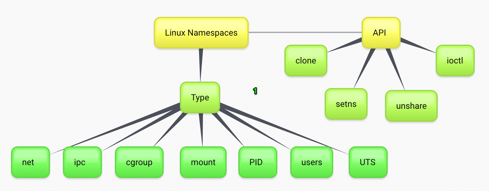
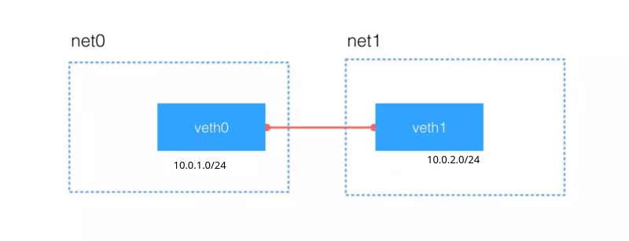

### Linux Namespace'lerine Giriş 




Containerlar aslında birbirinden iyi isole edilmiş processlerdir diyebiliriz. Ortal kernek kullanmalarına rağmen birbirlierini (!) görmezler, hatta kendilerini çalışan yegane işletim ssitemi olarka görürler. 

peki bunu nasıl yaparlar? yani aslında Linux'da container diye bir kavram bulunmamasın arağmen bu izolasyon aynı kernel kullarnılarak nasıl sağlanabilmektedir?

Konu ileride daha da detaylanacak ancak containmer özelinde inceleyecek olursak Containerları mümkün kılan 2 yapıdan söz etmek mümkündür.

1. Namespacing: Containerların gördüklerini kısıtlamak. yani örneğin container sadece kendi içinde çalışan proccessleri, network yapılarını, kullanıcıları, vb şeyleri görebilmesini sağlamak.
 - chroot (çroot diye okunur): container a bir folder veriyor ve senin root un burasıdır diyor. yani bu klasörün dışına üstüne çıkamazsın diyor.
 

**root and chroot**

In a Unix-like OS, root directory(/) is the top directory. root file system sits on the same disk partition where root directory is located. And it is on top of this root file system that all other file systems are mounted. All file system entries branch out of this root. This is the system’s actual root. 
 
 
 - unshare: normalde linux'da (yada diğer işletim sistemlerinde de) çalışan processler birbirini görebilir. Bu teknoloji sayesinde container'ın processlerini unshare yapabilmek mümkün oluyor. Bu sadece processlerle alakalı değil tabiiki, network, cpu, file system vb kaynkları soyutlamak mümkün hale geliyor. bir program unshre olarak çalıştırıldığında çevrsinde çalışanları göremiyor. 
 
 Mesela mount, PID, network, cgroup, user,  gibi namespace ler mevcut.
 
 
2. Resource Control: Normal şartlarda linux'da çalışan proccessler'in ne kadar kaynak (örneğin CPU, memory, devices, pids (bir process kaç alt proccess ayağa kaldırabilir.)) tüketeceğine kara veremezdik. 
 - cgroups (control group): Ancak bu teknoloji le artık bu mümkün hale geliyor. Kernel üzerinde proccesslerin kaynkalrını sınırlandırabiliyoruz.

Aşağıda bu iki başlıkta yer alan konular hakkında uygulamalr yer alacaktır.

### Namespaces

- Mount (mnt)
- Process ID (pid)
- Network (net)
- Interprocess Communication (ipc)
- UTS
- User ID (user)
- Control group (cgroup) Namespace
- Time Namespace
- Proposed namespaces
  - syslog namespace


 
### Network Namespace kullanımı

**network dosyaları**

- /etc/sysconfig/network dosyası
- /etc/sysconfig/network-scripts dizini
- /etc/hosts
- /etc/resolv.conf
- /etc/nsswitch.conf
- /etc/services
- /etc/netplan (NetwotkManager kullanacak şekilde ayarlanabilir)


**kaynaklar**

- https://matrix.ai/blog/linux-network-namespaces/
- https://enveraltin.com/blog/iptables.html

- https://www.youtube.com/watch?v=_WgUwUf1d34&t=398s

- https://www.computerhope.com/unix/ip.htm
- https://developers.redhat.com/blog/2018/10/22/introduction-to-linux-interfaces-for-virtual-networking/
- https://blog.scottlowe.org/2013/09/04/introducing-linux-network-namespaces/
- https://itnext.io/create-your-own-network-namespace-90aaebc745d
- https://blogs.igalia.com/dpino/2016/04/10/network-namespaces/
- https://diego.assencio.com/?index=d71346b8737ee449bb09496784c9b344
- https://unix.stackexchange.com/questions/546235/i-can-ping-across-namespaces-but-not-connect-with-tcp
- https://www.cyberciti.biz/faq/ip-route-add-network-command-for-linux-explained/
- https://www.cyberciti.biz/faq/linux-ip-command-examples-usage-syntax/
- https://www.ibm.com/support/knowledgecenter/en/linuxonibm/com.ibm.linux.z.ldva/ldva_c_virtualizationOfNetworkDevices.html


_ip link_ komutunu çalıştıracak olursak root namespace üzerinde işlem yapıyor oluruz. Aynı şekilde _ip a_ dediğimizde de root namespace üzerindeki device ları görüyor oluruz. 


örnekler

- https://net-labs.in/2014/07/21/linux-network-namespaces-examples-of-usage/
- https://www.thegeekdiary.com/how-to-configure-network-namespaces-in-docker-containers/
- https://itnext.io/create-your-own-network-namespace-90aaebc745d
- https://dzone.com/articles/step-by-step-guide-establishing-container-networki
- http://fosshelp.blogspot.com/2014/08/connect-two-network-namespaces-using.html
- http://rmadapur.blogspot.com/2014/02/vrf-linux-network-name-space.html
- https://binarymaps.com/docker-network/
- https://developpaper.com/detailed-underlying-technology-of-cloud-computing-network-principle-and-practice-of-linux-network-namespace/


**örnek kod:** https://developpaper.com/detailed-underlying-technology-of-cloud-computing-network-principle-and-practice-of-linux-network-namespace/

faydalanılan diğer adreslerini
- https://tanzu.vmware.com/developer/blog/a-container-is-a-linux-namespace-and-networking-basics/
- http://fosshelp.blogspot.com/2014/07/introduction-to-network-namespace-and.html
- https://blogs.igalia.com/dpino/2016/04/10/network-namespaces/



```
$ sudo ip netns add net0
$ sudo ip netns add net1
$ sudo ip netns ls
```
daha sonra net0 ve net1 in ip adreslerini Kontrol ediyoruz

```
$ sudo ip netns exec net0 ip addr

1: lo: <LOOPBACK> mtu 65536 qdisc noop state DOWN group default qlen 1000
    link/loopback 00:00:00:00:00:00 brd 00:00:00:00:00:00

    
$ sudo ip netns exec net1 ip addr
1: lo: <LOOPBACK> mtu 65536 qdisc noop state DOWN group default qlen 1000
    link/loopback 00:00:00:00:00:00 brd 00:00:00:00:00:00


```

şimdi iki networkü konuşturacağız.

ilk olarak bir veth oluşturuyoruz. bu aslındaiki ucu açık kablo gibidir yani uçları bağlı değil herhangi bir yere.

daha sonra ip link komutuyla uç bilgilerini alıyoruz.


```
"
$ sudo ip link add type veth
$ sudo ip link

# sonuç

9: veth0@veth1: <BROADCAST,MULTICAST,M-DOWN> mtu 1500 qdisc noop state DOWN mode DEFAULT group default qlen 1000
    link/ether e6:b3:85:b9:80:87 brd ff:ff:ff:ff:ff:ff
10: veth1@veth0: <BROADCAST,MULTICAST,M-DOWN> mtu 1500 qdisc noop state DOWN mode DEFAULT group default qlen 1000
```
daha sonra bu ethernet kablosunun bir ucunu net0 a diğerini net1 e bağlıyoruz.


```
$ sudo ip link set veth0 netns net0
$ sudo ip link set veth1 netns net1

# bağlandıdan sonra da bi kontrol yapıyoruz. net0 daki bağlı networkler

$ sudo ip netns exec net0 ip addr


1: lo: <LOOPBACK> mtu 65536 qdisc noop state DOWN group default qlen 1000
    link/loopback 00:00:00:00:00:00 brd 00:00:00:00:00:00
8: veth0@if9: <BROADCAST,MULTICAST> mtu 1500 qdisc noop state DOWN group default qlen 1000
    link/ether aa:80:4c:0d:0e:03 brd ff:ff:ff:ff:ff:ff link-netns net1


# net1 deki bağlı networkler

$ sudo ip netns exec net1 ip addr

1: lo: <LOOPBACK> mtu 65536 qdisc noop state DOWN group default qlen 1000
    link/loopback 00:00:00:00:00:00 brd 00:00:00:00:00:00
9: veth1@if8: <BROADCAST,MULTICAST> mtu 1500 qdisc noop state DOWN group default qlen 1000
    link/ether 12:a1:20:fa:35:e0 brd ff:ff:ff:ff:ff:ff link-netns net0

```

ancak görüldüğü üzere bu interface lerde ne ip var ne de UP durmundalar (DOWN durumundalar).


şimdi ip ataması yapıp UP durmuna getiriyoruz.

```

$ sudo ip -n net0 addr add 10.0.1.0/24 dev veth0
$ sudo ip -n net1 addr add 10.0.2.0/24 dev veth1

$ sudo ip -n net0 link set veth0 up
$ sudo ip -n net0 link set lo up

$ sudo ip -n net1 link set veth1 up
$ sudo ip -n net1 link set lo up

```

şimdi tekrar kontrol ediyoruz ve görüleceği üzere artık ip almış veth0 ve UP durumda

```
$ sudo ip netns exec net0 ip addr

1: lo: <LOOPBACK,UP,LOWER_UP> mtu 65536 qdisc noqueue state UNKNOWN group default qlen 1000
    link/loopback 00:00:00:00:00:00 brd 00:00:00:00:00:00
    inet 127.0.0.1/8 scope host lo
       valid_lft forever preferred_lft forever
    inet6 ::1/128 scope host 
       valid_lft forever preferred_lft forever
8: veth0@if9: <BROADCAST,MULTICAST,UP,LOWER_UP> mtu 1500 qdisc noqueue state UP group default qlen 1000
    link/ether aa:80:4c:0d:0e:03 brd ff:ff:ff:ff:ff:ff link-netns net1
    inet 10.0.1.0/24 scope global veth0
       valid_lft forever preferred_lft forever
    inet6 fe80::a880:4cff:fe0d:e03/64 scope link 
       valid_lft forever preferred_lft forever

```


şimdi networklerin birbiriyle konuşup konuşmadığını test edelim.

öncelikle host dan ping atmayı deniyoruz. ancak host subnet (veya network) ile net0 arasında bir route tanımı olmadığı için haberleşemeyeceklerdir. bunun için ya default gateway veya statc ip tanımı yapmalıyız. ancak görüleceği üzer unreachable hatası da vermemektedir. Bu durumda donanımsal bir problem olduğu anlasşılır. Biz burada fiziksel donanımlarla bu işi yapmadığımız için kutgumuz hatalı demek oluyor. tabii ki biz eksik yaptığımızı biliyoruz :).

```
$ ping 10.0.1.0
```
bu durumda veth0 ı inceleyebiliriz çünki sonuçta veth0 a ping atıyoruz
```
$ ip link show veth0

Device "veth0" does not exist.

```
görülceği üzere veth0 host makinamız tarafından erişebilir durumda değil. Ancak aslında orada. şu komut bunu göstemektedir.


```
$ sudo ip netns exec net0 ip addr


8: veth0@if9: <BROADCAST,MULTICAST,UP,LOWER_UP> mtu 1500 qdisc noqueue state UP group default qlen 1000
    link/ether aa:80:4c:0d:0e:03 brd ff:ff:ff:ff:ff:ff link-netns net1
    inet 10.0.1.0/24 scope global veth0
       valid_lft forever preferred_lft forever
    inet6 fe80::a880:4cff:fe0d:e03/64 scope link 
       valid_lft forever preferred_lft forever


```


bir de networkleri kendi aralarındaki testlerini yapalım. örneğin net0 dan net1 e ping atalım. burada da sonuçta networkun unreachable olduğunu görebiliyoruz. çünki burada da network kablosunu iki network arasına taktık ancak aynı subnette olmadıkları için unreachable hatası aldık.

```
$ sudo ip netns exec net0 ping 10.0.2.0

```
diğer bir kontrol tekniğini de deneyelim. aşağıdaki komut net0 ın 10.0.2.0 (yani net1 e bağlı veth1 ucu) ile iletşime geçip geçemeceğini test etmek. daha dğrusu iki network arasındaki route bilgisinin getirilmesini sağlar

```
$ sudo ip -n net0 route get 10.0.2.0

RTNETLINK answers: Network is unreachable
```

görüleecği üzere böyle bir yolun olmadığını söylüyor.

diğer bir kontrol ise öreneğin net0 da tanımlı route lara bakmak. görülecceği üzere sadece kendisiyle haberleşebiliyor.

```
sudo ip netns exec net0 ip route
10.0.1.0/24 dev veth0 proto kernel scope link src 10.0.1.0

```

son bir kontrolü de host makinasındaki route lara bakarak yapabiliriz

```
$ sudo ip route
```
buradada ne net0 ne de net1 ile ilişkili bir route görünmüyor.


peki acaba kendi üzerinde net0 ping attığında ne oluyor ona bakalım. görüldüğü üzere net0 kendi içinde veth0  aping atabiliyor.
```
$ sudo ip netns exec net0 ping 10.0.1.0

PING 10.0.1.0 (10.0.1.0) 56(84) bytes of data.
64 bytes from 10.0.1.0: icmp_seq=1 ttl=64 time=0.104 ms
64 bytes from 10.0.1.0: icmp_seq=2 ttl=64 time=0.065 ms
64 bytes from 10.0.1.0: icmp_seq=3 ttl=64 time=0.060 ms
64 bytes from 10.0.1.0: icmp_seq=4 ttl=64 time=0.053 ms

```
bütün bunlardan şunu çıakrtıyoruz networkler kendi içlerinde çalışıyorlar ancak birbirleriyle ya da host makinasıyla iletişime geçemiyorlar.

bunun çözümü ise bu networklere diğer networklerle haberleşme yollarını göstermek.


```
$ sudo ip -n net0 route add 10.0.2.0/24 dev veth0
$ sudo ip -n net1 route add 10.0.1.0/24 dev veth1
```
şimdi yukarıda yaptığımız bazı kontrolleri 2 network arasında tekrar yapalım


örneğin alttaki komuıtu yukarıda çalıştırdığımızda unreachable hatası almıştık.

```
$ sudo ip -n net0 route get 10.0.2.0
10.0.2.0 dev veth0 src 10.0.1.0 uid 0 
```

alttaki komut ise route tanımlamasında önce tek bir route gösteriyordu o da kendi içindeydi artık 2 adet route var

```
$ sudo ip netns exec net0 ip route
10.0.1.0/24 dev veth0 proto kernel scope link src 10.0.1.0 
10.0.2.0/24 dev veth0 scope link 

```
alttaki komut ise yukarıda çalıştırıldığında unreachable hatası almıştık artık iki network birbiriyle hablerşebiliyor. 

```
$ sudo ip netns exec net0 ping 10.0.2.0
PING 10.0.2.0 (10.0.2.0) 56(84) bytes of data.
64 bytes from 10.0.2.0: icmp_seq=1 ttl=64 time=0.063 ms
64 bytes from 10.0.2.0: icmp_seq=2 ttl=64 time=0.032 ms
64 bytes from 10.0.2.0: icmp_seq=3 ttl=64 time=0.077 ms

```

şimdi tcpdump ile net0 daki veth0 interface ini dinlyelim ve başka bir terminalde ping atalım

ping atarken kullanılcak komut

```
$  sudo ip netns exec net1 ping 10.0.1.0
```
alttaki  de sonuç

```
$ sudo ip netns exec net0  tcpdump -i veth0 icmp -l
tcpdump: verbose output suppressed, use -v or -vv for full protocol decode
listening on veth0, link-type EN10MB (Ethernet), capture size 262144 bytes
15:19:24.411414 IP 10.0.2.0 > 10.0.1.0: ICMP echo request, id 11209, seq 1, length 64
15:19:24.411433 IP 10.0.1.0 > 10.0.2.0: ICMP echo reply, id 11209, seq 1, length 64
15:19:25.440952 IP 10.0.2.0 > 10.0.1.0: ICMP echo request, id 11209, seq 2, length 64
15:19:25.440981 IP 10.0.1.0 > 10.0.2.0: ICMP echo reply, id 11209, seq 2, length 64
15:19:26.464957 IP 10.0.2.0 > 10.0.1.0: ICMP echo request, id 11209, seq 3, length 64
...
```

şimdi basit bir mesajlaşma uygulamsı ile iki networkü birbiriyle konuşturalım.


amacımız net0 da 80 portunu dinlemek ve gelen emsajşar mesaj göndermek. bunun için üç tane terminal açmamız gerekiyor.


```
# birinci terminalde çalıştırıyoruz
# l listen , n ise ip vereceğimizi hostnamse resole yapmasına gerek olmadığını söylemiş oluyoruz
$ sudo ip netns exec net0 nc -l -n  10.0.1.0 80 -v

Listening on [10.0.1.0] (family 0, port 80)

# ikinci terminalde handshake yaptırabilmekm için aşağıdaki komutu çalıştırıyoruz
$ sudo ip netns exec net1 nc -4t -n 10.0.1.0 80 -v  

Connection to 10.0.1.0 80 port [tcp/*] succeeded!


# üçüncü terminalde aşağıdaki komutla tcp portunu net0 da dump alarak paketleri inceliyoruz
$ sudo ip netns exec net0 tcpdump -X -i veth0 -n tcp -l

```

artık net0 ile net1 arasında mesaj gönderebiliriz. tcpdump ekranımızda gelen gide mesajları izleyebiliriz.


peki örneğin net0 host ile haberleşebiliyor mu ona bakalım. local ip nizi düzeltmeyi unutmayın.

```
$ sudo ip netns exec net0 ping 192.168.0.20
ping: connect: Network is unreachable

```
görüldüğü üzere haberleşemiyor. 

yada internette 8.8.8.8 u ping leyebiliyor mu? bunu da yapamıyor. bu arada ip yerine domain adı yazsaydık bu seferde nameserver çözülemiyor hatası alacaktık yani bu hostname i çözemeyecekti. bunun için /etc/netns/net0/resolv.conf dosyasını tanımlanması gerekli. çünki network izolasyonundan dolayı /etc/resolv.conf dosyası okunamaz. net0 ve net1 için bahsedilen path altıne networklere özel resolv.conf dosyaları açılmalı.

bunuda ilerde yapacağız

```
$ sudo ip netns exec net0 ping 8.8.8.8
ping: connect: Network is unreachable
```

tam bu noktada aslında şunu düşünmeemiz gerekiyor. örneğin net0 ın host a erişmesi demek internete de erişmesi demek oluyor. yani bu durumda aslında biz default gateway tanımı yapmış oluyoruz. yani net0 erişemediği diğer tüm networkler için kullanacağı route ı oluşturmuş olacağız.


eğer default gateway tanımı yapmadan host makinasının subnet adresine bağlamasını söylersen ozman sadece o subnet ile haberleşebilir.

bu arada configürasyon yaprken host makinasında gelen isteleri ipv4 seviyesinde forward yapmasıyla ilgili ayarı yapmayı unutmayınız, vakti gelince zaten yapacağız.


eğer host (root namespace) daki eth interface ini çıkartıp net0 a takacak olursak internet gider. eğer test etmek isteseniz  isterseniz

```
# alttaki komutu çalıştırdığınızda internetinizin gittiğini görebilirsiniz.
$ sudo ip link set enp3s0 netns net0

# geri almak için 1 root namespace i ifade eder
$ sudo ip netns exec net0 ip link set enp3s0 netns 1

```
peki bridge kullanmadan net0 ı veya net1 i root network namespace (host) a nasıl açabiliriz?


bunun bir yolu bir veth oluşturarak bir ucunu root namespaeci ne diğer ucunu net0 a bağlamak.

```
$ sudo ip link add hostveth type veth peer name net0veth

$ sudo ip link set net0veth netns net0
$ sudo ip netns exec net0 ip addr add 192.168.0.60/24  dev net0veth
$ sudo ip netns exec net0 ip link set net0veth up

# namespace belirtilmediği için root da (host) çalışır.
$ sudo ip addr add 192.168.0.61/24 dev hostveth
$ sudo ip link set hostveth up

# daha sonra check ediyoruz
$ sudo ip netns exec net0 ping 192.168.0.20
PING 192.168.0.20 (192.168.0.20) 56(84) bytes of data.
64 bytes from 192.168.0.20: icmp_seq=1 ttl=64 time=0.109 ms
64 bytes from 192.168.0.20: icmp_seq=2 ttl=64 time=0.142 ms
64 bytes from 192.168.0.20: icmp_seq=3 ttl=64 time=0.053 ms
64 bytes from 192.168.0.20: icmp_seq=4 ttl=64 time=0.220 ms
```
eğer localhosta ping atacak olursak host un /etc/hosts dosyasıo okunur. bu namespace için localhost tanılaması yapmak isityorsak /etc/netns/net0/hosts dosyası tanımlamalıyız ve içine alttaki satırı eklemeliyiz


ayrıca nameserver için yani DNS çözümlemesi içinde /etc/netns/net0/resolv.conf dosyasını oluşturup içine örneğin aşağıdakler yazılabilir

```
nameserver 192.168.0.20
nameserver 8.8.8.8
search google.com

```
üstteki ayarlar yapılmazsa localhost için host localhost olark kabül edilir ayrıca örneğin resolv.conf olmadığı içinde google.com adresi çözülemez.


```
10.0.1.0 localhost
```

şimdi local hosta net0 içinden ping atacak olursak 10.0.1.0 interface i cevap verecektir.

ancak internet testi yapacak olursak erişemediğimizi görebiliriz

```
$ sudo ip netns exec net0 ping 8.8.8.8
ping: connect: Network is unreachable
```

bunun için artık default gateway tanımlamsı yapmamız gerekiyor.

```
# host u gateway i ni gösteriyoruz
$ sudo ip netns exec net0 ip route add default via 192.168.0.1
# veya
$ sudo ip netns exec net0 route add default gw 192.168.0.1 

# ayrıca host makinasında forward işlemine onay vermemiz gerekiyor

$ sudo sysctl -w net.ipv4.ip_forward=1
```

ancak bu tanımlamdan sonra bile internete çıkmadığımızı görebilirsiniz.

çünki biz bridge koymadık araya. bridge direk kendisi NAT a ihtiyaç duymadan bizi dışarı çıkarabilirdi.

Ancak burada NAT a ihtiyacımız var. iptable üzerinde iç ip mizi dış ip ye çevirmemiz gerekiyor.

```


$ sudo iptables -t nat -A POSTROUTING -s 192.168.0.0/24 -o enp3s0 -j MASQUERADE

$ sudo iptables -A FORWARD -i enp3s0 -o hostveth -j ACCEPT
$ sudo iptables -A FORWARD -o enp3s0 -i hostveth -j ACCEPT

# parameterelerin tanımları

iptables: the command line utility for configuring the kernel
-t nat: select table "nat" for configuration of NAT rules.
-A POSTROUTING : Append a rule to the POSTROUTING chain (-A stands for "append").
-o hostveth: this rule is valid for packets that leave on the second network interface (-o stands for "output")
-j MASQUERADE: the action that should take place is to 'masquerade' packets, i.e. replacing the sender's address by the router's address.
```

artık test ettiğimizde google.com ve 8.8.8.8 iplerine çıktığımızı görebiliriz.

```
$ sudo ip route sh
default via 192.168.0.1 dev enp3s0 proto dhcp metric 100 
192.168.0.0/24 dev hostveth proto kernel scope link src 192.168.0.61 
192.168.0.0/24 dev enp3s0 proto kernel scope link src 192.168.0.20 metric 100 
192.168.1.0/24 dev br-7cfc4bcbbb46 proto kernel scope link src 192.168.1.1 linkdown 
```

net0 üerinde route tablosuna bakacak olursak

```
$ sudo ip netns exec net0 ip route
default via 192.168.0.20 dev net0veth 
10.0.1.0/24 dev veth0 proto kernel scope link src 10.0.1.0 
10.0.2.0/24 dev veth0 scope link 
192.168.0.0/24 dev net0veth proto kernel scope link src 192.168.0.60 
```

örneğin net0 dan 8.8.8.8 e ping atarken root namespace üzerindeki hostveth interface ini dinlemek istersek

```
$ sudo tcpdump -i hostveth icmp -l
```
veya net0 üzerindeki net0veth ı dinlemek için

```
sudo ip netns exec net0  tcpdump -i net0veth icmp -l
```


**yukarıda yazdığımız iptables kullarının açıklaması**
Kural, NAT paketi eşleştirme tablosunu (-t nat) kullanır ve güvenlik duvarının harici ağ aygıtında (-o eth0) NAT (-A POSTROUTING) için yerleşik POSTROUTING zincirini belirtir. POSTROUTING, paketlerin güvenlik duvarının harici aygıtından çıkarken değiştirilmesine izin verir. -J MASQUERADE hedefi, güvenlik duvarının / ağ geçidinin harici IP adresi ile bir düğümün özel IP adresini maskelemek için belirtilir.


Dahili ağınızda harici olarak kullanılmasını istediğiniz bir sunucunuz varsa, bir hedef IP adresi ve dahili hizmetinize bağlantı isteyen gelen paketlerin olabileceği portu belirtmek için NAT'taki PREROUTING zincirinin -j DNAT hedefini kullanabilirsiniz. iletildi. Örneğin, gelen HTTP isteklerini 172.31.0.23 adresindeki özel Apache HTTP Sunucusu sunucu sisteminize iletmek istiyorsanız, aşağıdaki komutu çalıştırın;
```
iptables -t nat -A PREROUTING -i eth0 -p tcp --dport 80 -j DNAT \
      --to 172.31.0.23:80
```
FORWARD zincirinizde varsayılan bir DROP ilkeniz varsa, hedef NAT yönlendirmesinin mümkün olması için gelen HTTP isteklerinin iletilmesine izin vermek için bir kural eklemelisiniz. Bunu yapmak için aşağıdaki komutu çalıştırın:


```
iptables -A FORWARD -i eth0 -p tcp --dport 80 -d 172.31.0.23 -j ACCEPT
```
Bu kural, güvenlik duvarından gelen HTTP isteklerinin, güvenlik duvarının arkasındaki Apache HTTP Sunucusu sunucusunun amaçlanan hedefine iletilmesine izin verir.


### PID Namespace


### Mount Namespace
### UTS namespace
### User Namespace
### CGroup - Kontrol Grupları 

### Chroot

konuyla ilgili, linux sıkılarştırma eğitimi içinde başlık var bakılmalı
