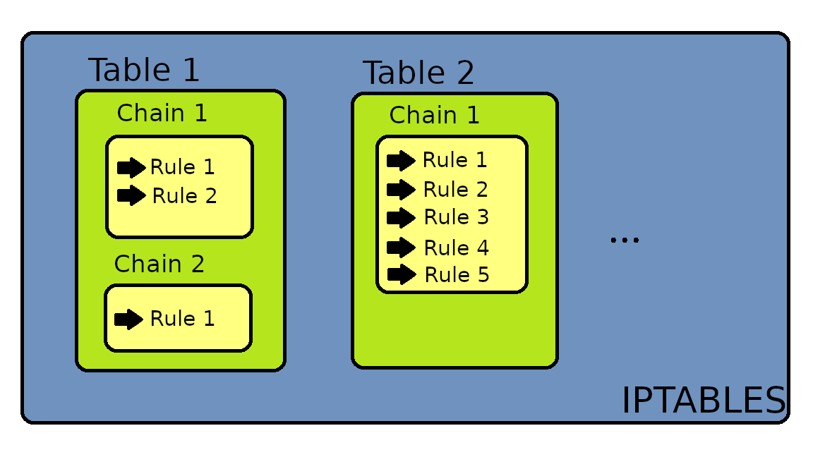
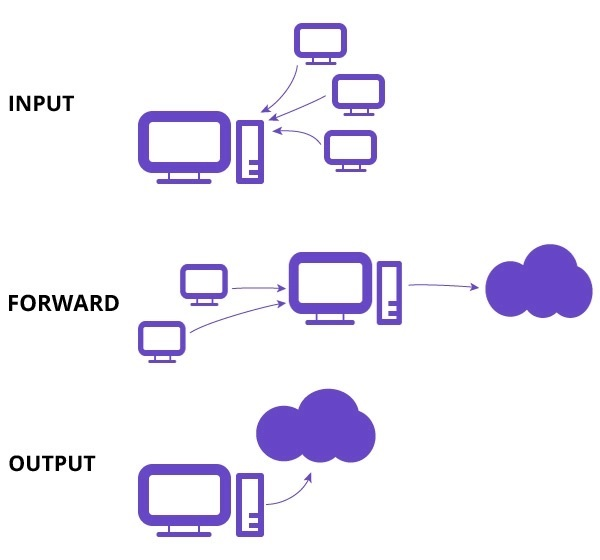
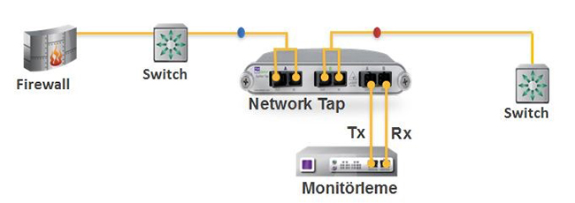
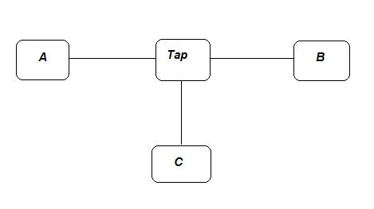
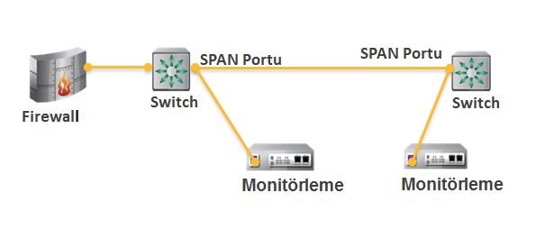

### Öenmli komutlar

okunması lazım 

https://jvns.ca/blog/2017/09/03/network-interfaces/

https://en.wikipedia.org/wiki/Netfilter

https://www.booleanworld.com/depth-guide-iptables-linux-firewall/

about interfaces

- they can be physical network interfaces (like eth0) or virtual interfaces (like lo and docker0)
- you can list them with ifconfig or ip link list
- if you don’t have any network interfaces, your packets don’t enter the linux network stack at all really. To go through the network stack you need network interfaces.
- When you send a packet to an IP address, your route table decides which network interface that packet goes through. This is one of the first things that happens in the network stack.
- tcpdump captures packets after they’re routed (assigned an interface) Though there’s a PREROUTING chain in iptables that happens before routing!`

#### Linux ip list interfaces


- [WiFi](https://www.linux.com/learn/how-configure-wireless-any-linux-desktop)

- [Add Network Interface](https://www.digitalocean.com/docs/networking/private-networking/how-to/enable/)

```
lshw -class network
```
ekrana kullancağımız mac address gelecek

```
/etc/netplan/50-cloud-init.yaml
```
alttaki satıraklar eth1 ile yukarıdan eth0 kopyala yapıştır yapılır
```
eth1:
    addresses:
    - 198.51.100.0/16
    match:
        macaddress: ex:am:pl:e3:65:13
    set-name: eth1
```
debug yapmak için

```
sudo netplan apply --debug
```
daha sonra

```
sudo ifconfig
```


```
$ ifconfig -a 
```

sonuç şunun gibibir şey olur. ilk iki interface br ile başlayanlar _docker create network -d bridge_ ile oluşturuldu.


```
br-50df7b60cf61 Link encap:Ethernet  HWaddr 02:42:1A:BE:D4:A5  
          inet addr:172.19.0.1  Bcast:172.19.255.255  Mask:255.255.0.0
          UP BROADCAST RUNNING MULTICAST  MTU:1500  Metric:1
          RX packets:803 errors:0 dropped:0 overruns:0 frame:0
          TX packets:6132 errors:0 dropped:0 overruns:0 carrier:0
          collisions:0 txqueuelen:0 
          RX bytes:44015 (42.9 KiB)  TX bytes:9102719 (8.6 MiB)

br-a9972bdde57f Link encap:Ethernet  HWaddr 02:42:39:6C:16:1C  
          inet addr:172.20.0.1  Bcast:172.20.255.255  Mask:255.255.0.0
          UP BROADCAST RUNNING MULTICAST  MTU:1500  Metric:1
          RX packets:957 errors:0 dropped:0 overruns:0 frame:0
          TX packets:6034 errors:0 dropped:0 overruns:0 carrier:0
          collisions:0 txqueuelen:0 
          RX bytes:51134 (49.9 KiB)  TX bytes:8990045 (8.5 MiB)

docker0   Link encap:Ethernet  HWaddr 02:42:16:96:C7:88  
          inet addr:172.17.0.1  Bcast:172.17.255.255  Mask:255.255.0.0
          UP BROADCAST MULTICAST  MTU:1500  Metric:1
          RX packets:0 errors:0 dropped:0 overruns:0 frame:0
          TX packets:0 errors:0 dropped:0 overruns:0 carrier:0
          collisions:0 txqueuelen:0 
          RX bytes:0 (0.0 B)  TX bytes:0 (0.0 B)

eth0      Link encap:Ethernet  HWaddr F6:43:8E:10:D8:96  
          inet addr:192.168.0.23  Bcast:0.0.0.0  Mask:255.255.254.0
          UP BROADCAST RUNNING MULTICAST  MTU:1500  Metric:1
          RX packets:16 errors:0 dropped:0 overruns:0 frame:0
          TX packets:0 errors:0 dropped:0 overruns:0 carrier:0
          collisions:0 txqueuelen:0 
          RX bytes:1296 (1.2 KiB)  TX bytes:0 (0.0 B)

eth1      Link encap:Ethernet  HWaddr 02:42:AC:12:00:5F  
          inet addr:172.18.0.95  Bcast:0.0.0.0  Mask:255.255.0.0
          UP BROADCAST RUNNING MULTICAST  MTU:1500  Metric:1
          RX packets:62739 errors:0 dropped:0 overruns:0 frame:0
          TX packets:12926 errors:0 dropped:0 overruns:0 carrier:0
          collisions:0 txqueuelen:0 
          RX bytes:73797830 (70.3 MiB)  TX bytes:12581083 (11.9 MiB)

lo        Link encap:Local Loopback  
          inet addr:127.0.0.1  Mask:255.0.0.0
          UP LOOPBACK RUNNING  MTU:65536  Metric:1
          RX packets:82 errors:0 dropped:0 overruns:0 frame:0
          TX packets:82 errors:0 dropped:0 overruns:0 carrier:0
          collisions:0 txqueuelen:1 
          RX bytes:10403 (10.1 KiB)  TX bytes:10403 (10.1 KiB)

veth4a4542e Link encap:Ethernet  HWaddr 6E:18:98:6C:17:FF  
          UP BROADCAST RUNNING MULTICAST  MTU:1500  Metric:1
          RX packets:957 errors:0 dropped:0 overruns:0 frame:0
          TX packets:6034 errors:0 dropped:0 overruns:0 carrier:0
          collisions:0 txqueuelen:0 
          RX bytes:64532 (63.0 KiB)  TX bytes:8990045 (8.5 MiB)

veth7a34e8d Link encap:Ethernet  HWaddr 6E:C5:6C:39:54:C9  
          UP BROADCAST RUNNING MULTICAST  MTU:1500  Metric:1
          RX packets:803 errors:0 dropped:0 overruns:0 frame:0
          TX packets:6132 errors:0 dropped:0 overruns:0 carrier:0
          collisions:0 txqueuelen:0 
          RX bytes:55257 (53.9 KiB)  TX bytes:9102719 (8.6 MiB)

```

#### see routing table on Linux

```
ip r
```
çıktı şu şekilde oluri.

br ile başlayan 2 custom bridge network görülebilir 19 ve 20 li subnet lerde.

```
default via 172.18.0.1 dev eth1 
172.17.0.0/16 dev docker0 scope link  src 172.17.0.1 
172.18.0.0/16 dev eth1 scope link  src 172.18.0.95 
172.19.0.0/16 dev br-50df7b60cf61 scope link  src 172.19.0.1 
172.20.0.0/16 dev br-a9972bdde57f scope link  src 172.20.0.1 
192.168.0.0/23 dev eth0 scope link  src 192.168.0.23
```

#### ip komutu

Network Address Translation (NAT) converts local ip to global ip. Routing is the process to route the data packet from one network to the other.


ip komutunun genel biçimi

ip [ OPTIONS ] OBJECT [ COMMAND [ ARGUMENTS ] ]

options
- V : ip programının sürümünü belirtir.
- s : çıktı hakkında istatistiksel bilgiler verir.
- 4: ipv4 protokol ailesini belirtir
- 6 ipv6 protokol ailesini belirtir.

 
 
LİNUXSİSTEM-NETWORK
ip Komutu ve Kullanımı
adminAğustos 15, 2017

 

 
Linux 2.2 çekirdek sürümüyle birlikte network işlemleri için kullanılan net-tools paketinin yerini IPROUTE2 paketi aldı. Bu paketteki ana araç “ip” komut setidir. Net-tools paketinde kullanılan ifconfig, route, arp vb komutların yerini daha güçlü ve esnek olan ip komutu almıştır.Bunun yanında net-tools paketindeki komutlar geriye dönük uyumluluk için vardır ve kullanılabilir. Bu komut setiyle ağ arayüzlerini, ağ adreslerini, yönlendirme işlemlerini, arp tablolarını, ağ tünellerini, politika tabanlı yönlendirme işlemlerini, etki alanı işlemlerini vb network ile ilgili birçok işlemi kolayca gerçekleştirebilir ve konfigüre edebiliriz.

İp Komutunun Genel Biçimi

ip [ OPTIONS ] OBJECT [ COMMAND [ ARGUMENTS ] ]

Köşeli parantez içerisindeki alanların kullanımı zorunlu değildir ihtiyaca göre kullanılır. Şimdi komut setinde yer alan kısımları açıklayalım.

OPTİONS kısmı ip komutunun genel davranışını ve çıktısını etkileyen kısımdır. “-” işaretiyle başlar. Aldığı değerlerden bazıları sırasıyla şöyledir

-V : ip programının sürümünü belirtir.

-s : çıktı hakkında istatistiksel bilgiler verir.

-4: ipv4 protokol ailesini belirtir

-6 ipv6 protokol ailesini belirtir.


 
OBJECT kısmı üzerinde çalışılmak veya bilgi almak istenen türdür. Bunlardan bazıları şöyledir:

- link: Fiziksel veya mantıksal aygıt bağlantılarını görüntülemek ve yapılandırmak için kullanılır

- address:aygıt üzerindeki ipv4 ve ipv6 adreslerini ve network aygıtı bilgilerini verir

- neighbour: arp tabloları için kullanılır

- route: yönlendirme tabloları için kullanılır

- rule: yönlendirmede kullanılacak politikalar, kurallar için kullanılır.

- maddress: multicast adresler için kullanılır.

COMMAND: Bu kısım object kısmı ile belirtilen nesne üzerinde yapılacak eylemi belirtir. Yapılacak eylem nesne türüne bağlı olarak değişkenlik arz etse de genellikle ekleme, silme, görüntüleme tarzında eylemler yapılır. Hiçbir komut belirtilmezse varsayılan olarak show komutu kullanılır. Şimdi konuyu örneklerle pekiştirelim. 


https://acemipenguenler.com/ip-komutu-ve-kullanimi/

```
$ ip route list
default via 172.18.0.1 dev eth1 
172.17.0.0/16 dev docker0 scope link  src 172.17.0.1 
172.18.0.0/16 dev eth1 scope link  src 172.18.0.95 
172.19.0.0/16 dev br-50df7b60cf61 scope link  src 172.19.0.1 
172.20.0.0/16 dev br-a9972bdde57f scope link  src 172.20.0.1 
192.168.0.0/23 dev eth0 scope link  src 192.168.0.23
```


aşağıdaki komut ile mevcut tüm arayüzlerin IP adresini görüntüleyebilirsiniz.

görldüğü üzere eth0 üzerinde public ve private olmak üzere 2  ip tanımlı
```
$ ip addr  show

1: lo: <LOOPBACK,UP,LOWER_UP> mtu 65536 qdisc noqueue state UNKNOWN group default qlen 1000
    link/loopback 00:00:00:00:00:00 brd 00:00:00:00:00:00
    inet 127.0.0.1/8 scope host lo
       valid_lft forever preferred_lft forever
    inet6 ::1/128 scope host
       valid_lft forever preferred_lft forever
2: eth0: <BROADCAST,MULTICAST,UP,LOWER_UP> mtu 1500 qdisc fq_codel state UP group default qlen 1000
    link/ether 2e:4d:0d:47:dd:4e brd ff:ff:ff:ff:ff:ff
    inet 104.248.249.124/20 brd 104.248.255.255 scope global eth0
       valid_lft forever preferred_lft forever
    inet 10.19.0.5/16 brd 10.19.255.255 scope global eth0
       valid_lft forever preferred_lft forever
    inet6 fe80::2c4d:dff:fe47:dd4e/64 scope link
       valid_lft forever preferred_lft forever

```


ip link komutu ile interface lerin aktif olup olamdığı göreülebilir.

```
$ ip link 

1: lo: <LOOPBACK,UP,LOWER_UP> mtu 65536 qdisc noqueue state UNKNOWN mode DEFAULT group default qlen 1000
    link/loopback 00:00:00:00:00:00 brd 00:00:00:00:00:00
2: eth0: <BROADCAST,MULTICAST,UP,LOWER_UP> mtu 1500 qdisc fq_codel state UP mode DEFAULT group default qlen 1000
    link/ether 2e:4d:0d:47:dd:4e brd ff:ff:ff:ff:ff:ff

```

arayüze ip atanması

```
ip addr add 192.168.1.6./24 dev eth0
```

ip komutu ile mevcut route ları görüntileme

```
$ ip route list

default via 104.248.240.1 dev eth0 proto static
10.19.0.0/16 dev eth0 proto kernel scope link src 10.19.0.5
104.248.240.0/20 dev eth0 proto kernel scope link src 104.248.249.124
```


- ip route show root ${address}/${mask}: Bu komut yardımıyla bir ağa ait tüm alt ağları görüntüleriz.

- ip route show table local : Bu komut bize makinanın doğrudan bağlı olduğu ağlar hakkında bilgi verir

- ip route show exact ${address}/${mask}: Sadece belirtilen alt ağları görüntüler

- ip route add ${address}/${mask} via ${next hop} : Bir ağa statik bir rota eklemek için kullanılır. Next hop’tan kasıt genellikle varsayılan ağ geçididir.

- ip route add ${address}/${mask} dev ${interface name} : Bir interface rota eklemek için bu komutu kullanırız. Bu yöntem daha çok PPP (point to Point ) bağlantıları gibi bir sonraki atlama adresinin gerekli olmadığı zamanlarda kullanılır.

- ip route change ${address}/${mask} via ${next hop} : Mevcut rotayı değiştirip düzenlemek için kullanılır.

- ip route delete ${address}/${mask} via ${next hop} : Var olan bir rotayı silmek için kullanılır.

#### Ip link yönetimi
“ip link” komutu fiziksel ve mantıksal aygıt bilgilerini görüntülemek ve değiştirmek için kullanılır. “ip address” komutunda aygıt bilgileriyle birlikte network bilgileri de görüntülenirken burada sadece aygıta ait bilgiler görüntülenir.

- ip link list=ip link show=ip link: Bu üç komutun da vereceği çıktı aynıdır.

- ip link show dev {interface name} : Bu komutu kullanarak istediğimiz interface hakkında bilgi alabiliriz.


Görselden de anlaşıldığı gibi kablolu nic kartımın adı olan eth0 ‘ı zeytin olarak değiştirdim. Yalnız bu komutu kullanabilmemiz için hem root yetkisi gerekiyor hem de ilgili interface’in down durumunda olması gerekir. Aksi halde “interface meşgul” diye hata alırız. Bunun için de öncesinde “ip link set dev {interfacename} down” komutunu kullanmalıyız. ip link set dev {interface name} adress {mac adress}: Bu komut ile interface ait mac adresini değiştirebiliriz.


- ip link set dev {interface name} up : Bu komut ile istedğimiz arayüzü aktif hale getiririz.

- ip link set dev {interface name} down : Bu komut ile istediğimiz arayüzü (yani network aygıtını) pasif hale getiririz

- ip link set dev {old interface name} name {new interface name} : Bu komutu kullanarak var olan bir arayüzün adını değiştirebiliriz.

- ip link set dev {interface name} mtu {mtu value}: Bu komut yardımıyla mtu size değerini değiştirebilriz.MTU, bir arabirimin aynı anda iletebileceği bir çerçevenin maksimum boyutu olan “Maksimum İletim Birimi” ni ifade eder.

- ip link delete dev {interface name}: Bu komut yardımıyla sanal bağlantı olan “vlan” silinebilir.

- ip link set dev {interface name} arp on : Bu komut ile arayüzü arp sorgusuna kapatabiliriz. Özel bir neden olmadığı sürece tavsiye edilmez. Aksi halde diğer bilgisayarlarla iletişim kesilir.


#### ip komutu işe ARP tablolarını yönetmek

Arp ile ilgili komutlara geçmeden önce Arp protokolünün ne olduğunu kısaca ifade edelim:Yerel ağlarda haberleşme mac adresleri aracılığıyla gerçekleşir. TCP/IP protokolü ise ip adresleriyle haberleşme yapar. Bu sebeple ip’si bilinip mac adresi bilinmeyen cihazın mac adresinin öğrenilmesi protokolüne Adres Çözümleme Protokolü (Address Resolution Protocol) denir.

- ip neigh show: bu komut yardımıyla cihazımızdaki arp tablolarını bir başka deyişle cihazımızın haberleştiği makinaları görebiliriz.

- ip neigh show dev {interface}: Herhangi bir arayüze ait arp tablosunu görüntülemek istediğimizde bu komutu kullanırız.

- ip neigh flush dev {interface}: Herhangi bir arayüze ait arp tablosunu silmek istediğimizde bu komutu kullanırız.

- ip neighbor add ${network address} lladdr ${link layer address} dev ${interface name} : Elle statik olarak arp tablosuna kayıt eklemek istediğimize bu komutu gireriz. ${network address} kısmı karşıdaki cihazın ip adresi iken ${link layer address} kısmı mac adresi kısmını belirtir.

- ip neighbor delete ${network address} lladdr ${link layer address} dev ${interface name}: Bu komut ile manuel olarak arp tablosundan kayıt silebiliriz.

#### Ip Komutu ile Ağı Monitor Etmek (İzlemek)

Ağ yapılandırmasında, yönlendirme tablolarında,ARP tablolarındaki değişiklikler ve network trafiği gibi bazı ağ olaylarını iproute2 ile izleyebiliriz. Bunun için kullanacağımız komut “ip monitor” komutudur. Eğer parametre olmadan kullanılırsa varsayılan olarak “all” parametresi çağrılır ve network ile ilgili tüm işlemleri monitor eder. Kullanabileceğimiz parametre türleri şunlardır : “link, address, route, neigh” bu parametrelerin yaptığı işlevler ile ilgili değişiklikleri görüntüler veya istersek bunları bir dosyaya kayıt ettirebiliriz.

Kullanımı Örnekleri:

- ip monitor route: Routing tablosu ile ilgili değişiklikleri gözlemlemek için kullanılır.

- ip monitor link:Arayüz bağlantılarında olan değişiklikleri gözlemlemek için kullanılır.

- ip monitor address:Arayüzlere ait ip değişikliklerini gözlemlemek için kullanılır

- ip monitor neigh: Arp tablosunda meydana gelen değişiklikleri gözlemlemek için kullanılır. Yukarıdaki komutlar varsayılan değişimleri komut ekranında gösterir. Bu değişiklikleri bir kayıt dosyasında tutmak için aşağıdaki komuttan faydalanırız.

- rtmon [-family [inet|inet6]] [[route|link|address|all]] file ${log file path} : Burada rtmon komutundan sonra ipv4 veya ipv6 sınıfını belirtebiliriz. Belirtmezsek iki sınıfı da içerir. Daha sonra parametre türünü belirleyip file komutu ve kaydetmek istediğimiz dosyanın path’ini belirtiriz. Kaydettiğimiz bu dosyanın içeriğini okuyabilmek için terminalden şu komutu gireriz.

- ip monitor ${event type} file ${path to the log file}:Görüntülemek istediğimiz log türünü ${event type} (route, link,address,all) kısmında belirtip daha sonra file komutu ve kayıt dosyasının adresini belirtiyoruz...


#### route komutu

alsında bu komut IP komutunun _ip route_ ile aynı işleri yapmaktadır. 

bu komutta

```
$ route
Kernel IP routing table
Destination     Gateway         Genmask         Flags Metric Ref    Use Iface
default         172.18.0.1      0.0.0.0         UG    0      0        0 eth1
172.17.0.0      *               255.255.0.0     U     0      0        0 docker0
172.18.0.0      *               255.255.0.0     U     0      0        0 eth1
172.19.0.0      *               255.255.0.0     U     0      0        0 br-50df7b60cf61
172.20.0.0      *               255.255.0.0     U     0      0        0 br-a9972bdde57f
192.168.0.0     *               255.255.254.0   U     0      0        0 eth0
```

#### netstat a komutu


Network bağlantılarını, routing tablosunu, arabirim istatiskleri ve benzer ağ bağlantısı bilgileri ile ilgili ayrıntılı bilgiler verebilen bir konsol komutudur.

Netstat komutu çeşitli parametreler ile kullanılmaktadır. Bu parametreler ve anlamları şunlardır :

- a : Tüm TCP ve UDP bağlantıları ekrana basar.
- e : Gelen ve giden paket sayısının istatistiklerini görüntüler.
- n : Tüm bağlantıları rakamsal olarak görüntüler.
- o : Tüm bağlantıları PID numarası ve uygulama adına göre listeler.
- p : Bağlantıların kullandığı uygulama ve PID numaralarını ekrana basar.
- s : Kurallara göre istatistiksel verileri ekrana basar.
- r : IP yönlendirme tablosunun içeriğini görüntüler.


Netstat çıktısında yer alan bağlantı durumlarının anlamları

- ESTABLISHED : Soket bağlantı gerçekleşmiş durumdadır.
- SYN_SENT : Soket bağlantı kurmaya çalışıyordur.
- SYN_RECV : Ağdan bir bağlantı isteği gelmiştir.
- FIN_WAIT1 : Soket kapatılmış, bağlantı sonlandırılmak üzeredir.
- FIN_WAIT2 : Bağlantı sonlandırılmıştır.Soket karşı ucun bağlantıyı sonlandırmasını beklemektedir.
- TIME_WAIT : Soket kapandıktan sonra gelebilecek paketleri alabilmek için beklemektedir.
- CLOSED : Soket kullanılmamaktadır.
- CLOSE_WAIT : Karşı uç bağlantıyı kapatmıştır.Soketin kapanması beklenmektedir.
- LAST_ACK : Karşı uç bağlantıyı sonlandırmış ve soketi kapatmıştır.Onay beklenmektedir.
- LISTEN : Soket gelebilecek bağlantılar için dinleme konumundadır.
- CLOSING : Yerel ve uzak soketler kapatılmış fakat tüm verilerini göndermemiş durumdadır.Tüm veriler gönderilmeden soketler kapanmaz.


```
$ netstat -a
Active Internet connections (w/o servers)
Proto Recv-Q Send-Q Local Address           Foreign Address         State       
tcp        0      0 bqj7puio_bqj7u95im9m0008d8mng.docker_gwbridge:2375 ::ffff:172.18.0.1:61818 ESTABLISHED 
Active UNIX domain sockets (w/o servers)
Proto RefCnt Flags       Type       State         I-Node Path
unix  3      [ ]         STREAM     CONNECTED     1210269061 /var/run/docker/containerd/containerd.sock
unix  3      [ ]         STREAM     CONNECTED     1210269060 
unix  3      [ ]         STREAM     CONNECTED     1210268314 
unix  3      [ ]         STREAM     CONNECTED     1212892576 
unix  3      [ ]         STREAM     CONNECTED     1212906566 
unix  3      [ ]         STREAM     CONNECTED     1212891110 @/containerd-shim/moby/1e1075686f6d6f7a6fe385dd42148a561c61cd8fb63286355f5240662bf8e122/shim.sock
unix  3      [ ]         STREAM     CONNECTED     1212906571 @/containerd-shim/moby/2497b727a10e5effee0de914fbb7fc653f1242aa0c8831d127a61af2c9d0f97f/shim.sock
unix  3      [ ]         STREAM     CONNECTED     1210269057 /var/run/docker/containerd/containerd.sock
unix  3      [ ]         STREAM     CONNECTED     1210268320 
unix  3      [ ]         STREAM     CONNECTED     1210266533 /var/run/docker/containerd/containerd.sock
```

natstat -r denilirse aynı yukarıdaki örneklerde olduğu gibi routie komutuyla aynı sonuç orataya çıkacaktır yani "Kernek IP  routing table"


#### iptables/netfilter

https://medium.com/@gokhansengun/iptables-nedir-nas%C4%B1l-ve-nerelerde-kullan%C4%B1l%C4%B1r-1-7c081a9512c0

https://medium.com/@gokhansengun/iptables-nedir-nas%C4%B1l-ve-nerelerde-kullan%C4%B1l%C4%B1r-2-5178c5560bb

https://codefarm.me/2018/04/20/firewall-netfilter-iptables/


firewall da aslında alta tarafta şptables ı kullanmaktadır. sadece kullanım kolaylığından dolayı firewall son kulanıclar tarafında daha çok tercih edilmektedir.

IPTABLES NEDİR?

Iptables Linux ve Unix yada BSD tabanlı sunucularımız üzerinden geçen trafiğin erişim denetimini sağlayan kural tabanlı bir uygulamadır. Iptables günümüzde birçok firewall yazılımının entegresi olarak kullanılmakta olan kural tabanlı bir erişim denetleyicisi olarak adlandırılabilir. Iptables ile erişim denetimi dışında birçok işlem yapılabilmektedir.


Linux çekirdeğinin ağ paket işleme alt sistemine NetFilter denir. Netfilter için kullanılan ve konfigüre edilmesi için tüm Linux dağıtımlarıyla birlikte gelen kural tabanlı güvenlik duvarı yazılımına iptables denir. 


Yüksek düzeyde bir iptables birden fazla table içerebilir. Table, birden fazla chain içerebilir. Chain default ya da kullanıcı tanımlı olabilir. Chain birden fazla kural içerebilir. Paketler için kural tanımlanır. Iptables'ın yapısal şeması aşağıdaki gibidir:

iptables > tables > chains > rules



https://www.hostinger.web.tr/rehberler/iptables-rehberi



https://www.tecmint.com/linux-firewall-iptables-interview-questions-and-answers/


- Blocking ICMP with iptables
If you want to block ICMP (ping) request to and from on your server, you can try the following. The first one will block not to send ICMP ping echo request to another host.

```
sudo iptables -A OUTPUT -p icmp --icmp-type 8 -j DROP
```
- Block DDoS
We all are familiar with the term DDoS. To get rid of it, issue the following command in your terminal.

```
iptables -A INPUT -p tcp --dport 80 -m limit --limit 20/minute --limit-burst 100 -j ACCEPT
```
- Blocking Port Scanning
There are hundred of people out there to scan your open ports of your server and try to break down your server security. To block it

```
sudo iptables -N block-scan

sudo iptables -A block-scan -p tcp —tcp-flags SYN,ACK,FIN,RST RST -m limit —limit 1/s -j RETURN

sudo iptables -A block-scan -j DROP
```

- Blocking Bad Ports
You may need to block some bad ports for your server as well. Here is how you can do this.

```
badport="135,136,137,138,139,445"
sudo iptables -A INPUT -p tcp -m multiport --dport $badport -j DROP
sudo iptables -A INPUT -p udp -m multiport --dport $badport -j DROP
```

You can add more ports according to your needs.


### bazı termniolojiler 


__Network Tap (Trafik Çoklama Cihazı) Nedir?__

Network (ağ) üzerinde sorunsuz bir şekilde trafik izleme (monitoring) ya da trafik analizi yapmak için akan trafiğin bir şekilde elde edilmesi gerekir. Ağ üzerinden akan trafiği elde etmenin iki temel yolu vardır. Bunlardan birisi “Port Mirroring” yöntemi diğer ise “TAP Cihazı Kullanma” yöntemidir.



Bir network tap in en az 3 portu olmalıdır. Şekil2 de görüldüğü gibi network tap ekipmanı izlemek istediğimiz trafiğin geçtiği iki cihaz arasına yerleştirilir.




__Tap:__ TAP’ler (ya da test access port’lar) izleme amaçlı üretilmiş ağ cihazlarıdır. TAP’ler herhangi 2 ağ cihazının arasına konumlandırılabilir. 

linux üzernde TUN/TAP kurulumuna bakılabilir.


Switched Networklerin en önemli problemlerinden biri izleme (monitoring) veya analiz amaçlı olarak ağ üzerinden akan trafiğe güvenilir erişimdir.  Bunu ağ üzerinden farklı türlerde gerçekleştirmek mümkündür. En çok bilinen ve kullanılan yöntem port span yada mirroring olarak bilinen switchler üzerinde bir porttan akan trafiğin başka bir porta kopyalanmasıdır. Port mirroring işleri çok kolaylaştıran ve ek bir maliyet gerektirmeyen bir yöntem olmasına karşın bazı dezavantajları ağcılar için can sıkabilmektedir.

Bu tip problemlerin başımızı ağrıtması söz konusu olduğu durumlarda network tap basit ama etkili bir çözüm olarak kullanılabilir. Network tap basitçe ağ üzerinden akan bilgiye erişimi sağlayan donanımsal bir cihazdır. 


Network Tap (Trafik Çoklama Cihazı) Nedir?

Network (ağ) üzerinde sorunsuz bir şekilde trafik izleme (monitoring) ya da trafik analizi yapmak için akan trafiğin bir şekilde elde edilmesi gerekir. Ağ üzerinden akan trafiği elde etmenin iki temel yolu vardır. Bunlardan birisi “Port Mirroring” yöntemi diğer ise “TAP Cihazı Kullanma” yöntemidir.

Port Mirroring

Ağ üzerinden akan trafiği elde etmenin en çok bilinen ve kullanılan yöntemi PORT SPAN ya da PORT MIRRORING olarak bilinen switch’ler üzerinde bir porttan akan trafiğin başka bir porta kopyalanmasıdır. Bu yöntem trafiğin elde edilmesinde ek bir maliyet gerektirmeyen ancak buna karşın bazı dezavantajları olan bir yöntemdir.




- https://stackoverflow.com/questions/27649545/how-to-connect-multiple-dockers-to-different-bridges-in-a-single-host-machine
- https://www.thegeekstuff.com/2017/06/brctl-bridge/
- https://www.docker.com/blog/understanding-docker-networking-drivers-use-cases/
- http://agciyiz.net/network-tap/
- http://www.epdata.com.tr/%C3%A7%C3%B6z%C3%BCmler/network-tab-cihaz%C4%B1


### tüm açık / kullanılan portları görmek için

linux deki tüm açık portlar

```
sudo netstat -tunlp
```

-t Show TCP ports.
-u Show UDP ports.
-n Show numerical addresses instead of resolving hosts.
-l Show only listening ports.
-p Show the PID and name of the listener’s process.


yada ss i kullanabiliriz

```
sudo ss -tunlp
```

### IPTABLES AND CONNECTION TRACKING

You can inspect and restrict connections to services based on their connection state. A module within iptables uses a method called connection tracking to store information about incoming connections. You can allow or deny access based on the following connection states:
- NEW — A packet requesting a new connection, such as an HTTP request.
- ESTABLISHED — A packet that is part of an existing connection.
- RELATED — A packet that is requesting a new connection but is part of an existing connection. For example, FTP uses port 21 to establish a connection, but data is transferred on a different port (typically port 20).
- INVALID — A packet that is not part of any connections in the connection tracking table.
You can use the stateful functionality of iptables connection tracking with any network protocol, even if the protocol itself is stateless (such as UDP). The following example shows a rule that uses connection tracking to forward only the packets that are associated with an established connection:

```
~]# iptables -A FORWARD -m state --state ESTABLISHED,RELATED -j ACCEPT
```


- [The art of port forwarding on Linux](https://www.digi77.com/the-art-of-port-forwarding-on-linux/)
- [Conn Tracking System](https://www.usenix.org/system/files/login/articles/892-neira.pdf)
- https://www.booleanworld.com/depth-guide-iptables-linux-firewall/

