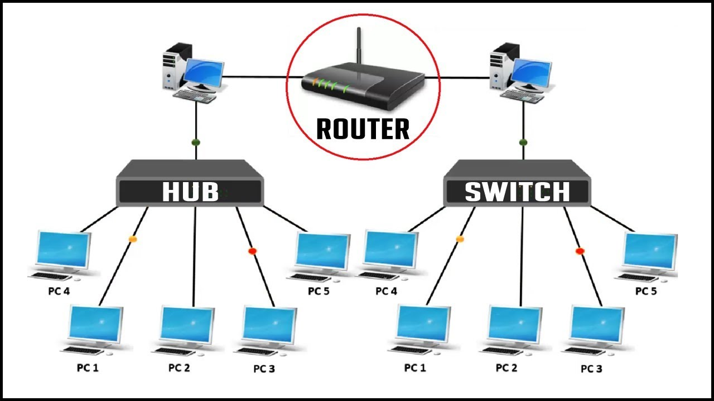

## VIRTUAL VE FİZİKSEL CİHAZLAR

### Hub
bağlı cihazlar arasında veri iletimi gerçekleştirmek için kullanılan, yönetimsel özellikleri bulunmayan ağ bağlantısı cihazlarındandır. Ağ üzerindeki iki cihaz haberleşeceği zaman, gönderici veriyi hub’ a gönderir. Hub ise alıcı gözetmeksizin veriyi ağdaki tüm cihazlara iletir, sadece alıcı cihaz veriyi alır. Veriyi ağın tamamına dağıttığı için ağın trafik yoğunluğunu yüksek, performans düşüktür.

Hub’ lar, ağın bant genişliğini bağlı cihazlara eşit dağıtır. Yani 5 cihazın bağlı olduğu ağın bant genişliği 100 mbps ise, her bir cihazın bant genişliği 20 mbps olur. Bu sebeple yüksek bant genişliği ve performans gerektiren, büyük ölçekli ağlarda hub kullanılmaz.

Hublar aktif ve pasif olmak üzere 2 sınıfa ayrılır. Aktif hub, kendisine gelen sinyali güçlendirerek iletir. Pasif hub ise gelen sinyali olduğu gibi ağdaki cihazlara iletir. Bu sebeple aktif hub, uzun mesafede kablo kayıplarını gidermek için kullanılır.

### Switch - Open vSwitch

**open vswitch**
Open vSwitch 2009 yılında çıkmış açık kaynak kodlu(Open-source) çok katmanlı(multi-layer) sanal bir switchtir . OVS olarak da kısaltılır.

Daha iyi anlaşılması için, linux server üzerinde sanal bir switch oluşturur diyebiliriz.

https://medium.com/devopsturkiye/open-vswitch-nedir-nas%C4%B1l-kullan%C4%B1l%C4%B1r-afe00241a56f

Desteklediği Protokoller

- Netflow
- sFlow
- SPAN
- RSPAN
- CLI
- LACP
- GRE
- VXLAN

**Netflow** Cisco tarafından geliştirilen bir switch üzerinden giden veya gelen trafiği toplayarak ağ trafiğini izleme protokolüdür. Protokol Layer 2 den sonra ki katmanları kapsar.

**Sflow** Netflow gibi switch üzerinden geçen trafiği monitoring yapmamızı sağlar . Sflow netflow gibi stateful yapısı yoktur. Trafiğin tamamını gözlemez sadece örnekleme alır . Trafiğin belli bir istatisliğini çıkarır. Örnekleme alırken rastgele paketler seçer. Örnekleme sistemini kullanması yüksek hızlı veri transferi olan sistemlerde kullanması bir problem çıkarmaz . L2, L3, L4 ve L7 katmanlarında çalışır.

**SPAN( Switched Port Analyzer) ve RSPAN( Remote Switched Port Analyzer)** bu protokoller networkü gözlemlemek için port veya vlanı kontrol etmek istediğimiz trafiği bir kopyasını bir porta veya vlana göndererek analiz etmek için kullanılır. SPAN tek cihaz üzerinde RSPAN uzaktaki cihazlarda kullanılabilmektedir.

Open vSwitch **CLI** ile network sistemimizi kontrol edebilir , yönetebiliriz .

**LACP(Link Aggregation Control Protocol)** Bu protokol sayesinde birden fazla fiziksel bağlantıyı tek bir hatmış gibi gösterir. LACP sayesinde bant genişliğimi artırabilir ve fiziksel bir yedekliliği sağlayabiliriz.

**GRE(Generic Routing Encapsulation)** Cisco tarafından geliştirilmiş 3. layer katmanda çalışan tünelleme protokolüdür.

**VXLAN** bir overlay network teknolojisidir. VXLAN geniş çaplı bulut bilişim sistemlerinde ağların ölçeklenebilirlik sorunlarına bir çözüm amacıyla tasarlanan bir ağ sanallaştırma tekniğidir. Vlan 4094(2¹²) adet ölçekleme sağlarken . VXLAN de ise 16777216(2²⁴) adet ölçeklendirme sağlar

**OVS** gördüğümüz gibi bir çok protokolü destekliyor . Bu protokoller desteklemesi özelliklerini de ortaya çıkarıyor .

Ayrıca bir daha tekrarlıyorum OVS ,**SDN(Software-Defined Network)** alt yapısında kullanılan önemli birleşenidir. Mesela Netflow protokolü SDN de networkü izlemek için kullanılıyor. SDN konusunu da ilerleyen zamanlarda anlatacağım .

### Switch vs Hub

- https://www.youtube.com/watch?v=GCy6IPyXO_k
- https://www.youtube.com/watch?v=s45lpn5HcvU

- Hub ve Switch arasında farklılıklar bulunmaktadır. Biri bütün bilgisayarlara bilgi gönderirken, diğeri sadece istenilen bilgisayarlara veri gönderip hızlıdır.
- Hub, bilgisayarları birbirine bağlayan  merkezi birleştirme cihazıdır. Aktif ve Pasif  hublar vardır. Pasif tipler bilgisayarı birbirlerini bağlar ama sinyalleri işlemezler.
- Verileri Hub kendine bağlı tüm bilgisayarlara gönderir.  Veriyi alması gereken tek bilgisayar olması halinde diğer kendine bağlı bilgisayarlara da veri yolladığı için onları da meşgul eder. Bu yüzden Hublar Switch lere göre performans olarak daha zayıftır. Port sayısı kadar bilgisayar bağlana bilir.
- Switchler ise şifreleme yöntemiyle her bir veriyi iletim kanalına ayrı bir yol bulan cihazlardır. Sadece istenilen bilgisayarlara veri gönderir. Portlarına hangi cihaz bağlı ise hepsine ayrı bir yol hazırlar . Görev olarak hub le aynıdır. fakat performans ve hız olarak hub dan  daha hızlıdır.
- Switch kendine gelen verinin hangi adrese gideceğine bakar o veriyi gönderen ve alacak olan arasında bir bağlantı kurup diğer bilgisayarların haberi olmadan ve onları meşgul etmeden iletir.

**spanning Tree**

Graph  lardaki spanning tree ile aynı şey.

Anahtarlardan oluşan yerel ağ yapısında fiziksel artıklık, yani hostların birbirleri ile iletişim kurarken yedek yolların bulunması ağda kesintisiz bir iletişim kurulmasını sağlar. Bir bağlantıda ya da anahtarda bir arıza durumunda ağda kesinti yaşanmaz. Aşağıdaki topolojide PC1’in dosya sunucu ile iletişim kurması için yedek yollar ve anahtarlar kullanılmıştır.

**STP Protokolü**

STP protokolü aşağıdaki şekilde görüldüğü üzere yedek yollardan biri üzerindeki portu engelleyerek (blocked) loop vb. sorunların önüne geçer. Bu şekilde tek bir yol var ve yedek yol yok gibi gözükse de herhangi bir arıza anında engellenmiş port, STP protokolü tarafından iletime geçirilerek ağda kesinti yaşanması engellenmiş olur.

daha detaylı bilgi için: https://bidb.itu.edu.tr/seyir-defteri/blog/2013/09/07/spanning-tree-protokol%C3%BC-(stp)

### Bridge

https://www.youtube.com/watch?v=Xmwmezk75Tk

Repeater gibidir.Repeater kendisine gelen sinyali güçlendirerek diğer porttan gönderir. Bridge ise gelen elektrik sinyalinin MAC adresini kontrol ederek geçerli bölüme geçip geçmeyeceğine karar verir ve gerekli MAC adresi bölümde varsa sinyali gönderir.

Bridge, Bir yerel ağı diğer yerel ağa bağlayan LAN cihazıdır. Birbirine bağlanan iki network’te aynı protokol ile çalışmalıdır.

MAC adresine göre trafik kısıtlaması yapabilir ve gelen paketleri MAC adreslerine göre hedefe yönlendirebilir.

Bridge, Hub’dan çok karışıktır. Layer-2’de çalışır. Hub’dan farklı olarak paketleri yönlendirmeden önce MAC addres tablosuna bakar, hedef adres tabloda yoksa paketleri yönlendirmez. Kısaca, Hub gibi broadcast çalışmaz, multicast/unicast çalışır.

### Router

### Repeater

### Hub vs Switch vs Router
- https://www.youtube.com/watch?v=s45lpn5HcvU

## VIRTUAL INTERFACE LISTESI

- Bridge
- Bonded interface
- Team device
- VLAN (Virtual LAN) 
- VXLAN (Virtual eXtensible Local Area Network)
- MACVLAN
- IPVLAN
- MACVTAP/IPVTAP
- MACsec (Media Access Control Security)
- VETH (Virtual Ethernet)
- VCAN (Virtual CAN)
- VXCAN (Virtual CAN tunnel)
- IPOIB (IP-over-InfiniBand)
- NLMON (NetLink MONitor)
- Dummy interface
- IFB (Intermediate Functional Block)
- netdevsim

## VIRTUAL TANIMLAR

Alttaki Nat ve Bridge sanallaştırma sistemlerinde sıklıkla karşımıza çıkar. Bu ikisinin haricinde ayrıca Host Only ve  Internal bulunmaktadır.

alttaki tablo aslında sanallaştırma sistemlerini özetlemektedir. 

sanallaştırm aözelinde konuşacak olursak network interfaceleri aşağıdaki gibi tanımlayabiliriz.

- **Nat:** 

NAT ile sanal makineniz ve fiziksel Ana Bilgisayarınız aynı ağ kimliğini paylaşır. Ancak Sanal Makinenize ağın dışından erisilemez. Birisi ağ trafiğini dinlemek isterse(Man in the Middle Attack diye de adlandirabilir, tam olarak anlami Ortadaki Adam demek.(Kemal Sunal aklima geldi, Allah Rahmet eylesin)) Sanal Makine Trafiğini algılayamaz demektir.

- **Bridge:**

Bridged Köprüleme ile, sanal makine dışardaki Ethernet ağına doğrudan erişime sahiptir. Sanal makine, ana ağdaki DHCP Sunucusu’ndan İP Adresi alır (Bu bir Firewall yada Router olabilir).

Sanal makinenizi ana sistemle aynı ağda tutmak ve sanal makineniz için ayrı bir İP adresine sahip olmak istiyorsanız, Bridged(Köprüleme) Bağlantısını seçmelisiniz. Aynı ağdaki diğer bilgisayarlar doğrudan sanal makineniz ile iletişim kurabilir. 

- **Host Only:**

Host-Only ağlarda, sanal makine yalnızca ağındaki diğer sanal makinelerle iletişim kurabilir. Sanal Makineler birbirlerine Sanal bir Switch sayesinde bağlanılar. İzole edilmiş ve güvenli bir sanal ağ kurmak için yalnızca bir Host-Only ağını seçmelisiniz. 

- **Internal:** 

### SUBNET vs VLAN

Subnets are the IP stacks way of determining what hosts are "assumed to be on link". If an address is in the same subnet traffic will be sent directly, otherwise it will be sent to a router (by default).

VLANs are a method for splitting a physical Ethernet network into multiple virtual Ethernet networks

Subnet is a small network composed by a group of IP addresses. It is part of a larger network. Any IP address within the same Subnet can communicate with each other without using routing devices. To be clear, we can think Subnet as the department of a company, people in the same department can talk freely without going out of their department. If you want to reach an address outside of your Subnet, you will have to go through a router or modern Gigabit Ethernet switch with router functionality. Since Subnet is related to IP address, it often works at layer 3.

|Parameter|VLAN|Subnet|
|---|----|----|
|Definition|VLAN is a logical LAN that contains broadcasts within itself, and only hosts belonged to that VLAN will see those broadcasts.|Subnet is an IP address range of IP addresses that help hosts communicate over layer 3.|
|Logical and Physical Network|VLAN allows us to create different logical and physical networks.|Subnet allows us to create logical networks through the same physical network.|
|Network Member Control|A VLAN is configured at server/router side. The one who controls the router/server decides which computer/port is assigned to which VLAN. For example, if you have a 24 port 10GbE switch, you can assign 12 ports to VLAN 1 and the others to VLAN 2.|A Subnet is determined by the IP you use and the IP can be chosen by the admin of a computer (or device). Therefore it is done on the client side – you can not control it.|
|OSI Layer|VLAN is a layer 2 term where MAC addresses work.|Subnet is a layer 3 term where IP layer works.|
|Hardware/Software Based|More of software-based terminology.|More of hardware-based terminology.|
|Security & Control|VLANs perceived to be more secure and provide more robust control for the network.|Subnet has limited control in comparison to VLAN.|
|Major Benefit|VLAN is extremely flexible, it brings better work performance, less traffic, and more efficiency.|A Subnet will not be affected when other Subnets going down or having technical breakdowns.|

### NAT

### BRIDGE

### VNET

internette bu network konusunda böyle bir terim bulunmuyor aslında. Daha çok azure networking sisteminde kullanılan bir terim.

bu arada aynı teknik AWS üzerinde VPC (virtual private cloud) olarka isimlendirilir. 

azure aws karşılaştıması

üstteki grafikte azure da farklı region larda oluşturulmuş vnet ler birbiriyle global peering oluşturulmuş.

### VLAN

özet olarak normalde hiç dokunulmadığında aynı network de olan cihazları mantıksal olrak gruplamaktır.

aynı örneği 3 farklı şekilde inceleyelim.

1. elimizde tek bir switch var ve üzerine takılı 9 cihaz var diyelim. bu 9 cihazı 3 erli olacak şekilde 3 grup halinde sadece aynı grupta olanlar birbiriyle haberleşebilecek şekilde kurgulamak istediğimiz varsayalım. böylece broadcast ler azalacak, güvenlik de sağlanmış olacak. bunu yapabilmek için router özelliği de olan bir switch e ihtiyacımız olacak. aşağıda örneklerde de görüleceği üzere router üzerinde açılan tek bir porta 3 tane etiketli ip verilerek trunk oluşturlur.
2. üsttekindne farklı olarka ayrı bir router umuzun olduğunu düşünelim bu durumda da aynı işlem fiziksel router üzerinde yapılmş olur.
3. elimizde 3 farklı switch olduğunu düşünelim bu durumda da switch üzerinde trunk porta tanımlamsı yapılarak birbiriyle haberleştirilir.

**vlan için video serisi** 
- https://www.youtube.com/watch?v=GtxMpIDB5Fk
- https://www.youtube.com/watch?v=nAbElY9zEjs
- https://www.youtube.com/watch?v=f5W2UASrGZc
- https://www.youtube.com/watch?v=Sve6jEgHqpE
- https://www.youtube.com/watch?v=gbSupqc4ClE

**kaynaklar**
- https://www.omersahin.com.tr/vlan-nedir-virtual-local-area-network/
- https://www.cemaltaner.com.tr/2018/02/18/vlan-nedir/
- https://www.kablosuzdestek.com/vlan-nedir-vlan-turleri-nelerdir/
- https://www.firatboyan.com/vlan-nedir-vlan-konfigurasyonu-nasil-yapilandirilir.aspx

IEEE tarafından gerçekleştirilen VLAN, Sanal Yerel Alan Ağı anlamına gelmektedir. OSI’nin 2. Katmanında çalışmaktadır. VLAN teknolojisi kullanılarak, bir yerel alan ağı (LAN) üzerindeki ağ kullanıcıları ve kaynaklar mantıksal olarak gruplandırılır ve portlara atanır. Bu mantıksal ağlar bölünmüş broadcast domainlerdir. VLAN yapılandırma sonrasında her VLAN sadece kendi broadcast’ini aldığından dolayı broadcast trafiği azaltılır ve bant genişliği de arttırılmış olur. LAN üzerinde farklı bir VLAN oluşturulmak istendiğinde kullanılan switch’in boş portları kullanılabilir. Bu sayede ağ yatırımından tasarruf edilmiş olur. 

VLAN kullanılarak ağı segmentlere ayırmak kullanıcıları daha kolay yönetmeye, erişim izinleri (access-list) daha kolay yapılandırıp uygulanmasına ve olası ağ sorunlarının saptanıp çözüme kavuşturulmasında bize kolaylık sağlar.

Misafir bir kullanıcıyı sistem ağına dahil etmek güvenlik açısından sağlıklı olmayabilir. Bu nedenle misafir kullanıcıyı sistemden izole eğilmiş bir ağ üzerinden internet ortamına çıkartmak daha güvenli olacaktır. Bu da ağı bölümleyerek yani VLAN yapılandırılması ile olur. VLAN kullanılan bir ağda, VLAN’da bulunan kullanıcılar sadece birbirleri ile iletişim kurabilirler, farklı bir VLAN’daki kullanıcılarla iletişim kuramazlar.

vtp client lşarı birbirine bağlaran ve her bir vlan daki cihazları birbiriyle görüştüren porta trunk port denir. switchler üzerine seçilen port trunk olarak atanır.  

VTP(Vlan trunk protocol): Her swicht’e tek tek vlan yapılandırması yapmamıza gerek yoktur. Cisco geliştirdiği VTP sayesinde tek merkezden diğer client switch’lere vlan bilgisini gönderebiliriz.

VTP; Server (Sunucu), Client (İstemci) ve Transparent (Şeffaf) olmak üzere 3 farklı modda çalıştırabilir.

- **Server (Sunucu):** VLAN’lar üzerinde tüm değişiklikleri yapma yetkisi olan, yaptığı değişiklik bilgilerini gönderme, bilgi alma, güncelleme özellikleri olan moddur. Her VTP etki alanında VLAN ekleme, yapılandırma işlemleri için en azından VTP server (sunucu) modda çalışan bir anahtarlayıcıya ihtiyaç vardır. Bu modda yapılan her değişiklik de o VTP etki alanına duyurulur ve etki alanındaki diğer anahtarlayıcılara öğretilir. Bu yapılan yapılandırmalar NVRAM (Non-Volatile RAM- Geçici olmayan bellek) üzerinde saklanır.
- **Client (İstemci):** VTP sunucularından bilgileri alabilme, güncelleme ve aldığı bilgileri gönderebilme yapabilen fakat VLAN’lar üzerinde herhangi bir değişiklik yapma yetkisine sahip olmayan anahtarlayıcılardır. Bu moda ait yapılandırma NVRAM  üzerinde saklanmaz, geçicidirler.
- **Transparent (Şeffaf):** Bu modda çalışan anahtarlayıcı aslında sunucu gibidir, üzerlerinden VLAN’lar oluşturulabilir, silinebilir veya değiştirilebilir. Bu işlemler sadece bu anahtarlayıcının VLAN veritabanını etkiler, burada yapılan değişiklikler diğer anahtarlayıcılara aktarılamaz. Ayrıca trunk portları üzerinden diğer anahtarlayıcılardan aldığı bilgileri yine trunk portlarından diğer anahtarlayıcılara gönderir fakat aldığı bilgileri kullanmaz, bu bilgilerle kendi VLAN veritabanını güncellemez. Bu moda ait yapılandırma NVRAM üzerinde saklanır.

https://www.practicalnetworking.net/stand-alone/configuring-vlans/

- https://bidb.itu.edu.tr/seyir-defteri/blog/2013/09/07/vlan-t%c3%bcrleri

**VLAN Türleri**
- Veri VLAN'ı ( Data VLAN )
- Varsayılan VLAN ( Default VLAN )
- Yerel VLAN ( Native VLAN)
- Yönetim VLAN'ı ( Management VLAN )
- Ses VLAN'ı ( Voice VLAN )

şu iki video terimleri anlatıyor.
- https://www.youtube.com/watch?v=GtxMpIDB5Fk
- https://www.youtube.com/watch?v=nAbElY9zEjs

### VETH

### VXLA

### Resources
- https://www.cemaltaner.com.tr/2019/12/08/spanning-tree-protokolu-nedir-nasil-yapilandirilir/
- https://bidb.itu.edu.tr/seyir-defteri/blog/2013/09/07/spanning-tree-protokol%C3%BC-(stp)
- https://www.tech-worm.com/hub-ile-switch-karsilastirmasi/
- https://medium.com/devopsturkiye/open-vswitch-nedir-nas%C4%B1l-kullan%C4%B1l%C4%B1r-afe00241a56f
- https://www.nakivo.com/blog/virtualbox-network-setting-guide/
- https://azizozbek.ch/blog/2018/01/vmware-network-adaptor-ayarlari-gorseli/

