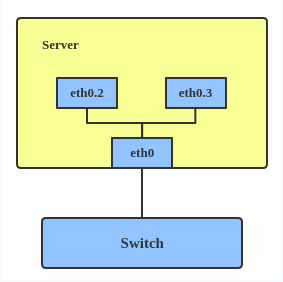
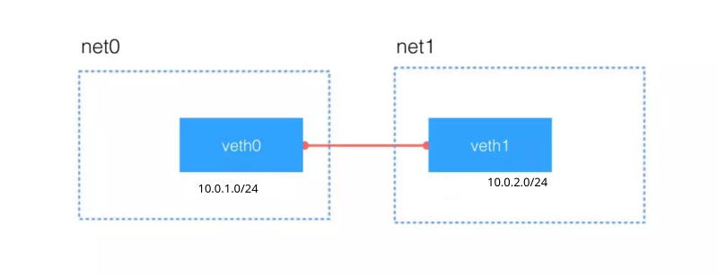
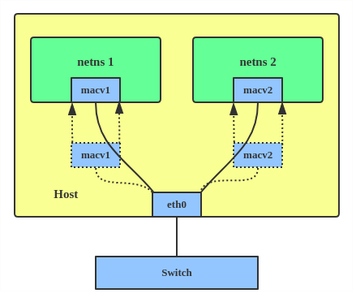

## NETWORK 
- https://www.youtube.com/playlist?list=PL966g7O8Fr34Z-PsTCM1YBzB6COiu0uZp (Temel Network)
- https://www.youtube.com/playlist?list=PLXaBFPQgxYavJseF_HAXOeNH13OuHjI7s (Temel Network - Sistem Yöneticiliği)
- https://www.youtube.com/playlist?list=PL5MqbnhzqrZQmKns4KyFfFnZlHUet9caW (Temel NEtwork)
- https://www.youtube.com/watch?v=pDn2u65rQbQ&t=1341s (Güzel anlatım 30 dk da network)
- https://www.youtube.com/watch?v=haBM0e-5UL0 (Temel Network : Bir Paketin Yolculuğu)
- https://www.youtube.com/playlist?list=PLXU1gWXx72mbez4ZKziBlud1sjhukaCqW (temel network)


## VIRTUAL VE FİZİKSEL CİHAZLAR

### Hub
bağlı cihazlar arasında veri iletimi gerçekleştirmek için kullanılan, yönetimsel özellikleri bulunmayan ağ bağlantısı cihazlarındandır. Ağ üzerindeki iki cihaz haberleşeceği zaman, gönderici veriyi hub’ a gönderir. Hub ise alıcı gözetmeksizin veriyi ağdaki tüm cihazlara iletir, sadece alıcı cihaz veriyi alır. Veriyi ağın tamamına dağıttığı için ağın trafik yoğunluğunu yüksek, performans düşüktür.

Hub’ lar, ağın bant genişliğini bağlı cihazlara eşit dağıtır. Yani 5 cihazın bağlı olduğu ağın bant genişliği 100 mbps ise, her bir cihazın bant genişliği 20 mbps olur. Bu sebeple yüksek bant genişliği ve performans gerektiren, büyük ölçekli ağlarda hub kullanılmaz.

Hublar aktif ve pasif olmak üzere 2 sınıfa ayrılır. Aktif hub, kendisine gelen sinyali güçlendirerek iletir. Pasif hub ise gelen sinyali olduğu gibi ağdaki cihazlara iletir. Bu sebeple aktif hub, uzun mesafede kablo kayıplarını gidermek için kullanılır.


### Switch - Open vSwitch

- https://www.youtube.com/playlist?list=PLSNNzog5eydtmcbcbc1b8pVRkgre3vNUy


**open vswitch**
Open vSwitch 2009 yılında çıkmış açık kaynak kodlu(Open-source) çok katmanlı(multi-layer) sanal bir switchtir . OVS olarak da kısaltılır.

Daha iyi anlaşılması için, linux server üzerinde sanal bir switch oluşturur diyebiliriz.

- https://medium.com/devopsturkiye/open-vswitch-nedir-nas%C4%B1l-kullan%C4%B1l%C4%B1r-afe00241a56f (docker üzerinden overlay network oluşturma örneği var bakılmalı)


Desteklediği Protokoller

- Netflow
- sFlow
- SPAN
- RSPAN
- CLI
- LACP
- GRE
- VXLAN

**Netflow** Cisco tarafından geliştirilen bir switch üzerinden giden veya gelen trafiği toplayarak ağ trafiğini izleme protokolüdür. Protokol Layer 2 den sonra ki katmanları kapsar.


**Sflow** Netflow gibi switch üzerinden geçen trafiği monitoring yapmamızı sağlar . Sflow netflow gibi stateful yapısı yoktur. Trafiğin tamamını gözlemez sadece örnekleme alır . Trafiğin belli bir istatisliğini çıkarır. Örnekleme alırken rastgele paketler seçer. Örnekleme sistemini kullanması yüksek hızlı veri transferi olan sistemlerde kullanması bir problem çıkarmaz . L2, L3, L4 ve L7 katmanlarında çalışır.


**SPAN( Switched Port Analyzer) ve RSPAN( Remote Switched Port Analyzer)** bu protokoller networkü gözlemlemek için port veya vlanı kontrol etmek istediğimiz trafiği bir kopyasını bir porta veya vlana göndererek analiz etmek için kullanılır. SPAN tek cihaz üzerinde RSPAN uzaktaki cihazlarda kullanılabilmektedir.


Open vSwitch **CLI** ile network sistemimizi kontrol edebilir , yönetebiliriz .


**LACP(Link Aggregation Control Protocol)** Bu protokol sayesinde birden fazla fiziksel bağlantıyı tek bir hatmış gibi gösterir. LACP sayesinde bant genişliğimi artırabilir ve fiziksel bir yedekliliği sağlayabiliriz.


**GRE(Generic Routing Encapsulation)** Cisco tarafından geliştirilmiş 3. layer katmanda çalışan tünelleme protokolüdür.


**VXLAN** bir overlay network teknolojisidir. VXLAN geniş çaplı bulut bilişim sistemlerinde ağların ölçeklenebilirlik sorunlarına bir çözüm amacıyla tasarlanan bir ağ sanallaştırma tekniğidir. Vlan 4094(2¹²) adet ölçekleme sağlarken . VXLAN de ise 16777216(2²⁴) adet ölçeklendirme sağlar


**OVS** gördüğümüz gibi bir çok protokolü destekliyor . Bu protokoller desteklemesi özelliklerini de ortaya çıkarıyor .


Ayrıca bir daha tekrarlıyorum OVS ,**SDN(Software-Defined Network)** alt yapısında kullanılan önemli birleşenidir. Mesela Netflow protokolü SDN de networkü izlemek için kullanılıyor. SDN konusunu da ilerleyen zamanlarda anlatacağım .


- https://www.cemaltaner.com.tr/2019/12/08/spanning-tree-protokolu-nedir-nasil-yapilandirilir/
- https://bidb.itu.edu.tr/seyir-defteri/blog/2013/09/07/spanning-tree-protokol%C3%BC-(stp)
- https://www.tech-worm.com/hub-ile-switch-karsilastirmasi/
- https://medium.com/devopsturkiye/open-vswitch-nedir-nas%C4%B1l-kullan%C4%B1l%C4%B1r-afe00241a56f
- https://www.nakivo.com/blog/virtualbox-network-setting-guide/
- https://azizozbek.ch/blog/2018/01/vmware-network-adaptor-ayarlari-gorseli/


### Switch vs Hub

- https://www.youtube.com/watch?v=GCy6IPyXO_k
- https://www.youtube.com/watch?v=s45lpn5HcvU


- Hub ve Switch arasında farklılıklar bulunmaktadır. Biri bütün bilgisayarlara bilgi gönderirken, diğeri sadece istenilen bilgisayarlara veri gönderip hızlıdır.
- Hub, bilgisayarları birbirine bağlayan  merkezi birleştirme cihazıdır. Aktif ve Pasif  hublar vardır. Pasif tipler bilgisayarı birbirlerini bağlar ama sinyalleri işlemezler.
- Verileri Hub kendine bağlı tüm bilgisayarlara gönderir.  Veriyi alması gereken tek bilgisayar olması halinde diğer kendine bağlı bilgisayarlara da veri yolladığı için onları da meşgul eder. Bu yüzden Hublar Switch lere göre performans olarak daha zayıftır. Port sayısı kadar bilgisayar bağlana bilir.
- Switchler ise şifreleme yöntemiyle her bir veriyi iletim kanalına ayrı bir yol bulan cihazlardır. Sadece istenilen bilgisayarlara veri gönderir. Portlarına hangi cihaz bağlı ise hepsine ayrı bir yol hazırlar . Görev olarak hub le aynıdır. fakat performans ve hız olarak hub dan  daha hızlıdır.
- Switch kendine gelen verinin hangi adrese gideceğine bakar o veriyi gönderen ve alacak olan arasında bir bağlantı kurup diğer bilgisayarların haberi olmadan ve onları meşgul etmeden iletir.


**spanning Tree**

Graph  lardaki spanning tree ile aynı şey.


Anahtarlardan oluşan yerel ağ yapısında fiziksel artıklık, yani hostların birbirleri ile iletişim kurarken yedek yolların bulunması ağda kesintisiz bir iletişim kurulmasını sağlar. Bir bağlantıda ya da anahtarda bir arıza durumunda ağda kesinti yaşanmaz. Aşağıdaki topolojide PC1’in dosya sunucu ile iletişim kurması için yedek yollar ve anahtarlar kullanılmıştır.

**STP Protokolü**

STP protokolü aşağıdaki şekilde görüldüğü üzere yedek yollardan biri üzerindeki portu engelleyerek (blocked) loop vb. sorunların önüne geçer. Bu şekilde tek bir yol var ve yedek yol yok gibi gözükse de herhangi bir arıza anında engellenmiş port, STP protokolü tarafından iletime geçirilerek ağda kesinti yaşanması engellenmiş olur.


daha detaylı bilgi için: https://bidb.itu.edu.tr/seyir-defteri/blog/2013/09/07/spanning-tree-protokol%C3%BC-(stp)


- https://www.cemaltaner.com.tr/2019/12/08/spanning-tree-protokolu-nedir-nasil-yapilandirilir/
- https://bidb.itu.edu.tr/seyir-defteri/blog/2013/09/07/spanning-tree-protokol%C3%BC-(stp)
- https://www.tech-worm.com/hub-ile-switch-karsilastirmasi/
- https://medium.com/devopsturkiye/open-vswitch-nedir-nas%C4%B1l-kullan%C4%B1l%C4%B1r-afe00241a56f
- https://www.nakivo.com/blog/virtualbox-network-setting-guide/
- https://azizozbek.ch/blog/2018/01/vmware-network-adaptor-ayarlari-gorseli/

### Bridge

https://www.youtube.com/watch?v=Xmwmezk75Tk


Repeater gibidir.Repeater kendisine gelen sinyali güçlendirerek diğer porttan gönderir. Bridge ise gelen elektrik sinyalinin MAC adresini kontrol ederek geçerli bölüme geçip geçmeyeceğine karar verir ve gerekli MAC adresi bölümde varsa sinyali gönderir.


Bridge, Bir yerel ağı diğer yerel ağa bağlayan LAN cihazıdır. Birbirine bağlanan iki network’te aynı protokol ile çalışmalıdır.


MAC adresine göre trafik kısıtlaması yapabilir ve gelen paketleri MAC adreslerine göre hedefe yönlendirebilir.


Bridge, Hub’dan çok karışıktır. Layer-2’de çalışır. Hub’dan farklı olarak paketleri yönlendirmeden önce MAC addres tablosuna bakar, hedef adres tabloda yoksa paketleri yönlendirmez. Kısaca, Hub gibi broadcast çalışmaz, multicast/unicast çalışır.


- https://www.cemaltaner.com.tr/2019/12/08/spanning-tree-protokolu-nedir-nasil-yapilandirilir/
- https://bidb.itu.edu.tr/seyir-defteri/blog/2013/09/07/spanning-tree-protokol%C3%BC-(stp)
- https://www.tech-worm.com/hub-ile-switch-karsilastirmasi/
- https://medium.com/devopsturkiye/open-vswitch-nedir-nas%C4%B1l-kullan%C4%B1l%C4%B1r-afe00241a56f
- https://www.nakivo.com/blog/virtualbox-network-setting-guide/
- https://azizozbek.ch/blog/2018/01/vmware-network-adaptor-ayarlari-gorseli/

### Router, Router Table, BGP


- https://www.youtube.com/watch?v=BqycNMntf5c&list=PLXaBFPQgxYavJseF_HAXOeNH13OuHjI7s&index=18 (Routing Temelleri)
- https://www.youtube.com/watch?v=SBY_Q4h2KCA&list=PLXaBFPQgxYavJseF_HAXOeNH13OuHjI7s&index=19 (statik Routing)
- https://www.youtube.com/watch?v=rXOqO62iSbM&list=PLXaBFPQgxYavJseF_HAXOeNH13OuHjI7s&index=32 (dinamik routing)
- https://www.youtube.com/watch?v=N9agdL72RaE&list=PLXaBFPQgxYavJseF_HAXOeNH13OuHjI7s&index=41 (Dimnaimk BGP)
- https://www.youtube.com/watch?v=pJnqQqPJMVM&list=PLXaBFPQgxYavJseF_HAXOeNH13OuHjI7s&index=42 (BGP tracer uygulaması)
- https://www.youtube.com/playlist?list=PLSNNzog5eydtmcbcbc1b8pVRkgre3vNUy (Switching and Routing hakkında video serisi)


### Repeater


### Hub vs Switch vs Router
- https://www.youtube.com/watch?v=s45lpn5HcvU


## VIRTUAL INTERFACE LISTESI


- Bridge
- Bonded interface
- Team device
- VLAN (Virtual LAN) 
- VXLAN (Virtual eXtensible Local Area Network)
- MACVLAN
- IPVLAN
- MACVTAP/IPVTAP
- MACsec (Media Access Control Security)
- VETH (Virtual Ethernet)
- VCAN (Virtual CAN)
- VXCAN (Virtual CAN tunnel)
- IPOIB (IP-over-InfiniBand)
- NLMON (NetLink MONitor)
- Dummy interface
- IFB (Intermediate Functional Block)
- netdevsim


**kaynaklar**
- https://developers.redhat.com/blog/2018/10/22/introduction-to-linux-interfaces-for-virtual-networking/
- https://man7.org/linux/man-pages/man8/ip-link.8.html
- https://man7.org/linux/man-pages/man8/ip.8.html


bu tip interface leri oluşturuken kullanılan iyi komut "ip" komutudur. ip komutunda belirtilen type parametresine göre başka parametrlerin de doldurulması gerekecektir.
ip komutu için de kullanılan type parametresinin alcağı değerler şu şekildedir. 


- bridge - Ethernet Bridge device
- bond - Bonding device
- dummy - Dummy network interface
- hsr - High-availability Seamless Redundancy device
- ifb - Intermediate Functional Block device
- ipoib - IP over Infiniband device
- macvlan - Virtual interface base on link layer
address (MAC)
- macvtap - Virtual interface based on link layer
address (MAC) and TAP.
- vcan - Virtual Controller Area Network interface
- vxcan - Virtual Controller Area Network tunnel
interface
- veth - Virtual ethernet interface
- vlan - 802.1q tagged virtual LAN interface
- vxlan - Virtual eXtended LAN
- ip6tnl - Virtual tunnel interface IPv4|IPv6 over
IPv6
- ipip - Virtual tunnel interface IPv4 over IPv4
- sit - Virtual tunnel interface IPv6 over IPv4
- gre - Virtual tunnel interface GRE over IPv4
- gretap - Virtual L2 tunnel interface GRE over IPv4
- erspan - Encapsulated Remote SPAN over GRE and
IPv4
- ip6gre - Virtual tunnel interface GRE over IPv6
- ip6gretap - Virtual L2 tunnel interface GRE over
IPv6
- ip6erspan - Encapsulated Remote SPAN over GRE and
IPv6
- vti - Virtual tunnel interface
- nlmon - Netlink monitoring device
- ipvlan - Interface for L3 (IPv6/IPv4) based VLANs
- ipvtap - Interface for L3 (IPv6/IPv4) based VLANs
and TAP
- lowpan - Interface for 6LoWPAN (IPv6) over IEEE
802.15.4 / Bluetooth
- geneve - GEneric NEtwork Virtualization
Encapsulation
- bareudp - Bare UDP L3 encapsulation support
- macsec - Interface for IEEE 802.1AE MAC Security
(MACsec)
- vrf - Interface for L3 VRF domains
- netdevsim - Interface for netdev API tests
- rmnet - Qualcomm rmnet device
- xfrm - Virtual xfrm interface


**ip Command Syntax**

- ip OBJECT COMMAND
- ip \[options\] OBJECT COMMAND
- ip OBJECT help

OBJECTS can be any one of the following and may be written in full or abbreviated form:
|Object|Abbreviated form|Purpose|
|------|----------------|-------|
|link|l|Network device.|
|address|a addr|Protocol (IP or IPv6) address on a device.|
|addrlabel|addrl|Label configuration for protocol address selection.|
|neighbour|n neigh|ARP or NDISC cache entry.|
|route|r|Routing table entry.|
|rule|ru|Rule in routing policy database.|
|maddress|m maddr|Multicast address.|
|mroute|mr|Multicast routing cache entry.|
|tunnel|t|Tunnel over IP.|
|xfrm|x|Framework for IPsec protocol.|


## VIRTUAL TANIMLAR


- https://www.youtube.com/watch?v=BB_q-75Snsk (virtualbox üzerinden anlatım)

Alttaki Nat ve Bridge sanallaştırma sistemlerinde sıklıkla karşımıza çıkar. Bu ikisinin haricinde ayrıca Host Only ve  Internal bulunmaktadır.

alttaki tablo aslında sanallaştırma sistemlerini özetlemektedir. 


sanallaştırm aözelinde konuşacak olursak network interfaceleri aşağıdaki gibi tanımlayabiliriz.

- **Nat:** 


NAT ile sanal makineniz ve fiziksel Ana Bilgisayarınız aynı ağ kimliğini paylaşır. Ancak Sanal Makinenize ağın dışından erisilemez. Birisi ağ trafiğini dinlemek isterse(Man in the Middle Attack diye de adlandirabilir, tam olarak anlami Ortadaki Adam demek.(Kemal Sunal aklima geldi, Allah Rahmet eylesin)) Sanal Makine Trafiğini algılayamaz demektir.


- **Bridge:**


Bridged Köprüleme ile, sanal makine dışardaki Ethernet ağına doğrudan erişime sahiptir. Sanal makine, ana ağdaki DHCP Sunucusu’ndan İP Adresi alır (Bu bir Firewall yada Router olabilir).

Sanal makinenizi ana sistemle aynı ağda tutmak ve sanal makineniz için ayrı bir İP adresine sahip olmak istiyorsanız, Bridged(Köprüleme) Bağlantısını seçmelisiniz. Aynı ağdaki diğer bilgisayarlar doğrudan sanal makineniz ile iletişim kurabilir. 


- **Host Only:**


Host-Only ağlarda, sanal makine yalnızca ağındaki diğer sanal makinelerle iletişim kurabilir. Sanal Makineler birbirlerine Sanal bir Switch sayesinde bağlanılar. İzole edilmiş ve güvenli bir sanal ağ kurmak için yalnızca bir Host-Only ağını seçmelisiniz. 


- **Internal:** 


### SUBNET vs VLAN

Subnets are the IP stacks way of determining what hosts are "assumed to be on link". If an address is in the same subnet traffic will be sent directly, otherwise it will be sent to a router (by default).


VLANs are a method for splitting a physical Ethernet network into multiple virtual Ethernet networks


Subnet is a small network composed by a group of IP addresses. It is part of a larger network. Any IP address within the same Subnet can communicate with each other without using routing devices. To be clear, we can think Subnet as the department of a company, people in the same department can talk freely without going out of their department. If you want to reach an address outside of your Subnet, you will have to go through a router or modern Gigabit Ethernet switch with router functionality. Since Subnet is related to IP address, it often works at layer 3.


|Parameter|VLAN|Subnet|
|---|----|----|
|Definition|VLAN is a logical LAN that contains broadcasts within itself, and only hosts belonged to that VLAN will see those broadcasts.|Subnet is an IP address range of IP addresses that help hosts communicate over layer 3.|
|Logical and Physical Network|VLAN allows us to create different logical and physical networks.|Subnet allows us to create logical networks through the same physical network.|
|Network Member Control|A VLAN is configured at server/router side. The one who controls the router/server decides which computer/port is assigned to which VLAN. For example, if you have a 24 port 10GbE switch, you can assign 12 ports to VLAN 1 and the others to VLAN 2.|A Subnet is determined by the IP you use and the IP can be chosen by the admin of a computer (or device). Therefore it is done on the client side – you can not control it.|
|OSI Layer|VLAN is a layer 2 term where MAC addresses work.|Subnet is a layer 3 term where IP layer works.|
|Hardware/Software Based|More of software-based terminology.|More of hardware-based terminology.|
|Security & Control|VLANs perceived to be more secure and provide more robust control for the network.|Subnet has limited control in comparison to VLAN.|
|Major Benefit|VLAN is extremely flexible, it brings better work performance, less traffic, and more efficiency.|A Subnet will not be affected when other Subnets going down or having technical breakdowns.|


### NAT

- https://www.youtube.com/watch?v=NR5G2Vy9mpk&list=PLXaBFPQgxYavJseF_HAXOeNH13OuHjI7s&index=44 (statik NAT packet tracer)
- https://medium.com/@gokhansengun/nat-network-address-translation-nedir-ve-nas%C4%B1l-%C3%A7al%C4%B1%C5%9F%C4%B1r-a2c8b6291de8
- https://www.sysnettechsolutions.com/nat-nedir-ne-ise-yarar/


**video anlatım**
- https://www.youtube.com/watch?v=uda8t2wAtgs
- https://www.youtube.com/watch?v=wg8Hosr20yw
- https://www.youtube.com/watch?v=dUfKR2wC1Y4


 NAT (Network Address Translation), aynı ağ içerisinde bulunan birden fazla cihazın aynı public IP’yi kullanarak internete erişebilmesini sağlayan yöntemdir.
 

 

 buradaki mantık aslında basitçe şu şekilde, içeride bir çok cihaz olabilir bunları dışarı bağlamak için tek bir noktadan (örneğin router dan) cihazlar dışarı açılır. Dışar ıçıkarken bütün cihazlar router ın dış ucunun ipsi ile dışarı çıkarlar.
 
 
 
Dışarıdan içeri istek atıldığında tek bir noktadan (roueter) içeri girildiği için içeride hanci chza isteğin ynedireleği belirlemek gerekiyor. Burada da devreye PAT giriyor. dışarıdan geln isteğin angi portdan yapıldığına göre içeride o portla ilişki (o porta cevap vermesi beklenen) cihaza yönlendirme yapılır. 
 
 

 
 


**NAT üç şekilde yapılır:**


1. **Static NAT (SNAT)** = Local deki ıp yi dışarıdaki ıp ye birebir çevirmedir ve sadece kendi tanımladığımız ıp ler reel ıp ile internete çıkabilirler.Pek kullanışlı değildir.
2. **Dynamic NAT (DNAT)** = Bir havuz oluşturarak dinamik olarak içerdeki adresleri bu havuzdaki dış IP bloklarıyla eşlemedir.Hemen hemen Static NAT ın aynısıdır fakat dinamiktir.

Hangi ıp ilk önce eşleşirse ilk önce internete o çıkar.Birden fazla reel ıp varsa o zaman duruma göre hepsi çıkabilir.Şu anda herhangi bir yerde kullanımı yoktur.

3. **NAT Overload (PAT,NAPT)** = IP artı portların değiştirilmesi denebilir.65535-(eksi) 1024 tane bilgisayar aynı anda portu kullanabilir.Herbirisi aynı ıp yi farklı portlardan

kullanarak internete çıkar.Router, kaynak ıp ve kaynak portu değiştirir,kendi üzerindeki NAT tablosuna yazar.


PAT ve NAT beraber kullanıldığında Overloaded olur


### ARP, ARP TABLE

### BRIDGE


şekilde görüldüğü üzere 2 adet tap cihazı var. altta tanımı var. 

örnek kod 

```
# ip link add br0 type bridge
# ip link set eth0 master br0
# ip link set tap1 master br0
# ip link set tap2 master br0
# ip link set veth1 master br0
```
Network Tap Nedir Network Tap, çeşitli izleme cihazlarının kullanımı için trafiğin "kopyasını" oluşturan harici bir ağ cihazıdır. Bağlantı noktası (port) yansıtmaya (mirroring) izin verir ve bir kuruluşun ağ yığınının karmaşık bir parçasıdır. Test veya sorun giderme amacıyla verilere erişilebildiği ağdaki belirli bir noktaya yerleştirilmiş bir donanım cihazıdır. Network TAP'ları temel olarak bir ağ altyapısında iki nokta arasındaki ağ trafiğini izlemek için kullanılır.


### Bonded interface vs Team device

temel amaç network cihazlarını load balance yapmaktır. tabiiki aralarında farklar var ancak konu bu değil. ancak şunu söylebiliriz team daha yetenkli ve kurgulanması daha kolay bir araç.

**bond**


örnek kod
```
ip link add bond1 type bond miimon 100 mode active-backup
ip link set eth0 master bond1
ip link set eth1 master bond1
```

**team**


örnek kod

```
# teamd -o -n -U -d -t team0 -c '{"runner": {"name": "activebackup"},"link_watch": {"name": "ethtool"}}'
# ip link set eth0 down
# ip link set eth1 down
# teamdctl team0 port add eth0
# teamdctl team0 port add eth1
```


net fail over


### VNET


internette bu network konusunda böyle bir terim bulunmuyor aslında. Daha çok azure networking sisteminde kullanılan bir terim. ancak network namespace kullanılararak oluşturulan networklere vnet isimini verenler de var.

örneğin 

```
$ ip netns add vnet0
```

bu arada aynı teknik AWS üzerinde VPC (virtual private cloud) olarka isimlendirilir. 


azure aws karşılaştıması


üstteki grafikte azure da farklı region larda oluşturulmuş vnet ler birbiriyle global peering oluşturulmuş.


### VLAN


özet olarak normalde hiç dokunulmadığında aynı network de olan cihazları mantıksal olarak gruplamaktır.

aynı örneği 3 farklı şekilde inceleyelim.

1. elimizde tek bir switch var ve üzerine takılı 9 cihaz var diyelim. bu 9 cihazı 3 erli olacak şekilde 3 grup halinde sadece aynı grupta olanlar birbiriyle haberleşebilecek şekilde kurgulamak istediğimiz varsayalım. böylece broadcast ler azalacak, güvenlik de sağlanmış olacak. bunu yapabilmek için router özelliği de olan bir switch e ihtiyacımız olacak. aşağıda örneklerde de görüleceği üzere router üzerinde açılan tek bir porta 3 tane etiketli ip verilerek trunk oluşturlur.
2. üsttekindne farklı olarka ayrı bir router umuzun olduğunu düşünelim bu durumda da aynı işlem fiziksel router üzerinde yapılmş olur.
3. elimizde 3 farklı switch olduğunu düşünelim bu durumda da switch üzerinde trunk porta tanımlamsı yapılarak birbiriyle haberleştirilir.


**vlan header**


**örnek vlan**



Note: When configuring a VLAN, you need to make sure the switch connected to the host is able to handle VLAN tags, for example, by setting the switch port to trunk mode.

örnek kod
```
# ip link add link eth0 name eth0.2 type vlan id 2
# ip link add link eth0 name eth0.3 type vlan id 3

```

şu ayara dikkat
```
 echo 1 > /sys/class/net/br0/bridge/vlan_filtering

 bridge vlan del dev br0 vid 1 self

 bridge vlan show
```
özellikle aşağıdakiler incelenmeli

- https://linux-blog.anracom.com/2017/11/28/fun-with-veth-devices-linux-bridges-and-vlans-in-unnamed-linux-network-namespaces-vi/
- https://linux-blog.anracom.com/2017/12/30/fun-with-veth-devices-linux-bridges-and-vlans-in-unnamed-linux-network-namespaces-vii/
- https://linux-blog.anracom.com/2018/01/05/fun-with-veth-devices-linux-bridges-and-vlans-in-unnamed-linux-network-namespaces-viii/

diğer linkler
- https://hicu.be/bridge-vs-macvlan (bridge vs vlan)
- https://wiki.archlinux.org/index.php/VLAN
- https://developers.redhat.com/blog/2017/09/14/vlan-filter-support-on-bridge/
- https://wiki.mikrotik.com/wiki/Manual:Bridge_VLAN_Table


**vlan için video serisi** 
- https://www.youtube.com/watch?v=GtxMpIDB5Fk
- https://www.youtube.com/watch?v=nAbElY9zEjs
- https://www.youtube.com/watch?v=f5W2UASrGZc
- https://www.youtube.com/watch?v=Sve6jEgHqpE
- https://www.youtube.com/watch?v=gbSupqc4ClE

**kaynaklar**
- https://www.omersahin.com.tr/vlan-nedir-virtual-local-area-network/
- https://www.cemaltaner.com.tr/2018/02/18/vlan-nedir/
- https://www.kablosuzdestek.com/vlan-nedir-vlan-turleri-nelerdir/
- https://www.firatboyan.com/vlan-nedir-vlan-konfigurasyonu-nasil-yapilandirilir.aspx


IEEE tarafından gerçekleştirilen VLAN, Sanal Yerel Alan Ağı anlamına gelmektedir. OSI’nin 2. Katmanında çalışmaktadır. VLAN teknolojisi kullanılarak, bir yerel alan ağı (LAN) üzerindeki ağ kullanıcıları ve kaynaklar mantıksal olarak gruplandırılır ve portlara atanır. Bu mantıksal ağlar bölünmüş broadcast domainlerdir. VLAN yapılandırma sonrasında her VLAN sadece kendi broadcast’ini aldığından dolayı broadcast trafiği azaltılır ve bant genişliği de arttırılmış olur. LAN üzerinde farklı bir VLAN oluşturulmak istendiğinde kullanılan switch’in boş portları kullanılabilir. Bu sayede ağ yatırımından tasarruf edilmiş olur. 


VLAN kullanılarak ağı segmentlere ayırmak kullanıcıları daha kolay yönetmeye, erişim izinleri (access-list) daha kolay yapılandırıp uygulanmasına ve olası ağ sorunlarının saptanıp çözüme kavuşturulmasında bize kolaylık sağlar.


Misafir bir kullanıcıyı sistem ağına dahil etmek güvenlik açısından sağlıklı olmayabilir. Bu nedenle misafir kullanıcıyı sistemden izole eğilmiş bir ağ üzerinden internet ortamına çıkartmak daha güvenli olacaktır. Bu da ağı bölümleyerek yani VLAN yapılandırılması ile olur. VLAN kullanılan bir ağda, VLAN’da bulunan kullanıcılar sadece birbirleri ile iletişim kurabilirler, farklı bir VLAN’daki kullanıcılarla iletişim kuramazlar.


vtp client ları birbirine bağlaran ve her bir vlan daki cihazları birbiriyle görüştüren porta trunk port denir. switchler üzerine seçilen port trunk olarak atanır.  


VTP(Vlan trunk protocol): Her swicht’e tek tek vlan yapılandırması yapmamıza gerek yoktur. Cisco geliştirdiği VTP sayesinde tek merkezden diğer client switch’lere vlan bilgisini gönderebiliriz.

VTP; Server (Sunucu), Client (İstemci) ve Transparent (Şeffaf) olmak üzere 3 farklı modda çalıştırabilir.

- **Server (Sunucu):** VLAN’lar üzerinde tüm değişiklikleri yapma yetkisi olan, yaptığı değişiklik bilgilerini gönderme, bilgi alma, güncelleme özellikleri olan moddur. Her VTP etki alanında VLAN ekleme, yapılandırma işlemleri için en azından VTP server (sunucu) modda çalışan bir anahtarlayıcıya ihtiyaç vardır. Bu modda yapılan her değişiklik de o VTP etki alanına duyurulur ve etki alanındaki diğer anahtarlayıcılara öğretilir. Bu yapılan yapılandırmalar NVRAM (Non-Volatile RAM- Geçici olmayan bellek) üzerinde saklanır.
- **Client (İstemci):** VTP sunucularından bilgileri alabilme, güncelleme ve aldığı bilgileri gönderebilme yapabilen fakat VLAN’lar üzerinde herhangi bir değişiklik yapma yetkisine sahip olmayan anahtarlayıcılardır. Bu moda ait yapılandırma NVRAM  üzerinde saklanmaz, geçicidirler.
- **Transparent (Şeffaf):** Bu modda çalışan anahtarlayıcı aslında sunucu gibidir, üzerlerinden VLAN’lar oluşturulabilir, silinebilir veya değiştirilebilir. Bu işlemler sadece bu anahtarlayıcının VLAN veritabanını etkiler, burada yapılan değişiklikler diğer anahtarlayıcılara aktarılamaz. Ayrıca trunk portları üzerinden diğer anahtarlayıcılardan aldığı bilgileri yine trunk portlarından diğer anahtarlayıcılara gönderir fakat aldığı bilgileri kullanmaz, bu bilgilerle kendi VLAN veritabanını güncellemez. Bu moda ait yapılandırma NVRAM üzerinde saklanır.


https://www.practicalnetworking.net/stand-alone/configuring-vlans/


- https://bidb.itu.edu.tr/seyir-defteri/blog/2013/09/07/vlan-t%c3%bcrleri

**VLAN Türleri**
- Veri VLAN'ı ( Data VLAN )
- Varsayılan VLAN ( Default VLAN )
- Yerel VLAN ( Native VLAN)
- Yönetim VLAN'ı ( Management VLAN )
- Ses VLAN'ı ( Voice VLAN )


şu iki video terimleri anlatıyor.
- https://www.youtube.com/watch?v=GtxMpIDB5Fk
- https://www.youtube.com/watch?v=nAbElY9zEjs
- https://www.youtube.com/watch?v=r9Yfz0GyqVQ&list=PLXaBFPQgxYavJseF_HAXOeNH13OuHjI7s&index=17
- https://www.youtube.com/playlist?list=PLSNNzog5eydurp2zcB4xs6gdeeVW3cMOW (video serisi)


**ip komutu ile örnek trunk kullanımı**
- http://rmadapur.blogspot.com/2014/02/vrf-linux-network-name-space.html


### ETHERNET, NIC (NETWORK INTERFACE CARD) ,  VETH


- https://www.youtube.com/watch?v=03HWtTizG4c&list=PL966g7O8Fr34Z-PsTCM1YBzB6COiu0uZp&index=10 (Ethernet nedir)
- https://www.youtube.com/playlist?list=PLSNNzog5eydvAxPHJiDybPomC1fFHf1KE (Ethernet hakkıkında seri video - hepsi çok gerekli olmayabilir.)
- https://www.youtube.com/watch?v=FkH_J-IZbpU&list=PLSNNzog5eydvAxPHJiDybPomC1fFHf1KE
- https://www.ibm.com/support/knowledgecenter/en/linuxonibm/com.ibm.linux.z.ldva/ldva_c_virtualizationOfNetworkDevices.html

**nic**
- https://www.youtube.com/watch?v=m9evUZtkEAc


Ethernet, kablolu bir yerel alan ağlarını (LAN’lar) bağlamak için kullanılan ve bir protokolle – bir kurallar kümesi veya ortak ağ dili – aracılığıyla birbirleriyle iletişim kurmalarını sağlayan geleneksel teknolojidir.


Ethernet, TCP / IP yığındaki bir veri bağlantısı katmanı protokolü olarak Ethernet, ağ aygıtlarının veri paketlerini nasıl biçimlendirebileceğini ve iletebileceğini açıklar; böylece aynı yerel veya kampüs alanı ağ bölümündeki diğer aygıtlar onları tanıyabilir, alabilir ve işleyebilir. Bir Ethernet kablosu, verilerin üzerinde hareket ettiği fiziksel, kapalı kablolamadır.


Kablo kullanarak coğrafi olarak yerelleştirilmiş bir ağa erişen herhangi bir cihaz – yani kablosuz bağlantı yerine kablolu – büyük olasılıkla ev, okul veya ofis ortamında Ethernet kullanır. İşletmelerden oyunculara kadar çeşitli son kullanıcılar, güvenilirlik ve güvenlik dahil olmak üzere Ethernet bağlantısının avantajlarına bağlıdır.


Kablosuz LAN teknolojisine kıyasla, Ethernet, radyo dalgası girişiminden, fiziksel engellerden veya bant genişliği domuzlarından kaynaklanan bozulmalara karşı daha az hassastır. Ayrıca, cihazların fiziksel kablolar kullanarak bağlanması gerektiğinden, yabancıların ağ verilerine erişmesini veya onaylanmamış cihazlar için bant genişliğini kaçırmasını zorlaştırdığından, kablosuz teknolojiden daha fazla ağ güvenliği ve kontrolü sunabilir.

VETH ise bunun yazılımsal olarak üretilmiş halidir diyebiliriz.


Veth cihazlar sanal Ethernet cihazlarıdır. Başka bir ad alanındaki fiziksel bir ağ cihazına köprü oluşturmak için ağ ad alanları arasında tüneller görevi görebilirler, ancak bağımsız ağ cihazları olarak da kullanılabilirler.

veth cihazları her zaman birbirine bağlı çiftler halinde oluşturulur. çünki veth gerçek hayattaki bir ethernet kablosu gibidir. Kablonun bir ucu bir interface e diğer ucu diğer bir interface e takılır. Şu komut kullanılarak bir çift oluşturulabilir:

```
# ip bağlantısı add <p1-name> veth eş adı <p2-name> yazın
```
Yukarıda, p1-adı ve p2-adı, bağlantılı iki uç noktaya atanan adlardır.

Çiftteki bir cihazda iletilen paketler diğer cihaza anında alınır. Cihazlardan biri çalışmadığında, çiftin bağlantı durumu kapalıdır.

veth aygıt çiftleri, çekirdeğin ağ olanaklarını ilginç şekillerde bir araya getirmek için kullanışlıdır. Özellikle ilginç bir kullanım durumu, bir veth çiftinin bir ucunu bir ağ ad alanına ve diğer ucunu başka bir ağ ad alanına yerleştirmek ve böylece ağ ad alanları arasında iletişime izin vermektir. Bunu yapmak için, arayüzleri oluştururken netns parametresi sağlanabilir:
 
```
# ip bağlantısı ekle <p1-name> netns <p1-ns> veth peer <p2-name> netns <p2-ns>
```

 veya mevcut bir veth çifti için bir tarafı diğer ad alanına taşıyın:
 
```
# ip link set <p2-name> netns <p2-ns>
```


örnek kodlu
```
# ip netns add net1
# ip netns add net2
# ip link add veth1 netns net1 type veth peer name veth2 netns net2
```

This creates two namespaces, net1 and net2, and a pair of VETH devices, and it assigns veth1 to namespace net1 and veth2 to namespace net2. These two namespaces are connected with this VETH pair. Assign a pair of IP addresses, and you can ping and communicate between the two namespaces.


### VETH -  Nat ile bridge Kullanmadan


**örnek kod:** https://developpaper.com/detailed-underlying-technology-of-cloud-computing-network-principle-and-practice-of-linux-network-namespace/

faydalanılan diğer adreslerini
- https://tanzu.vmware.com/developer/blog/a-container-is-a-linux-namespace-and-networking-basics/
- http://fosshelp.blogspot.com/2014/07/introduction-to-network-namespace-and.html
- https://blogs.igalia.com/dpino/2016/04/10/network-namespaces/



```
$ sudo ip netns add net0
$ sudo ip netns add net1
$ sudo ip netns ls
```
daha sonra net0 ve net1 in ip adreslerini Kontrol ediyoruz

```
$ sudo ip netns exec net0 ip addr

1: lo: <LOOPBACK> mtu 65536 qdisc noop state DOWN group default qlen 1000
    link/loopback 00:00:00:00:00:00 brd 00:00:00:00:00:00

    
$ sudo ip netns exec net1 ip addr
1: lo: <LOOPBACK> mtu 65536 qdisc noop state DOWN group default qlen 1000
    link/loopback 00:00:00:00:00:00 brd 00:00:00:00:00:00


```

şimdi iki networkü konuşturacağız.

ilk olarak bir veth oluşturuyoruz. bu aslındaiki ucu açık kablo gibidir yani uçları bağlı değil herhangi bir yere.

daha sonra ip link komutuyla uç bilgilerini alıyoruz.


```
"
$ sudo ip link add type veth
$ sudo ip link

# sonuç

9: veth0@veth1: <BROADCAST,MULTICAST,M-DOWN> mtu 1500 qdisc noop state DOWN mode DEFAULT group default qlen 1000
    link/ether e6:b3:85:b9:80:87 brd ff:ff:ff:ff:ff:ff
10: veth1@veth0: <BROADCAST,MULTICAST,M-DOWN> mtu 1500 qdisc noop state DOWN mode DEFAULT group default qlen 1000
```
daha sonra bu ethernet kablosunun bir ucunu net0 a diğerini net1 e bağlıyoruz.


```
$ sudo ip link set veth0 netns net0
$ sudo ip link set veth1 netns net1

# bağlandıdan sonra da bi kontrol yapıyoruz. net0 daki bağlı networkler

$ sudo ip netns exec net0 ip addr


1: lo: <LOOPBACK> mtu 65536 qdisc noop state DOWN group default qlen 1000
    link/loopback 00:00:00:00:00:00 brd 00:00:00:00:00:00
8: veth0@if9: <BROADCAST,MULTICAST> mtu 1500 qdisc noop state DOWN group default qlen 1000
    link/ether aa:80:4c:0d:0e:03 brd ff:ff:ff:ff:ff:ff link-netns net1


# net1 deki bağlı networkler

$ sudo ip netns exec net1 ip addr

1: lo: <LOOPBACK> mtu 65536 qdisc noop state DOWN group default qlen 1000
    link/loopback 00:00:00:00:00:00 brd 00:00:00:00:00:00
9: veth1@if8: <BROADCAST,MULTICAST> mtu 1500 qdisc noop state DOWN group default qlen 1000
    link/ether 12:a1:20:fa:35:e0 brd ff:ff:ff:ff:ff:ff link-netns net0

```

ancak görüldüğü üzere bu interface lerde ne ip var ne de UP durmundalar (DOWN durumundalar).


şimdi ip ataması yapıp UP durmuna getiriyoruz.

```

 
```

şimdi tekrar kontrol ediyoruz ve görüleceği üzere artık ip almış veth0 ve UP durumda

```
$ sudo ip netns exec net0 ip addr

1: lo: <LOOPBACK,UP,LOWER_UP> mtu 65536 qdisc noqueue state UNKNOWN group default qlen 1000
    link/loopback 00:00:00:00:00:00 brd 00:00:00:00:00:00
    inet 127.0.0.1/8 scope host lo
       valid_lft forever preferred_lft forever
    inet6 ::1/128 scope host 
       valid_lft forever preferred_lft forever
8: veth0@if9: <BROADCAST,MULTICAST,UP,LOWER_UP> mtu 1500 qdisc noqueue state UP group default qlen 1000
    link/ether aa:80:4c:0d:0e:03 brd ff:ff:ff:ff:ff:ff link-netns net1
    inet 10.0.1.0/24 scope global veth0
       valid_lft forever preferred_lft forever
    inet6 fe80::a880:4cff:fe0d:e03/64 scope link 
       valid_lft forever preferred_lft forever

```


şimdi networklerin birbiriyle konuşup konuşmadığını test edelim.

öncelikle host dan ping atmayı deniyoruz. ancak host subnet (veya network) ile net0 arasında bir route tanımı olmadığı için haberleşemeyeceklerdir. bunun için ya default gateway veya statc ip tanımı yapmalıyız. ancak görüleceği üzer unreachable hatası da vermemektedir. Bu durumda donanımsal bir problem olduğu anlasşılır. Biz burada fiziksel donanımlarla bu işi yapmadığımız için kutgumuz hatalı demek oluyor. tabii ki biz eksik yaptığımızı biliyoruz :).

```
$ ping 10.0.1.0
```
bu durumda veth0 ı inceleyebiliriz çünki sonuçta veth0 a ping atıyoruz
```
$ ip link show veth0

Device "veth0" does not exist.

```
görülceği üzere veth0 host makinamız tarafından erişebilir durumda değil. Ancak aslında orada. şu komut bunu göstemektedir.


```
$ sudo ip netns exec net0 ip addr


8: veth0@if9: <BROADCAST,MULTICAST,UP,LOWER_UP> mtu 1500 qdisc noqueue state UP group default qlen 1000
    link/ether aa:80:4c:0d:0e:03 brd ff:ff:ff:ff:ff:ff link-netns net1
    inet 10.0.1.0/24 scope global veth0
       valid_lft forever preferred_lft forever
    inet6 fe80::a880:4cff:fe0d:e03/64 scope link 
       valid_lft forever preferred_lft forever


```


bir de networkleri kendi aralarındaki testlerini yapalım. örneğin net0 dan net1 e ping atalım. burada da sonuçta networkun unreachable olduğunu görebiliyoruz. çünki burada da network kablosunu iki network arasına taktık ancak aynı subnette olmadıkları için unreachable hatası aldık.

```
$ sudo ip netns exec net0 ping 10.0.2.0

```
diğer bir kontrol tekniğini de deneyelim. aşağıdaki komut net0 ın 10.0.2.0 (yani net1 e bağlı veth1 ucu) ile iletşime geçip geçemeceğini test etmek. daha dğrusu iki network arasındaki route bilgisinin getirilmesini sağlar

```
$ sudo ip -n net0 route get 10.0.2.0

RTNETLINK answers: Network is unreachable
```

görüleecği üzere böyle bir yolun olmadığını söylüyor.

diğer bir kontrol ise öreneğin net0 da tanımlı route lara bakmak. görülecceği üzere sadece kendisiyle haberleşebiliyor.

```
sudo ip netns exec net0 ip route
10.0.1.0/24 dev veth0 proto kernel scope link src 10.0.1.0

```

son bir kontrolü de host makinasındaki route lara bakarak yapabiliriz

```
$ sudo ip route
```
buradada ne net0 ne de net1 ile ilişkili bir route görünmüyor.


peki acaba kendi üzerinde net0 ping attığında ne oluyor ona bakalım. görüldüğü üzere net0 kendi içinde veth0  aping atabiliyor.
```
$ sudo ip netns exec net0 ping 10.0.1.0

PING 10.0.1.0 (10.0.1.0) 56(84) bytes of data.
64 bytes from 10.0.1.0: icmp_seq=1 ttl=64 time=0.104 ms
64 bytes from 10.0.1.0: icmp_seq=2 ttl=64 time=0.065 ms
64 bytes from 10.0.1.0: icmp_seq=3 ttl=64 time=0.060 ms
64 bytes from 10.0.1.0: icmp_seq=4 ttl=64 time=0.053 ms

```
bütün bunlardan şunu çıakrtıyoruz networkler kendi içlerinde çalışıyorlar ancak birbirleriyle ya da host makinasıyla iletişime geçemiyorlar.

bunun çözümü ise bu networklere diğer networklerle haberleşme yollarını göstermek.


```
$ sudo ip -n net0 route add 10.0.2.0/24 dev veth0
$ sudo ip -n net1 route add 10.0.1.0/24 dev veth1
```
şimdi yukarıda yaptığımız bazı kontrolleri 2 network arasında tekrar yapalım


örneğin alttaki komuıtu yukarıda çalıştırdığımızda unreachable hatası almıştık.

```
$ sudo ip -n net0 route get 10.0.2.0
10.0.2.0 dev veth0 src 10.0.1.0 uid 0 
```

alttaki komut ise route tanımlamasında önce tek bir route gösteriyordu o da kendi içindeydi artık 2 adet route var

```
$ sudo ip netns exec net0 ip route
10.0.1.0/24 dev veth0 proto kernel scope link src 10.0.1.0 
10.0.2.0/24 dev veth0 scope link 

```
alttaki komut ise yukarıda çalıştırıldığında unreachable hatası almıştık artık iki network birbiriyle hablerşebiliyor. 

```
$ sudo ip netns exec net0 ping 10.0.2.0
PING 10.0.2.0 (10.0.2.0) 56(84) bytes of data.
64 bytes from 10.0.2.0: icmp_seq=1 ttl=64 time=0.063 ms
64 bytes from 10.0.2.0: icmp_seq=2 ttl=64 time=0.032 ms
64 bytes from 10.0.2.0: icmp_seq=3 ttl=64 time=0.077 ms

```

şimdi tcpdump ile net0 daki veth0 interface ini dinlyelim ve başka bir terminalde ping atalım

ping atarken kullanılcak komut

```
$  sudo ip netns exec net1 ping 10.0.1.0
```
alttaki  de sonuç

```
$ sudo ip netns exec net0  tcpdump -i veth0 icmp -l
tcpdump: verbose output suppressed, use -v or -vv for full protocol decode
listening on veth0, link-type EN10MB (Ethernet), capture size 262144 bytes
15:19:24.411414 IP 10.0.2.0 > 10.0.1.0: ICMP echo request, id 11209, seq 1, length 64
15:19:24.411433 IP 10.0.1.0 > 10.0.2.0: ICMP echo reply, id 11209, seq 1, length 64
15:19:25.440952 IP 10.0.2.0 > 10.0.1.0: ICMP echo request, id 11209, seq 2, length 64
15:19:25.440981 IP 10.0.1.0 > 10.0.2.0: ICMP echo reply, id 11209, seq 2, length 64
15:19:26.464957 IP 10.0.2.0 > 10.0.1.0: ICMP echo request, id 11209, seq 3, length 64
...
```

şimdi basit bir mesajlaşma uygulamsı ile iki networkü birbiriyle konuşturalım.


amacımız net0 da 80 portunu dinlemek ve gelen emsajşar mesaj göndermek. bunun için üç tane terminal açmamız gerekiyor.


```
# birinci terminalde çalıştırıyoruz
# l listen , n ise ip vereceğimizi hostnamse resole yapmasına gerek olmadığını söylemiş oluyoruz
$ sudo ip netns exec net0 nc -l -n  10.0.1.0 80 -v

Listening on [10.0.1.0] (family 0, port 80)

# ikinci terminalde handshake yaptırabilmekm için aşağıdaki komutu çalıştırıyoruz
$ sudo ip netns exec net1 nc -4t -n 10.0.1.0 80 -v  

Connection to 10.0.1.0 80 port [tcp/*] succeeded!


# üçüncü terminalde aşağıdaki komutla tcp portunu net0 da dump alarak paketleri inceliyoruz
$ sudo ip netns exec net0 tcpdump -X -i veth0 -n tcp -l

```

artık net0 ile net1 arasında mesaj gönderebiliriz. tcpdump ekranımızda gelen gide mesajları izleyebiliriz.


peki örneğin net0 host ile haberleşebiliyor mu ona bakalım. local ip nizi düzeltmeyi unutmayın.

```
$ sudo ip netns exec net0 ping 192.168.0.20
ping: connect: Network is unreachable

```
görüldüğü üzere haberleşemiyor. 

yada internette 8.8.8.8 u ping leyebiliyor mu? bunu da yapamıyor. bu arada ip yerine domain adı yazsaydık bu seferde nameserver çözülemiyor hatası alacaktık yani bu hostname i çözemeyecekti. bunun için /etc/netns/net0/resolv.conf dosyasını tanımlanması gerekli. çünki network izolasyonundan dolayı /etc/resolv.conf dosyası okunamaz. net0 ve net1 için bahsedilen path altıne networklere özel resolv.conf dosyaları açılmalı.

bunuda ilerde yapacağız

```
$ sudo ip netns exec net0 ping 8.8.8.8
ping: connect: Network is unreachable
```

tam bu noktada aslında şunu düşünmeemiz gerekiyor. örneğin net0 ın host a erişmesi demek internete de erişmesi demek oluyor. yani bu durumda aslında biz default gateway tanımı yapmış oluyoruz. yani net0 erişemediği diğer tüm networkler için kullanacağı route ı oluşturmuş olacağız.


eğer default gateway tanımı yapmadan host makinasının subnet adresine bağlamasını söylersen ozman sadece o subnet ile haberleşebilir.

bu arada configürasyon yaprken host makinasında gelen isteleri ipv4 seviyesinde forward yapmasıyla ilgili ayarı yapmayı unutmayınız, vakti gelince zaten yapacağız.


eğer host (root namespace) daki eth interface ini çıkartıp net0 a takacak olursak internet gider. eğer test etmek isteseniz  isterseniz

```
# alttaki komutu çalıştırdığınızda internetinizin gittiğini görebilirsiniz.
$ sudo ip link set enp3s0 netns net0

# geri almak için 1 root namespace i ifade eder
$ sudo ip netns exec net0 ip link set enp3s0 netns 1

```
peki bridge kullanmadan net0 ı veya net1 i root network namespace (host) a nasıl açabiliriz?


bunun bir yolu bir veth oluşturarak bir ucunu root namespaeci ne diğer ucunu net0 a bağlamak.

```
$ sudo ip link add hostveth type veth peer name net0veth

$ sudo ip link set net0veth netns net0
$ sudo ip netns exec net0 ip addr add 192.168.0.60/24  dev net0veth
$ sudo ip netns exec net0 ip link set net0veth up

# namespace belirtilmediği için root da (host) çalışır.
$ sudo ip addr add 192.168.0.61/24 dev hostveth
$ sudo ip link set hostveth up

# daha sonra check ediyoruz
$ sudo ip netns exec net0 ping 192.168.0.20
PING 192.168.0.20 (192.168.0.20) 56(84) bytes of data.
64 bytes from 192.168.0.20: icmp_seq=1 ttl=64 time=0.109 ms
64 bytes from 192.168.0.20: icmp_seq=2 ttl=64 time=0.142 ms
64 bytes from 192.168.0.20: icmp_seq=3 ttl=64 time=0.053 ms
64 bytes from 192.168.0.20: icmp_seq=4 ttl=64 time=0.220 ms
```
eğer localhosta ping atacak olursak host un /etc/hosts dosyasıo okunur. bu namespace için localhost tanılaması yapmak isityorsak /etc/netns/net0/hosts dosyası tanımlamalıyız ve içine alttaki satırı eklemeliyiz


ayrıca nameserver için yani DNS çözümlemesi içinde /etc/netns/net0/resolv.conf dosyasını oluşturup içine örneğin aşağıdakler yazılabilir

```
nameserver 192.168.0.20
nameserver 8.8.8.8
search google.com

```
üstteki ayarlar yapılmazsa localhost için host localhost olark kabül edilir ayrıca örneğin resolv.conf olmadığı içinde google.com adresi çözülemez.


```
10.0.1.0 localhost
```

şimdi local hosta net0 içinden ping atacak olursak 10.0.1.0 interface i cevap verecektir.

ancak internet testi yapacak olursak erişemediğimizi görebiliriz

```
$ sudo ip netns exec net0 ping 8.8.8.8
ping: connect: Network is unreachable
```

bunun için artık default gateway tanımlamsı yapmamız gerekiyor.

```
# host u gateway i ni gösteriyoruz
$ sudo ip netns exec net0 ip route add default via 192.168.0.1
# veya
$ sudo ip netns exec net0 route add default gw 192.168.0.1 

# ayrıca host makinasında forward işlemine onay vermemiz gerekiyor

$ sudo sysctl -w net.ipv4.ip_forward=1
```

ancak bu tanımlamdan sonra bile internete çıkmadığımızı görebilirsiniz.

çünki biz bridge koymadık araya. bridge direk kendisi NAT a ihtiyaç duymadan bizi dışarı çıkarabilirdi.

Ancak burada NAT a ihtiyacımız var. iptable üzerinde iç ip mizi dış ip ye çevirmemiz gerekiyor.

```


$ sudo iptables -t nat -A POSTROUTING -s 192.168.0.0/24 -o enp3s0 -j MASQUERADE

$ sudo iptables -A FORWARD -i enp3s0 -o hostveth -j ACCEPT
$ sudo iptables -A FORWARD -o enp3s0 -i hostveth -j ACCEPT

# parameterelerin tanımları

iptables: the command line utility for configuring the kernel
-t nat: select table "nat" for configuration of NAT rules.
-A POSTROUTING : Append a rule to the POSTROUTING chain (-A stands for "append").
-o hostveth: this rule is valid for packets that leave on the second network interface (-o stands for "output")
-j MASQUERADE: the action that should take place is to 'masquerade' packets, i.e. replacing the sender's address by the router's address.
```

artık test ettiğimizde google.com ve 8.8.8.8 iplerine çıktığımızı görebiliriz.

```
$ sudo ip route sh
default via 192.168.0.1 dev enp3s0 proto dhcp metric 100 
192.168.0.0/24 dev hostveth proto kernel scope link src 192.168.0.61 
192.168.0.0/24 dev enp3s0 proto kernel scope link src 192.168.0.20 metric 100 
192.168.1.0/24 dev br-7cfc4bcbbb46 proto kernel scope link src 192.168.1.1 linkdown 
```

net0 üerinde route tablosuna bakacak olursak

```
$ sudo ip netns exec net0 ip route
default via 192.168.0.20 dev net0veth 
10.0.1.0/24 dev veth0 proto kernel scope link src 10.0.1.0 
10.0.2.0/24 dev veth0 scope link 
192.168.0.0/24 dev net0veth proto kernel scope link src 192.168.0.60 
```

örneğin net0 dan 8.8.8.8 e ping atarken root namespace üzerindeki hostveth interface ini dinlemek istersek

```
$ sudo tcpdump -i hostveth icmp -l
```
veya net0 üzerindeki net0veth ı dinlemek için

```
sudo ip netns exec net0  tcpdump -i net0veth icmp -l
```


**yukarıda yazdığımız iptables kullarının açıklaması**
Kural, NAT paketi eşleştirme tablosunu (-t nat) kullanır ve güvenlik duvarının harici ağ aygıtında (-o eth0) NAT (-A POSTROUTING) için yerleşik POSTROUTING zincirini belirtir. POSTROUTING, paketlerin güvenlik duvarının harici aygıtından çıkarken değiştirilmesine izin verir. -J MASQUERADE hedefi, güvenlik duvarının / ağ geçidinin harici IP adresi ile bir düğümün özel IP adresini maskelemek için belirtilir.


Dahili ağınızda harici olarak kullanılmasını istediğiniz bir sunucunuz varsa, bir hedef IP adresi ve dahili hizmetinize bağlantı isteyen gelen paketlerin olabileceği portu belirtmek için NAT'taki PREROUTING zincirinin -j DNAT hedefini kullanabilirsiniz. iletildi. Örneğin, gelen HTTP isteklerini 172.31.0.23 adresindeki özel Apache HTTP Sunucusu sunucu sisteminize iletmek istiyorsanız, aşağıdaki komutu çalıştırın;
```
iptables -t nat -A PREROUTING -i eth0 -p tcp --dport 80 -j DNAT \
      --to 172.31.0.23:80
```
FORWARD zincirinizde varsayılan bir DROP ilkeniz varsa, hedef NAT yönlendirmesinin mümkün olması için gelen HTTP isteklerinin iletilmesine izin vermek için bir kural eklemelisiniz. Bunu yapmak için aşağıdaki komutu çalıştırın:


```
iptables -A FORWARD -i eth0 -p tcp --dport 80 -d 172.31.0.23 -j ACCEPT
```
Bu kural, güvenlik duvarından gelen HTTP isteklerinin, güvenlik duvarının arkasındaki Apache HTTP Sunucusu sunucusunun amaçlanan hedefine iletilmesine izin verir.

### VETH - Bridge + NAT kullanarak

öncelikle detaylı bilgi almak için üstteki VETH Nat kullanark başlılı tutorial ı takip ediniz.


```
# Making use of the `ip` command from the `iproute2` 
# package we're able to create the namespaces.
#
# By convention, network namespace handles created by
# iproute2 live under `/var/run/netns` (although they
# could live somewhere, like `docker` does with its
# namespaces - /var/run/docker/netns`).


# Check that iproute2 indeed creates the files
# under `/var/run/netns`.
tree /var/run/netns/
/var/run/netns/
├── namespace1
└── namespace2


sudo ip netns add namespace1
sudo ip netns add namespace2

# Create the two pairs.
sudo ip link add veth1 type veth peer name br-veth1
sudo ip link add veth2 type veth peer name br-veth2

# Associate the non `br-` side
# with the corresponding namespace
sudo ip link set veth1 netns namespace1
sudo ip link set veth2 netns namespace2


# Assign the address 192.168.1.11 with netmask 255.255.255.0
# (see the `/24` mask there) to `veth1`.
sudo ip netns exec namespace1 \
        ip addr add 192.168.1.11/24 dev veth1


# Repeat the process, assigning the address 192.168.1.12 with 
# netmask 255.255.255.0 to `veth2`.
sudo ip netns exec namespace2 \
        ip addr add 192.168.1.12/24 dev veth2


# Create the bridge device naming it `br1`
# and set it up:
sudo ip link add name br1 type bridge
sudo ip link set br1 up


# Set the bridge veths from the default
# namespace up.
sudo ip link set br-veth1 up
sudo ip link set br-veth2 up


# Set the veths from the namespaces up too.
sudo ip netns exec namespace1 \
        ip link set veth1 up
sudo ip netns exec namespace2 \
        ip link set veth2 up


# Add the br-veth* interfaces to the bridge
# by setting the bridge device as their master.
sudo ip link set br-veth1 master br1
sudo ip link set br-veth2 master br1

# buarada fiziksel eth de brigge a master olararak tanımlaabilir. böylece bridge device fizilsel networkle de konuşabilir.
# ancak biz burada yapmamdık yine de çalıştı


# br1 üzerindeki interface leri check ediyoruz. net0

bridge link show br1
5: virbr0-nic: <BROADCAST,MULTICAST> mtu 1500 master virbr0 state disabled priority 32 cost 100 
10: br-veth1@if11: <BROADCAST,MULTICAST,UP,LOWER_UP> mtu 1500 master br1 state forwarding priority 32 cost 2 
12: br-veth2@if13: <BROADCAST,MULTICAST,UP,LOWER_UP> mtu 1500 master br1 state forwarding priority 32 cost 2 


# Set the address of the `br1` interface (bridge device)
# to 192.168.1.13/24 and also set the broadcast address
# to 192.168.1.255 (the `+` symbol sets  the host bits to
# 255).
# burada broadcast adresi bu adrese gönderilen paketlerin tüm subnet e gideceğini belirtir.
sudo ip addr add 192.168.1.13/24  brd + dev br1
sudo ip link set br1 up


# bridge broadcast adresi ektradan ayrı olarak şöylede eklembilirdi
# ip addr add 192.168.1.0/24 broadcast 192.168.1.255 dev br0


# başka bir araçla broadcat ekleme yolu

#iface br0 inet static 
#    bridge_ports eth0 eth1
#        address 192.168.1.2
#        broadcast 192.168.1.255
#        netmask 255.255.255.0
#        gateway 192.168.1.1 -->


# routing leri root namespace de check ediyoruz 
sudo ip route

192.168.1.0/24 dev br1 proto kernel scope link src 192.168.1.13 


# görüldüğü üzere default gateway tanımlı değil yani namespace ler bilmedikleri ip leri nereden geçireceklerini bilmiyorlar
# bunuda ekliyoruz
sudo ip netns  exec  namespace1 \
        ip route add default via 192.168.1.13

sudo ip netns  exec namespace2 \
        ip route add default via 192.168.1.13

# yukarıda ayrı ayrı yaprığımız ayarı bütün namespace leriçin alttki komutla da yapabilirdik. ancak bütün namespace lere yapar
# ip -all netns exec ip route add default via 192.168.1.13


# test ediyorsunuz
sudo ip netns exec namespace1 ping 192.168.1.13 
PING 192.168.1.13 (192.168.1.13) 56(84) bytes of data.
64 bytes from 192.168.1.13: icmp_seq=1 ttl=64 time=0.385 ms
64 bytes from 192.168.1.13: icmp_seq=2 ttl=64 time=0.185 ms


sudo ip netns exec namespace1 ping 192.168.1.12
PING 192.168.1.12 (192.168.1.12) 56(84) bytes of data.
64 bytes from 192.168.1.12: icmp_seq=1 ttl=64 time=0.430 ms
64 bytes from 192.168.1.12: icmp_seq=2 ttl=64 time=0.144 ms

# şimdi sıra bridge netwokümüzü NAT lamaya

sudo echo 1 | sudo tee /proc/sys/net/ipv4/ip_forward

# Then insert a NAT rule (also called IP masquerade) in the external interface: 

sudo iptables \
        -t nat \
        -A POSTROUTING \
        -s 192.168.1.0/24 \
        -j MASQUERADE


# yukarıda broadcast ip sini eklemiştik brigde device a onu test etmek içişn
# öncelikle namespacelerden birinde bütün portları 8080 den dinliyoruz. 
# başka bir tetminalde de 192.168.1.255 broadcast ipsine udp portundan mesaj gönderiyoruz mesajın namespace eriştiğini görebiliriz.
# ancak udp tek tarflı olduğu için tek mesajdan sonra kapancaktır. namespace2 dinliyor namespace1 ve root (host) namespace de mesaj gönderiyor.
sudo ip netns exec namespace2 nc -l  8080 -u 
sudo ip netns exec namespace1 nc 192.168.1.255 8080 -u -b
sudo nc 192.168.1.255 8080 -u -b


### birde dış network ping atalım

sudo ip netns exec namespace2 ping  8.8.8.8
PING 8.8.8.8 (8.8.8.8) 56(84) bytes of data.
64 bytes from 8.8.8.8: icmp_seq=1 ttl=117 time=26.5 ms
64 bytes from 8.8.8.8: icmp_seq=2 ttl=117 time=25.3 ms
64 bytes from 8.8.8.8: icmp_seq=3 ttl=117 time=24.3 ms
64 bytes from 8.8.8.8: icmp_seq=4 ttl=117 time=31.2 ms

```


- https://ops.tips/blog/using-network-namespaces-and-bridge-to-isolate-servers/
- http://fosshelp.blogspot.com/2014/08/connect-two-network-namespaces-using.html
- https://www.thegeekdiary.com/how-to-configure-network-namespaces-in-docker-containers/
- https://developpaper.com/detailed-underlying-technology-of-cloud-computing-network-principle-and-practice-of-linux-network-namespace/
- https://blog.mbrt.dev/2017-10-01-demystifying-container-networking/
- https://www.karlrupp.net/en/computer/nat_tutorial
- https://wiki.archlinux.org/index.php/Network_bridge (genel bridge)
- https://wiki.archlinux.org/index.php/Bridge_with_netctl (netctl ile bridge)
- https://wiki.archlinux.org/index.php/Systemd-networkd#Bridge_interface (systemd üzerinden kalıcı bridge)
- https://wiki.linuxfoundation.org/networking/bridge (detaylı anlatım)
- https://vincent.bernat.ch/en/blog/2017-linux-bridge-isolation (bridge izolasyonu çok iyi anlatmış)


### VXLAN (Virtual eXtensible Local Area Network)

özellikle cloud plaformlarında scalebility problemini çözmek için çıkmıştır. 


VXLAN, geniş çaplı bulut bilişim dağıtımlarında görülen ağların ölçeklenebilirlik sorunlarına bir çözüm amacıyla tasarlanan yeni bir ağ sanallaştırma tekniği olarak tanımlanmaktadır.  VXLAN teknik olarak Ethernet protokolünün tünellenmesi yöntemi ile çalışır. Tünelleme işlemini, UDP paketine veya ilgili cihazlarla uyumlu bir taşıma mekanizması içine eklenmiş yeni bir Ethernet frame (header bilgisi olarak ekstradan birkaç yeni byte eklenmiş şekilde) gerçekleştirir.


**vxlan header**


**örnek**


```
# ip link add vx0 type vxlan id 100 local 1.1.1.1 remote 2.2.2.2 dev eth0 dstport 4789
```


https://codingpackets.com/blog/linux-network-components-used-in-openstack/


- https://developers.redhat.com/blog/2018/10/22/introduction-to-linux-interfaces-for-virtual-networking/
- https://www.kernel.org/doc/html/latest/networking/vxlan.html
- http://www.fatlan.com/openstack-ansible-network-configuration-bonding-mtu-vlan-br-vlan-br-vxlan-with-netplan-on-ubuntu-18/
- http://tr.opticalpatchcable.com/info/an-overview-on-evpn-and-lnv-35954130.html


### MACVLAN

macvlan aslında bir fiziksel bir interface e birden fazla mac adresi bağlam demektir. böylece alt interface ler kendilerine ait mac adresleriyle fizikssel interface e bağlanabilirler ve böyle kendi ip adresleriyle dışarı da çıkabilirler.


macvlan dan önce eğer bir VM yada namespace i fiziksel networke bağlamak isteseyid bunun içi aşağıda örneği görüldüğü üzere tap veya veth cihazları oluşturmak ve bridge yarımıyla firiksel interface e bağlamak zorunda kalacaktık. Bunun örneği VETH kısmındammavcut zaten


macvlan den sonra aşağıd görüldüğü şekliyle ditrek olark fiziksel interface üzerinde tanımlanan mac adresleri ile vm yada namespace i haberleştirmek mümkün hale geliyor. 



5 farklı macvlan tipi vardır

**private**


**VEPA**
her bir cihaz (vm/namespace/container) için ayrı bir çıkış var fiziksel network kartı üzerinde 


!!!!!!!!!!!!! önemli !!!!!!!!!!!!!!!

internete çıkmak için

VEPA (Virtual Ethernet Port Aggregator) is the default mode. If the lower device receives data from a macvlan in VEPA mode, this data is always sent "out" to the upstream switch or bridge, even if it's destined for another macvlan in the same lower device. Since macvlans are almost always assigned to virtual machines or containers, this makes it possible to see and manage inter-VM traffic on a real external switch (whereas with normal bridging it would not leave the hypervisor), with all the features provided by a "real" switch. However, at the same time this implies that, for VMs to be able to communicate, the external switch should send back inter-VM traffic to the hypervisor out of the same interface it was received from, something that is normally prevented from happening by STP. This feature (the so-called "hairpin mode" or "reflective relay") isn't widely supported yet, which means that if using VEPA mode with an ordinary switch, inter-VM traffic leaves the hypervisor but never comes back (unless it's sent back at the IP level by a router somewhere, but then there's nothing special about that, it has always worked that way).
Since there are few switches supporting hairpin mode, VEPA mode isn't used all that much yet. However it's worth mentioning that Linux's own internal bridge implementation does support hairpin mode in recent versions; assuming eth0 is a port of br0, hairpin mode can be anabled by doing

```
# echo 1 > /sys/class/net/br0/brif/eth0/hairpin_mode
```


**Bridge**
her bir cihaz (vm/namespace/container) için tek bir çıkış var fiziksel network kartı üzerinde 


Bridge mode: this works almost like a traditional bridge, in that data received on a macvlan in bridge mode and destined for another macvlan of the same lower device is sent directly to the target (if the target macvlan is also in bridge mode), rather than being sent outside. This of course works well with non-hairpin switches, and inter-VM traffic has better performance than VEPA mode, since the external round-trip is avoided. In the words of a kernel developer,

    The macvlan is a trivial bridge that doesn't need to do learning as it
    knows every mac address it can receive, so it doesn't need to implement
    learning or stp. Which makes it simple stupid and and fast. 


**Passthru**


**Source**
bu modda ise sadece belirli mac adreslerinin geçişine izin verilir. mac based vlan gibi birşey olur. https://git.kernel.org/pub/scm/linux/kernel/git/netdev/net.git/commit/?id=79cf79abce71


hızlı kod örneği 3 macvlan tipine bir örnek yani bridges
```
# ip link add macvlan1 link eth0 type macvlan mode bridge
# ip link add macvlan2 link eth0 type macvlan mode bridge
# ip netns add net1
# ip netns add net2
# ip link set macvlan1 netns net1
# ip link set macvlan2 netns net2

This creates two new MACVLAN devices in bridge mode and assigns these two devices to two different namespaces.
```


gerçek uygulama

enp3s0 gerçek fiziksel device

```

sudo ip link add macvlan1 link enp3s0 type macvlan mode bridge
sudo ip link add macvlan2 link enp3s0 type macvlan mode bridge

sudo ip netns add macvlannet1
sudo ip netns add macvlannet2

sudo ip link set macvlan1 netns macvlannet1
sudo ip link set macvlan2 netns macvlannet2

sudo ip netns exec macvlannet1 ifconfig macvlan1 192.168.1.50/24 up
# sudo ip netns exec macvlannet1 ip addr add 192.168.1.50/24 dev macvlan1
sudo ip netns exec macvlannet1 ifconfig macvlan1 192.168.1.60/24 up
# sudo ip netns exec macvlannet2 ip addr add 192.168.1.60/24 dev macvlan2

sudo ip netns exec macvlannet1  ping  192.168.1.60

PING 192.168.0.60 (192.168.0.60) 56(84) bytes of data.
64 bytes from 192.168.0.60: icmp_seq=1 ttl=64 time=0.085 ms
64 bytes from 192.168.0.60: icmp_seq=2 ttl=64 time=0.068 ms
64 bytes from 192.168.0.60: icmp_seq=3 ttl=64 time=0.049 ms
64 bytes from 192.168.0.60: icmp_seq=4 ttl=64 time=0.069 ms


#  host ve internet için iki subnet arasında bağlantı kurmak lazım bunun için bir bridge kurup 192.168.1.0/24 altındaki ipler buraya bağlanıp daha sonra bridge host networkune de bağlanabilir ancak biz kısa yoldan sadece macvlannet1 namespace ini bağlayacağız.


sudo ip link add dev vethhost type veth peer name vethmacvlannet1
sudo ip link set vethmacvlannet1 netns macvlannet1
sudo ip netns exec macvlannet1 ip addr add 192.168.0.50/24 dev vethmacvlannet1
sudo ip netns exec macvlannet1 ip link set vethmacvlannet1 up
sudo ip addr add 192.168.0.51/24 dev vethhost
sudo ip link set vethhost up
sudo ip netns exec macvlannet1 ip route add default via 192.168.0.20

böylece sistem dışarıda açılmış oldu iç networku de kullanabilir  oldu.


```


- https://backreference.org/2014/03/20/some-notes-on-macvlanmacvtap/
- http://networkstatic.net/configuring-macvlan-ipvlan-linux-networking/
- http://hicu.be/bridge-vs-macvlan
- https://developers.redhat.com/blog/2018/10/22/introduction-to-linux-interfaces-for-virtual-networking/


### IPVLAN

macvlan e benze ancak burada bütün endpointler aynı mac adresine sahiptir.


 fakat farklı ip blokları alabilirler


**Ipvlan L2**


**Ipvlan L3**

Ipvlan L3 mode behaves like a router – it forwards the IP packets between different subnets, however it does not reduce the TTL value of the passing packets. Thus, you will not see the Ipvlan “router” in the path when doing traceroute.


kernel döümanında hangi durumlarda ipvlan kullanılması gerektiği açıkça beliritlmiş

**choose to use ipvlan –**
- (a) The Linux host that is connected to the external switch / router has policy configured that allows only one mac per port.
- (b) No of virtual devices created on a master exceed the mac capacity and puts the NIC in promiscuous mode and degraded performance is a concern.
- (c) If the slave device is to be put into the hostile / untrusted network namespace where L2 on the slave could be changed / misused.”


IPVLAN L2 mode acts like a MACVLAN in bridge mode. The parent interface looks like a bridge or switch.


In IPVLAN L3 mode, the parent interface acts like a router and packets are routed between endpoints, which gives better scalability.


**örnek**

pvlan L2 Mode Linux Networking : bridge (switch) mode  yani The parent interface looks like a bridge or switch.


Ipvlan L2 mode is virtually identical to Macvlan Bridge mode but instead has a single MAC address per container. There are upsides and downsides to this. Net is having unique mac-addresses hit a ceiling on most NICs of 500-1,000. While that would never be an issue in the VM world, the efficiencies you gain from containers 5x-10x+ and the resulting increase in density, creates a multiplier of more apps (and IP addresses) per server then we have ever seen before. That density is as good a reason as any to get a handle on container networking in your organization sooner rather then later.

```
# add the namespaces
sudo ip netns add ns3
sudo ip netns add ns4
 
# create the macvlan link attaching it to the parent host enp3s0
sudo ip link add ipv1 link enp3s0 type ipvlan mode l2
sudo ip link add ipv2 link enp3s0 type ipvlan mode l2
 
# move the new interface ipv1/ipv2 to the new namespace
sudo ip link set ipv1 netns ns3
sudo ip link set ipv2 netns ns4
 
# bring the two interfaces up
sudo ip netns exec ns3 ip link set dev ipv1 up
sudo ip netns exec ns4 ip link set dev ipv2 up
 
# set ip addresses
sudo ip netns exec ns3 ifconfig ipv1 192.168.1.10/24 up
sudo ip netns exec ns4 ifconfig ipv2 192.168.1.20/24 up
 
# ping from one ns to another
sudo ip netns exec ns3 ping 192.168.1.20
 
# cleanup
sudo ip netns del ns3
sudo ip netns del ns4
```


**örnek**

In IPVLAN L3 mode, the parent interface acts like a router and packets are routed between endpoints, which gives better scalability.

For anyone that has been in networking for a while, Ipvlan L3 mode will punish your senses of what can and can’t be done. That is likely a good thing. First and foremost, there is no broadcast or multicast traffic allowed into the namespace. This means a next hop default gateway has little meaning. The default gateway is simply the namespace interface. If you are running a provider network, this presents excellent potentials for securing tenant traffic. Any network attached to the same parent interface can reach any other network attached to the same parent interface. 

```
# add the namespaces
sudo ip netns add ns5
sudo ip netns add ns6
 
# create the macvlan link attaching it to the parent host enp3s0
sudo ip link add ipv1 link enp3s0 type ipvlan mode l3
sudo ip link add ipv2 link enp3s0 type ipvlan mode l3
 
# move the new interface ipv1/ipv2 to the new namespace
sudo ip link set ipv1 netns ns5
sudo ip link set ipv2 netns ns6
 
# bring the two interfaces up
sudo ip netns exec ns5 ip link set dev ipv1 up
sudo ip netns exec ns6 ip link set dev ipv2 up
 
# set ip addresses
sudo ip netns exec ns5 ifconfig ipv1 10.1.100.10/24 up
sudo ip netns exec ns6 ifconfig ipv2 192.168.100.10/24 up
 
# add default routes
sudo ip netns exec ns5 ip route add default dev ipv1
sudo ip netns exec ns6 ip route add default dev ipv2
# view the namespace default gateway (interface not next hop IP)
sudo ip netns exec ns5 ip route
sudo ip netns exec ns6 ip route
 
# ping from one ns to another
sudo ip netns exec ns5 ping 192.168.100.10

# ipler farklı olmasına rağme sistem routing yapabiliyor
 

# ancak dış ip lere yada host ip lerine ping atıldığında unreachable hatası vermemesine rağmen geri dönüş alınamamaktadır. 
# durumu test etmek için tcpdump ile host ve ns6 dinlenere hem ns5 den ns6 ya hem de host ip si ile dış dip lere pign atıldı


sudo tcpdump -i enp3s0  icmp -l
sudo ip netns exec ns5   tcpdump -i ipv1  icmp -l


# cleanup
sudo ip netns del ns5
sudo ip netns del ns6
```


- http://networkstatic.net/configuring-macvlan-ipvlan-linux-networking/

### MACVTAP/IPVTAP


MACVTAP/IPVTAP is a new device driver meant to simplify virtualized bridged networking. When a MACVTAP/IPVTAP instance is created on top of a physical interface, the kernel also creates a character device/dev/tapX to be used just like a TUN/TAP device, which can be directly used by KVM/QEMU.

With MACVTAP/IPVTAP, you can replace the combination of TUN/TAP and bridge drivers with a single module:


bunda da aynı macvlan daki gibi aynı tipler var.


**VEPA**
görüldüğü üzere vepa mode da her bir container/vm  için ayrı ayrı çıkış var eth0 üzerinde


**BRIDGE**
görüldüğü üzere bridge mode da tek bir çıkış ar eth0 üzerinde


**PRIVATE**


**passthrough**


- https://suhu0426.github.io/Web/Presentation/20150203/index.html
- https://suhu0426.github.io/Web/Presentation/20150120/index.html


