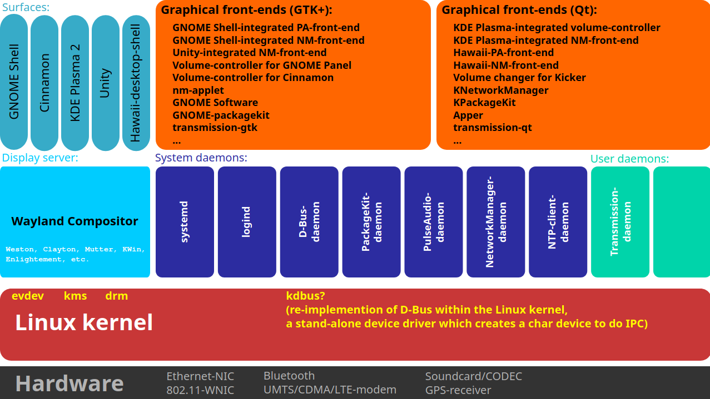
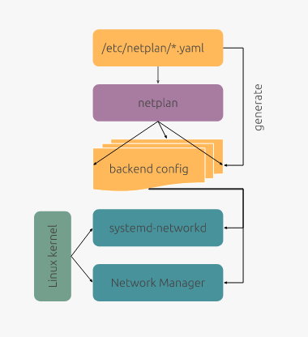

### Network Manager

Libudev ve diğer bazı linux kernel interface leri üzerinde çalışan high-level network konfigürasyon aracıdır.

Çoğunlukla Redhat desteği ile devam etmektedir.

Nmcli kullanılarak yönetilebilir.

ayrıca centos/fedora/redhat ve debian tabanlı distrbution ların arkada tarafta kullanıkları persitant network kanfigürasyon aracıdır.





- https://wiki.archlinux.org/index.php/NetworkManager
- https://wiki.debian.org/NetworkManager
- https://access.redhat.com/documentation/en-us/red_hat_enterprise_linux/7/html/networking_guide/getting_started_with_networkmanager

### /etc/sysconfig/network-scripts/

Redhat ve Centos da network konfigürasyonu için kullanılan sistemdir. Aslında Network Manager kullanılrak yönetilir. Ubuntu tarafındaki netplan a benzer. Bu da arka tarafta network manager kullanmaktadır.


### netplan

Canonical firmasının ubuntu için geliştirdiği 
- **Network Manager** veya networkd kullanarak 
- network configürasyonunu bu araçlardan soyutlayarak 
- yaml tabanlı

bir network konfigürasyon aracısır.





### brctl

bridge yönetimi için  kullanılır ancak bunun için artık ip komutu kullanılır.

- https://www.thegeekstuff.com/2017/06/brctl-bridge/

### Open VSwitch

Open vSwitch is a production quality, multilayer virtual switch licensed under the open source Apache 2.0 license.  It is designed to enable massive network automation through programmatic extension, while still supporting standard management interfaces and protocols (e.g. NetFlow, sFlow, IPFIX, RSPAN, CLI, LACP, 802.1ag).  In addition, it is designed to support distribution across multiple physical servers similar to VMware's vNetwork distributed vswitch or Cisco's Nexus 1000V. See full feature list here


- Visibility into inter-VM communication via NetFlow, sFlow(R), IPFIX, SPAN, RSPAN, and GRE-tunneled mirrors
- LACP (IEEE 802.1AX-2008)
- Standard 802.1Q VLAN model with trunking
- Multicast snooping
- IETF Auto-Attach SPBM and rudimentary required LLDP support
- BFD and 802.1ag link monitoring
- STP (IEEE 802.1D-1998) and RSTP (IEEE 802.1D-2004)
- Fine-grained QoS control
- Support for HFSC qdisc
- Per VM interface traffic policing
- NIC bonding with source-MAC load balancing, active backup, and L4 hashing
- OpenFlow protocol support (including many extensions for virtualization)
- IPv6 support
- Multiple tunneling protocols (GRE, VXLAN, STT, and Geneve, with IPsec support)
- Remote configuration protocol with C and Python bindings
- Kernel and user-space forwarding engine options
- Multi-table forwarding pipeline with flow-caching engine
- Forwarding layer abstraction to ease porting to new software and hardware platforms


Q: Why would I use Open vSwitch instead of the Linux bridge?

A: Open vSwitch is specially designed to make it easier to manage VM network configuration and monitor state spread across many physical hosts in dynamic virtualized environments. Refer to Why Open vSwitch? for a more detailed description of how Open vSwitch relates to the Linux Bridge.

In some scenarios when you have to transfer data from one VM to another, Open vSwitch forwards packages in-kernel instead of creating copies of the package that transverse interfaces.

Open vSwitch works with the concept of datapaths. It's basically a rule-based system that creates paths to forward packages, and the tables of those paths are stored in memory to achieve best performance. When a specific packet uses this datapath, it will be processed by the kernel avoiding the overheads of going to a Physical NIC and return to the virtual host. Generally, will be slower if the virtual Switch have to deliver something that is not inside the host.

**şu şekilde düşünenlerde var**


But let’s remember that truism: simple wins over complicated. Having been through the convolutions required by OVS, large scale production environments are now increasingly moving over to Linux Bridge. OVS just comes with too much complexity and renders issues in the network domain a royal pain in the rear to manage. Certainly, there have been changes to Linux Bridge that have also helped close the gap between projects using OVS and Linux Bridge, including the addition of VXLAN support as a tunnel technology. But in the greater scheme, it’s the simplicity of Linux Bridge that wins the day.


https://docs.openvswitch.org/en/latest/faq/general/


### ip

Ifcongig yerine artık bu kullanılmaktadır.

### route

Statik route tanımlamak ve routing table ı görüntülemek için kullanılır.

### arp

Arp table görüntüleme ve değiştirme için kullanılr.

### ifconfig

Network interfacelerini konfigüre etme ve  ip ayarlarını değiştirmek için kullanılır.

Ayrıca interfaceleri start stop yapabilir.

### networkd (systemd-networkd)

Systemd-networkd is a system daemon that manages network configurations. It detects and configures network devices as they appear; it can also create virtual network devices. This service can be especially useful to set up complex network configurations for a container managed by systemd-nspawn or for virtual machines. It also works fine on simple connections.

- https://wiki.archlinux.org/index.php/Systemd-networkd


### Tcmpdump

TCP paketlerini dump alarak analiz ve monitor etme imkanı sağlar. 

### Netstat

TCP paketlerini öonitor etmeye yarar.


### BAzı Faydalı Bilgiler

```
1- Names incorporating Firmware/BIOS provided index numbers for on-board devices (example: eno1)
2- Names incorporating Firmware/BIOS provided PCI Express hotplug slot index numbers (example: ens1)
3- Names incorporating physical/geographical location of the connector of the hardware (example: enp2s0)
4- Names incorporating the interfaces's MAC address (example: enx78e7d1ea46da)
5- Classic, unpredictable kernel-native ethX naming (example: eth0)


enp0s10:
| | |
v | |
en| |   --> ethernet
  v |
  p0|   --> bus number (0)
    v
    s10 --> slot number (10)


```


### Resources

- https://developers.redhat.com/blog/2018/10/22/introduction-to-linux-interfaces-for-virtual-networking/
- https://www.cyberciti.biz/faq/linux-ip-command-examples-usage-syntax/
- https://aboutnetworks.net/linux-networking-part-1/
- https://aboutnetworks.net/linux-networking-part-2/
- https://aboutnetworks.net/linux-networking-part-3
- https://aboutnetworks.net/linux-networking-part-4

 
