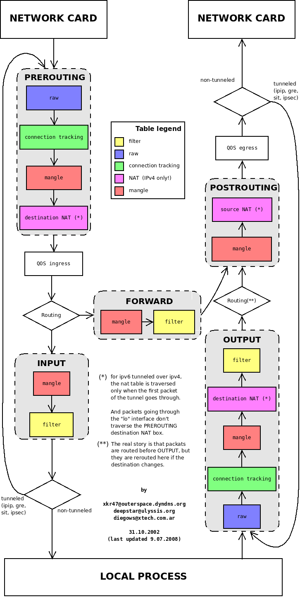
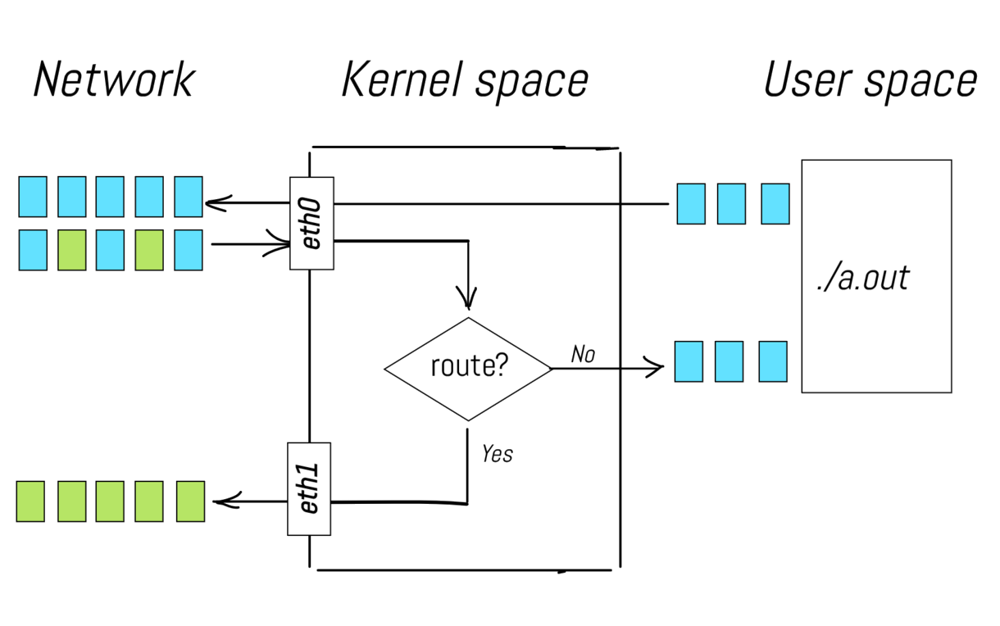
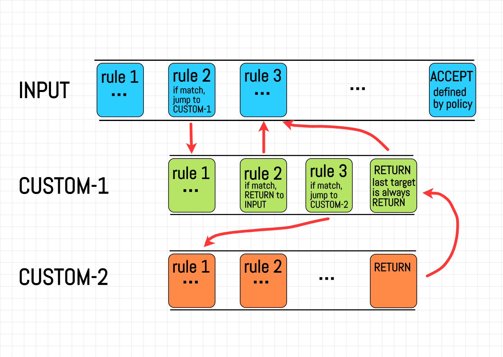
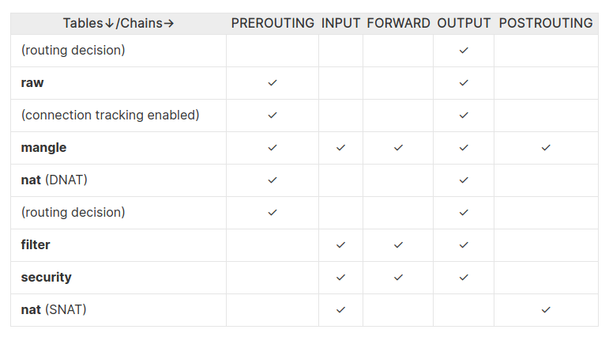
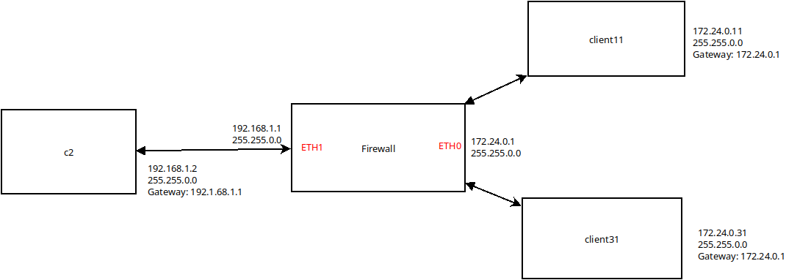

### Iptables (Legacy) vs Iptables-nft 


- https://codilime.com/how-to-drop-a-packet-in-linux-in-more-ways-than-one/ (keinlikl eoknmalı)
- https://jamielinux.com/docs/libvirt-networking-handbook/custom-nat-based-network.html

- https://serverfault.com/questions/82585/iptables-forwarding-to-a-dummy-interface
- https://serverfault.com/questions/393546/nat-via-iptables-and-virtual-interface


iptables-nft nftables api sini kullanarak xtables match a yazar. nft ise direk olarak nftables ı kullanır. iptables legacy ise bildiğiniz iptables apisini kullnarak xtables match a yazar. 

Peki neden iptables-nft xtables ı kullanmasına rağmen nftables api sini kullanır? 


Bunun sebebi kernel daki gelişmelerden faydalanmak içindir.Çünki nftables apisi daha yeteneklidir. A
örneğin


- Atomic rules updates.
- Per-network namespace locking.
- No file-based locking (for example: /run/xtables.lock).
- Fast updates to the incremental ruleset.

be sebeplerden dolayı iptables-nft çıkmıştır.

- https://developers.redhat.com/blog/2020/08/18/iptables-the-two-variants-and-their-relationship-with-nftables/

- https://medium.com/@iced_burn/compare-firewalld-iptables-nftables-netfilter-de08a8d21b5b
peki acaba ikisi aynı anda sistemde kuallanılabilir mi? 


- kubernetes henuz iptables-nft le uyumlu değil : https://github.com/kubernetes/kubernetes/issues/71305

eğer detafault olark iptables iptables-nft ye linklenmişse düzeltmek için iptables
```
update-alternatives --set iptables /usr/sbin/iptables-legacy
```


### IpTables nedir Nasıl Çalışır

Linux çekirdeğinin ağ paket işleme alt sistemine NetFilter denir. Netfilter için kullanılan ve konfigüre edilmesi için tüm Linux dağıtımlarıyla birlikte gelen kural tabanlı güvenlik duvarı yazılımına iptables denir. 

Iptables aslında bir firewall dur ve diğer firewall ların çalıştığı gibi çalışır. Bir firewall da 3 temel özellik bulunur.
1. routing
2. nat
3. layer 4 kuralları yazılabilmeli (en azından, yoksa yeni fireewall lar atık layer 7 de de çalışabilmektedir.)


Bu arada Iptables Layer 7'de de çalışabilir.


 

eğer gelen pakette routing yapılmadan önce  NAT kuralı varsa öncelikle o yapılır.

iptables a gelen paket eğer bizzat firewall işlemi için geldiyse YES yasan taraftan INPUT  (zinciri /chain) kanalıyla firewall tarafından işlemeye gider. Eğer arka tarafta bir örneğin bir sunucunun korunması amacıyla geldiyse ozaman FORWARD kanalına gider.




 
Bu bölüm için büyük ölçüde https://makdos.blog/iptables/ adresinden faydalanılmıştır.





Iptables ile çalışmak için root kullanıcısının sahip olduğu yüksek ayrıcalıklara sahip olmak gerekir.

Farklı protokoller için farklı servisler kullanılır.

|Protokol|Servis|
|--------|------|
|ipV4|iptables|
|ipV6|ip6tables|
|ARP|arptables|
|Ethernet Frames|ebtables|

Yüksek düzeyde bir iptables birden fazla table içerebilir. Table, birden fazla chain içerebilir. Chain default ya da kullanıcı tanımlı olabilir. Chain birden fazla kural içerebilir. Paketler için kural tanımlanır. Iptables'ın yapısal şeması aşağıdaki gibidir:

**iptables > tables > chains > rules**




Iptables 5 table'dan oluşur. Bunlar aşağıdaki gibidir.


1. Filter Table: Filter Table, iptables için default(varsayılan) table'dır. Herhani bir table tanımlamazsanız , default olarak Filter Table'ı kullanmış olursunuz. En çok kullanılan table'dır. Bir paketin amaçlanan hedefe gitme talebini izin verme ya da reddetmek için kararlar alındığı table türüdür.
Filter Table aşağıdaki 3 chain'e sahiptir.
   - INPUT chain: Local server'a gelen paketler(firewall'a gelen paketler) için kullanılır.Bu chain'deki kurallar, local bir işleme başlamadan hemen önce paketlere uygulanır.
   - OUTPUT chain : Local server'da üretilen ve çıkan paketler(firewall'den çıkan paketler) için kullanılır. Bu chain'deki kurallar, bir işlem sonucunda üretilen paketlere uygulanır.
   - FORWARD chain : Local'de başka bir NIC'e yönlendirilecek paketler için kullanılır. Bu chain'deki kurallar, mevcut host üzerinden yönlendirilen tüm paketlere uygulanır.


1. Nat Table: Network Address Translation kurallarını uygulamak yani yönlendirme kararları alırken kullanılır.
Bu tablo, paketlerin kaynak ve hedef adresleri değiştirilerek farklı Nat üzerinde host ağlarına paketleri yönlendirmeye izin verir.
Doğrudan erişilemeyen servislere erişime izin vermek için sıklıkla kullanılır.


   - PREROUTING chain (DNAT): Ağ arayüzüne yeni gelen paketlerden sorumludur.Henüz yönlendirme kararı alınmamış paketin ,local olarak yorumlanıp yorumlanmayacağı veya başka bir ağ arayüzünde bulunan başka bir makineye iletilip iletilmeyeceği bilinmeyen paketin PREROUTING chain'i geçtikten sonra yönlendirme kararı verilir.
    Bu chain'deki kurallar, ağ arayüzüne gelen paketler için geçerlidir.
   - POSTROUTING chain (SNAT): Alıcının farklı bir ağ arayüzünde bulunan (alt) bir ağa yerleştirilmesi durumunda ,makinenin bunu yapmak üzere yapılandırılması şartıyla paket bu arayüze iletilecektir.İletilen paketimiz makineden ayrılmadan hemen önce POSTROUTING chain'den geçer ve ardından ağ arayüzünden çıkar.
    Bu chain'deki kurallar, ağ arayüzünden ayrılan paketler için geçerlidir.
   - OUTPUT chain : Local'de üretilen paketler için küçük bir fark vardır. PREROUTING zincirinden geçmek yerine OUTPUT zincirinden geçer ve daha sonra POSTROUTING zincirine geçer.
    Bu chain'deki kurallar, bir işlem sonucunda üretilen paketlere uygulanır.
   - MASQUERADE : Bir SNAT türü, pakete maskeleme yapar, paketin kaynak adresi ve kaynak portu, sunucu adresiyle ve boş bir portla eşleşerek hedefe gider. Örnek olarak, ağdaki bütün istemciler aynı IP adresinden dışarı çıkar.
   - REDIRECT : (Yeniden yönlendirme) Gelen paketi direkt olarak başka bir portla ilişkilendirir/yönlendirir.


3. Mangle Table: Özel paket değişikliği için kullanılır. TTL değerlerini değiştirmek gbii çeşitli yöntemlerle paket başlıklarını değiştirebilme imkanı sağlar.TCP header'da QOS bitlerini değiştirir.
Mangle Table aşağıdaki 5 chain'e sahiptir.
   - PREROUTING chain
   - OUTPUT chain
   - FORWARD chain
   - INPUT chain
   - POSTROUTING chain
4. Raw Table: NOTRACK hedefiyle birlikte bağlantıları izlerken istinai durumların yapılandırılması için kullanılır.
Netfilter hooks'a yüksek öncelikle kaydedilir ve ip_conntrack veya diğer Ip tables'lardan önce çağrılır.
Raw Table aşağıdaki 2 chain'e sahiptir.

   - PREROUTING chain
   - OUTPUT chain


1. Security Table: Bu table, SECMARK ve CONNSECMARK hedefleri tarafından izin verilen Mandatory Access Control(MAC) ağ kuralları için kullanılır. MAC, SELinux gibi Linux güvenlik modülleri tarafından uygulanır. Filter table'dan sonra security table çağrılarak, filter table'daki  Discretionary Access Control(DAC) kuralları , MAC kurallarından önce geçerli olması için izin verilir.
SELinux Tarafından, SELinux güvenlik bağlamlarına dayalı politikalar uygulamak için kullanılır.
Securtiy Table aşağıdaki 3 chain'e sahiptir.

   - INPUT chain : Local server'a gelen paketler(firewall'a gelen paketler) için kullanılır.
   - OUTPUT chain : Local server'da üretilen ve çıkan paketler(firewall'den çıkan paketler) için kullanılır.
   - FORWARD chain : Local'de başka bir NIC'e yönlendirilecek paketler için kullanılır.


**Iptables Route İlişkisi**




#### Iptables kural oluşturma

Oluşturacağımız kuralı nerede işlemesini istiyorsak belirtmemiz gerekir.Örneğin; nat table'da yer alan prerouting chain'de şu işlemi yap gibi. Buradaki işlem target'dır. Kuralın içeriği için ise parametreler ile belirlenir. Iptables'daki chain'de ne olacağı durumunun ne olacağı ise komutlarla(command) belirlenir.

Kurallar, konusunda bilmemiz gereken durumlar şöyledir:

- Kurallar bir kriter ve hedef(target) içerir.
- Kriterler eşleşirse hedef için belirtilen kural çalışır.
- Kriterler eşleşmezse bir sonraki kurala geçer.

Standart TARGET değerleri:

- ACCEPT: Paketin iptables'tan geçmesine izin vermek için kullanılır.
- DROP: Paketin iptables'tan geçmesini engellemek ,çöpe atmak anlamında kullanılır. Sisteminize bağlanmaya çalışan herhangi bir kişi, DROP sayesinde sistemin varlığını göremez.Çünkü paketi gönderen sisteme yanıt vermeden paketi düşürür.
- QUEUE: Iptables , paketi kullanıcı alanına iletir.
- RETURN: Paket , iptables tarafından reddedilir.Iptables , TCP'den "connection reset" ya da UDP veya ICMP'den "destination host unreachable" paketlerini gönderir.

**Red Hat Enterprise Linux'ta varsayılan  olarak bulunan en popüler Target'lar aşağıdaki gibidir.

- LOG: LOG target'ı verilerek oluşturulan kuralla eşleşen tüm paketleri günlüğe kaydeder. 
- REJECT: Paketi gönderen sisteme error paketini gönderir ve paketi düşürür.

**Chain komutları:**

- -A , --append  :Belirtilen chain'deki kuralların sonuna kural eklemek için kullanılır.
- -I , --insert   :Belirtilen chain'de belirtilen id'ye göre kural eklenir. Örneğin; 5 kuralımız var. 2.sıraya kuralımızı eklemek için bu komutu kullanırız.
- -D , --delete   :Berirtilen chain'deki kuralı silmek için kullanılır.
- -L , --list   :Belirtilen chain'deki kuralları listelemek için kullanılır.
- -F , --flush   :Belirtilen chain içindeki kuralların tamamını siler.
- -N , --new-chain  :Yeni bir chain oluşturmak için kullanılır.
- -X , --delete-chain   :Belirtilen chain'i silmek için kullanılır.
- -R    (replace) :Zincirde belirtilen numarada ki alana başka kural koyar.
- -P    (policy) : Herhangi bir kurala uymayan paketlerin başına ne geleceğini belirtir.


Yukarıda en çok kullandığım komutları paylaştım. Daha fazlası için komut satırına aşağıdaki komutları yazarak ulaşabilirsiniz.
```
man iptables
```
ya da
```
iptables  -h
```

```
Seçenekler 	Açıklama
-s 	(source) Kaynak adresini belirtir.
–sport 	(source port) Kaynak portu belirtir.
-d 	(destination) Hedef adresidir.
–dport 	(destination port) Hedef portudur.
-p 	Protokolü belirtir, TCP ya da UDP gibi. ALL hepsi için kullanılır.
-i 	(interface) Ara birim belirtir, eth0 gibi.
-o 	Çıkan veya yönlendirilen kural zincirinde kullanılır. (-o eth1 gibi)
-t 	Tabloyu belirtir, nat tablosu için -t nat şeklinde kullanılır.
-m 	Kullanılacak modülü belirtir, -m limit gibi. veya sıkça kullanılan state gibi  (RELATED, ESTABLISHED Vb için)
-j 	Belirtilen kural zincirine uygulanacak seçim, -j ACCEPT gibi..
! 	Yazılan kuralı tersine çevirir. (Neredeyse bütün seçenekler ile kullanılabilir.)
–tcp-flags 	TCP flag’leri. (ACK, FIN, RST, URG, SYN, PS veya ALL.)
–syn 	SYN paketlerini kontrol etmek için kullanılır.
–state 	State (durum) modülü içindir. ESTABLISHED ve RELATED gibi. (Bağlı olan bağlantıların kayıtlarını tutar vb.)
–limit 	Saniye saniye eşleşme hızını kontrol etmek için kullanılır.
–mac-source 	Belirtilen mac adresi için işlem yapılır.
```


**Parametreler:**

- -p , --protocol   : Protokol. TCP, UDP gibi.
- -s , --source     : Kaynak. Hostname, ip adresi , network  adı vb verilmeli
- -d , --destination : Hedef. Hostname ,ip adresi, network adı  vb verilmeli
- -j , --jump         : Kuralın target'ını belirtirken kullanılır.
- -g , --goto chain : İşlemin kullanıcı tarafından belirtilen bir chain'de devam edeceğini belirtir.
- -i , --in-interface : Paketlerin alındığı arayüz ismi verilir. Örneğin:eth0
- -o , --out-interface : Bir paketin gönderildiği arayüzün ismi verilir. Örneğin; ens160

Daha fazlası için yine aynı şekilde man iptables 'tan bakabilirsiniz. 

Kullanımı:


```
iptables --table [table] [chain_komut] [chain] [kural]
```

Basit bir kural oluşturalım.
```
iptables -A INPUT -j DROP
```
Yukarıdaki kurala göre ;
Kuralın , INPUT chain'de yazılması ve işlemesi gerekiyor. Gelen bir trafik için bir işlem yapılacağını belirtiyor.
- -A diyerek INPUT chain'de yer alan kuralların sonuna bu kuralı eklemiş oluyoruz.
- -j DROP diyerek gelen paketi çöpe at, engelle ve mesaj gönderme diyoruz.
Tam anlamı ise gelen trafiği engelleyen bir kural oluşturmuş oluyoruz.

**Yukarıdaki kuralda dikkat etmeniz gereken nokta ,table'ın belirtilmemiş olması. Eğer kuralda yazmıyorsa default olarak Filter Table için geçerlidir.**

**Yukarıdaki gibi trafik engelleyen bir kural girildiğinde , aynı kuralın izin veren halini yazsanız bile öncelik olarak engellenen komutu dikkate alacaktır. Bu sebeple en son engelleme kuralını yazmanızı tavsiye ederim.**

**Son olarak yazığınız kurallardan sonra aşağıdaki komutu çalıştırmayı unutmayın.
```
service iptables save 
```

#### Ipset nedir

ipset is an extension to iptables that allows you to create firewall rules that match entire "sets" of addresses at once. Unlike normal iptables chains, which are stored and traversed linearly, IP sets are stored in indexed data structures, making lookups very efficient, even when dealing with large sets.

Supposing you want to block 10k ip addresses, with just iptables you'll have to create 10k rules, one for each ip address, while with ipset you can create a single rule for a specific set of those ip addresses. This translates in speed, less rules, less cpu processing power etc


- https://access.redhat.com/documentation/en-us/red_hat_enterprise_linux/6/html/security_guide/sect-security_guide-iptables-ipset_commands (ipset komutları)
- https://wiki.archlinux.org/index.php/Ipset 
- https://linoxide.com/linux-how-to/block-ips-country-ipset/ (güzel bir örnek)

#### Iptables kurallarını saklamak ve tekrar geri yüklemek için

```
sudo iptables-save > firewall.rules
sudo iptables-restore < firewall.rules
```

sadece **sudo iptables-save** komutunu çalıştırsaydık ekrana tüm kuralları basardı.


#### Iptables daki tüm kuralları silmek için kullanılır.
```
iptables -F
iptables -X;
iptables -t nat -F;
iptables -t nat -X;
iptables -t mangle -F;
iptables -t mangle -X;
iptables -P INPUT ACCEPT;
iptables -P FORWARD ACCEPT;
iptables -P OUTPUT ACCEPT;
```
#### IPTables sunucu yeniden başladıktan sonra çalışmıyor ise

IPTables sunucu yeniden başladıktan sonra çalışmıyoesa iptables koşullarını kaydet açılışta çalıştır

```
#!/usr/bin/env bash


#### iptables koşullarını kaydet ve açılışta çalıştır
apt update; apt upgrade -y; apt install -y iptables-persistent
iptables-save > /etc/iptables/rules.v4
```

### Ip tables Connaction Tracking (NEW, ESTABLISHED, RELATED, INVALID)

```
iptables -A INPUT -m state --state ESTABLISHED,RELATED -j ACCEPT 
```


burada -m (match) eşleşen modulu ifade eder.

bütün nfilter modullerinin listesi


```
ls /lib/modules/`uname -r`/kernel/net/netfilter/
ipset                       nf_flow_table.ko        nf_tables_set.ko     nft_objref.ko       xt_CLASSIFY.ko     xt_helper.ko      xt_NETMAP.ko    xt_socket.ko
ipvs                        nf_log_common.ko        nft_chain_nat.ko     nft_osf.ko          xt_cluster.ko      xt_hl.ko          xt_nfacct.ko    xt_state.ko
nf_conncount.ko             nf_log_netdev.ko        nft_compat.ko        nft_queue.ko        xt_comment.ko      xt_HL.ko          xt_NFLOG.ko     xt_statistic.ko
nf_conntrack_amanda.ko      nf_nat_amanda.ko        nft_connlimit.ko     nft_quota.ko        xt_connbytes.ko    xt_HMARK.ko       xt_NFQUEUE.ko   xt_string.ko
nf_conntrack_broadcast.ko   nf_nat_ftp.ko           nft_counter.ko       nft_redir.ko        xt_connlabel.ko    xt_IDLETIMER.ko   xt_osf.ko       xt_tcpmss.ko
nf_conntrack_ftp.ko         nf_nat_irc.ko           nft_ct.ko            nft_reject_inet.ko  xt_connlimit.ko    xt_ipcomp.ko      xt_owner.ko     xt_TCPMSS.ko
nf_conntrack_h323.ko        nf_nat.ko               nft_dup_netdev.ko    nft_reject.ko       xt_connmark.ko     xt_iprange.ko     xt_physdev.ko   xt_TCPOPTSTRIP.ko
nf_conntrack_irc.ko         nf_nat_sip.ko           nft_fib_inet.ko      nft_socket.ko       xt_CONNSECMARK.ko  xt_ipvs.ko        xt_pkttype.ko   xt_tcpudp.ko
nf_conntrack.ko             nf_nat_tftp.ko          nft_fib.ko           nft_synproxy.ko     xt_conntrack.ko    xt_l2tp.ko        xt_policy.ko    xt_TEE.ko
nf_conntrack_netbios_ns.ko  nfnetlink_acct.ko       nft_fib_netdev.ko    nft_tproxy.ko       xt_cpu.ko          xt_LED.ko         xt_quota.ko     xt_time.ko
nf_conntrack_netlink.ko     nfnetlink_cthelper.ko   nft_flow_offload.ko  nft_tunnel.ko       xt_CT.ko           xt_length.ko      xt_rateest.ko   xt_TPROXY.ko
nf_conntrack_pptp.ko        nfnetlink_cttimeout.ko  nft_fwd_netdev.ko    nft_xfrm.ko         xt_dccp.ko         xt_limit.ko       xt_RATEEST.ko   xt_TRACE.ko
nf_conntrack_sane.ko        nfnetlink.ko            nft_hash.ko          x_tables.ko         xt_devgroup.ko     xt_LOG.ko         xt_realm.ko     xt_u32.ko
nf_conntrack_sip.ko         nfnetlink_log.ko        nft_limit.ko         xt_addrtype.ko      xt_dscp.ko         xt_mac.ko         xt_recent.ko
nf_conntrack_snmp.ko        nfnetlink_osf.ko        nft_log.ko           xt_AUDIT.ko         xt_DSCP.ko         xt_mark.ko        xt_REDIRECT.ko
nf_conntrack_tftp.ko        nfnetlink_queue.ko      nft_masq.ko          xt_bpf.ko           xt_ecn.ko          xt_MASQUERADE.ko  xt_sctp.ko
nf_dup_netdev.ko            nf_synproxy_core.ko     nft_nat.ko           xt_cgroup.ko        xt_esp.ko          xt_multiport.ko   xt_SECMARK.ko
nf_flow_table_inet.ko       nf_tables.ko            nft_numgen.ko        xt_CHECKSUM.ko      xt_hashlimit.ko    xt_nat.ko         xt_set.ko

```

bütün yüklü modüller içerisinde
```
cat /proc/net/ip_tables_matches
comment
addrtype
mark
conntrack
conntrack
conntrack
recent
recent
addrtype
udplite
udp
tcp
multiport
icmp
```


State (“durum” (–state)) kullanabileceğimiz durumlar aşağıdaki gibidir:

- NEW : SYN isteği doğrultusunda NEW state alırız, yeni bir bağlantı vardır, birkaç şekilde kullanılır ama örnek verme açısından; sisteme girişte yeni bir bağlantı açılır “NEW”, gelen paket içerisinde SYN açık ACK boşsa, bu tür paketleri düşürmek saldırı durumunda avantaj olacaktır. Zira normalde “header” içi bu şekilde boş olmaz.

- ESTABLISHED : Açık olan bağlantılara ait paketler. Paketler karşılıklı gidip gelip, bilgisayarlar arası sohbet başladığı zaman, bağlantı “NEW” durumundan “ESTABLISHED” durumuna geçer.

- RELATED : An itibarıyla sistemde “ESTABLISHED” bağlantı varsa, aynı yerden aynı konu ile ilgili benzer istek geldiği zaman, durumu fark edip “hımm bunlar aynı konu üzerinde konuşuyor” diyerek bu bağlantıyı “RELATED” olarak işaretler. “RELATED” bağlantı gördüğümüzde böyle bir durum olduğunu anlarız.

- INVALID : Diğer durumlara “state” uymayan durumlardır. Genelde bu paketler düşürülür. (Hata mesajı döndüren paketler vb.)

**Diğer bir anlatım**

**Available States**

Connections tracked by the connection tracking system will be in one of the following states:

- NEW: When a packet arrives that is not associated with an existing connection, but is not invalid as a first packet, a new connection will be added to the system with this label. This happens for both connection-aware protocols like TCP and for connectionless protocols like UDP.
- ESTABLISHED: A connection is changed from NEW to ESTABLISHED when it receives a valid response in the opposite direction. For TCP connections, this means a SYN/ACK and for UDP and ICMP traffic, this means a response where source and destination of the original packet are switched.
- RELATED: Packets that are not part of an existing connection, but are associated with a connection already in the system are labeled RELATED. This could mean a helper connection, as is the case with FTP data transmission connections, or it could be ICMP responses to connection attempts by other protocols.
- INVALID: Packets can be marked INVALID if they are not associated with an existing connection and aren’t appropriate for opening a new connection, if they cannot be identified, or if they aren’t routable among other reasons.
- UNTRACKED: Packets can be marked as UNTRACKED if they’ve been targeted in a raw table chain to bypass tracking.
- SNAT: A virtual state set when the source address has been altered by NAT operations. This is used by the connection tracking system so that it knows to change the source addresses back in reply packets.
- DNAT: A virtual state set when the destination address has been altered by NAT operations. This is used by the connection tracking system so that it knows to change the destination address back when routing reply packets.

The states tracked in the connection tracking system allow administrators to craft rules that target specific points in a connection’s lifetime. This provides the functionality needed for more thorough and secure rules.


- https://www.digitalocean.com/community/tutorials/a-deep-dive-into-iptables-and-netfilter-architecture

- https://www.digitalocean.com/community/tutorials/iptables-essentials-common-firewall-rules-and-commands

This is the rule that does most of the work, and again we are adding (-A) it to the INPUT chain. Here we're using the -m switch to load a module (state). The state module is able to examine the state of a packet and determine if it is NEW, ESTABLISHED or RELATED. NEW refers to incoming packets that are new incoming connections that weren't initiated by the host system. ESTABLISHED and RELATED refers to incoming packets that are part of an already established connection or related to and already established connection. 


ESTABLISHED and RELATED are features of "stateful" packet filtering, where filtering does not just depend on a static rule set but also on the context, within which packets are considered. You need ESTABLISHED in order to allow connections to work, and you need RELATED for relevant ICMP messages. Stateful filtering allows to filter more precisely compared to static "stateless" rules.


### Devam Çalışmaları için örnek ortamın kurulması

ortamın kurulması için vagrantı yükledikten sonra alttaki kodları iptables adında bir klasöre Vagrant diye bir doya ekleyip içine yapıştırıyoruz ve klasörde __vagrant up__ komutunu terminalde çalıştırıyoruz.





vagrant versiyonu bu çalışmayı yaptığımda 2.2.13'tü. Bu versiyonda NAT vagrant da mecburiydi.


```
# -*- mode: ruby -*-
# vi: set ft=ruby :


Vagrant.configure("2") do |config|

    
config.vm.define "firewall" do |firewall|
   firewall.vm.box = "snz/ubuntu-20.04-server"
   firewall.vm.box_version = "1.0.0"
   firewall.vm.hostname="firewall.muratcabuk.com"
   
   
    firewall.vm.network "private_network", ip: "172.24.0.1"
  firewall.vm.network "private_network", ip: "192.168.1.1"
   
   
   firewall.vm.provider :virtualbox do |v|
      v.customize ["modifyvm", :id, "--memory", 1024]
      v.customize ["modifyvm", :id, "--name", "firewall"]
   end 
end
  
  
config.vm.define "clinet11" do |client11|
   client11.vm.box = "snz/ubuntu-20.04-server"
   client11.vm.box_version = "1.0.0"
   client11.vm.network :private_network, ip: "172.24.0.11"
   client11.vm.hostname="client11.muratcabuk.com"


   
   
   client11.vm.provider :virtualbox do |v|
      v.customize ["modifyvm", :id, "--memory", 1024]
      v.customize ["modifyvm", :id, "--name", "client11"]
   end
end


config.vm.define "client31" do |client31|
   client31.vm.box = "snz/ubuntu-20.04-server"
   client31.vm.box_version = "1.0.0"
   client31.vm.network :private_network, ip: "172.24.0.31"
   client31.vm.hostname="client31.muratcabuk.com"


   
   client31.vm.provider :virtualbox do |v|
      v.customize ["modifyvm", :id, "--memory", 1024]
      v.customize ["modifyvm", :id, "--name", "client31"]
   end   
end


config.vm.define "c2" do |c2|
   c2.vm.box = "snz/ubuntu-20.04-server"
   c2.vm.box_version = "1.0.0"
   c2.vm.network :private_network, ip: "192.168.1.2"
   c2.vm.hostname="c2.muratcabuk.com"


   
   
   c2.vm.provider :virtualbox do |v|
      v.customize ["modifyvm", :id, "--memory", 1024]
      v.customize ["modifyvm", :id, "--name", "c2"]
   end
end


end

```

makinaları ayağa kaldırdıktan sonra sunucularda bazı uygulamarın çalıştığını varsayıuoruz bu nedenle aşağıda belitrilen uygulamaların sunucularda çalıştığından eminolmalıyız.

- client11: ssh, web, ftp,telnet
- client31:web, ftp
- c2: ssh, web, ftp,telnet
- firewall: ssh, web, ftp,telnet

vagrant dan dolayı zaten ssh kurulu geliyor sistemimize.


telnet server ve client kurulumu

```
sudo apt-get install telnetd -y
sudo apt-get install telnet -y
```

ftp içinde en çok kullanılanlardan biri olan vsftpd kurabiliriz.

https://devanswers.co/install-ftp-server-vsftpd-ubuntu-20-04/


```
sudo apt install vsftpd -y
sudo adduser ftpuser

sudo mkdir /home/ftpuser -p

sudo chown nobody:nogroup /home/ftpuser

sudo chmod a-w /home/ftpuser


```
anonymus a kapatıp local kullanıcılara yani kendi kullanıcımıza izin veriyoruz.

config dosyasını nano ile açıp 
```

sudo mv /etc/vsftpd.conf /etc/vsftpd.conf.bak
sudo nano /etc/vsftpd.conf

# alttaki satırları yapıştırıyoruz
listen=NO
listen_ipv6=YES
anonymous_enable=NO
local_enable=YES
write_enable=YES
local_umask=022
dirmessage_enable=YES
use_localtime=YES
xferlog_enable=YES
connect_from_port_20=YES
chroot_local_user=YES
secure_chroot_dir=/var/run/vsftpd/empty
pam_service_name=vsftpd
force_dot_files=YES
pasv_min_port=40000
pasv_max_port=50000


# restart eediyoruz

sudo systemctl restart vsftpd
```
web hizmeti için de netcat kullnabiliriz. amacımız sonuçta ip tables çalışmak

```
sudo apt-get install -y netcat
```
ve netcat ile http yayın yapıyoruz

```
printf 'HTTP/1.1 200 OK\n\n%s' '<h1>Merhaba</h1>'| sudo netcat -l 80


```


### Iptables Örnek Uyulamalar

- http://blog.btrisk.com/2015/12/ubuntu-iptables-linux-iptables-firewall-1.html
- https://unix.stackexchange.com/questions/571187/ubuntu-server-virtual-network-interface-with-internet-access(soru cevap okunmalı)


#### Örnek Uygulama 1 (dummy interface üzerindeki 2 name space ile)

1. Adım: ilk uygulamamızda virtal NIC (dummy interface)  tanımlaycağız ve bunu NAT yarsımıyla dışarıya açacağız. Daha sonra bu dummy interface e bir namespace bağlayarak bu namespace altında background'da çalışacak netcat listener ile bazı portları dinliyor olacağız.   
2. Adım: Daha sonra oluşturacağımız diğer dummy interfaceler ile bu portlara istek atacağız.
3. Adım: Iptables yarımıyla bazı kurallar yazarak ilgili portlara engel koyacağız
4. Adım: Yine Iptables yardımıyla ilk oluşturduğumuz network namespace ini internete açacağız.
5. Adım: Internete açatığımız bu namespace i daha sonra bazı sitelere açacağız bazılarına kapatacağız.


#### Örnek Uygulama 2 (bridge kullanarak network namespace ler üzerinden)


resimdeki topolojiyi kurarak sitemi internete açacağız. topolojide container denen yerlerde asında networkm namespace olacak. 

uygulamayı ve veritabanını default da tüm iç dış ortamlara açacağız.

daha sonra soldaki namespace i web sunucusu ve sağdakini de postgres sunucusu kabül ederek, 

1. uygulamanın postgres sunucusuna bağlnatılarını kısıtlayacağız. 
2. postgresin interenete çıkışını kapatacağız.
3. uygulamanın public kısmını (80 portu) internete açağız. 
4. uygulamanın yönetim panelini sadece iç networkde çalışacak şekilde ayarlayacağız.


#### Örnek uygulama 3 (VM ler üzerinden VxLan ile)


resimdekiş gibi vxlan ortamı kurup iptables kuralları test edilecek.


#### Örnek Uyugulama 4 (MacVlan)


resimdeki topolojiyi kurarak sitemi internete açacağız. topolojide c1, c2 vb denen yerlerde asında network namespace olacak. Buralarda farklı uygulamalrın olduğunu düşünelim ve bunların farklı firewall kuralları ile birbirleriyle haberleşeceklerini veya haberleşemeyeceklerini düşünelim. Bu kurguya yönelik uygulamlar yapacağız.

eth0 ve eth1 adında 2 dummy NIC oluşturup bunları intenete açacağız. 

daha sonra bu NIC lere 2 adet MacVlan tanımlayarak bu uçlara namespace leri tanımlayacağız. bu

uygulamayı ve veritabanını default da tüm iç dış ortamlara açacağız.

1. uygulamanın postgres sunucusuna bağlnatılarını kısıtlayacağız. 
2. postgresin interenete çıkışını kapatacağız.
3. uygulamanın public kısmını (80 portu) internete açağız. 
4. uygulamanın yönetim panelini sadece iç networkde çalışacak şekilde ayarlayacağız.


MacVlan ve IpVlan hakkında detaylı bilgi almak için NetworkInterfacesAndDevices.md dosyaına bakınız. 


sadece şunu söyleyebiliriz. macvlan aslında bir fiziksel bir interface e birden fazla mac adresi bağlam demektir. böylece alt interface ler kendilerine ait mac adresleriyle fizikssel interface e bağlanabilirler ve böyle kendi ip adresleriyle dışarı da çıkabilirler.

 


```
sudo ip link add eth0 type dummy
sudo ip link add eth1 type dummy

sudo ip link set dev eth0 up
sudo ip link set dev eth1 up

# sudo ip link set eth0 arp on

sudo ip addr add 192.168.4.50/24 dev eth0
sudo ip addr add 192.168.5.51/24 dev eth1


```


#### Örnek Uyugulama 5 (IpVlan)


resimdeki topolojiyi kurarak sitemi internete açacağız. topolojide c1, c2 vb denen yerlerde asında network namespace olacak. Buralarda farklı uygulamalrın olduğunu düşünelim ve bunların farklı firewall kuralları ile birbirleriyle haberleşeceklerini veya haberleşemeyeceklerini düşünelim. Bu kurguya yönelik uygulamlar yapacağız.

uygulamayı ve veritabanını default da tüm iç dış ortamlara açacağız.

1. uygulamanın postgres sunucusuna bağlnatılarını kısıtlayacağız. 
2. postgresin interenete çıkışını kapatacağız.
3. uygulamanın public kısmını (80 portu) internete açağız. 
4. uygulamanın yönetim panelini sadece iç networkde çalışacak şekilde ayarlayacağız.


MacVlan ve IpVlan hakkında detaylı bilgi almak için NetworkInterfacesAndDevices.md dosyaına bakınız. 


sadece şunu söyleyebiliriz. macvlan e benzer ancak burada bütün endpointler aynı mac adresine sahiptir.


 fakat farklı ip blokları alabilirler


### Ebtables (Ethernet Bridge Tables) Örnek Uygulamalar

Iptables a göre daha alt seviyede kural yazmamızı sağlar. Örneğin sadece belli bir MAC adresinden gelenlerleri içeride 80 portuna izin ver gibi.

layer 3 ün latında kullar yazmamızı sağlar. Ebtables Layer 2 yani "Data Link" katmanına, Iptables ise layer 3 katmanına kural yazar. Yani temelde böyledir yoksa şuan özellikle firewall lar layer 7 ye kadar kural yazabilir haldedirler.


- What is ebtables?
    The ebtables project is the Linux 2.6 (and above) Link Layer firewalling subsystem, a patch for the latest 2.4 kernel is also maintained. It delivers for Linux the functionality of Ethernet frame filtering, MAC NAT (Network Address Translation), logging and brouting. The ebtables infrastructure is a part of the standard Linux 2.6 (and above) kernels. 
- Why would I use ebtables?
    To filter frames by MAC address or frame type at Link Layer inside your Linux-based Ethernet bridge, to do some basic filtering of certain protocol headers, to make a Linux brouter, to do MAC NAT, to log traffic.
    Although {ip,ip6,arp}tables can see bridged traffic, the only way to have full access to the Ethernet header is by using ebtables. Furthermore, ebtables is essential for making a brouter. 


#### Örnek Uygulama 1

1. iptables daki aynı adlı örneğe ebtables örnekleri eklenecek

#### Örnek Uygulama 2

1. iptables daki aynı adlı örneğe ebtables örnekleri eklenecek


#### Örnek Uygulama 3

1. iptables daki aynı adlı örneğe ebtables örnekleri eklenecek


#### Örnek Uyugulama 4


1. iptables daki aynı adlı örneğe ebtables örnekleri eklenecek

ebtables kısmına bakan kısımlarla alakalı uygulama yapılcak.


**Resources**
- https://ebtables.netfilter.org/misc/ebtables-faq.html

### Iptables Hardening

- sunucu hardening kursundan bakılmalı
- Rate Limiting yapılabilir
- Hit Count = ani aaynı ip den belli bir süre gelebilcek maximu istek
- Iptables Limit Burst = yani syn (yada syn flood) saldırıalrı önler. aynı i den belli bir zama aralığında belli sayının üstünde istek gelirse log toplnaır.

Normal olarak bir istemci bir sunucuya TCP bağlantısı başlatma isteğinde bulunduğunda, sunucu ve istemci bir dizi mesaj takas eder ve bu durum şöyle işler:

İstemci kendi sistem yapısı hakkındaki bilgiyi sunucuya bir SYN (synchronize) mesajı ile göndererek bir bağlantı kurmak ister.

Sunucu bu mesajı aldığını belirten ve kendi sistem yapısı hakkındaki bilgiyi istemciye bir SYN-ACK mesajı ile gönderir.

İstemci bu mesajı aldığını belirten bir ACK mesajı ile yanıt verir ve bağlantı kurulmuş olur.

Bu TCP üçlü zamanlı el sıkışma olarak adlandırılır, ve bütün TCP protokolü kullanan kurulmuş bağlantılar için temeldir.

- Boyer Moore algoritması kullanımı 

örneğin wget i curl ü engellemek yada güvenli kalamsı gereken dosyaların görüntülenmesini enlenebilir (lfi = local file inclusion açıklarına karşı korumuş olur yani)

- kötü amaçlı  paketlerin ve geçersiz kullanımların yasaklnamı
