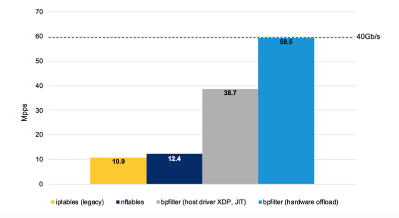
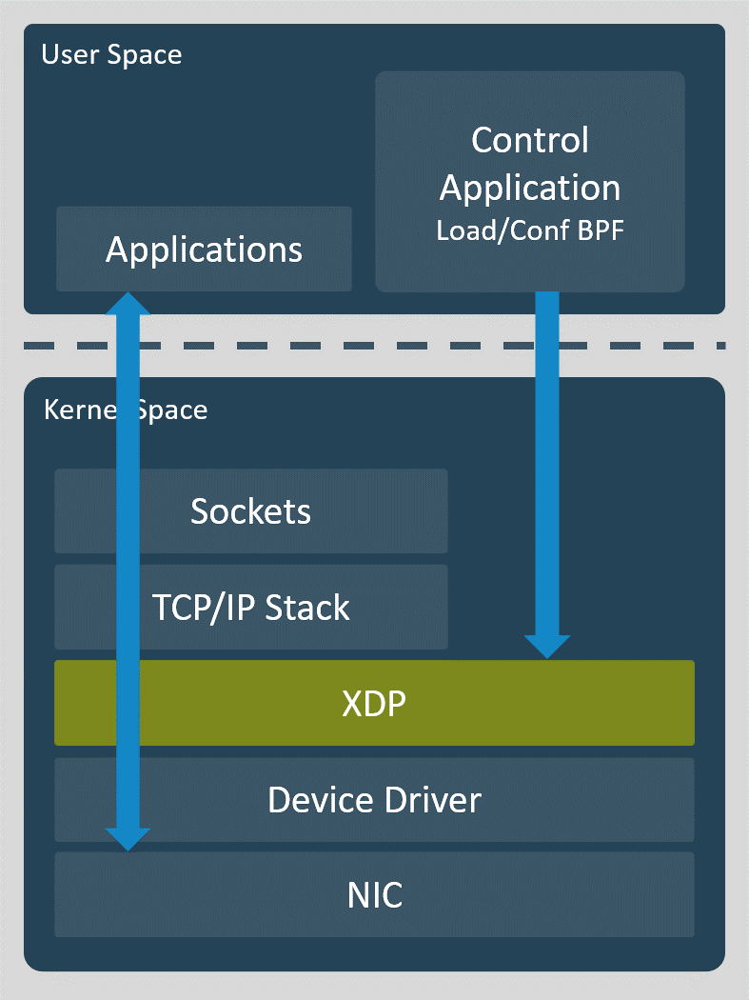

### IpTables vs Nftables

- https://codilime.com/how-to-drop-a-packet-in-linux-in-more-ways-than-one/ (keinlikl eoknmalı)

Linux çekirdeğinin ağ paket işleme alt sistemine NetFilter denir. Netfilter için kullanılan ve konfigüre edilmesi için tüm Linux dağıtımlarıyla birlikte gelen kural tabanlı güvenlik duvarı yazılımına iptables denir. 

Iptables ile çalışmak için root kullanıcısının sahip olduğu yüksek ayrıcalıklara sahip olmak gerekir.

Farklı protokoller için farklı servisler kullanılır.

|Protokol|Servis|
|--------|------|
|ipV4|iptables|
|ipV6|ip6tables|
|ARP|arptables|
|Ethernet Frames|ebtables|

Nftables ise IpTables yerine geçmesi planlanan ve Netfilter ı yazan firma tarafında n yazılmış araçtır. Araştırdığım kadarıyla nftables'ın tutulmadığını, hiç bir linux sürümünün tamamen iptables'dan vazeçmediğini yazanlar da var tam tersine iptables ın yerine geçeceğini söyleyen de. y

Biz burada öncelikle Iptables ı örnekleriyle birlikte bitirmeye çalışacağız vakit olursa nftables'ın consept ve matıksal farklılıklarına değineceğiz yani ihtiyaç duyulması durumunda hızlı adaptasyon yada hta ayıklma vb işleri de nftables da yapabilemk mümkün olsun.

### Iptables Legacy vs Iptables-nft

Anladığım kadarıyla legacy iptables dan nftables a geçişi kolaylaştıran araçlar ve anladığım kadarıyla iptables 1.8 den itibaren iptables-nft de gelmiş durumda. aslında belki en iyisi nftables ı öğrenmek ve native nft cli kullanmak ancak bu syntax a geçiş bir türlü tam anlamıyla olmayınca sektöde ve kullanılarda bu çözüm üretilmiş gibi görünüyor. 


iptables-nft nftables api sini kullanarak xtables match a yazar. nft ise direk olarak nftables ı kullanır. iptables legacy ise bildiğiniz iptables apisini kullnarak xtables match a yazar. 

Peki neden iptables-nft xtables ı kullanmasına rağmen nftables api sini kullanır? 

Bunun sebebi kernel daki gelişmelerden faydalanmak içindir.Çünki nftables apisi daha yeteneklidir. A
örneğin


- Atomic rules updates.
- Per-network namespace locking.
- No file-based locking (for example: /run/xtables.lock).
- Fast updates to the incremental ruleset.

be sebeplerden dolayı iptables-nft çıkmıştır.

- https://developers.redhat.com/blog/2020/08/18/iptables-the-two-variants-and-their-relationship-with-nftables/

- https://medium.com/@iced_burn/compare-firewalld-iptables-nftables-netfilter-de08a8d21b5b
peki acaba ikisi aynı anda sistemde kuallanılabilir mi? 


```
(1)
# iptables-nft -L INPUT
    Chain INPUT (policy ACCEPT)
    target     prot opt source               destination
(2)
# nft list ruleset
    table ip filter {
        chain INPUT {
            type filter hook input priority 0; policy accept;
        }

        chain FORWARD {
            type filter hook forward priority 0; policy accept;
        }

        chain OUTPUT {
            type filter hook output priority 0; policy accept;
        }
    }

```

burada şuna dikkaet etmek gerekiyor eğer sisteminizde kurulu ve default olarakm seçili olan iptables legacy ise bildiğimiz klasik iptables ve komutlarını kullanıyor olacağız.

```
$ sudo iptables --version
iptables v1.8.4 (legacy)
```

eğer legacy yerine iptables v1.8.4 (nf_tables) yazsaydı ozaman nftables kullanıyor olacaktık ancak iptables komutlları kullanıyor olcaktık tek farkı yukarıdaki tabloda görülceği üzere nft ekii le kullanıyor olacağız.


eğer iptables (legacy) kullanıyorsak zaten doğrudan ip tables kullandığımız için aşağıdaki komutla symblolic linkin direk iptables a yapıldığını görebiliriz
```
ls -al /usr/sbin/iptables
/usr/sbin/iptables -> /etc/alternatives/iptables

```

eğer iptables-nft (nf_tables) kullanırsak aşağıdaki şekilde sonuç alıryor olcağız.

```
ls -al /usr/sbin/iptables-nft
/usr/sbin/iptables -> xtables-nft-multi

```

**peki xtables nedir?**


aslında iptables-nft komutu xtables-nft komutunu çalıştırı yani iptables ın nft versiyonu aslında xtables-nft dir. Kullanıcının   iptables,  ip6tables, arptables, ve  ebtables kural setlerini nftables a migrate eder.


 The xtables-nft set is composed of several commands:

- iptables-nft
- iptables-nft-save
- iptables-nft-restore
- ip6tables-nft
- ip6tables-nft-save
- ip6tables-nft-restore
- arptables-nft
- ebtables-nft


eğer iptables-nft yi kullanıyorsak daha başka symbolic linkerle de vardır
,
- /sbin/iptables -> /usr/sbin/iptables-nft-multi
- /sbin/ip6tables -> /usr/sbin/ip6tables-nft-multi
- /sbin/arptables -> /usr/sbin/arptables-nft-multi
- /sbin/ebtables -> /usr/sbin/ebtables-nft-multi


son tahlilde aslında yeni Linux dstribution larında aslında artık iptables kalmadı biz iptables komutunu çalıştırdığmızda dahi aslında nftables a map adilerek çalıyor komutlarımız.


**resources**

- https://developers.redhat.com/blog/2020/08/18/
- https://lwn.net/Articles/759184/
- iptables-the-two-variants-and-their-relationship-with-nftables/
- https://www.redhat.com/en/blog/using-iptables-nft-hybrid-linux-firewall
- https://man7.org/linux/man-pages/man8/xtables-nft.8.html
- http://manpages.ubuntu.com/manpages/focal/man8/iptables-nft.8.html


### Iptables vs Firewall vs TCpwrapper

In simple words, TCPwrapper comes in between firewall and network Services.


In the OSI model, the TCPwrapper works in Application layer while iptable works mostly in Transport layer.


iptables (netfilter) is kernelspace, tcpwrappers are userspace.


1. firewall (netfilter), you use iptables command to administer the rules. firewall work at internet layer by allowing or denying access from/to a specific host which in this case using tcp/ip and tcp/udp port number e.g allowing access to port 80 on a web server. With iptables you can restrict access to any ports / protocols or service.


2. tcpwrapper is another method of allowing or denying access to a specific service which work at application layer. Futhermore, tcpwrappers is implemented in the User space of Linux and can be used only with xinetd based services and works at application layer where as IPTABLES is implemented in the Kernel space of Linux and works in internet layer which of course can be extended to other layers by using various modules. 


### Iptables, Nftables vs BPF (Berkeley Packet Filter)

Uzunca bir süre nftables (NetFilter Tables) ın aslında iptables ı yerini alacağı düşünülmesine rağmen 2018 şubat ayında yepyeni bir üçüncü araç çıktı BPF (Berkeley Packet Filter).

**eBPF aslında kernel içinde çalışan ufak bir virtual machine dir.**

- https://www.admin-magazine.com/Archive/2019/50/Bpfilter-offers-a-new-approach-to-packet-filtering-in-Linux (çok iyi anlatım)
- https://medium.com/@ugendreshwarkudupudi/bpfilter-your-next-firewall-engine-5f7dc63ebc3
- https://www.astrid-project.eu/media/ASTRID_Netdev-0x12.pdf
- https://medium.com/@ugendreshwarkudupudi/bpfilter-your-next-firewall-engine-5f7dc63ebc3
- https://jvns.ca/blog/2017/04/07/xdp-bpf-tutorial/
- https://webthesis.biblio.polito.it/9047/1/tesi.pdf


bpfilter ise aslında arkada tarafta bpf/ebpf nimetlerini, son kullanıcıya yani sistem yöneticisine kullandıran araçtır. yoksa direk olarak bpf/ebpf'in sistem yöneticileri tarafında kullanılması olası durmuyor. Daha çok sistem programcılarının veya network programcılarının kullanacağı bir araç gibi duruyor. Hatta büyük ihtimal biz iptables (iptables-nft) veya nft kullanırken de asında arka tarafta biryerlerde bpf kullanılıyor yada kullanılıyor olacak. 


resimde görülceği üzere bpf çok alt seviyelerde çalışır. son kullanıcı ise kernek space in bile üerinde yer alan userspace de çalışır.


peki bpf tam olark nedir ve iptables ve nftables dan fartı yada faydası nedir?

aslında en önemli amaç hızdır. Alttaki resimde de yapılan testlerin sonucu görülmektedir.



ebpf  ise bpf in Linux uyarlamasıdır. Bu arada bpf i biz sadece network aracı gibi görüyoruz ancak çok daha fazlasınır. aslında kullanıcı tarafında  yazılmış ufak prorgramcıkları kernel içinde çalıştırabilir. buda doğrudan kernela zarar vermeksizin kod çalıştırılmasını sağlar. tam burada BCC den bahsetmek gerekir. BCC (BPF Compiler Collection) bu ufak programcıkların yazılması ve kernl içinde çalıştırılmasını sağlayan araçtır. Bu araç (BCC) ebpf verilerini okuyarak bir çok aracın yaılmasını kolaylaştırmıştır. bpfilter da ebpf i kullanarak yeni nesil bir firewall ortaya çıkarmaktadır.



dediğimiz gibi mevzuu sadece network değil kernel üzerinde bir çok izleme veya ufak manipülasyon kodları ve araçları geliştirilebilir BCC ile. Şu github reposunu takip edebilirsiniz.

- https://github.com/iovisor/bcc

**BCC makes BPF programs easier to write, with kernel instrumentation in C (and includes a C wrapper around LLVM), and front-ends in Python and lua. It is suited for many tasks, including performance analysis and network traffic control.**

repoda birçok örnek kod var özellikle python ile yazılmış olan network, IO, TCP, CPU trace paketi görülebilir...


Buradaki araçlar gittikçe artmaktadır. 

- http://www.brendangregg.com/blog/2019-01-01/learn-ebpf-tracing.html

bpfilter da aslında bu araçlar gibi pbf nimetlerini kullanarak yazılmış network trace ve manipulation aracıdır. aslında farkında olmasakda tcpdump aracı da bpf yetenkleri kullanılrak yazılmış bir araçtır. temel amacı iptables komutlarıyla yazılmış olan kuralları ebpf e migrate eder. yani aradan iptables ı kaldırır.  

eBPF bytecode u çalışan bir sisteme attach etmenin 4  yolu vardır.

1. Using QOS action attach to: tc filter add dev eth0 ingress bpf object-file compiled_ebpf.o section simple direct-action
2. Using firewall module: iptables w/  -m bpf --bytecode (which is not of any interest to us, as the BPF would be used only for packet classification)
3. Using eXpress Data Path (xdp) - with a little help of the ip route command
4. Using the CLI tool named bpfilter (in early stage of development)


bu arada bpfilter adında bir cli henüz yok. yada varsa da henüs release değil.

python da kod yazmak için BCC paketi import edilmelidir

- https://github.com/iovisor/bcc/blob/master/docs/tutorial_bcc_python_developer.md

```
from bcc import BPF
```

öenğin BCC ve dolayısıyle ebpf kullanılarak python da io kulanan process leri listeleyen ufak bir uygulama şu linklten göreülebilir

- https://github.com/iovisor/bcc/blob/master/tools/biotop.py


şuan hali hazırda bu altyapıyı (eBPF) kullanan araçlar vard. örneğin Cilium (eBPF-based Networking, Observability, and Security). Cilium örneğin Kubernetes ortamlarında security policy lerini eBPF kullanarak uygular. Calico yada Weave diğer iki en büyük rakibi iptables kullnarak yapar aynı işi.


Cilium un neden eBPF'e geçtiğini anlattığı yazı

- https://cilium.io/blog/2018/04/17/why-is-the-kernel-community-replacing-iptables

iptables, sbpf, kubernetes cni ve network policy kavramlarını şekilleriyle birlikte anlatan çok iyi bir pdf

- https://archive.fosdem.org/2020/schedule/event/replacing_iptables_with_ebpf/attachments/slides/3622/export/events/attachments/replacing_iptables_with_ebpf/slides/3622/Cilium_FOSDEM_2020.pdf


### resources

- https://iximiuz.com/en/posts/laymans-iptables-101/
- https://wiki.debian.org/nftables
- https://wiki.nftables.org/wiki-nftables/index.php/Main_Page
- https://makdos.blog/iptables/661/iptables-nedir-iptables-nasil-kurulur/#661 (çok iyi bir seri)
- http://blog.btrisk.com/2015/12/ubuntu-iptables-linux-iptables-firewall-1.html
- http://blog.btrisk.com/2015/12/ubuntu-iptables-linux-iptables-firewall-2.html
- https://ebtables.netfilter.org/br_fw_ia/br_fw_ia.html
- https://www.karlrupp.net/en/computer/nat_tutorial
- https://access.redhat.com/documentation/en-us/red_hat_enterprise_linux/4/html/security_guide/s1-firewall-ipt-fwd