## NETWORK 
- https://www.youtube.com/playlist?list=PL966g7O8Fr34Z-PsTCM1YBzB6COiu0uZp (Temel Network)
- https://www.youtube.com/playlist?list=PLXaBFPQgxYavJseF_HAXOeNH13OuHjI7s (Temel Network - Sistem Yöneticiliği)
- https://www.youtube.com/playlist?list=PL5MqbnhzqrZQmKns4KyFfFnZlHUet9caW (Temel NEtwork)
- https://www.youtube.com/watch?v=pDn2u65rQbQ&t=1341s (Güzel anlatım 30 dk da network)
- https://www.youtube.com/watch?v=haBM0e-5UL0 (Temel Network : Bir Paketin Yolculuğu)
- https://www.youtube.com/playlist?list=PLXU1gWXx72mbez4ZKziBlud1sjhukaCqW (temel network)

## SANAL VE FİZİKSEL CİHAZLAR

### Hub
bağlı cihazlar arasında veri iletimi gerçekleştirmek için kullanılan, yönetimsel özellikleri bulunmayan ağ bağlantısı cihazlarındandır. Ağ üzerindeki iki cihaz haberleşeceği zaman, gönderici veriyi hub’ a gönderir. Hub ise alıcı gözetmeksizin veriyi ağdaki tüm cihazlara iletir, sadece alıcı cihaz veriyi alır. Veriyi ağın tamamına dağıttığı için ağın trafik yoğunluğunu yüksek, performans düşüktür.

Hub’ lar, ağın bant genişliğini bağlı cihazlara eşit dağıtır. Yani 5 cihazın bağlı olduğu ağın bant genişliği 100 mbps ise, her bir cihazın bant genişliği 20 mbps olur. Bu sebeple yüksek bant genişliği ve performans gerektiren, büyük ölçekli ağlarda hub kullanılmaz.

Hublar aktif ve pasif olmak üzere 2 sınıfa ayrılır. Aktif hub, kendisine gelen sinyali güçlendirerek iletir. Pasif hub ise gelen sinyali olduğu gibi ağdaki cihazlara iletir. Bu sebeple aktif hub, uzun mesafede kablo kayıplarını gidermek için kullanılır.

### Switch - Open vSwitch

- https://www.youtube.com/playlist?list=PLSNNzog5eydtmcbcbc1b8pVRkgre3vNUy

**open vswitch**
Open vSwitch 2009 yılında çıkmış açık kaynak kodlu(Open-source) çok katmanlı(multi-layer) sanal bir switchtir . OVS olarak da kısaltılır.

Daha iyi anlaşılması için, linux server üzerinde sanal bir switch oluşturur diyebiliriz.

- https://medium.com/devopsturkiye/open-vswitch-nedir-nas%C4%B1l-kullan%C4%B1l%C4%B1r-afe00241a56f (docker üzerinden overlay network oluşturma örneği var bakılmalı)

Desteklediği Protokoller

- Netflow
- sFlow
- SPAN
- RSPAN
- CLI
- LACP
- GRE
- VXLAN

**Netflow** Cisco tarafından geliştirilen bir switch üzerinden giden veya gelen trafiği toplayarak ağ trafiğini izleme protokolüdür. Protokol Layer 2 den sonra ki katmanları kapsar.

**Sflow** Netflow gibi switch üzerinden geçen trafiği monitoring yapmamızı sağlar . Sflow netflow gibi stateful yapısı yoktur. Trafiğin tamamını gözlemez sadece örnekleme alır . Trafiğin belli bir istatisliğini çıkarır. Örnekleme alırken rastgele paketler seçer. Örnekleme sistemini kullanması yüksek hızlı veri transferi olan sistemlerde kullanması bir problem çıkarmaz . L2, L3, L4 ve L7 katmanlarında çalışır.

**SPAN( Switched Port Analyzer) ve RSPAN( Remote Switched Port Analyzer)** bu protokoller networkü gözlemlemek için port veya vlanı kontrol etmek istediğimiz trafiği bir kopyasını bir porta veya vlana göndererek analiz etmek için kullanılır. SPAN tek cihaz üzerinde RSPAN uzaktaki cihazlarda kullanılabilmektedir.

Open vSwitch **CLI** ile network sistemimizi kontrol edebilir , yönetebiliriz .

**LACP(Link Aggregation Control Protocol)** Bu protokol sayesinde birden fazla fiziksel bağlantıyı tek bir hatmış gibi gösterir. LACP sayesinde bant genişliğimi artırabilir ve fiziksel bir yedekliliği sağlayabiliriz.

**GRE(Generic Routing Encapsulation)** Cisco tarafından geliştirilmiş 3. layer katmanda çalışan tünelleme protokolüdür.

**VXLAN** bir overlay network teknolojisidir. VXLAN geniş çaplı bulut bilişim sistemlerinde ağların ölçeklenebilirlik sorunlarına bir çözüm amacıyla tasarlanan bir ağ sanallaştırma tekniğidir. Vlan 4094(2¹²) adet ölçekleme sağlarken . VXLAN de ise 16777216(2²⁴) adet ölçeklendirme sağlar

**OVS** gördüğümüz gibi bir çok protokolü destekliyor . Bu protokoller desteklemesi özelliklerini de ortaya çıkarıyor .

Ayrıca bir daha tekrarlıyorum OVS ,**SDN(Software-Defined Network)** alt yapısında kullanılan önemli birleşenidir. Mesela Netflow protokolü SDN de networkü izlemek için kullanılıyor. SDN konusunu da ilerleyen zamanlarda anlatacağım .

- https://www.cemaltaner.com.tr/2019/12/08/spanning-tree-protokolu-nedir-nasil-yapilandirilir/
- https://bidb.itu.edu.tr/seyir-defteri/blog/2013/09/07/spanning-tree-protokol%C3%BC-(stp)
- https://www.tech-worm.com/hub-ile-switch-karsilastirmasi/
- https://medium.com/devopsturkiye/open-vswitch-nedir-nas%C4%B1l-kullan%C4%B1l%C4%B1r-afe00241a56f
- https://www.nakivo.com/blog/virtualbox-network-setting-guide/
- https://azizozbek.ch/blog/2018/01/vmware-network-adaptor-ayarlari-gorseli/

### Switch vs Hub

- https://www.youtube.com/watch?v=GCy6IPyXO_k
- https://www.youtube.com/watch?v=s45lpn5HcvU

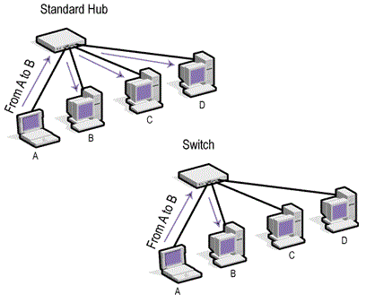

- Hub ve Switch arasında farklılıklar bulunmaktadır. Biri bütün bilgisayarlara bilgi gönderirken, diğeri sadece istenilen bilgisayarlara veri gönderip hızlıdır.
- Hub, bilgisayarları birbirine bağlayan  merkezi birleştirme cihazıdır. Aktif ve Pasif  hublar vardır. Pasif tipler bilgisayarı birbirlerini bağlar ama sinyalleri işlemezler.
- Verileri Hub kendine bağlı tüm bilgisayarlara gönderir.  Veriyi alması gereken tek bilgisayar olması halinde diğer kendine bağlı bilgisayarlara da veri yolladığı için onları da meşgul eder. Bu yüzden Hublar Switch lere göre performans olarak daha zayıftır. Port sayısı kadar bilgisayar bağlana bilir.
- Switchler ise şifreleme yöntemiyle her bir veriyi iletim kanalına ayrı bir yol bulan cihazlardır. Sadece istenilen bilgisayarlara veri gönderir. Portlarına hangi cihaz bağlı ise hepsine ayrı bir yol hazırlar . Görev olarak hub le aynıdır. fakat performans ve hız olarak hub dan  daha hızlıdır.
- Switch kendine gelen verinin hangi adrese gideceğine bakar o veriyi gönderen ve alacak olan arasında bir bağlantı kurup diğer bilgisayarların haberi olmadan ve onları meşgul etmeden iletir.

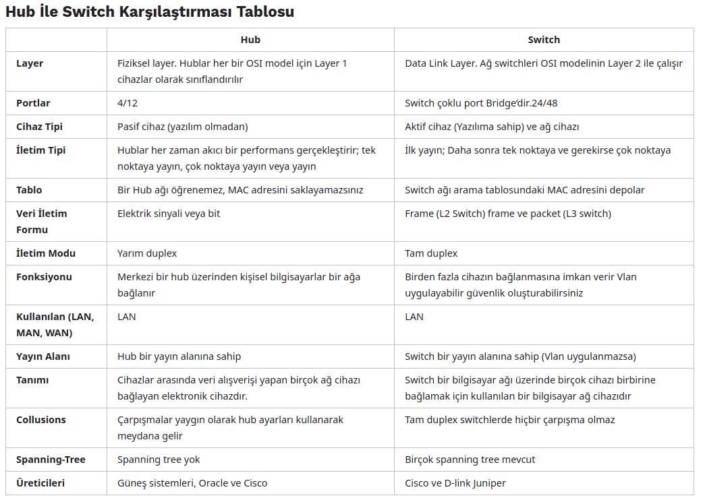

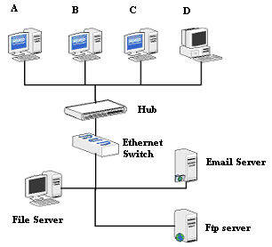

**spanning Tree**

Graph  lardaki spanning tree ile aynı şey.

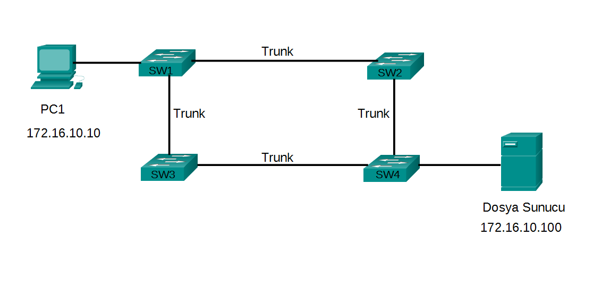

Anahtarlardan oluşan yerel ağ yapısında fiziksel artıklık, yani hostların birbirleri ile iletişim kurarken yedek yolların bulunması ağda kesintisiz bir iletişim kurulmasını sağlar. Bir bağlantıda ya da anahtarda bir arıza durumunda ağda kesinti yaşanmaz. Aşağıdaki topolojide PC1’in dosya sunucu ile iletişim kurması için yedek yollar ve anahtarlar kullanılmıştır.

**STP Protokolü**

STP protokolü aşağıdaki şekilde görüldüğü üzere yedek yollardan biri üzerindeki portu engelleyerek (blocked) loop vb. sorunların önüne geçer. Bu şekilde tek bir yol var ve yedek yol yok gibi gözükse de herhangi bir arıza anında engellenmiş port, STP protokolü tarafından iletime geçirilerek ağda kesinti yaşanması engellenmiş olur.

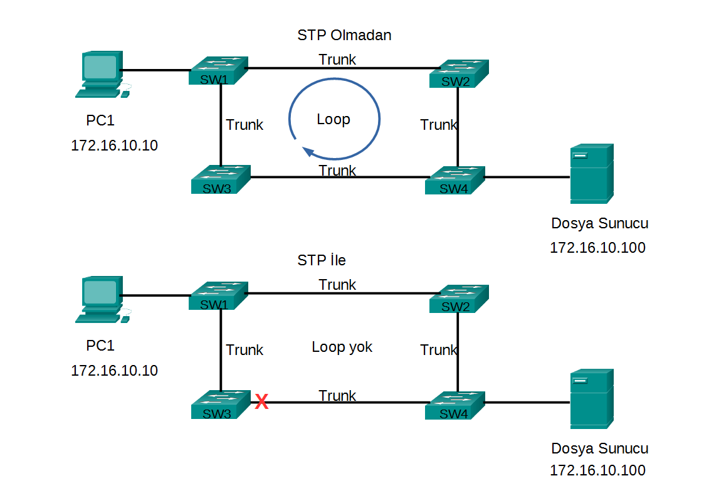

daha detaylı bilgi için: https://bidb.itu.edu.tr/seyir-defteri/blog/2013/09/07/spanning-tree-protokol%C3%BC-(stp)

- https://www.cemaltaner.com.tr/2019/12/08/spanning-tree-protokolu-nedir-nasil-yapilandirilir/
- https://bidb.itu.edu.tr/seyir-defteri/blog/2013/09/07/spanning-tree-protokol%C3%BC-(stp)
- https://www.tech-worm.com/hub-ile-switch-karsilastirmasi/
- https://medium.com/devopsturkiye/open-vswitch-nedir-nas%C4%B1l-kullan%C4%B1l%C4%B1r-afe00241a56f
- https://www.nakivo.com/blog/virtualbox-network-setting-guide/
- https://azizozbek.ch/blog/2018/01/vmware-network-adaptor-ayarlari-gorseli/

### Bridge

https://www.youtube.com/watch?v=Xmwmezk75Tk

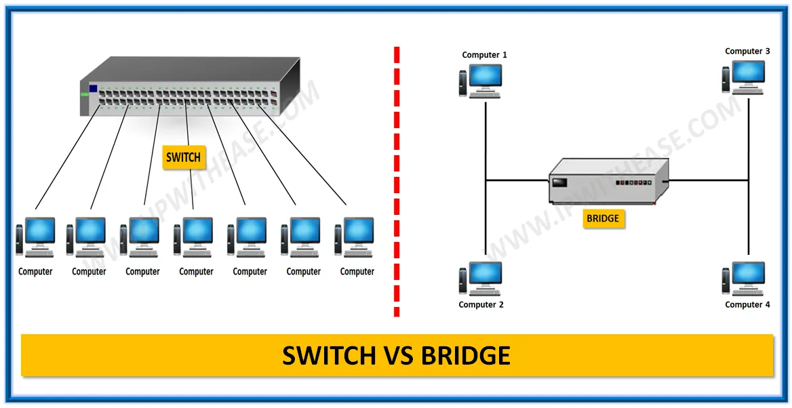

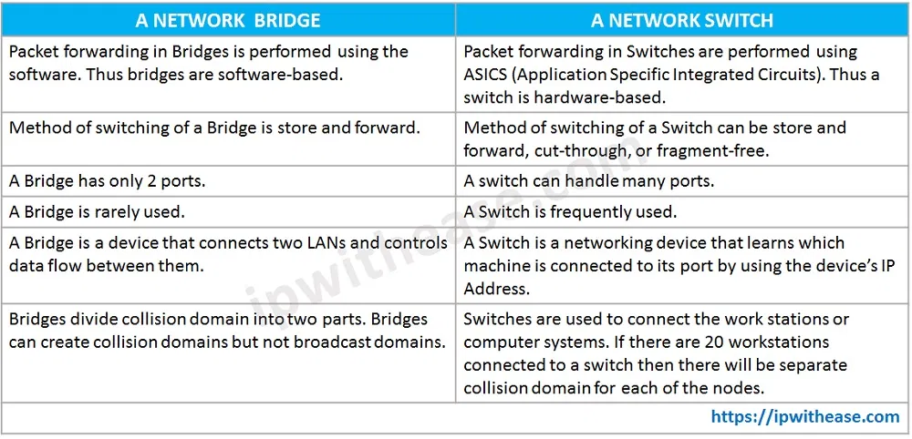

Repeater gibidir.Repeater kendisine gelen sinyali güçlendirerek diğer porttan gönderir. Bridge ise gelen elektrik sinyalinin MAC adresini kontrol ederek geçerli bölüme geçip geçmeyeceğine karar verir ve gerekli MAC adresi bölümde varsa sinyali gönderir.

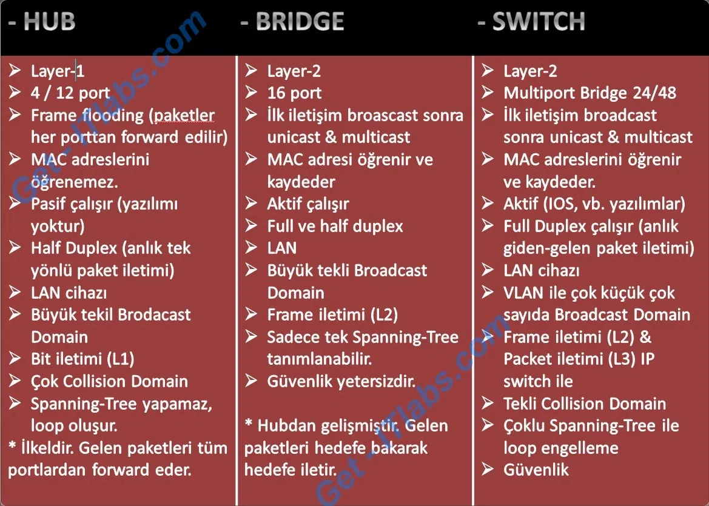

Bridge, Bir yerel ağı diğer yerel ağa bağlayan LAN cihazıdır. Birbirine bağlanan iki network’te aynı protokol ile çalışmalıdır.

MAC adresine göre trafik kısıtlaması yapabilir ve gelen paketleri MAC adreslerine göre hedefe yönlendirebilir.

Bridge, Hub’dan çok karışıktır. Layer-2’de çalışır. Hub’dan farklı olarak paketleri yönlendirmeden önce MAC addres tablosuna bakar, hedef adres tabloda yoksa paketleri yönlendirmez. Kısaca, Hub gibi broadcast çalışmaz, multicast/unicast çalışır.

- https://www.cemaltaner.com.tr/2019/12/08/spanning-tree-protokolu-nedir-nasil-yapilandirilir/
- https://bidb.itu.edu.tr/seyir-defteri/blog/2013/09/07/spanning-tree-protokol%C3%BC-(stp)
- https://www.tech-worm.com/hub-ile-switch-karsilastirmasi/
- https://medium.com/devopsturkiye/open-vswitch-nedir-nas%C4%B1l-kullan%C4%B1l%C4%B1r-afe00241a56f
- https://www.nakivo.com/blog/virtualbox-network-setting-guide/
- https://azizozbek.ch/blog/2018/01/vmware-network-adaptor-ayarlari-gorseli/

### Router, Router Table, BGP

- https://www.youtube.com/watch?v=BqycNMntf5c&list=PLXaBFPQgxYavJseF_HAXOeNH13OuHjI7s&index=18 (Routing Temelleri)
- https://www.youtube.com/watch?v=SBY_Q4h2KCA&list=PLXaBFPQgxYavJseF_HAXOeNH13OuHjI7s&index=19 (statik Routing)
- https://www.youtube.com/watch?v=rXOqO62iSbM&list=PLXaBFPQgxYavJseF_HAXOeNH13OuHjI7s&index=32 (dinamik routing)
- https://www.youtube.com/watch?v=N9agdL72RaE&list=PLXaBFPQgxYavJseF_HAXOeNH13OuHjI7s&index=41 (Dimnaimk BGP)
- https://www.youtube.com/watch?v=pJnqQqPJMVM&list=PLXaBFPQgxYavJseF_HAXOeNH13OuHjI7s&index=42 (BGP tracer uygulaması)
- https://www.youtube.com/playlist?list=PLSNNzog5eydtmcbcbc1b8pVRkgre3vNUy (Switching and Routing hakkında video serisi)

**BGP (Border Gateway Protocol - Sınır Geçit Protokolü)**

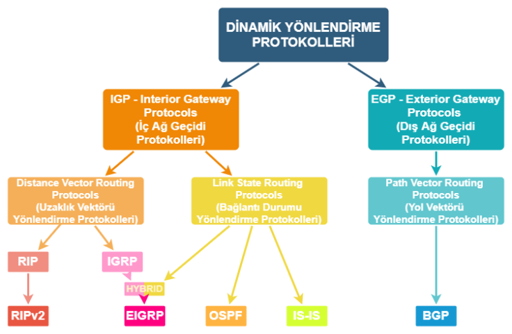

iç network protokolleri IGP (interior gateway protocol) olarka adlnadırılır. Dış network protokollerine de EGP (exterior gateway protocol) adı verilir. 

örneğin süperonline networkünden turk telekom networküne  giderken EGP kullanılır. BGP de EGP leriden biridir. Path Vector Routing protokkolerinden biridit BGP de. komsuşukları kullanrak ilgili networke ulaşılır.

BGP nin iç network olanına IBGP dış olanına EBGP de denir. 

BGP DATABASESBGP 3 database tutar . Neighbor Database, BGP Database, Routing Table. 

farklı komşuluklar kurularak network te bir kopma olması durumunda diğer komşu yollardan hedefe ulaşmaya çalışışır. Aslında tüm internet böyle çalışmaktadır.

BGP için piyasada en fazla BIRD ve FRRouting kullanılıyor. Calico altyapısında bird kullanıyor. ancak cloud foundation frrouting i detekliyor. aslında FRRounting, BIRD e göre daha gelişmiş bir araç.

https://docs.projectcalico.org/reference/architecture/overview

### Repeater

### Hub vs Switch vs Router
- https://www.youtube.com/watch?v=s45lpn5HcvU

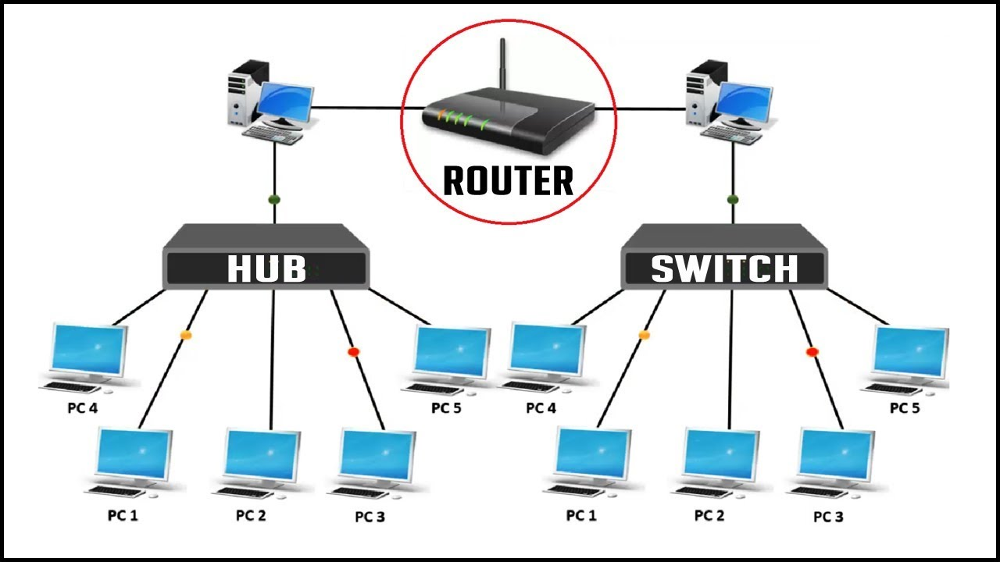

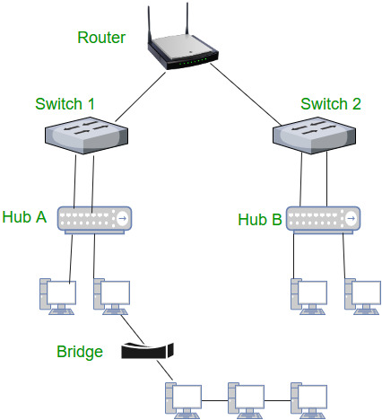

## VIRTUAL INTERFACE LISTESI

- Bridge
- Bonded interface
- Team device
- VLAN (Virtual LAN) 
- VXLAN (Virtual eXtensible Local Area Network)
- MACVLAN
- IPVLAN
- MACVTAP/IPVTAP
- MACsec (Media Access Control Security)
- VETH (Virtual Ethernet)
- VCAN (Virtual CAN)
- VXCAN (Virtual CAN tunnel)
- IPOIB (IP-over-InfiniBand)
- NLMON (NetLink MONitor)
- Dummy interface
- IFB (Intermediate Functional Block)
- netdevsim

**kaynaklar**
- https://developers.redhat.com/blog/2018/10/22/introduction-to-linux-interfaces-for-virtual-networking/
- https://man7.org/linux/man-pages/man8/ip-link.8.html
- https://man7.org/linux/man-pages/man8/ip.8.html

