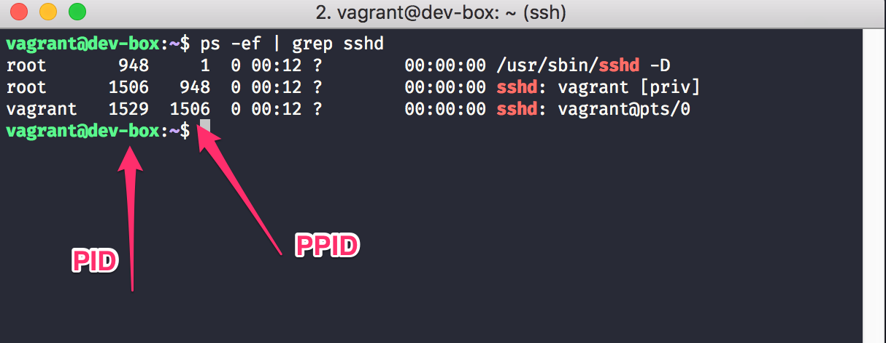
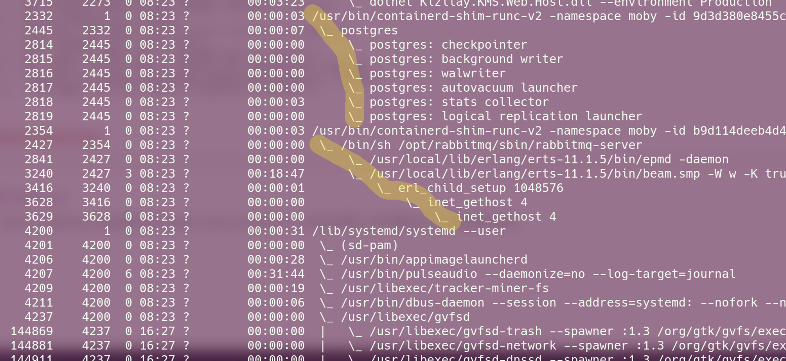

### PS komutu

- A : Sistemdeki bütün süreçleri listeler.
- a : Belirli bir terminal kontrölündeki o an çalışan süreçleri listeler
- r : Sadece çalışmakta olan süreçleri listeler.
- x : Bir terminal kontrolünde olmayan süreçleri listeler.
- u : Süreç sahiplerini listeler.
- f : Süreçler arasındaki parent-child ilişkilerini gösterir.
- l : Uzun formatlı bir liste üretir.
- w : Bir sürecin komut satırı parametrelerini gösterir.
- C : Bir süreç ile birlikte o sürecin alt süreçlerini listeler.
- T  : Komutun girildiği terminalde başlatılan süreçleri listeler.
- p  : PID değeri girilen sürecin bilgilerini gösterir.

https://snipcademy.com/linux-command-line-processes

forest parametresi kullanımı

ps -ef --forest 

### Resources

- https://medium.com/@gokhansengun/linux-prosesleri-nas%C4%B1l-y%C3%B6netir-9b1536dc06f7
- http://www.yemreugur.com/linux-islem-yonetimi-process-yonetimi-p=6521
- https://hakanbayir.github.io/tr/2017/08/07/linux-surec-yonetimi.html
- https://www.hostinger.web.tr/rehberler/linuxta-komut-satiri-ile-islemler-nasil-yonetilir
- https://medium.com/@gokhansengun/linuxta-sinyaller-hangi-i%C5%9Flere-yarar-534a6ff6c581
- https://furkanonder.github.io/Linux-ve-Sinyaller
- https://yazilimcorbasi.blogspot.com/2012/04/linux-sinyalleri.html
- https://demirten.gitbooks.io/linux-sistem-programlama/content/signals/handling.html
- https://www.bogotobogo.com/Linux/linux_process_and_signals.php
