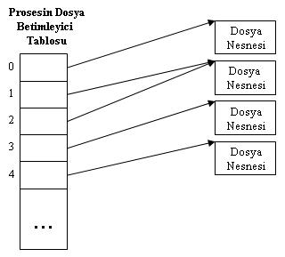
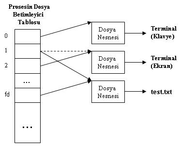
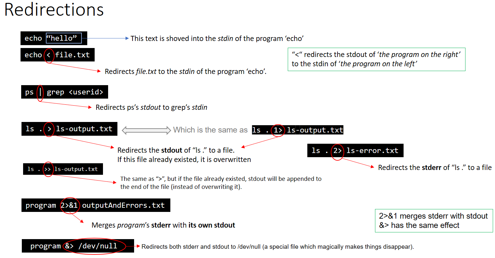

### File descriptor 


Unix tabanlı sistemlerde genel olarak, bir şey okunabiliyor veya yazılabiliyorsa, dosya arayüzü üzerinden de kullanılabilir. Örnek olarak ağ iletişiminde kullanılan soketler, seri port, dizinler, pipe, timer, sinyal vb. pek çok bileşen üzerinde dosya arayüzü ile işlem yapmak mümkündür.

Dosya arayüzünü açmak için öncelikle ilgili dosyayı açmak ve dosya betimleyiciyi file descriptor elde etmek gereklidir.

File descriptor elde etme yolları kullanılan sisteme göre değişir. Örneğin standart bir dosya için open() sistem çağrısı kullanılırken soket açmak istiyorsak socket(), timer oluşturmak istiyorsak timerfd_create() gibi ilgili sisteme özgü özel bir sistem çağrısı kullanılır.

Tüm bu çağrıların ortak özelliği, başarılı olunması durumunda geriye int tipinde bir file descriptor dönülüyor olmasıdır. File descriptor elde edildikten sonra artık bu dosya ile ilgili tüm işlemlerde, dosya kapatılana kadar ilgili int değeri kullanılıyor olacaktır.


UNIX/Linux sistemlerinde her prosesin proses tablosu yoluyla erişilen bir dosya betimleyici tablosu (file descriptor table) vardır. Dosya betimleyici tablosu bir gösterici dizisi biçimindedir. Betimleyci tablo içersindeki her gösterici açılmış bir dosyanın bilgilerinin tutulduğu ve ismine dosya nesnesi (file object) denilen bir veri yapısını gösterir. open fonksiyonundan elde edilen dosya betimleyicisi (file descriptor) prosesin dosya betimleyici tablosunda bir indeks belirtmektedir.





Örneğin bir sunucu üzerinde çalışan MySQL Veritabanı servisinin açık file descriptor'larından bir kesit aşağıda görülebilir:

```
ls -l /proc/6274/fd
```

İşletim sistemindeki proses tablosunda, her proses ile ilgili açık dosyaların listesi tutulur. Bu liste yapısı içerisinde açık dosyalarla ilgili ek bir takım bilgiler de saklanır (örneğin normal bir dosya ise inode numarası, erişim yetkileri, son erişim zamanı, geçerli file position vb.)


Çekirdek içerisinde yer alan bu proses tablosunun daha basit bir haline /proc dosya sistemi üzerinden erişmek de mümkündür. Her bir proses id (PID) için aşağıdaki bilgilerin alınması mümkündür:

/proc/PID/fd

İlgili PID için açık dosyaların int descriptor numaralarını içeren sembolink linkler bulunur. Bu sembolink linklerin bulunduğu dizine ls -l komutuyla bakılacak olursa veya uygulamanızda readlink() fonksiyonuyla sembolik linkin işaret ettiği yerle ilgili bilgileri okumaya çalıştığınızda type:\[inode\] formatında bir yanıt gelir.


Dosya sistemi üzerinde fiziksel bir inode olmadığı senaryolar için de inode sistematiği içinde kalınarak özgün bir numara verilir.


Örnek olarak açık soket bağlantıları için readlink() sonrasında socket:\[205846\] şeklinde bir yanıt döner. Burada tip olarak soket bağlantısını olduğunu görmekteyiz, inode bilgisi olarak da 205846 numarası dönülmüştür. Bu numaranın soketler için anlamlandırılması /proc/net altındaki ilgili dosyaların okunmasıyla yapılır. Eğer bu soket bağlantısı bir TCP soketine aitse, /proc/net/tcp dosyasında, UDP soketine aitse /proc/net/udp dosyasında vb. burada görülen inode numarasıyla eşleşecek şekilde kayıtlar bulunduğu görülecektir.

Eğer inode konseptiyle henüz ilişkilendirilemeyen epoll_create(), inotify_init(), signalfd() gibi bir fonksiyonla elde edilmiş file descriptor söz konusu ise bu durumda anon_inode:\<file type\> formatında bir çıktı verecektir.
/proc/PID/fdinfo


Linux 2.6.22 versiyonu ve sonrasında bu dizin yapısı üzerinden ek bilgiler elde edilmesi mümkündür. Dizin içerisinde her bir int file descriptor ile aynı isimde dosyalar bulunur. Herhangi bir dosyanın içerisinde baktığımızda aşağıdaki bilgiler elde edilir:


pos:    0
flags:  02
mnt_id: 7


Bu dosyada file pointer pozisyonu, dosya açılırken kullanılan flag'ler, dosyanın ilişkili olduğu mount point referansı yer almaktadır.
Açık Dosya Limitleri


Unix tabanlı sistemlerde, bir prosesin aynı anda açabileceği dosya sayısının bir limiti bulunmaktadır.


Bu limitler soft limit ve hard limit adında 2 başlıkta toplanır. Açık dosya limitini ulimit uygulamasıyla veya setrlimit() fonksiyonuyla artırmak mümkündür. Ancak bu değer hard limit'i aşamaz. Bu limit ancak root kullanıcısı tarafından değiştirilebilir.

```
$ ulimit -a
core file size          (blocks, -c) 0
data seg size           (kbytes, -d) unlimited
scheduling priority             (-e) 0
file size               (blocks, -f) unlimited
pending signals                 (-i) 15234
max locked memory       (kbytes, -l) 64
max memory size         (kbytes, -m) unlimited
open files                      (-n) 1024
pipe size            (512 bytes, -p) 8
POSIX message queues     (bytes, -q) 819200
real-time priority              (-r) 0
stack size              (kbytes, -s) 8192
cpu time               (seconds, -t) unlimited
max user processes              (-u) 15234
virtual memory          (kbytes, -v) unlimited
file locks                      (-x) unlimited

$ ulimit -n 2048
$ ulimit -n
2048

Aşağıdaki örnek uygulama ile parametre vererek aynı anda kaç dosya açabileceğini test edebilir, ulimit -n komutuyla limitleri değiştirip tekrar testi gerçekleştirebilirsiniz.

#include <stdio.h>
#include <unistd.h>
#include <sys/types.h>
#include <sys/stat.h>
#include <fcntl.h>
#include <stdlib.h>
#include "../common/debug.h"

int main (int argc, char *argv[])
{
    int opened = 0;
    int wanted;
    int i;

    if (argc != 2) {
        printf("Usage: %s NumberOfFiles\n", argv[0]);
        exit(1);
    }

    wanted = atoi(argv[1]);
    for (i = 0; i < wanted; i++) {
        if (open("/dev/zero", O_RDONLY) < 0) {
            errorf("Couldn't open file");
            break;
        }
        opened++;
    }
    debugf("Total of %d files opened", opened);

    return 0;
}

Proses başına ayarlanan bu limitin haricinde, sistem genelinde maksimum açık dosya sayısının da bir limiti mevcuttur. Bu değer /proc/sys/fs/file-max dosyasından veya fs.file-max parametresi ile sysctl üzerinden okunabilir ve değiştirilebilir:

$ cat /proc/sys/fs/file-max
389794
$ sudo sysctl fs.file-max=400000
fs.file-max = 400000
$ cat /proc/sys/fs/file-max 
400000
```

**Open File Descriptor Limiti**


File descriptor'ların UNIX sistemimiz üzerinde aslında çekirdek (kernel) tarafından idare edildiğini öğrendik. Yani bir program standart çıktısının nereye yazıldığını kendisi bilmiyor, ancak işletim sistemi her programın standart çıktısının (ve standart girdisinin ve standart hatasının) nereye işaret ettiğini, dolayısıyla her programın file descriptor'larının nereye karşılık geldiğini biliyor. Bu durum UNIX çekirdeğinin pek çok program için pek çok dosya işaretini aklında tutmasına sebep olur. Buradaki "aklında tutması" aslında sistemin bunu RAM'de tutması anlamına gelir. Bu yüzden sistemde file descriptor'ların bir limiti bulunur. Buna "o anda sistemin aklında tuttuğu file descriptor'lar" anlamına gelen open file descriptor limit denilir.


Daha önce komut1 | komut2 | komut3 şeklinde bir pipeline oluştururken aslında -neredeyse sonsuza kadar- bu diziyi uzatabileceğinizi söylemiştik. Buradaki "neredeyse" kısmı da bu limitten kaynaklanır. 


Sisteminiz üzerinde bu limitler farklı biçimlerde temsil edilir. İşletim sisteminizin tamamının open file descriptor limitini öğrenmek için /proc/sys/fs/file-max dosyasının içeriğine bakmanız yeterli olacaktır. 


```
$ ulimit -n
1024

```
Buradan görüleceği üzere, aslında bir program çalıştırıldığında, kendisine işletim sisteminin çekirdeği tarafından 1024 tane file descriptor oluşturma hakkı tanınır.
"Ama önceki bölümlerde programların stdin, stdout ve stderr şeklinde 3 tane file descriptor'ı olduğunu söylemiştik? Tek program neden 1024 tane file descriptor'a ihtiyaç duysun ki?"


Bir kullanıcının bütün Hardlimit'lerini görmek için aşağıdaki komut kullanılabilir:

```
$ ulimit -aH
core file size          (blocks, -c) unlimited
data seg size           (kbytes, -d) unlimited
scheduling priority             (-e) 0
file size               (blocks, -f) unlimited
pending signals                 (-i) 47455
max locked memory       (kbytes, -l) 64
max memory size         (kbytes, -m) unlimited
open files                      (-n) 1048576
pipe size            (512 bytes, -p) 8
POSIX message queues     (bytes, -q) 819200
real-time priority              (-r) 0
stack size              (kbytes, -s) unlimited
cpu time               (seconds, -t) unlimited
max user processes              (-u) 47455
virtual memory          (kbytes, -v) unlimited
file locks                      (-x) unlimited
```


```
$cat /proc/sys/fs/file-nr
736    0    386774
```

Burada yine biraz önceki sayı olan 386774'ü, yani üst limiti görüyoruz. İlk baştaki 736 ise aslında sistemin şu anda aklında tuttuğu, rezerve edilmiş (allocated) file descriptor sayısıdır. Dolayısıyla bu sistem üzerinde 386774-736=386038 tane daha file desciptor açabiliriz. Ortadaki 0 sayısı ise, sistem tarafından rezerve edilmiş (allocated) ancak kullanılmayan file descriptor'ların sayısını gösteriyor. Yani bu örnekte sistem "rezerve ettiği" bütün file descriptorları (736 tane) kullanmış.


İşletim sistemi çekirdeği, file descriptor'ları olduğu gibi açıp kapatmaz, daha ziyade bir geri-dönüşüm (recycle) mekanizması kullanır. Örneğin bir program bir file descriptor açıp sonra kapattıysa, sistem onu hala rezerve edip kullanmayabilir, daha sonra tekrar talep edildiğinde bu rezerve olan file descriptor'ı kullanır. Ortadaki 0 sayısı aslında buna karşılık gelmektedir. Eskiden, Linux çekirdeğinin 2.4 versiyonunda ortadaki sayı "rezerve edilen file descriptor'ların kaçının kullanıldığını" gösteriyordu, ancak çekirdeğin 2.6 versiyona gelmesinden sonra bu sayı, "rezerve edilen file descriptor'lardan kullanılmayanları" göstermeye başladı. Bu açıdan, üzerinde çalıştığınız sistemin Linux çekirdek versiyonu eski ise ters sonuç görebileceğinizi göz önünde bulundurmakta fayda var.


**çalışan bir process e ayrılan file descriptor laeri gormk için

```
ls /proc/18622/fd/
```


Bu bölüm boyunca, programların üç tane file descriptor'ından bahsettik. Standart girdi, standart çıktı, standart hata. Aslında Dennis Ritchie standart hata'yı UNIX'in 6. versiyonu üzerinde tanımladığında tam olarak şunu yaptı: bir program çalışmaya başladığında, programın ön tanımlı 3 tane file descriptor'ı olsun. Bu yüzden bunlara standart diyoruz aslında. Çünkü programlar -neredeyse- her zaman bu üç tip file descriptor'a ihtiyaç duyuyorlar. Ancak bir programın 3'ten fazla file descriptor'ı olabilir.


örneğin c de bir program yazdık ve program için de bir dosyaya veriler yazılıyor olsun bu durumda 0,1,2 dışında 3. bir file decritor oluşturulur.

eğer bu 3 nolu descriptor u yeni bir doyaya yönlendirirsek. deneme3 uygulamamızzın adı bu arada.

```
./deneme3 3>yeni.txt
```

bunu bu şekilde yaparsak 4. bir file descriptor açılır. 

uygulama kodumuzda şunun gibi bir bölüm var. FP yaz.txt adında bir dosya.

```

 FILE *fp;
    fp = fopen("yaz.txt", "w");

    int i;

    for (i=0;i<10;i++) {
        printf("Test\n");
        fprintf(fp, "Dosyaya yazdırma\n");
        sleep(1);
    }
    fclose(fp);
    return 0;

```

yönlendirmeden sonra çıktıya bakacak olursak. Bu durumda kodumuzun 3. çıktısını yeni.txt'ye yönlendiriyoruz. Hemen sistemde açık file descriptor'larına bakalım.

```
$ ls -l /proc/23705/fd
total 0
lrwx------ 1 eaydin eaydin 64 Mar 22 15:59 0 -> /dev/pts/2
lrwx------ 1 eaydin eaydin 64 Mar 22 15:59 1 -> /dev/pts/2
lrwx------ 1 eaydin eaydin 64 Mar 22 15:59 2 -> /dev/pts/2
l-wx------ 1 eaydin eaydin 64 Mar 22 15:59 3 -> /home/eaydin/devel/sleep-test/yeni.txt
l-wx------ 1 eaydin eaydin 64 Mar 22 15:59 4 -> /home/eaydin/devel/sleep-test/yaz.txt
```


sonuç istediğimiz gibi değil.Sistem 3. file descriptor'ı terminalde belirttiğimiz gibi yeni.txt dosyasına yönlendirdi, program içerisinde açtığımız yaz.txt ise kendine yeni bir numara edinerek 4. file descriptor oldu.


İşletim sisteminin çekirdeği şu şekilde davranıyor: "Bu program ile ilgili bir dosya işlemi talep edildiğinde, eğer bana file descriptor adresi (numarası) verilmemişse, ben sıradan uygun ilk rakamı tahsis edeyim."


Öyleyse kodumuz içerisinde özellikle yaz.txt yolunu belirtmek yerine, file descriptor'a yazmasını belirtebilirdik.

```
    int i;

    for (i=0;i<10;i++) {
        printf("Test\n");
        write(3, "Dosyaya yazdırma\n", 18);
        sleep(1);
    }
    return 0;
```

Programı derleyip çalıştırdığımızda, standart çıktıya sadece Test yazdığını görüyoruz.

```
$ ./deneme4 3>yeni.txt
Test
Test
Test
Test
Test
Test
Test
Test
Test
Test

```
Öte yandan, 3. file descriptor'ını yeni.txt'ye yönlendirmiştik. Kodun içerisinde hiçbir yerde dosya ismi belirtmedik, ancak kodda 3. file descriptor'a bir yazma işlemi söz konusu. PID'den açık file descriptor'lara bakalım.


```
 $ ls -l /proc/24419/fd
total 0
lrwx------ 1 eaydin eaydin 64 Mar 22 16:18 0 -> /dev/pts/2
lrwx------ 1 eaydin eaydin 64 Mar 22 16:18 1 -> /dev/pts/2
lrwx------ 1 eaydin eaydin 64 Mar 22 16:18 2 -> /dev/pts/2
l-wx------ 1 eaydin eaydin 64 Mar 22 16:18 3 -> /home/eaydin/devel/sleep-test/yeni.txt

```
Öyleyse yeni.txt içerisinde beklediğimiz satılar olmalı.


```

$ cat yeni.txt 
Dosyaya yazdırma
Dosyaya yazdırma
Dosyaya yazdırma
Dosyaya yazdırma
```
Bu durumda açık file descriptor'lara bakacak olursak:

```
$ ls -l /proc/24890/fd
total 0
lrwx------ 1 eaydin eaydin 64 Mar 22 16:29 0 -> /dev/pts/2
lrwx------ 1 eaydin eaydin 64 Mar 22 16:29 1 -> /dev/pts/2
lrwx------ 1 eaydin eaydin 64 Mar 22 16:29 2 -> /dev/pts/2

```


Çünkü ne programın içinde, ne de programı çalıştırırken 3. file descriptor'ın nereye işaret edeceğini söylemedik.


Her ne kadar ilk üç file descriptor standart olarak belirlenmiş olsa da, programın kodlarında ilgili descriptor'ları kapatıp yeniden bir dosya açtığımızda işletim sistemi çekirdeğinin bu descriptor'ları kullandığını gözlemek mümkün. Yani 1 numaralı file descriptor'ı C kodundan kapatırsak, sonra C kodu içerisinde yeni bir dosyaya erişim sağlayacak olursak, işletim sistemi ilk uygun boş sayı 1 olacağı için bu değeri kullanacaktır.


**Alternatif File Descriptor'ın Pipeline'da Kullanımı**

Programları birbirlerine pipeline ile bağlarken, eğer bir programın alternatif file descriptorlarından birini kullanmak istiyorsak biraz dolambaçlı bir yol izlemek gerekecektir. Örneğin biraz önceki deneme4 programımızın 3. file descriptor çıktısını grep'e göndermek istiyorsak, ve sadece 3. file descriptor'ı ile ilgileniyorsak, programın 1. descriptor'ı ile 3. descriptor'ını yer değiştirebiliriz. Böylece programın sanki standart çıktısından bu bilgiler çıkıyormuş gibi davranır, pipe ise bunu olduğu gibi diğer programa taşır.

```
$ ./deneme4 3>&1 | grep Dos
Dosyaya yazdırma
Dosyaya yazdırma
Dosyaya yazdırma
^C
```
Ancak bu örnekte standart çıktıya yazılan Test satırlarını kaybettik. Eğer hem 3. hem de 1. descriptor'ın sonuçlarıyla ilgileniyorsak, process substitution tekniğini kullanabiliriz.


```
$ ./deneme4 3> >(grep Dos)
Test
Dosyaya yazdırma
Test
Dosyaya yazdırma
Test
Dosyaya yazdırma
^C

```

Burada dikkat edilmesi gereken nokta, standart çıktının verilerini grep programına yollamadık, dolayısıyla ekranda gördüğümüz Test satırları grep'in işlemlerinden geçmedi, sadece Dosyaya yazdırma satırları buradan geçti.


Eğer birden fazla file descriptor'ın birden fazla programa çeşitli yollarda gönderilmesini istiyorsak, en pratik çözüm ilerleyen bölümlerde göreceğimiz named pipe kullanımı olacaktır.


### stdin, stdout and stderr

- stdin veya 0 - klavyeye bağlı, çoğu program bu dosyadan girişi okur.
- stdout veya 1 - ekrana eklenir ve tüm programlar sonuçlarını bu dosyaya gönderir ve
- stderr veya 2 - programlar ekrana da eklenmiş olan bu dosyaya durum / hata mesajları gönderir.


**Standart Output stdout**

yazdığımız komut ile ilgili çıktının nereye gideceği ile ilgili bir bilgi  verilmediyse standart output ekrandır. ama bazen standart output bir dosyaya da yönlendirilebilir. bu durumda > işaret ile doya adı belirtilerek output bilinen text dosyasına da yönlendirilebilir.


```
ls > ls_cikti
```

tabi üstteki kullanım aslında kolya kullanım

file descriptio ile yapmak istesek

```
ls 1> ls_cikti2

```


**Standart Input stdin**

özellikle belirtilmediyse standart girdi klavyedir. ancak burada da < işareti ile örneğin bir text dosyasından veri alınabilir. 

```
cat < ls_cikti
```

<< işareti yoktur çünki input da üzerine yazma gibi bir durum yoktur.

**Standart Error stderr**

Aslında UNIX üzerinde programların üç temel veri akış biçimi vardır. Standart girdi, standart çıktı ve standart hata. İngilizceleri Standard Input, Standard Output ve Standard Error olarak geçer. Bu yüzden bazen kısaltmalarını stdin, stdout, stderr olarak görebilirsiniz.

```
$ cat karakterler paragraf > deneme
cat: paragraf: No such file or directory

$ cat deneme

AbCdE
```
paragraf dosyası olmadığı için sistem hata verdi ancak yinede karakterler dosyası içindekileri deneme doyasına aktardı. paragraf da olsayıd onu da aktaracaktı.

ancak yüzlerde dosyı bu şekilde işleyen bir shell scriptimiz olsaydı bunu akranda ayıklamak zor olacaktı. 

aşağıdaki komut da birleştirme işlemi deneme dosyasında yapılırken hatalar hatalar adlı dosyaya yönlendirimiştir. deneme nin statndart hatalarını hatalar dosyasına yönlendir.

```
$ cat karakterler paragraf > deneme 2> hatalar
$ cat deneme 
AbCdE
$ cat hatalar
cat: paragraf: No such file or directory

```
aşağıdaki iki kullanımda yukarıdaki sonucu verecektir ancak genellikle 1-2 sıraı korunur.

```
$ cat karakterler paragraf 2> hatalar > deneme
$ cat karakterler paragraf 2> hatalar 1> deneme
```

**standart hatanın standaat çıktıya yönlendirilmesi**

&1 denmesinin sebebi standat text dosyası olmadığıonı file descriptor olduğununu belirtmek için.

```
cat karakterler paragraf > sonuc 2>&1
```

Yani, bir file descriptor, aslında C programlama dilinde standart kütüphanenin kullandığı file pointer'lar ile aynı işi yapıyor. C'de adres gösterimi & işaret ile yapılmakta. Bunu, daha önce 1 olarak tanımlanmış bir değerin adresi olarak düşünebilirsiniz. Yukarıdaki bash satırında da, cat programının standart çıktısı için sonuc tanımlandı. Dolayısıyla 1 (stdout) değeri için bir adres belirtmiş olduk. Daha sonra 2 (stderr) değeri için adres belirtirken de "daha önce 1 için tanımladığım adresi kullan" demiş oluyoruz. Burada adres sözcüğüne karşılık gelmesi için de, C'deki pointer'ların adres gösterim gibi & işareti kullanılmaktadır.


Burada & işaretini, bir programı arka planda çalıştırmak için sonuna koyduğumuzdaki kullanımıyla karıştırmamakta fayda var. Eğer ardından 1 veya 2 geliyorsa, doğrudan file desriptor için adres görevi görmektedir

Yukarıdaki işlemi de yine tersi olarak yapabilirdik. Yani önce standart hata yönlendirmesi yapıp, daha sonra standart çıktının yönleneceği yerin, standart hatanın adresi olmasını da söyleyebilirdik.

```

$ cat karakterler paragraf 2> hatalisonuc 1>&2
$ cat hatalisonuc 
AbCdE
cat: paragraf: No such file or directory

```
Genellikle standart çıktıyı ve standart hatayı aynı yere yönlendirme işlemini /dev/null dosyası ile görebilirsiniz. İleride göreceğimiz özel dosyalardan birisi olan /dev/null, içine yazılan her şeyi silen özel bir dosyadır. Böylece, örneğin checkmate.py programımızın çalışmasını istiyorsak, ancak oluşturacağı çıktılarla hiç ilgilenmiyorsak, bütün çıktılarını /dev/null dosyasına yönlendirip, bu çıktıların sistemde tutulmamasını sağlayabiliriz.

```
ping google.com  > /dev/null/ 2>&1
```
Bu tip kullanıma, en çok zamanlanmış görevlerde rastlarız. crontab içine yazılan satırların çoğu, eğer loglanmasını istemediğimiz işlemler yapıyorsa bu şekilde yazılır.


**standart error ve output un birleştirilerek aynı dosyaya yazılması**




### Pipe |

program standart outpunun başka bir programın inputu olarak  aktarılmasını sağlar.


### dev/null/ ,  dev/zero , /dev/u(random)  


- /dev/null produces no output.
- /dev/zero produces a continuous stream of NULL (zero value) bytes.

You can see the difference by executing cat /dev/null and cat /dev/zero.

- Try cat /dev/null > file and you will find an empty file.

- Now try cat /dev/zero > file, while watching the size of the file (watch -n 1 du -h file) continuously increase. This is because reading from /dev/zero gives an endless stream of \0 (null) characters.


**dev/zero**

/dev/zero Unix benzeri işletim sistemlerinde yer alan, ASCII sıfır (0x00) karakterini üretmekle görevli bir stream dosyasıdır. Ancak ASCII sıfırın onluk tabandaki "0" rakamı ile (0x30) karıştırılmamasına dikkat edilmelidir. Sıradan kullanımlarından biri mevcut disk ve belgelerin üzerine yazmak için gereken veriyi sunmasıdır.


1000 tane ASCII sıfır içeren 'hedef' belgesini yaratmak için:

```
dd if=/dev/zero of=hedef count=1 bs=1000 
```


**dev/null**

- How to redirect the output of an application in background to /dev/null?

```
yourcommand  > /dev/null 2>&1
```
If it should run in the Background add an &
```
yourcommand > /dev/null 2>&1 &
```
> /dev/null 2>&1 means redirect stdout to /dev/null AND stderr to the place where stdout points at that time

bu komut ile ekrana şunun gibi \[1\]+ 25177 bir yazı gelcek bu 1 rakamı eğer fg %1 şeklinde çağrılırsa backgrounda çalışan 1 nolu proıcessi foreground a getirecektir.

If you want stderr to occur on console and only stdout going to /dev/null you can use:
```
yourcommand 2>&1 > /dev/null
```
In this case stderr is redirected to stdout (e.g. your console) and afterwards the original stdout is redirected to /dev/null


If the program should not terminate you can use:

```
nohup yourcommand &
```


Without any parameter all output lands in nohup.out

### nohup, disown, screen, tmux and byobu

- **nohup**

Linux ve Unix'te terminalden çalıştırılan programlar, terminal kapatılınca işletim sistemi tarafından öldürülürler. İş "&" karakteri ile arka plana atılsa bile bu durum değişmez. Kullanıcı terminali kapatsa veya logoff olsa bile bazı işlerin çalışmasını isteyebilir. Bu durumda Linux ve Unix'te nohup kullanılır. nohup tek seçenek değil. Aynı işlevi yerine getirebilen screen, tmux, byobu gibi başka uygulamalar da var.

nohup "kapanma yok" anlamına gelir. Çalışan işlemlerin SIGHUP sinyali almasını engeller. Bu şekilde, terminal oturumunu kapatsanız bile komut dosyanız çalışmaya devam edecektir.

```
nohup ./your-script.sh &
```

bu sayede standart output ve error nohup.out a yönlendirilmiş olur.


- **disown**

bu komut ise hali hazırda çalışan bişr komutu nohup dakiş gibi oturumu kapatsak dahi backgrounda çöalıştırılmasını sağlar.

şöyle bir scriptimiz olsun

```
#!/bin/bash
while true; do
sleep 5
date +"Hi, the current time is %F %T"
done
```
show-time.sh adıyla kaydeymiş olalım

```
$ chmod +x show-time.sh

$ ./show-time.sh

```

komut ekranda çalışırken ctrl+z ile çıkalım. aşağıdakiş gibi bir ekran görüyor olacağız

```
$ ./show-time.sh
Hi, the current time is 2020–11–30 22:07:03
[1]+  Stopped                 ./show-time.sh
```

bg komuyuyla backgorunda ki uygulamayı görelim

```
$ bg

$ jobs -l
[1]+ 15791 Stopped                 ./show-time.sh

```
alttaki komutla process ia arkaya alabiliriz.

```
disown -h 15791
```

**screen, tmux and byobu**
bunların hepsi terminal multiplexer (çoklayıcı) oalrak çalışırlar


### Resources
- https://demirten.gitbooks.io/linux-sistem-programlama/content/file/
- https://www.csystem.org/makaleler/unixlinux-sistemlerinde-dosya-betimleyicilerinin-anlam%C4%B1
- http://www.belgeler.org/lis/archive-tlkg-lis-3.2.html
- https://yazilimcorbasi.blogspot.com/2012/02/nohup.html
