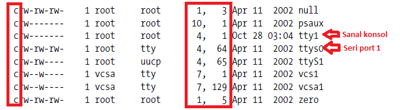
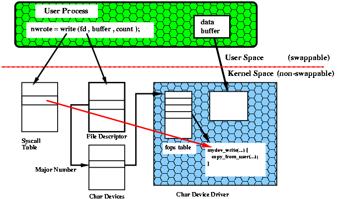
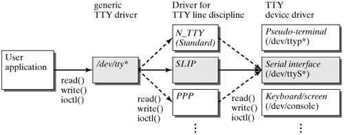

TTY konusunda kesinlikle okunması gereken yazı: http://www.linusakesson.net/programming/tty/index.php

TTY kelime açılımı TeleTypewriter yani uzaktan yazmak gibi bir anlama geliyor.

Bir çok TTY device bulunabilir. Örneğin :

- /dev/tty0 : Sanal consol gibi (virtual console.)
- /dev/pty1 : Pseudo Terminal
- /dev/pts1 : Pseudo Terminal
- /dev/ttyS0 : Seri terminal (COM1 mesela)
- /dev/ttyUSB0 : USB seri terminal

alttaki komutla liste olarak görebiliriz.

```
ls -l /dev 
```



Soldaki kırmızıyla işaretlenmiş c harfleri bu device'ın bir character device olduğunu gösterir. Sağdaki kare ise device'ların major ve minor numaralarını gösterir. Major number device'ın hangi alt sistem tarafından yönetildiğini gösteriyor. Alt sistemler tty ve audio olabilirler. Minor numara ise belirtilen alt sistemdeki hangi device driver'ın kullanılacağını belirtir.

Kernel bu numaralarda bakarak bir device'a read veya write işlemi yapılınca device driver içindeki hangi metodu çağıracağını bilir. Aşağıdaki şekil bu durumu çok güzel açıklıyor.








Ubuntuda Tty ye girmak için ctrl+Alt+(F1-F9) arası kombinasyonlardan biri girilir.  ctrl+Alt+F1 GUI nin olduğu yani X11 in çalıştığı TTY dir.

- komut satırına tty değimizde aşağıdaki gibi bir şey görüyorsak 2 nolu sanal terminale bağlantık demktir.

```
$ tty

/dev/tty2

```

komut satırına tty değimizde aşağıdaki gibi bir şey görüyorsak 3 nolu GUI terminaline bağlıyız demektir.

```
$ tty

/dev/pts/3

```

komut satırına who yada sadece w dersek kaç adet tty açık ve hangi kullanıcılar taraından kullanılıyor görebiliriz.


aşağıdaki komut çalışan bütün processleri alt process lerle (thread) birlikte terminale döker

```
$ ps fauxww

# yada filtre yapmakl için

$ ps fauxww

```

şuan benzer bi sonuç çıkacaktır.

```
root@localhost tests]# ps fauxww | grep -P [pt]t[ys] 
root      2604  2.3  0.8  50728 34576 tty1     Ss+  07:09   1:15      \_ /usr/bin/Xorg :0 -br -verbose -audit 4 -auth /var/run/gdm/auth-for-gdm-VRHaoJ/database -nolisten tcp vt1
root      2569  0.0  0.0   2008   500 tty2     Ss+  07:09   0:00 /sbin/mingetty /dev/tty2
root      2571  0.0  0.0   2008   500 tty3     Ss+  07:09   0:00 /sbin/mingetty /dev/tty3
root      2573  0.0  0.0   2008   504 tty4     Ss+  07:09   0:00 /sbin/mingetty /dev/tty4
root      2575  0.0  0.0   2008   500 tty5     Ss+  07:09   0:00 /sbin/mingetty /dev/tty5
root      2577  0.0  0.0   2008   504 tty6     Ss+  07:09   0:00 /sbin/mingetty /dev/tty6
sin       3374  0.2  0.7  90668 28564 ?        Sl   07:13   0:09 /usr/bin/python /usr/bin/terminator   <<< Added this parent of 3377 manually to see the pts source
sin       3377  0.0  0.0   2076   620 ?        S    07:13   0:00  \_ gnome-pty-helper
sin       3378  0.0  0.0   5236  1712 pts/0    Ss   07:13   0:00  \_ /bin/bash
root      4054  0.0  0.0   5124  1676 pts/0    S    07:23   0:00  |       \_ bash
root      5034  0.0  0.0   5056  1092 pts/0    R+   08:03   0:00  |           \_ ps fauxww
root      5035  0.0  0.0   4416   740 pts/0    S+   08:03   0:00  |           \_ grep -P [pt]t[ys]
sin       4154  0.0  0.0   5236  1708 pts/1    Ss   07:23   0:00  \_ /bin/bash
sin       4485  0.0  0.0   7252  3500 pts/1    S+   07:41   0:00      \_ python

```
burada Ss, Ss+ veya S+ gbi karakterlerin anlamları

PROCESS STATE CODES
Here are the different values that the s, stat and state output specifiers (header “STAT” or “S”) will display to describe the state of a process:

- D Uninterruptible sleep (usually IO)
- R Running or runnable (on run queue)
- S Interruptible sleep (waiting for an event to complete)
- T Stopped, either by a job control signal or because it is being traced.
- W paging (not valid since the 2.6.xx kernel)
- X dead (should never be seen)
- Z Defunct ("zombie") process, terminated but not reaped by its parent.

For BSD formats and when the stat keyword is used, additional characters may be displayed:

- < high-priority (not nice to other users)
- N low-priority (nice to other users)
- L has pages locked into memory (for real-time and custom IO)
- s is a session leader
- l is multi-threaded (using CLONE_THREAD, like NPTL pthreads do)
- (+) is in the foreground process group


### Resources

- https://yazilimcorbasi.blogspot.com/2012/02/devpts.html
- https://lwn.net/Kernel/LDD3/