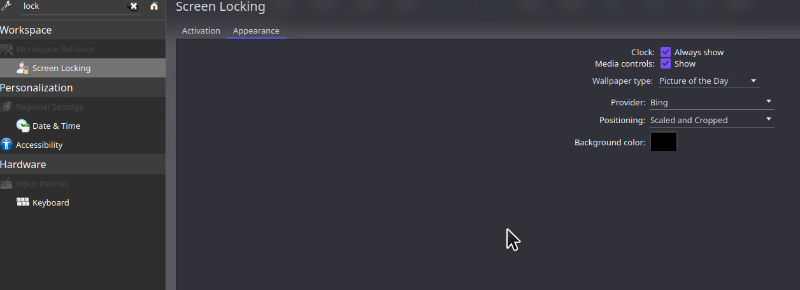

 
Picture of the day image lerini lock screen a gtirmek için "$HOME/.cache/plasmashell/plasma_engine_potd/" adresini "$HOME/.cache/kscreenlocker_greet/" adresi içine  symlink yapmamız gerekiyor.

1. bunun için "$HOME/.cache/kscreenlocker_greet/" kalsörünü create ediyoruz

```
mkdir -p $HOME/.cache/kscreenlocker_greet/
```

2. symlink oluşturuyoruz


from - to
```
ln -s "$HOME/.cache/plasmashell/plasma_engine_potd/ $HOME/.cache/kscreenlocker_greet/plasma_engine_potd/
```

3. lock scrren background resmini yarlıyoruz


