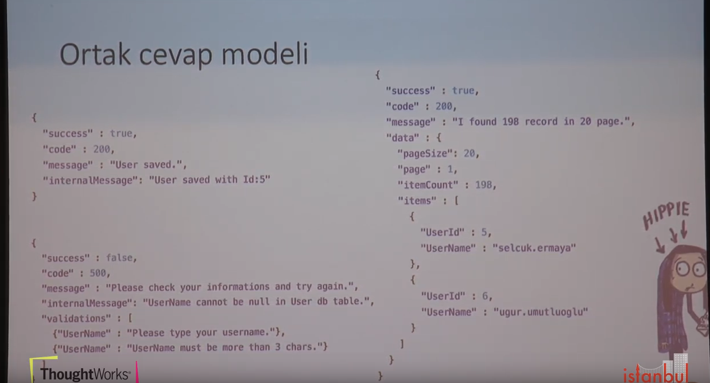

[Selçuk Ermaya - İstanbul Coders 2017 sunumundan](https://www.youtube.com/watch?v=nVhUyQqvv4s)

- Anlaşılır isimlendirme (semantic naming)
- İlişki API uçları (relational endpoint) - örneğin ziyaretçinin mesajları
- Ortak cevap modeli (Common Model)
- Ortak güvenlik katmanı (common security model)
- Önbellekleme (caching)

- Ayrıştırılmış istek ve data modeli  (seperated request / DTO model)
- Versiyonlama (Versioning)
- Basitlik (Simplicity)
- Az Bağımlılık (Less Dependence)
- Doğrulam (Validation)

#### isimlendirme

isimlendirme örnekler 

|endpoint|method|desc|
|--------|------|----|
|/users|get|tüm kullanıcıların listesi|
|/users|post|yeni kullanıcıekler|
|/users/5|put|idsi 5 olan kullanıcıyı günceller|
|/me|get|oturumu verilen kullanıcının bilgilerini getirir|
|/me/followers|get|oturumu verilen kullanıcının takipçilerini getirir|
|/me/followers/5/block|post|oturumu verilen kullanıcının 5 idli follower ını engeller|

patch ise belli alanları değişiyorsa patch kullanılır anacka post da kullanılabilir.

ayrıca /me/followers şu şekilde de yazılabilirdi /users/me/followers. İlk versiyonun aslında fiziksel bir karşılığı yok ancak semantik kullanım açısından kullanımı daha anlaşışır.burada arkada aslında yine /users/me/followers a yönlendşrmiş oluyoruz.

#### ilişkili API uçları

|endpoint|method|desc|
|--------|------|----|
|/customers/5/bills|get|id si 5 olan kullanıcının fatularını getirir|
|/users|post|id si 5 olan kullanıcıya fatura ekler|

#### ortak cevap modeli

resimdeki mesajlşardali code zaruri değil. ancak yazılırsa iyi olur. örneğin arada proxy varsa http code değüişebilir bu durumda client mesajı yanlış alabilir. 

burada örneğin mesaj için her model de aynı sisitem kullanılırsa sistemn anlaşılır olacaktır.

#### Ayrıştırılmış istek ve data modeli 

katmanlarda model entity vs faklı olmalı (DTO).

zaten SOLID ve ve güvenlik açısından da böyle olmalı.

gereksiz işlenmeyen alanları modelden kaldırmak lazım. bunlar kullanılarak saldırı yapılabilir.

#### caching

cache de header bilgisi kullanılarak client bilgilendirebilir cache in ne zaman yenileceği veya ne kadar süre tutulkduğu ile alakalaı. böylece belki client da kendi cache ini kullanabilir. vakti gelince güncel veriyi sunucudan çekebilir.

#### çoklu dil desteği 

accept language header 

UTC to local

kullanıcının bulunduğu lokasyona dikkaet edersek ve UC olark kydedersek. kullanıcıcın bulunduğu lokjasyoına göre saat gösterilebilir.

#### versiyonlama

|endpoint|version|
|--------|------|----|
|/v1/users|1.0.0|
|/v1.1.3/users|1.1.3|
|/users|latest|

