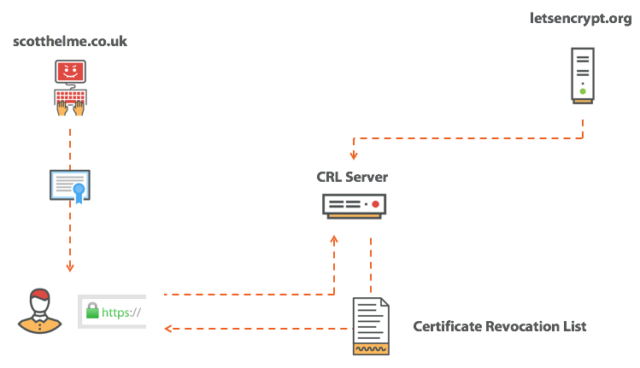
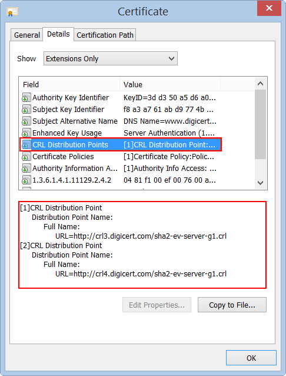
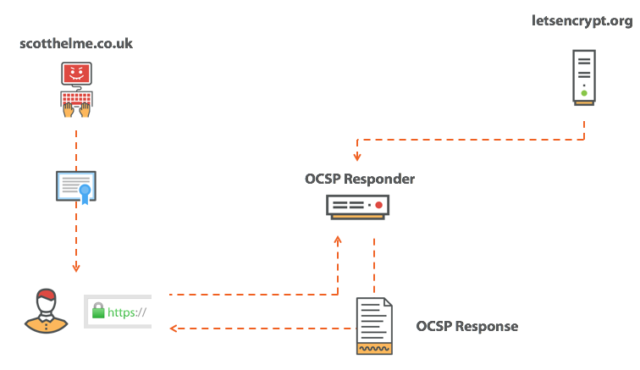
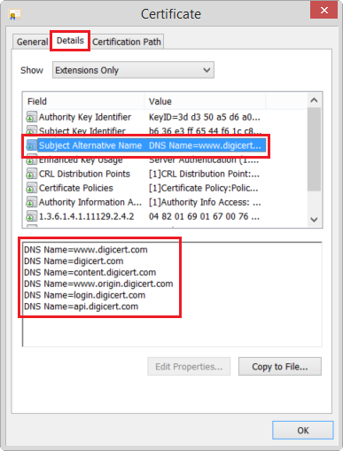

### CA Sertifikası oluşturma 

__dosya uzantıları ve anlamları__


- PEM Format (The name is from Privacy Enhanced Mail (PEM))

  - It is the most common format used for certificates 
  - Most servers (Ex: Apache) expects the certificates and private key to be in a separate files
  - Usually they are Base64 encoded ASCII files
  - Extensions used for PEM certificates are .cer, .crt, .pem, .key files
  - Apache and similar server uses PEM format certificates
 
- DER Format
 
  - The DER format is the binary form of the certificate
  - All types of certificates & private keys can be encoded in DER format
  - DER formatted certificates do not contain the "BEGIN CERTIFICATE/END CERTIFICATE" statements
  - DER formatted certificates most often use the ‘.cer’ and '.der' extensions
  - DER is typically used in Java Platforms
 

- P7B/PKCS#7 Format
 
  - The PKCS#7 or P7B format is stored in Base64 ASCII format and has a file extension of .p7b or .p7c
  - A P7B file only contains certificates and chain certificates (Intermediate CAs), not the private key
  - The most common platforms that support P7B files are Microsoft Windows and Java Tomcat
 
- PFX/P12/PKCS#12 Format (Originally defined by RSA in the Public-Key Cryptography Standards (abbreviated PKCS), the "12" variant was originally enhanced by Microsoft, and later submitted as RFC 7292. )
 
  - The PKCS#12 or PFX/P12 format is a binary format for storing the server certificate, intermediate certificates, and the private key in one encryptable file
  - These files usually have extensions such as .pfx and .p12
  - They are typically used on Windows machines to import and export certificates and private keys

__Hazır örnek__
[Tübitak PDF örnek](files/ssl_sayisal_sertifikalar.pdf)


Bu bölümde Certificate Authority sertifikası, intermediate sertifikası ve domain sertifikası oluşturacağız. alttaki kaynaklarda olan hazır bir örnek üzerinden gideceğiz. bu arada sertifika oluşturmak için bir çok araç var. openssl, cfssl,vault ve letsencryp gibi bir çok araç var. 


Ancak biz burada openssli kullanacağız.

amacımız CA tanımlamak daha sonra onun public key i ile intermadiate sertifika imzalamak ve son olarak da intermediate sertifika ile domain sertifikamızı oluşturmak olacak.


__Root CA olşturulması__

1. öncelikle root ca için bir klasör oluşturuyoruz

```
$ mkdir -p ~/SSLCA/root/
$ cd ~/SSLCA/root/
```

sertifikamız için bir private key oluşturuyoruz. eğer amacımız private key i şifreyle korumaksa -aes256 parametresini ekleyebiliriz.

```
$ openssl genrsa -aes256 -out rootca.key 2048

# example output

Generating RSA private key, 2048 bit long modulus
.........++
....................................................................................................................++
e is 65537 (0x10001)
```
daha sonra oluşturduğumuz private key le kendi sertifikamızı oluşturuyoruz.

```
$ openssl req -sha256 -new -x509 -days 1826 -key rootca.key -out rootca.crt

# örnek çıkı

You are about to be asked to enter information that will be incorporated
into your certificate request.
What you are about to enter is what is called a Distinguished Name or a DN.
There are quite a few fields but you can leave some blank
For some fields there will be a default value,
If you enter '.', the field will be left blank.
-----

# yukarıdaki uarıyla birlikte sistem bize bazı sorular soracak. mümkünse il denemede alttaki değerlerideğiştirmeden giriniz.

Country Name (2 letter code) [AU]:NL
State or Province Name (full name) [Some-State]:Zuid Holland
Locality Name (eg, city) []:Rotterdam
Organization Name (eg, company) [Internet Widgits Pty Ltd]:Sparkling Network
Organizational Unit Name (eg, section) []:Sparkling CA
Common Name (e.g. server FQDN or YOUR name) []:Sparkling Root CA
Email Address []:
```

sertifikanın seriallerini tutabilmesi için 2 adet create ediyoruz.

A Certificate Revocation List (CRL) is a list of certificates that have been revoked.

In a compromise scenario we revoke our certificate so that an attacker can't abuse it. Once a certificate is marked as "revoked," Web browsers will know not to trust it, even though the certificate is valid. The owner has requested revocation and no client should accept it.




A CRL is a really simple concept and is quite literally just a list of all certificates that a CA has marked as revoked. A client can contact the CRL Server and download a copy of the list. Armed with a copy of the list the browser can check to see if the certificate it has been provided is on that list. If the certificate is on the list, the browser now knows the certificate is bad and it shouldn't be trusted.


```
touch certindex
echo 1000 > certserial
echo 1000 > crlnumber
```
daha sonra bir config dosyası oluşturuyoruz.

- Certificate Revocation List (CRL) - A CRL is a list of revoked certificates that is downloaded from the Certificate Authority (CA).
  Certificate revocation is the act of invalidating a TLS/SSL before its scheduled expiration date. A certificate should be revoked immediately when its private key shows signs of being compromised. It should also be revoked when the domain for which it was issued is no longer operational.
- Online Certificate Status Protocol (OCSP) - OCSP is a protocol for checking revocation of a single certificate interactively using an online service called an OCSP responder.



The OCSP provides a much nicer solution to the problem and has a significant advantage over the CRL approach. With OCSP, we ask the CA for the status of a single, particular certificate. This means all the CA has to do is respond with a good/revoked answer, which is considerably smaller than a CRL. Great stuff!

- OCSP Stapling: In OCSP Stapling, it is not the browser, but the server hosting the SSL certificate that sends an OCSP request to the CA. This process is repeated regularly, keeping the result as up to date as possible. The server then connects the result to the SSL handshake, a process that is called upon each time a browser connects with the server.

ca.conf adında bir dosya oluşturarak aşağıdaki mertni ona yapıştırıyoruz.

```
nano ca.conf
```

halen root klasörü içindeyiz.

```
[ ca ]
default_ca = myca

[ crl_ext ]
issuerAltName=issuer:copy 
authorityKeyIdentifier=keyid:always

 [ myca ]
 dir = ./
 new_certs_dir = $dir
 unique_subject = no
 certificate = $dir/rootca.crt
 database = $dir/certindex
 private_key = $dir/rootca.key
 serial = $dir/certserial
 default_days = 730
 default_md = sha256
 policy = myca_policy
 x509_extensions = myca_extensions
 crlnumber = $dir/crlnumber
 default_crl_days = 730

 [ myca_policy ]
 commonName = supplied
 stateOrProvinceName = supplied
 countryName = optional
 emailAddress = optional
 organizationName = supplied
 organizationalUnitName = optional

 [ myca_extensions ]
 basicConstraints = critical,CA:TRUE
 keyUsage = critical,any
 subjectKeyIdentifier = hash
 authorityKeyIdentifier = keyid:always,issuer
 keyUsage = digitalSignature,keyEncipherment,cRLSign,keyCertSign
 extendedKeyUsage = serverAuth
 crlDistributionPoints = @crl_section
 subjectAltName  = @alt_names
 authorityInfoAccess = @ocsp_section

 [ v3_ca ]
 basicConstraints = critical,CA:TRUE,pathlen:0
 keyUsage = critical,any
 subjectKeyIdentifier = hash
 authorityKeyIdentifier = keyid:always,issuer
 keyUsage = digitalSignature,keyEncipherment,cRLSign,keyCertSign
 extendedKeyUsage = serverAuth
 crlDistributionPoints = @crl_section
 subjectAltName  = @alt_names
 authorityInfoAccess = @ocsp_section

 [alt_names]
 DNS.0 = Sparkling Intermidiate CA 1
 DNS.1 = Sparkling CA Intermidiate 1

 [crl_section]
 URI.0 = http://pki.sparklingca.com/SparklingRoot.crl
 URI.1 = http://pki.backup.com/SparklingRoot.crl

 [ocsp_section]
 caIssuers;URI.0 = http://pki.sparklingca.com/SparklingRoot.crt
 caIssuers;URI.1 = http://pki.backup.com/SparklingRoot.crt
 OCSP;URI.0 = http://pki.sparklingca.com/ocsp/
 OCSP;URI.1 = http://pki.backup.com/ocsp/

```
eğer sertifikaya bir expire date koymak istersek

```
If you need to set a specific certificate start / expiry date, add the following to [myca]

# format: YYYYMMDDHHMMSS
default_enddate = 20191222035911
default_startdate = 20181222035911
```

__Intermediate CA oluştrmak için__

Halen root klasöründeyken öncelikle intermediate sertifika için bir key oluşturuyoruz.

```
$ openssl genrsa -out intermediate1.key 2048
```

CSR (certificate signing request) oluşturuluyor bu aslında CA ya verilen encoded bir text ve bu da private key tarafından imzalanarak hazırlanıyor.

```
$ openssl req -sha256 -new -key intermediate1.key -out intermediate1.csr

# Örnek Çıktı

You are about to be asked to enter information that will be incorporated
into your certificate request.
What you are about to enter is what is called a Distinguished Name or a DN.
There are quite a few fields but you can leave some blank
For some fields there will be a default value,
If you enter '.', the field will be left blank.
-----
# buradan aşağısınuı ilk denemlerde değiştirmeden uygulayınız.

Country Name (2 letter code) [AU]:NL
State or Province Name (full name) [Some-State]:Zuid Holland
Locality Name (eg, city) []:Rotterdam
Organization Name (eg, company) [Internet Widgits Pty Ltd]:Sparkling Network
Organizational Unit Name (eg, section) []:Sparkling CA
Common Name (e.g. server FQDN or YOUR name) []:Sparkling Intermediate CA
Email Address []:

Please enter the following 'extra' attributes
to be sent with your certificate request
A challenge password []:
An optional company name []:

Make sure the subject (CN) of the intermediate is different from the root.
```


daha sonra csr i root ca ile imzalıyoruz

```
$ openssl ca -batch -config ca.conf -notext -in intermediate1.csr -out intermediate1.crt

# örnek çıktı

Using configuration from ca.conf
Check that the request matches the signature
Signature ok
The Subject's Distinguished Name is as follows
countryName           :PRINTABLE:'NL'
stateOrProvinceName   :ASN.1 12:'Zuid Holland'
localityName          :ASN.1 12:'Rotterdam'
organizationName      :ASN.1 12:'Sparkling Network'
organizationalUnitName:ASN.1 12:'Sparkling CA'
commonName            :ASN.1 12:'Sparkling Intermediate CA'
Certificate is to be certified until Mar 30 15:07:43 2017 GMT (730 days)

Write out database with 1 new entries
Data Base Updated

```

Generate the CRL (both in PEM and DER):

```
openssl ca -config ca.conf -gencrl -keyfile rootca.key -cert rootca.crt -out rootca.crl.pem
openssl crl -inform PEM -in rootca.crl.pem -outform DER -out rootca.crl
```

Certificate revocation is the act of invalidating a TLS/SSL before its scheduled expiration date. A certificate should be revoked immediately when its private key shows signs of being compromised. It should also be revoked when the domain for which it was issued is no longer operational.


Generate the CRL after every certificate you sign with the CA.

If you ever need to revoke the this intermediate cert:

```
openssl ca -config ca.conf -revoke intermediate1.crt -keyfile rootca.key -cert rootca.crt
```
buraha kadar halen root klasöründeyiz

daha sonra intermediate Ca için klasör oluşturuyoruz

```
mkdir ~/SSLCA/intermediate1/
cd ~/SSLCA/intermediate1/
```
root klasçründe oluşturduğumuz key ve crt dosyarını buraya taşıyoruz.

```
cp ~/SSLCA/root/intermediate1.key ./
cp ~/SSLCA/root/intermediate1.crt ./
```

index dosyalrımı oluşturuyoruz

```
touch certindex
echo 1000 > certserial
echo 1000 > crlnumber
```


Create a new ca.conf file:

```
# vim ca.conf
[ ca ]
default_ca = myca

[ crl_ext ]
issuerAltName=issuer:copy 
authorityKeyIdentifier=keyid:always

 [ myca ]
 dir = ./
 new_certs_dir = $dir
 unique_subject = no
 certificate = $dir/intermediate1.crt
 database = $dir/certindex
 private_key = $dir/intermediate1.key
 serial = $dir/certserial
 default_days = 365
 default_md = sha256
 policy = myca_policy
 x509_extensions = myca_extensions
 crlnumber = $dir/crlnumber
 default_crl_days = 365

 [ myca_policy ]
 commonName = supplied
 stateOrProvinceName = supplied
 countryName = optional
 emailAddress = optional
 organizationName = supplied
 organizationalUnitName = optional

 [ myca_extensions ]
 basicConstraints = critical,CA:FALSE
 keyUsage = critical,any
 subjectKeyIdentifier = hash
 authorityKeyIdentifier = keyid:always,issuer
 keyUsage = digitalSignature,keyEncipherment
 extendedKeyUsage = serverAuth
 crlDistributionPoints = @crl_section
 subjectAltName  = @alt_names #-------------------------------buraya dikkat
 authorityInfoAccess = @ocsp_section

 [alt_names] #------------------------------------------------buraya dikkat
 DNS.0 = example.com #------------------------------------------------buraya dikkat
 DNS.1 = example.org #------------------------------------------------buraya dikkat

 [crl_section]
 URI.0 = http://pki.sparklingca.com/SparklingIntermidiate1.crl
 URI.1 = http://pki.backup.com/SparklingIntermidiate1.crl

 [ocsp_section]
 caIssuers;URI.0 = http://pki.sparklingca.com/SparklingIntermediate1.crt
 caIssuers;URI.1 = http://pki.backup.com/SparklingIntermediate1.crt
 OCSP;URI.0 = http://pki.sparklingca.com/ocsp/
 OCSP;URI.1 = http://pki.backup.com/ocsp/
```

eğer Subject LAternate Name (SAN) kullanılmayacaksa yukarıda bura dikat denen satırlar silimelidir. 

Peki SAN ne işe yara eğer sertifika birden falza domain de kullanılcaksa ozaman kullanılır  multi-domain ssl certificate. tek domain olması durumunda ki domaine comon name denir.

burada tavsiyemiz buraya dikkat denen satırları silip kullanmanız.




f you need to set a specific certificate start / expiry date, add the following to [myca]

```
# format: YYYYMMDDHHMMSS
default_enddate = 20191222035911
default_startdate = 20181222035911
```

şimdi pem ve der altın doyaları için boş CRL oluştuyoruz.
eğer bu adımda hata alırsanız devem ediniz. sakın olmadığı söylenen doyayı elinizle create etmeyiniz. 

bu adımı aşağıda tekrarlayacağız ozaman çalışacaktır.


```
openssl ca -config ca.conf -gencrl -keyfile intermediate1.key -cert intermediate1.crt -out intermediate1.crl.pem

openssl crl -inform PEM -in intermediate1.crl.pem -outform DER -out intermediate1.crl
```
şuan halen ~/SSLCA/intermediate1/ klasörü içindeyiz.

__End User Sertifikası oluşturmak için__

bu kısım artık web sitemizde kullanacağımız kısım yani hosting imizde örneğin nginx, apache ve ya iis üzerinde barındıracağımız sertifika.

halen ~/SSLCA/intermediate1/ klasörü içindeyken enduser-certs klaösrümüzü oluşturuyoruz.

```
mkdir enduser-certs
```
daha sonra kullanıcı private key ini oluşturuyoruz

```
openssl genrsa -out enduser-certs/enduser-example.com.key 4096
```

daha sonra kullanıcı  CSR ını (Certificate Sign Request) oluşturuyoruz

```
openssl req -new -sha256 -key enduser-certs/enduser-example.com.key -out enduser-certs/enduser-example.com.csr

# örnek çıktı

You are about to be asked to enter information that will be incorporated
into your certificate request.
What you are about to enter is what is called a Distinguished Name or a DN.
There are quite a few fields but you can leave some blank
For some fields there will be a default value,
If you enter '.', the field will be left blank.
-----

alttaki alanları ilk  denemede değiştirmeden kullanınız.

Country Name (2 letter code) [AU]:NL
State or Province Name (full name) [Some-State]:Noord Holland
Locality Name (eg, city) []:Amsterdam
Organization Name (eg, company) [Internet Widgits Pty Ltd]:Example Inc
Organizational Unit Name (eg, section) []:IT Dept
Common Name (e.g. server FQDN or YOUR name) []:example.com
Email Address []:

Please enter the following 'extra' attributes
to be sent with your certificate request
A challenge password []:
An optional company name []:

```

şimdi CSR ı intermediate CA ile imzalıyoruz

```
openssl ca -batch -config ca.conf -notext -in enduser-certs/enduser-example.com.csr -out enduser-certs/enduser-example.com.crt

# örnek çıktı

Using configuration from ca.conf
Check that the request matches the signature
Signature ok
The Subject's Distinguished Name is as follows
countryName           :PRINTABLE:'NL'
stateOrProvinceName   :ASN.1 12:'Noord Holland'
localityName          :ASN.1 12:'Amsterdam'
organizationName      :ASN.1 12:'Example Inc'
organizationalUnitName:ASN.1 12:'IT Dept'
commonName            :ASN.1 12:'example.com'
Certificate is to be certified until Mar 30 15:18:26 2016 GMT (365 days)

Write out database with 1 new entries
Data Base Updated

```

şimdi CRL i PEM ve DER için oluşturuyoruz. hatırlarsanız yukarı hata verme ihtimali olan yerde bu adımı tekrarlayacağımızı söylemiştik.

```
openssl ca -config ca.conf -gencrl -keyfile intermediate1.key -cert intermediate1.crt -out intermediate1.crl.pem

openssl crl -inform PEM -in intermediate1.crl.pem -outform DER -out intermediate1.crl
```

eğer herhangi bir durumda sertifikanızı iptal etmeniz gerekirse

```
openssl ca -config ca.conf -revoke enduser-certs/enduser-example.com.crt -keyfile intermediate1.key -cert intermediate1.crt

# örnek çıktı
Using configuration from ca.conf
Revoking Certificate 1000.
Data Base Updated

```

şimdi de son olarak root, intermediate ve end-user sertifika zincirini oluşturuyoruz

```
cat ../root/rootca.crt intermediate1.crt > enduser-certs/enduser-example.com.chain
```
oluşturduğumuz 2 dosyayı müşteriye verebiliriz artık

```
enduser-example.com.crt
enduser-example.com.key
enduser-example.com.chain
```

ayrıca son kulanıcıya kendi CSR ını yapabilmersi .crt doyasını da veriyoruz. bu dosyayı ayrı kendimizde de bulundurmamız gerekiyor aksi taktirde revoke (iptal) edemeyiz.

__sertifikaların Validasyonu__

son kullanıcı sertifikasını chain i kullanarak valide etmek

```
openssl verify -CAfile enduser-certs/enduser-example.com.chain enduser-certs/enduser-example.com.crt

# örnek çıktı
enduser-certs/enduser-example.com.crt: OK
```
ayrıca CRL ilde valide debiiriz. bunun için öncelikle PEM ve CRL i birleştirmemiz gerekiyor.

```
cat ../root/rootca.crt intermediate1.crt intermediate1.crl.pem > enduser-certs/enduser-example.com.crl.chain
```
daha sonra valide edebiliriz

```
openssl verify -crl_check -CAfile enduser-certs/enduser-example.com.crl.chain enduser-certs/enduser-example.com.crt

# eğer sertika revoke (iptal) edilmediyse örnek çıktı

enduser-certs/enduser-example.com.crt: OK


# eğer revoke edildiyse

enduser-certs/enduser-example.com.crt: CN = example.com, ST = Noord Holland, C = NL, O = Example Inc, OU = IT Dept
error 23 at 0 depth lookup:certificate revoked

```


### Kaynaklar

- https://github.com/gokhansengun/nginx-tls
- https://medium.com/@hugomejia74/how-to-create-your-own-ssl-certificate-authority-for-local-https-development-3b97573c7bb5
- https://dev.to/aciklab/openssl-ile-sertifika-otoritesi-ara-sertifika-otoritesi-ve-sunucu-sertifikasi-olusturma-kja
- https://roll.urown.net/ca/ca_root_setup.html
- https://www.wikihow.com/Be-Your-Own-Certificate-Authority
- https://terryoy.github.io/2015/02/create-ssl-ca-root-and-self-sign.html
- https://raymii.org/s/tutorials/OpenSSL_command_line_Root_and_Intermediate_CA_including_OCSP_CRL%20and_revocation.html
- https://dadhacks.org/2017/12/27/building-a-root-ca-and-an-intermediate-ca-using-openssl-and-debian-stretch/
- https://www.networking4all.com/en/support/faq/what-is-ocsp
- https://www.fastly.com/blog/addressing-challenges-tls-revocation-and-ocsp
- https://en.wikipedia.org/wiki/Online_Certificate_Status_Protocol
- https://arstechnica.com/information-technology/2017/07/https-certificate-revocation-is-broken-and-its-time-for-some-new-tools/ (kesin bakılmalı detaylı resimli anlatım)
- 