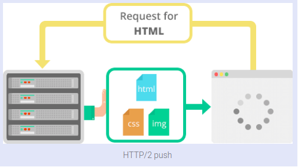

- Request multiplexing

- Header compression

- binary protocol

- HTTP/2 Server Push

### Kaynaklar

- https://medium.com/@factoryhr/http-2-the-difference-between-http-1-1-benefits-and-how-to-use-it-38094fa0e95b
- https://www.epigra.com/blog/http2-web-2-0-hakkinda-bilmeniz-gerekenler/
- https://www.thewebmaster.com/hosting/2015/dec/14/what-is-http2-and-how-does-it-compare-to-http1-1/
- https://kinsta.com/learn/what-is-http2/

