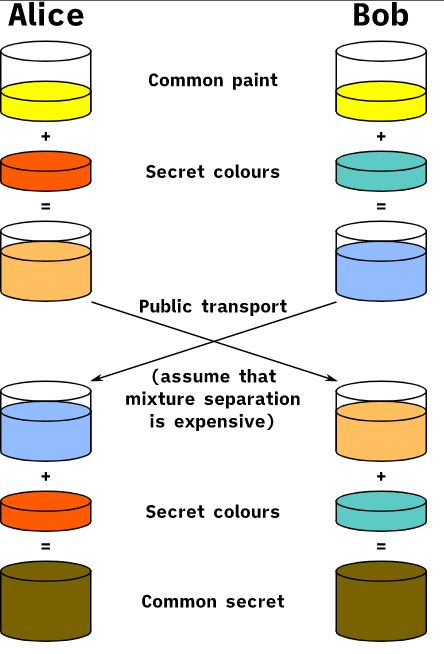
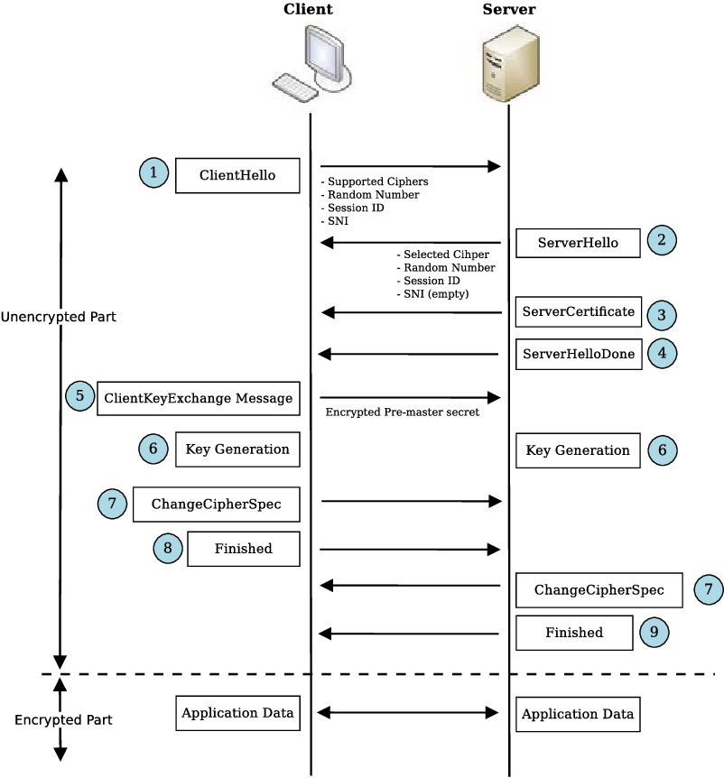

burada yapılan şey aslında tcp protokolünü güvenli hale getirmek. bu yapldığı an aslında tcp üzerinde çalışa http de güvenli hale gelmiş oluyor.

ssl aslında tls in eski versiyonun adı. yeni versiyonun adı tls.

1. dımda ziyaterçi banka sunucusuna hangi hash algoritmaları bildiğini, neleri destekleridğini belirtir. desteklediği algoritmları en güvenliden en güvensize doğru sıralyarak gönderir.
2. ikinci adımda banka sunucusu kendi desteklediği ve tabiki ziyaretçi ile eşleşen ve kendi desteklediği en güvenilir algortimaları ve public keyini ziyaretçiye gönderir.
3. ziyasretçi gelen public key i bildiği yöntemlerde doğruluyor. burada sunucudan gelen sertifikada ki CA imzasının kendi root CA larda olup olmadığına bakıyor ve varsa karşı tarafa yani banka sunucusuna güveniyor.
4. bu esnada sadece asymetric key kullanarak bütün trafiği sürdürmek çok çok yavaş olcağı için ziyaretçi bir symetric (aes, des) key üretir ve bunu sunucunun public key i ile şfreleyerek sunucuya bunu gönderir.
5. sunucu gelen paketi kendi primary key  ile açarak symmetric keye ulaşmış oluyor.
6. daha sonra bütün kominikasyon bunun üzerinden devam ediyor. arada sırada bu keyi de yeniliyorlar aralarında.

ancak 2011 yılına kdaar kullanılan bu yöntem o tarihte artık tarih oluyor.
NSA yıllarca bu trafikteki data yı biryere depoluyor. o anda çözemese dahi  ilerde aldığı bir mahkeme kararı ile bankanın private key ini alarak tüm verileri okuyor. 

o tarihten itibaren yeni sisteme geçiliyor.

artık iki bilgasayar biribini ok ledikten sonra sadece ikisinin ibilcebilceği bir key üretiyorlar bir kaç haberleşme ile. yani mesajlar private key ile çözülmyüyor. bu sisteme Diffie–Hellman key exchange deniyor. üst  ve mod alama yöntemiyle iki kişinin bilebileceği bir secret key oluşturulmuş oluyor.

https bir yavaşlık getirsede http2 ile birlikte bu da değişecek.

http vs http2 için [bakınız](HttpVshttp2.md).

### Sertifika Çeşitleri

3 çeşit sertifica issue edebliyor CA lar

1. Domain sertifikası. adres satırında sadece secure der.
2. Organizasyon velidation sertifikası (sadece web için değil farklı yerlerde de kullanmak için)
3. Extended validation (ticari sicil kaydına varıncaya kadar talep edip öyle veriliyor). adres satırında sadece güvenli demez uzunca firma adı yada kurum adı vs yazar.

### Self-sign sertifikalar

örneğin intranet içinde kullanmak için ya da develop ortamı için mantıklı olabilir ama internet için mantıklı değil.

OpenSSL çok kullanışlı bir araç. bu aynı zamanda ABC diye bir protokolü TCP üzerinde handshake sisietmini kullanrak ssl hale getirebiliyor.

https://badssl.com sitesinde lab lar var ssl konusunda farklı konuları işlemek mümkün.

https://www.ssllabs.com/ssltest site testi yapıyor.

### Kaynaklar

- https://en.wikipedia.org/wiki/Diffie%E2%80%93Hellman_key_exchange
- http://bilgisayarkavramlari.sadievrenseker.com/2008/03/20/diffie-hellman-ahahtar-degisimi-key-exchange/
- https://www.youtube.com/watch?v=C90IRZ5nlbo
- https://tr.wikipedia.org/wiki/Diffie-Hellman_anahtar_de%C4%9Fi%C5%9Fimi
