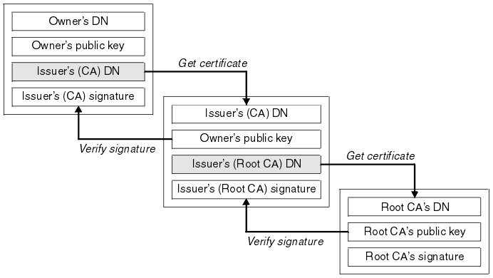

buradaki amaç asymetric key lerin dağtım problemini çözmek.

PKI = Public Key Infrustructure

aynı zamanda birde doğrulama yapıyor. yani dağıtılan key ni doğruluğunu da sağlıyorlar. Aynı nüfus müdürlükleri gibi

aslında public key in şifrelenmesi esasına dayanıyor. 

Ama öncelikle dijital imzalar nasıl çalışıyor ona bi bakalım.

dijital imzalar ne sağlıyor? integrirt ve non-reputability. tekrar hatırlayacak olursak

- __Itegrity:__ iki nokta arasında gönderilen mesajın değişmeden olduğu gibi karşıya erişmesi anlamına geliyor. Bunu için integriry check kullanılır.
- __Non-Reputability:__ iki nokta arasında karşı tarafın yapması gereken bir işi hakiktae karşı taraf mı yaptı? bunu şöylede düşünebiliriz karşı taraf yapmış ama reddediyor diyelim bunu da isptalayabilir miyim. resmibir belgeyi karşı taraf imzaladı da mı reddediyor yoksa araya hakikaten biri girdide imzayo omu atı yoksa hakikaten beklene kii mi imzaladı

__Digital Signiture (Dijital İmzalar)__

1. dökümanın önce hash i alınır. burada amaç imzalancak dökümanın hem fingerprint ini almak (iki farklı dökümanın hash iaynı olamaz.) hem de dökümanı küçültmek (20 ve ya 32 byte olmuş olacak).
2. daha sonra gönderici kendi private key i ile hash i şifreler. bu şu anlama geliyor başka kimsede olmayan bir key ile şirelemiş oluyor.
3. daha sonra oluşa bu son hali dökümana ekleyip öyle gönderiyor alıcıya.
4. Alıcı göndericinin public key ine sahip olduğu için gelen imzayı public keyle açıyor ve gelen dökümanın hash ini alarak alıcının göndermiş olduğu hash le karşılaştırıyor ve böylece doğru kişiden değişmemiş bir dökğman aldığından emin olmuş oluyorlar.

burada şuna dikkat etmek lazım. private key le şifrelenmiş bir döküman publik keyle yada public keyle oluşturulmuş döküman private keyle açılabilir.

güvenli konuçmada ise mesajı karşıya gönderecek kii karşı tarafın public key ile şifreliyorki karşı taraf açabilsin. mesela web siteleri böyle çalışır.

tabi asıl konumuz PKI. yani bu public key i nasıl dağıtacağız ve nasıl doğrulayacağız. mesela https de bu iş nasl çözülüyor SSL sertifikalarında.

Burada devreye dijital noterler giriyor. Certificaiton Authorities - CA. Bu kurumları bir nevi nüfus il müdürlüğü gibi düşünebiliriz. bize aslında kimlik veriyorlar.

dijita sertifika içinde aslında bizim public key imiz oluyor. banka sitesine girdiğimizde banka bize dijital sertificka içinde publik key ini veriyor anca bizim bunu doğrulamamız gerekiyor.

burada bankanın public key i ile biz şifrleyip veriyi gönderdiğimizde banka bunu private keyi ile açıp okuyabilir. bizde kendi public keyimizi gönderirisek onun gönderdiğinide biz açıp okuyabiliriz.

peki bu çalışmamekanizmasında bizim private key imizi CA biliyor mu? yani mantıken bilmememsi gerekiyor ozaman bu işin güvenliği kalmaz zaten.

__Dijital Sertifika oluşturulma süreci__

1. öncelikle kendimize bir private ve publik key üretiyoruz. (openssl veya cfssl gibi araçlarla)
2. daha sonra private key i private key store uma koyuyorum. 
3. daha sonra kend ipublik key imle ve subject identifier ımla (burada domain adımız neyse o oluyor) bir sertifika oluşturulması için  CA den talepde bulunuyoruz (certificate siginin request - dilekçe yazmak gibi).
4. CA da bize x.509 certificate üretip bize veriyor.

peki bu üretilen sertifakanın doğrluğndan nasıl emin olağız biz veya sitemizi kullancak ziretçiler. yani araya biri girip CA gibi davranabilir sonuçta.

__dijital sertifikanın validasyonu__

resimeki ilk bloğa bakacak olursak, iki bilgi görürüz
- sertifika sahibinin public key i
- sertifikayı crete eden CA nın imzası (peki buimza yı nası oluşturuyor? CA kendi private key  ile bu imzayı oluşturur)

bu setfikayı alıp ilk intermediate CA ya gidersek  da bir ütüne yönlendiri ve en son en üstteki (root) CA ya ulaşmış oluruz sertifikayı valide ederlen.

nu aynı il, il, varsa bölge ve en son nüfus genel müdürlüğüne kadar gitmek gibidir.
çünki bir sertifikayı sadece tek bir authority imzalamaz kademeli bir şekilde bu sertfikalar imzalanır.

peki en son gittiğimiz Ca nın bizzat root CA olduğnu nereden bilceğiz. bununatarayılar biliyor .tarayıcılar içinde bşiz kurarken root CA ların sertikaları kurulu geliyor. Firefox kendi içinde getirirken diğer tarayıcılar bilgisayardan okuyor.

### Kaynaklar
- https://www.tutorialspoint.com/cryptography/public_key_infrastructure.htm
- https://sites.google.com/site/ddmwsst/digital-certificates
- 