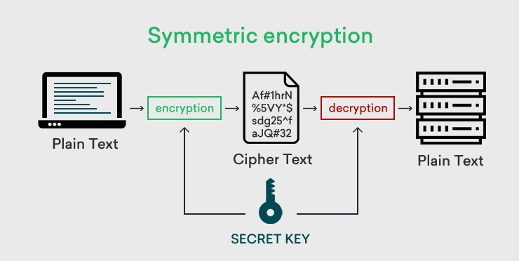

burada şifrelemek ve şifreyi çözmek aynı fonksiyonla oluyor ve ayn key kullanılıyuot. iki tarafta da aynı secret key var.

örneğin (DES (Data Encrypted Standart), Trible DES, AES (Advanced Ancryption Standat))

ancak burada da o gizli key i dağıtma problemi var. 

