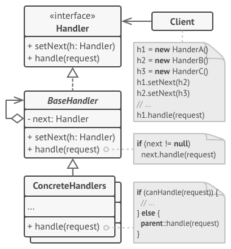
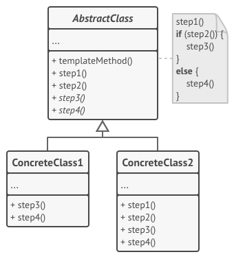

## 3. Behavioral patterns

Temel Kaynaklar

1. [DoFactory](https://www.dofactory.com/net/design-patterns)
2. [ReFactoring Guru](https://refactoring.guru/design-patterns/what-is-pattern)
3. [Source Making](https://sourcemaking.com/design_patterns/iterator)

Belirli görevlerin bu işleri yapmak üzere tasarlanmış nesnelere gönderilmesi ve geri dönen sonuçların işlenmesi davranışsal tasarım kalıpları içerisinde yapılan bir işlemdir. Davranışsal tarım kalıpları içerisinde bilinen ve sıklıkla kullanılan kalıplar şu şekildedir.

Bu tasarım modelleri özellikle nesneler arasındaki iletişim ile ilgilidir.

[Davranışsal Tasarım Desenleri Özet](http://bidb.itu.edu.tr/seyir-defteri/blog/2013/09/08/davran%C4%B1%C5%9Fsal-kal%C4%B1plar-(behavioral-patterns))

### 3.1. Blackboard

TODO: içerik gelecek

### 3.2. Chain of responsibility

Davranışsal(Behavioral) kalıplardan olan Chain of Responsibility deseni, ortak bir mesaj veya talebin(Request), birbirlerine zayıf bir şekilde bağlanmış(Loosly Coupled) nesneler arasında gezdirilmesi ve bu zincir içerisinde asıl sorumlu olanı tarafından ele alınması gerektiği vakalarda kullanılmaktadır. DoFactory.com güncel istatistiklerine baktığımızda kullanım oranı %40' lar seviyesinde görünsede, yazılışı son derece basit bir desendir. [kaynak Burak Selim Şenyurt](https://www.buraksenyurt.com/post/Tasarc4b1m-Desenleri-Chain-of-Responsibility)


Chain of responsibility sorumluluk zinciri anlamına gelmektedir. Sisteme gönderilen bir istediğin (komut) hangi nesne tarafından cevaplanması gerektiğini bilmediğimiz durumlarda ya da isteği yapan nesne ve servis sağlayan nesne arasında sıkı bir bağ oluşmasını engellememiz gerektiğinde Chain of Responsibility tasarım şablonu kullanılır. Bu tasarım şablonunda servis sağlayan ilgili tüm nesneler bir kolye üzerindeki boncuklar gibi birbirleriyle ilişkili hale getirilir. Bir nesne zincirdeki kendinden sonraki nesneyi tanır ve isteği kendi cevaplayamadığı durumda, kendinden sonraki nesneye iletir. Bu işlem, zincirde bulunan doğru servis saglayıcı nesneyi bulana kadar devam eder. [Kaynak: Kurumsal Java](http://www.kurumsaljava.com/2009/10/09/chain-of-responsibility-tasarim-sablonu/)





Bileşenleri

1. ConcreteHandler' lar arasında aggregation tadında bir ilişki olmasıdır. Aktörlerimiz ise;

2. Handler : Kendisinden türeyen ConcreteHandler' ların, talebi ele alması için gerekli arayüzü tanımlar. Abstract class veya Interface olarak tasarlanır.

3. ConcreteHandler :  Sorumlu olduğu talebi değerlendirir ve işler. Gerekirse talebi zincir içerisinde arkasından gelen nesneye iletir. Sonraki nesnenin ne olacağı genellikle istemci tarafında belirlenir.

4. Client : Talebi veya mesajı gönderir.


Yapısal Kod [Kaynak](https://www.dofactory.com/net/chain-of-responsibility-design-pattern)


``` C#
using System;
 
namespace DoFactory.GangOfFour.Chain.Structural
{
  /// <summary>

  /// MainApp startup class for Structural

  /// Chain of Responsibility Design Pattern.

  /// </summary>

  class MainApp

  {
    /// <summary>

    /// Entry point into console application.

    /// </summary>

    static void Main()
    {
      // Setup Chain of Responsibility

      Handler h1 = new ConcreteHandler1();
      Handler h2 = new ConcreteHandler2();
      Handler h3 = new ConcreteHandler3();
      h1.SetSuccessor(h2);
      h2.SetSuccessor(h3);
 
      // Generate and process request

      int[] requests = { 2, 5, 14, 22, 18, 3, 27, 20 };
 
      foreach (int request in requests)
      {
        h1.HandleRequest(request);
      }
 
      // Wait for user

      Console.ReadKey();
    }
  }
 
  /// <summary>

  /// The 'Handler' abstract class

  /// </summary>

  abstract class Handler

  {
    protected Handler successor;
 
    public void SetSuccessor(Handler successor)
    {
      this.successor = successor;
    }
 
    public abstract void HandleRequest(int request);
  }
 
  /// <summary>

  /// The 'ConcreteHandler1' class

  /// </summary>

  class ConcreteHandler1 : Handler

  {
    public override void HandleRequest(int request)
    {
      if (request >= 0 && request < 10)
      {
        Console.WriteLine("{0} handled request {1}",
          this.GetType().Name, request);
      }
      else if (successor != null)
      {
        successor.HandleRequest(request);
      }
    }
  }
 
  /// <summary>

  /// The 'ConcreteHandler2' class

  /// </summary>

  class ConcreteHandler2 : Handler

  {
    public override void HandleRequest(int request)
    {
      if (request >= 10 && request < 20)
      {
        Console.WriteLine("{0} handled request {1}",
          this.GetType().Name, request);
      }
      else if (successor != null)
      {
        successor.HandleRequest(request);
      }
    }
  }
 
  /// <summary>

  /// The 'ConcreteHandler3' class

  /// </summary>

  class ConcreteHandler3 : Handler

  {
    public override void HandleRequest(int request)
    {
      if (request >= 20 && request < 30)
      {
        Console.WriteLine("{0} handled request {1}",
          this.GetType().Name, request);
      }
      else if (successor != null)
      {
        successor.HandleRequest(request);
      }
    }
  }
}
 
```

Sonuç

```C#
//ConcreteHandler1 handled request 2
//ConcreteHandler1 handled request 5
//ConcreteHandler2 handled request 14
//ConcreteHandler3 handled request 22
//ConcreteHandler2 handled request 18
//ConcreteHandler1 handled request 3
//ConcreteHandler3 handled request 27
//ConcreteHandler3 handled request 20


```
Gerçek hayat kodu [Kaynak](https://www.dofactory.com/net/chain-of-responsibility-design-pattern)


``` C#
using System;
 
namespace DoFactory.GangOfFour.Chain.RealWorld
{
  /// <summary>

  /// MainApp startup class for Real-World 

  /// Chain of Responsibility Design Pattern.

  /// </summary>

  class MainApp

  {
    /// <summary>

    /// Entry point into console application.

    /// </summary>

    static void Main()
    {
      // Setup Chain of Responsibility

      Approver larry = new Director();
      Approver sam = new VicePresident();
      Approver tammy = new President();
 
      larry.SetSuccessor(sam);
      sam.SetSuccessor(tammy);
 
      // Generate and process purchase requests

      Purchase p = new Purchase(2034, 350.00, "Assets");
      larry.ProcessRequest(p);
 
      p = new Purchase(2035, 32590.10, "Project X");
      larry.ProcessRequest(p);
 
      p = new Purchase(2036, 122100.00, "Project Y");
      larry.ProcessRequest(p);
 
      // Wait for user

      Console.ReadKey();
    }
  }
 
  /// <summary>

  /// The 'Handler' abstract class

  /// </summary>

  abstract class Approver

  {
    protected Approver successor;
 
    public void SetSuccessor(Approver successor)
    {
      this.successor = successor;
    }
 
    public abstract void ProcessRequest(Purchase purchase);
  }
 
  /// <summary>

  /// The 'ConcreteHandler' class

  /// </summary>

  class Director : Approver

  {
    public override void ProcessRequest(Purchase purchase)
    {
      if (purchase.Amount < 10000.0)
      {
        Console.WriteLine("{0} approved request# {1}",
          this.GetType().Name, purchase.Number);
      }
      else if (successor != null)
      {
        successor.ProcessRequest(purchase);
      }
    }
  }
 
  /// <summary>

  /// The 'ConcreteHandler' class

  /// </summary>

  class VicePresident : Approver

  {
    public override void ProcessRequest(Purchase purchase)
    {
      if (purchase.Amount < 25000.0)
      {
        Console.WriteLine("{0} approved request# {1}",
          this.GetType().Name, purchase.Number);
      }
      else if (successor != null)
      {
        successor.ProcessRequest(purchase);
      }
    }
  }
 
  /// <summary>

  /// The 'ConcreteHandler' class

  /// </summary>

  class President : Approver

  {
    public override void ProcessRequest(Purchase purchase)
    {
      if (purchase.Amount < 100000.0)
      {
        Console.WriteLine("{0} approved request# {1}",
          this.GetType().Name, purchase.Number);
      }
      else

      {
        Console.WriteLine(
          "Request# {0} requires an executive meeting!",
          purchase.Number);
      }
    }
  }
 
  /// <summary>

  /// Class holding request details

  /// </summary>

  class Purchase

  {
    private int _number;
    private double _amount;
    private string _purpose;
 
    // Constructor

    public Purchase(int number, double amount, string purpose)
    {
      this._number = number;
      this._amount = amount;
      this._purpose = purpose;
    }
 
    // Gets or sets purchase number

    public int Number
    {
      get { return _number; }
      set { _number = value; }
    }
 
    // Gets or sets purchase amount

    public double Amount
    {
      get { return _amount; }
      set { _amount = value; }
    }
 
    // Gets or sets purchase purpose

    public string Purpose
    {
      get { return _purpose; }
      set { _purpose = value; }
    }
  }
}
 
 
 

```
Sonuç

``` C#

//Director Larry approved request# 2034
//President Tammy approved request# 2035
//Request# 2036 requires an executive meeting!

```


### 3.3. Command


Request-response model arasında lose coupling ilişki sağlar. Bir isteği nesneye dönüştürerek, isteğin kullanıcı sınıfları tarafından rahatça erişilebilmesi sağlanır. 


Faydaları Nedir?

1. Uygulama daha modüler ve esnek olur. 
2. Geriye alma işlemi( undo ) ve anlık durumun restorasyonu gibi işlemler yapılabilir. 
3. Loglama ve transactional işlemler için kullanılabilir. 
4. Makro komutlar oluşturarak bu komutların bir anda çalıştırılması sağlanabilir. 


Bileşenleri

1. Komut (Command) : Gerçekleştirilecek işlem için bir ara yüz tanımlar.
2. Somut Komut (Concrete Command): Alıcı ve gerçekleştirilecek işlemler arasında bir bağ kurar, alıcıda karşılık düşen işlemleri çağırarak çalıştırma eylemini gerçekleştirir.
3. İstemci (Client): Komut nesnesini oluşturur ve metodun sonraki zamanlarda çağrılabilmesi için gerekli bilgiyi sağlar.
4. Çağırıcı (Invoker): Metodun ne zaman çağrılacağını belirtir.
5. Alıcı (Receiver):  Kullanıcı isteklerini gerçekleştirecek asıl metod kodlarını içerir.


[Kaynak]()

Yapısal Kod

``` C#
using System;
 
namespace DoFactory.GangOfFour.Command.Structural
{
  /// <summary>

  /// MainApp startup class for Structural 

  /// Command Design Pattern.

  /// </summary>

  class MainApp

  {
    /// <summary>

    /// Entry point into console application.

    /// </summary>

    static void Main()
    {
      // Create receiver, command, and invoker

      Receiver receiver = new Receiver();
      Command command = new ConcreteCommand(receiver);
      Invoker invoker = new Invoker();
 
      // Set and execute command

      invoker.SetCommand(command);
      invoker.ExecuteCommand();
 
      // Wait for user

      Console.ReadKey();
    }
  }
 
  /// <summary>

  /// The 'Command' abstract class

  /// </summary>

  abstract class Command

  {
    protected Receiver receiver;
 
    // Constructor

    public Command(Receiver receiver)
    {
      this.receiver = receiver;
    }
 
    public abstract void Execute();
  }
 
  /// <summary>

  /// The 'ConcreteCommand' class

  /// </summary>

  class ConcreteCommand : Command

  {
    // Constructor

    public ConcreteCommand(Receiver receiver) :
      base(receiver)
    {
    }
 
    public override void Execute()
    {
      receiver.Action();
    }
  }
 
  /// <summary>

  /// The 'Receiver' class

  /// </summary>

  class Receiver

  {
    public void Action()
    {
      Console.WriteLine("Called Receiver.Action()");
    }
  }
 
  /// <summary>

  /// The 'Invoker' class

  /// </summary>

  class Invoker

  {
    private Command _command;
 
    public void SetCommand(Command command)
    {
      this._command = command;
    }
 
    public void ExecuteCommand()
    {
      _command.Execute();
    }
  }
}

```

Sonuç

``` C#
//Called Receiver.Action()
```
Gerçek hayat kodu

```C#
using System;
using System.Collections.Generic;
 
namespace DoFactory.GangOfFour.Command.RealWorld
{
  /// <summary>

  /// MainApp startup class for Real-World 

  /// Command Design Pattern.

  /// </summary>

  class MainApp

  {
    /// <summary>

    /// Entry point into console application.

    /// </summary>

    static void Main()
    {
      // Create user and let her compute

      User user = new User();
 
      // User presses calculator buttons

      user.Compute('+', 100);
      user.Compute('-', 50);
      user.Compute('*', 10);
      user.Compute('/', 2);
 
      // Undo 4 commands

      user.Undo(4);
 
      // Redo 3 commands

      user.Redo(3);
 
      // Wait for user

      Console.ReadKey();
    }
  }
 
  /// <summary>

  /// The 'Command' abstract class

  /// </summary>

  abstract class Command

  {
    public abstract void Execute();
    public abstract void UnExecute();
  }
 
  /// <summary>

  /// The 'ConcreteCommand' class

  /// </summary>

  class CalculatorCommand : Command

  {
    private char _operator;
    private int _operand;
    private Calculator _calculator;
 
    // Constructor

    public CalculatorCommand(Calculator calculator,
      char @operator, int operand)
    {
      this._calculator = calculator;
      this._operator = @operator;
      this._operand = operand;
    }
 
    // Gets operator

    public char Operator
    {
      set { _operator = value; }
    }
 
    // Get operand

    public int Operand
    {
      set { _operand = value; }
    }
 
    // Execute new command

    public override void Execute()
    {
      _calculator.Operation(_operator, _operand);
    }
 
    // Unexecute last command

    public override void UnExecute()
    {
      _calculator.Operation(Undo(_operator), _operand);
    }
 
    // Returns opposite operator for given operator

    private char Undo(char @operator)
    {
      switch (@operator)
      {
        case '+': return '-';
        case '-': return '+';
        case '*': return '/';
        case '/': return '*';
        default: throw new

         ArgumentException("@operator");
      }
    }
  }
 
  /// <summary>

  /// The 'Receiver' class

  /// </summary>

  class Calculator

  {
    private int _curr = 0;
 
    public void Operation(char @operator, int operand)
    {
      switch (@operator)
      {
        case '+': _curr += operand; break;
        case '-': _curr -= operand; break;
        case '*': _curr *= operand; break;
        case '/': _curr /= operand; break;
      }
      Console.WriteLine(
        "Current value = {0,3} (following {1} {2})",
        _curr, @operator, operand);
    }
  }
 
  /// <summary>

  /// The 'Invoker' class

  /// </summary>

  class User

  {
    // Initializers

    private Calculator _calculator = new Calculator();
    private List<Command> _commands = new List<Command>();
    private int _current = 0;
 
    public void Redo(int levels)
    {
      Console.WriteLine("\n---- Redo {0} levels ", levels);
      // Perform redo operations

      for (int i = 0; i < levels; i++)
      {
        if (_current < _commands.Count - 1)
        {
          Command command = _commands[_current++];
          command.Execute();
        }
      }
    }
 
    public void Undo(int levels)
    {
      Console.WriteLine("\n---- Undo {0} levels ", levels);
      // Perform undo operations

      for (int i = 0; i < levels; i++)
      {
        if (_current > 0)
        {
          Command command = _commands[--_current] as Command;
          command.UnExecute();
        }
      }
    }
 
    public void Compute(char @operator, int operand)
    {
      // Create command operation and execute it

      Command command = new CalculatorCommand(
        _calculator, @operator, operand);
      command.Execute();
 
      // Add command to undo list

      _commands.Add(command);
      _current++;
    }
  }
}
 

```
Sonuç

```C#
/*Current value = 100 (following + 100)
Current value =  50 (following - 50)
Current value = 500 (following * 10)
Current value = 250 (following / 2)

---- Undo 4 levels
Current value = 500 (following * 2)
Current value =  50 (following / 10)
Current value = 100 (following + 50)
Current value =   0 (following - 100)

---- Redo 3 levels
Current value = 100 (following + 100)
Current value =  50 (following - 50)
Current value = 500 (following * 10)
*/

```


### 3.4. Interpreter


Bu tasarım desenindeki amaç, özelleşmiş bir bilgisayar dilinin yorumlanmasının gerçekleştirilmesidir. Ana fikir, bu özelleşmiş dilin her bir sembolü için ayrı bir sınıf yaratmaktır. Bu tasarım deseni, veritabanı yönetim sistemlerindeki SQL tarzı dillerin yorumlanmasında kullanılabilir. Bir başka örnek olarak, bilgisayar ağlarındaki iletişim protokollerindeki özel dillerin çözümlenmesinde kullanılabilir. [Kaynak](http://www.tasarimdesenleri.com/jsp/tasdesincele/interpreter.jsp)

    
Dil bilgisi kuralları gibi kalıplar içerisinde yer alan ifadelerin yorumlanması amacıyla kullanılması tercih edilmektedir. 


__Bileşenleri__

1. AbstractExpression  Yorumlama işlemini yapan yapının arayüzü. Interface veya Abstract Class. Yorumlama sistemindeki yorumlayıcı sınıflar için ortak bir arayüz sağlayan soyut taban sınıftır. Bu nedenle interface olarak da kurgulanabilir.
2. TerminalExpression: İşleme konu olan değerler. AbstractExpression sınıfını implemente eden dolayısıyla yorumlama mantığını içeren sınıftır.s
3. NonterminalExpression: Diğer değerler. Bu sınıf da AbstractExpression sınıfını implemente eder. Ancak TerminalExpression sınıfından farklı olarak AbstractExpression sınıfıyla arasında bir aggregation ilişkisi söz konusudur. Yani NonTerminalExpression sınıfı AbstractExpression sınıfından türeyen (terminal veya nonterminal) nesneleri kendi içinde barındırabilir.
4. Context: Yorumlanacak içerik. Interpreter (yorumlayıcı) tarafından kullanılan ve genelde girdi/çıktı amaçlı bilgi saklayan nesnedir. Bir başka deyişle bu nesnenin içeriği yorumlanacak olan ve yorumlanmış veriyi ifade eder.
5. Client: İstemci uygulama


Yapısal kod . [Kaynak](https://www.dofactory.com/net/interpreter-design-pattern)

``` C#


using System;
using System.Collections;
 
namespace DoFactory.GangOfFour.Interpreter.Structural
{
  /// <summary>

  /// MainApp startup class for Structural 

  /// Interpreter Design Pattern.

  /// </summary>

  class MainApp

  {
    /// <summary>

    /// Entry point into console application.

    /// </summary>

    static void Main()
    {
      Context context = new Context();
 
      // Usually a tree 

      ArrayList list = new ArrayList();
 
      // Populate 'abstract syntax tree' 

      list.Add(new TerminalExpression());
      list.Add(new NonterminalExpression());
      list.Add(new TerminalExpression());
      list.Add(new TerminalExpression());
 
      // Interpret

      foreach (AbstractExpression exp in list)
      {
        exp.Interpret(context);
      }
 
      // Wait for user

      Console.ReadKey();
    }
  }
 
  /// <summary>

  /// The 'Context' class

  /// </summary>

  class Context

  {
  }
 
  /// <summary>

  /// The 'AbstractExpression' abstract class

  /// </summary>

  abstract class AbstractExpression

  {
    public abstract void Interpret(Context context);
  }
 
  /// <summary>

  /// The 'TerminalExpression' class

  /// </summary>

  class TerminalExpression : AbstractExpression

  {
    public override void Interpret(Context context)
    {
      Console.WriteLine("Called Terminal.Interpret()");
    }
  }
 
  /// <summary>

  /// The 'NonterminalExpression' class

  /// </summary>

  class NonterminalExpression : AbstractExpression

  {
    public override void Interpret(Context context)
    {
      Console.WriteLine("Called Nonterminal.Interpret()");
    }
  }
}
 
 
    
 ```               

Çıktı
```C#
//Called Terminal.Interpret()
//Called Nonterminal.Interpret()
//Called Terminal.Interpret()
//Called Terminal.Interpret()


```

Gerçek hayat kodu


``` C#
using System;
using System.Collections.Generic;
 
namespace DoFactory.GangOfFour.Interpreter.RealWorld
{
  /// <summary>

  /// MainApp startup class for Real-World 

  /// Interpreter Design Pattern.

  /// </summary>

  class MainApp

  {
    /// <summary>

    /// Entry point into console application.

    /// </summary>

    static void Main()
    {
      string roman = "MCMXXVIII";
      Context context = new Context(roman);
 
      // Build the 'parse tree'

      List<Expression> tree = new List<Expression>();
      tree.Add(new ThousandExpression());
      tree.Add(new HundredExpression());
      tree.Add(new TenExpression());
      tree.Add(new OneExpression());
 
      // Interpret

      foreach (Expression exp in tree)
      {
        exp.Interpret(context);
      }
 
      Console.WriteLine("{0} = {1}",
        roman, context.Output);
 
      // Wait for user

      Console.ReadKey();
    }
  }
 
  /// <summary>

  /// The 'Context' class

  /// </summary>

  class Context

  {
    private string _input;
    private int _output;
 
    // Constructor

    public Context(string input)
    {
      this._input = input;
    }
 
    // Gets or sets input

    public string Input
    {
      get { return _input; }
      set { _input = value; }
    }
 
    // Gets or sets output

    public int Output
    {
      get { return _output; }
      set { _output = value; }
    }
  }
 
  /// <summary>

  /// The 'AbstractExpression' class

  /// </summary>

  abstract class Expression

  {
    public void Interpret(Context context)
    {
      if (context.Input.Length == 0)
        return;
 
      if (context.Input.StartsWith(Nine()))
      {
        context.Output += (9 * Multiplier());
        context.Input = context.Input.Substring(2);
      }
      else if (context.Input.StartsWith(Four()))
      {
        context.Output += (4 * Multiplier());
        context.Input = context.Input.Substring(2);
      }
      else if (context.Input.StartsWith(Five()))
      {
        context.Output += (5 * Multiplier());
        context.Input = context.Input.Substring(1);
      }
 
      while (context.Input.StartsWith(One()))
      {
        context.Output += (1 * Multiplier());
        context.Input = context.Input.Substring(1);
      }
    }
 
    public abstract string One();
    public abstract string Four();
    public abstract string Five();
    public abstract string Nine();
    public abstract int Multiplier();
  }
 
  /// <summary>

  /// A 'TerminalExpression' class

  /// <remarks>

  /// Thousand checks for the Roman Numeral M 

  /// </remarks>

  /// </summary>

  class ThousandExpression : Expression

  {
    public override string One() { return "M"; }
    public override string Four() { return " "; }
    public override string Five() { return " "; }
    public override string Nine() { return " "; }
    public override int Multiplier() { return 1000; }
  }
 
  /// <summary>

  /// A 'TerminalExpression' class

  /// <remarks>

  /// Hundred checks C, CD, D or CM

  /// </remarks>

  /// </summary>

  class HundredExpression : Expression

  {
    public override string One() { return "C"; }
    public override string Four() { return "CD"; }
    public override string Five() { return "D"; }
    public override string Nine() { return "CM"; }
    public override int Multiplier() { return 100; }
  }
 
  /// <summary>

  /// A 'TerminalExpression' class

  /// <remarks>

  /// Ten checks for X, XL, L and XC

  /// </remarks>

  /// </summary>

  class TenExpression : Expression

  {
    public override string One() { return "X"; }
    public override string Four() { return "XL"; }
    public override string Five() { return "L"; }
    public override string Nine() { return "XC"; }
    public override int Multiplier() { return 10; }
  }
 
  /// <summary>

  /// A 'TerminalExpression' class

  /// <remarks>

  /// One checks for I, II, III, IV, V, VI, VI, VII, VIII, IX

  /// </remarks>

  /// </summary>

  class OneExpression : Expression

  {
    public override string One() { return "I"; }
    public override string Four() { return "IV"; }
    public override string Five() { return "V"; }
    public override string Nine() { return "IX"; }
    public override int Multiplier() { return 1; }
  }
}
 
```

Sonuç

``` C#

// MCMXXVIII = 1928

```


### 3.5. Iterator

Nesne tabanlı dillerde uygulama geliştirilirken en sık kullanılan yapılardan biri de koleksiyonlardır.  Iterator tasarım deseni ile koleksiyon yapısı bilinmesine ihtiyaç olmadan koleksiyon elemanları üzerinde işlem yapılabilmesini sağlar. Yani iterator tasarım deseni kullanılarak koleksiyonun array, queue, list olması önemli olmadan, aynı şekilde elemanlarının elde edilmesi sağlanır. Koleksiyon içindeki nesnelerin nasıl elde edileceği tercihe göre belirlenebilir. Yani sonraki, ilk, son, 3. Eleman gibi istenilen şekilde elemanlara ulaşılabilir. Iterator tasarım deseninde 5 temel yapı bulunur. [kaynak](http://harunozer.com/makale/iterator_tasarim_deseni__iterator_design_pattern.htm)

1. Iterator: Koleksiyon elemanları elde edilebilmesi için gerekli işlemleri tanımlar.
2. Aggregate: Koleksiyon barındıran nesnelerin Iterator tipinden nesne oluşturacağını belirten arayüzdür.
3. Concrete Aggregate: Koleksiyon barındıran nesnedir. Aggregate arayüzünü uygular ve ilgili ConcreteIterator nesnesini oluşturur.
4. ConcreteIterator:  Aggregate yapısında ki koleksiyon elemanlarının elde edilmesini sağlayan metotları barındıran yani Iterator arayüzünü uygulayan gerçek iterator nesnesidir.
5. Client: Bu yapıyı kullanarak koleksiyon içindeki elemanlara erişen yapıdır.


Gerçek Hayat Kodu [Katynak : DoFactory](https://www.dofactory.com/net/iterator-design-pattern)

```C#
using System;
using System.Collections;
 
namespace DoFactory.GangOfFour.Iterator.RealWorld
{
    /// <summary>

    /// MainApp startup class for Real-World 

    /// Iterator Design Pattern.

    /// </summary>

    class MainApp

    {
        /// <summary>

        /// Entry point into console application.

        /// </summary>

        static void Main()
        {
            // Build a collection

            Collection collection = new Collection();
            collection[0] = new Item("Item 0");
            collection[1] = new Item("Item 1");
            collection[2] = new Item("Item 2");
            collection[3] = new Item("Item 3");
            collection[4] = new Item("Item 4");
            collection[5] = new Item("Item 5");
            collection[6] = new Item("Item 6");
            collection[7] = new Item("Item 7");
            collection[8] = new Item("Item 8");
 
            // Create iterator

            Iterator iterator = collection.CreateIterator();
 
            // Skip every other item

            iterator.Step = 2;
 
            Console.WriteLine("Iterating over collection:");
 
            for (Item item = iterator.First();
                !iterator.IsDone; item = iterator.Next())
            {
                Console.WriteLine(item.Name);
            }
 
            // Wait for user

            Console.ReadKey();
        }
    }
 
    /// <summary>

    /// A collection item

    /// </summary>

    class Item

    {
        private string _name;
 
        // Constructor

        public Item(string name)
        {
            this._name = name;
        }
 
        // Gets name

        public string Name
        {
            get { return _name; }
        }
    }
 
    /// <summary>

    /// The 'Aggregate' interface

    /// </summary>

    interface IAbstractCollection

    {
        Iterator CreateIterator();
    }
 
    /// <summary>

    /// The 'ConcreteAggregate' class

    /// </summary>

    class Collection : IAbstractCollection

    {
        private ArrayList _items = new ArrayList();
 
        public Iterator CreateIterator()
        {
            return new Iterator(this);
        }
 
        // Gets item count

        public int Count
        {
            get { return _items.Count; }
        }
 
        // Indexer

        public object this[int index]
        {
            get { return _items[index]; }
            set { _items.Add(value); }
        }
    }
 
    /// <summary>

    /// The 'Iterator' interface

    /// </summary>

    interface IAbstractIterator

    {
        Item First();
        Item Next();
        bool IsDone { get; }
        Item CurrentItem { get; }
    }
 
    /// <summary>

    /// The 'ConcreteIterator' class

    /// </summary>

    class Iterator : IAbstractIterator

    {
        private Collection _collection;
        private int _current = 0;
        private int _step = 1;
 
        // Constructor

        public Iterator(Collection collection)
        {
            this._collection = collection;
        }
 
        // Gets first item

        public Item First()
        {
            _current = 0;
            return _collection[_current] as Item;
        }
 
        // Gets next item

        public Item Next()
        {
            _current += _step;
            if (!IsDone)
                return _collection[_current] as Item;
            else

                return null;
        }
 
        // Gets or sets stepsize

        public int Step
        {
            get { return _step; }
            set { _step = value; }
        }
 
        // Gets current iterator item

        public Item CurrentItem
        {
            get { return _collection[_current] as Item; }
        }
 
        // Gets whether iteration is complete

        public bool IsDone
        {
            get { return _current >= _collection.Count; }
        }
    }
}
 
```
Sonuç

```C#
//Iterating over collection:
//Item 0
//Item 2
//Item 4
//Item 6
//Item 8

```


### 3.6. Mediator


Bu kez bir network ağındaki kullanıcıları ve grupları göz önüne alalım. Kullanıcıların(Users) birden fazla gruba dahil olması muhtemeldir. Benzer şekilde bir grupta kendi içerisinde birden fazla kullanıcı barındırabilir. Yani kullanıcı ve gruplar arasında çoğa çok(Many to many) ilişki söz konusudur. Bu aktörler aslında birer nesne(Object) olarak düşünüldüklerinde, birbirlerine sıkı sıkıya bağlı olmaları(Tghtly Coupling), yönetimlerini zorlaştırmakla kalmaz, ileride yapılacak olan genişletmelerin çok fazla nesneyi etkilemesinede neden olur. Dolayısıyla aralarındaki bağı zayıflaştırmak(Loose Coupling) gerekir. Bu noktada veritabanı tasarımı ile uğraşanlar için sorunu çözmek son derece kolaydır. Nitekim bir ara tablo yardımıyla çoğa çok ilişkinin tesisi kolayca sağlanabilir. Diğer yandan Nesne Yönelimli(Object Oriented) tarafta, kullanıcı ve gruplar arasındaki iletişimi, onlardan soyutlayarak kendi içerisinde yönetecek olan bir ara nesneye ihtiyaç vardır. Kim...Mediator. [Kaynak : Burak Selim Şenyurt](https://buraksenyurt.com/post/Tasarc4b1m-Desenleri-Mediator)


Uygulamanın çalışabilmesi için bu sınıflar arasında sürekli bir haberleşme vardır. Sınıfların sayısı arttıkça, aralarındaki bağımlılıklar artar, uygulamanın bakımı ve değiştirilmesi zorlaşır. İşte arabulucu tasarım deseni, bu sınıflar arasındaki bağımlılıkları azaltmak ve aralarındaki iletişimi kolaylaştırmak için kullanılır. Bu sınıflar arasında arabuluculuk yapar. [Kaynak : Tasarım Desenleri](http://www.tasarimdesenleri.com/jsp/tasdesincele/mediator.jsp)


Kullanım alanları:

1. Anlaşılması zor ve karmaşık şekilde yapılandırılmış nesneler için kullanılır.
2. Gelişmiş nesnel yapılarda bir nesnede yapılan değişikliğin diğer nesneleri etkilemesini engellemek için kullanılır.
3. Yeni sınıflandırmalara gerek kalmadan nesneler arasında dağıtımı sağlamak için kullanılır.


Bileşenleri

1. Mediator: Nesneler arasındaki ilişkiyi sağlayacak metotların tanımlı olduğu arayüz.
2. ConcreteMediator: Nesneler arasındaki ilişkiyi sağlayacak gerçek nesnedir. Mediator arayüzünü uygular. İçinde Colleague ara yüzünden türeyen nesnelerin listesini barındırır.
3. Colleague: ConcreteMediator u kullanarak işlem gerçekleştirecek olan nesnelerin uygulaması gereken arayüzü temsil eder. Kendi içinde ConcreteMediator nesnesi barındırır.
4. ConcreteColleague: ConcreteMediator üzerinden birbirleri ile ilişkili nesnelerdir. Colleague arayüzünü uygularlar.


Avantajları

1. Kolay anlaşılırlık:  Aracı kalıbı collegue(eş görevli)ler tarafından yapılan tüm karmaşık faaliyetleri gizler ve kullanıcıların etkileşimleri, sistemi daha rahat anlamasını sağlar.
2. Çözümlenmiş eş görevliler: Eş görevliler eklenebilir, değiştirilebilir ve kaldırılabilir olduğundan yapısal olarak birbirlerine daha az bağlıdır. Bu nedenle aracı kalıbı ve collegue arası bağımsız olarak kullanılabilir.
3. Protokol kolaylığı: Aracı kalıbı bir kaç merkezi erişim noktası sağladığı için bire bir etkileşimden çok birden çok iletişimi tercih eder.
4. Alt sınıf sınırları: Aracı kalıbı yerel özellik taşıdığından davranış değiştirirken alt sınıf oluşturabilir ancak eşgörevli aynı kalır.
[İTÜ Bilgiişlem Daire Başkanlığı](http://bidb.itu.edu.tr/seyir-defteri/blog/2013/09/08/arac%C4%B1-kal%C4%B1b%C4%B1-(mediator-pattern))


Yapısal Kod [Kaynak : DoFactory](https://www.dofactory.com/net/mediator-design-pattern)
``` C#
using System;
 
namespace DoFactory.GangOfFour.Mediator.Structural
{
  /// <summary>

  /// MainApp startup class for Structural 

  /// Mediator Design Pattern.

  /// </summary>

  class MainApp

  {
    /// <summary>

    /// Entry point into console application.

    /// </summary>

    static void Main()
    {
      ConcreteMediator m = new ConcreteMediator();
 
      ConcreteColleague1 c1 = new ConcreteColleague1(m);
      ConcreteColleague2 c2 = new ConcreteColleague2(m);
 
      m.Colleague1 = c1;
      m.Colleague2 = c2;
 
      c1.Send("How are you?");
      c2.Send("Fine, thanks");
 
      // Wait for user

      Console.ReadKey();
    }
  }
 
  /// <summary>

  /// The 'Mediator' abstract class

  /// </summary>

  abstract class Mediator

  {
    public abstract void Send(string message,
      Colleague colleague);
  }
 
  /// <summary>

  /// The 'ConcreteMediator' class

  /// </summary>

  class ConcreteMediator : Mediator

  {
    private ConcreteColleague1 _colleague1;
    private ConcreteColleague2 _colleague2;
 
    public ConcreteColleague1 Colleague1
    {
      set { _colleague1 = value; }
    }
 
    public ConcreteColleague2 Colleague2
    {
      set { _colleague2 = value; }
    }
 
    public override void Send(string message,
      Colleague colleague)
    {
      if (colleague == _colleague1)
      {
        _colleague2.Notify(message);
      }
      else

      {
        _colleague1.Notify(message);
      }
    }
  }
 
  /// <summary>

  /// The 'Colleague' abstract class

  /// </summary>

  abstract class Colleague

  {
    protected Mediator mediator;
 
    // Constructor

    public Colleague(Mediator mediator)
    {
      this.mediator = mediator;
    }
  }
 
  /// <summary>

  /// A 'ConcreteColleague' class

  /// </summary>

  class ConcreteColleague1 : Colleague

  {
    // Constructor

    public ConcreteColleague1(Mediator mediator)
      : base(mediator)
    {
    }
 
    public void Send(string message)
    {
      mediator.Send(message, this);
    }
 
    public void Notify(string message)
    {
      Console.WriteLine("Colleague1 gets message: "

        + message);
    }
  }
 
  /// <summary>

  /// A 'ConcreteColleague' class

  /// </summary>

  class ConcreteColleague2 : Colleague

  {
    // Constructor

    public ConcreteColleague2(Mediator mediator)
      : base(mediator)
    {
    }
 
    public void Send(string message)
    {
      mediator.Send(message, this);
    }
 
    public void Notify(string message)
    {
      Console.WriteLine("Colleague2 gets message: "

        + message);
    }
  }
}
 
        
                
```
Sonuç

```C#
//Colleague2 gets message: How are you?
//Colleague1 gets message: Fine, thanks
```
Gerçek Hayat Kodu [Kaynak : DoFactory](https://www.dofactory.com/net/mediator-design-pattern)

``` C# 
using System;
using System.Collections.Generic;
 
namespace DoFactory.GangOfFour.Mediator.RealWorld
{
  /// <summary>

  /// MainApp startup class for Real-World 

  /// Mediator Design Pattern.

  /// </summary>

  class MainApp

  {
    /// <summary>

    /// Entry point into console application.

    /// </summary>

    static void Main()
    {
      // Create chatroom

      Chatroom chatroom = new Chatroom();
 
      // Create participants and register them

      Participant George = new Beatle("George");
      Participant Paul = new Beatle("Paul");
      Participant Ringo = new Beatle("Ringo");
      Participant John = new Beatle("John");
      Participant Yoko = new NonBeatle("Yoko");
 
      chatroom.Register(George);
      chatroom.Register(Paul);
      chatroom.Register(Ringo);
      chatroom.Register(John);
      chatroom.Register(Yoko);
 
      // Chatting participants

      Yoko.Send("John", "Hi John!");
      Paul.Send("Ringo", "All you need is love");
      Ringo.Send("George", "My sweet Lord");
      Paul.Send("John", "Can't buy me love");
      John.Send("Yoko", "My sweet love");
 
      // Wait for user

      Console.ReadKey();
    }
  }
 
  /// <summary>

  /// The 'Mediator' abstract class

  /// </summary>

  abstract class AbstractChatroom

  {
    public abstract void Register(Participant participant);
    public abstract void Send(
      string from, string to, string message);
  }
 
  /// <summary>

  /// The 'ConcreteMediator' class

  /// </summary>

  class Chatroom : AbstractChatroom

  {
    private Dictionary<string,Participant> _participants = 
      new Dictionary<string,Participant>();
 
    public override void Register(Participant participant)
    {
      if (!_participants.ContainsValue(participant))
      {
        _participants[participant.Name] = participant;
      }
 
      participant.Chatroom = this;
    }
 
    public override void Send(
      string from, string to, string message)
    {
      Participant participant = _participants[to];
 
      if (participant != null)
      {
        participant.Receive(from, message);
      }
    }
  }
 
  /// <summary>

  /// The 'AbstractColleague' class

  /// </summary>

  class Participant

  {
    private Chatroom _chatroom;
    private string _name;
 
    // Constructor

    public Participant(string name)
    {
      this._name = name;
    }
 
    // Gets participant name

    public string Name
    {
      get { return _name; }
    }
 
    // Gets chatroom

    public Chatroom Chatroom
    {
      set { _chatroom = value; }
      get { return _chatroom; }
    }
 
    // Sends message to given participant

    public void Send(string to, string message)
    {
      _chatroom.Send(_name, to, message);
    }
 
    // Receives message from given participant

    public virtual void Receive(
      string from, string message)
    {
      Console.WriteLine("{0} to {1}: '{2}'",
        from, Name, message);
    }
  }
 
  /// <summary>

  /// A 'ConcreteColleague' class

  /// </summary>

  class Beatle : Participant

  {
    // Constructor

    public Beatle(string name)
      : base(name)
    {
    }
 
    public override void Receive(string from, string message)
    {
      Console.Write("To a Beatle: ");
      base.Receive(from, message);
    }
  }
 
  /// <summary>

  /// A 'ConcreteColleague' class

  /// </summary>

  class NonBeatle : Participant

  {
    // Constructor

    public NonBeatle(string name)
      : base(name)
    {
    }
 
    public override void Receive(string from, string message)
    {
      Console.Write("To a non-Beatle: ");
      base.Receive(from, message);
    }
  }
}
 
 ```

 Sonuç

 ```C#
          
//To a Beatle: Yoko to John: 'Hi John!'
//To a Beatle: Paul to Ringo: 'All you need is love'
//To a Beatle: Ringo to George: 'My sweet Lord'
//To a Beatle: Paul to John: 'Can't buy me love'
//To a non-Beatle: John to Yoko: 'My sweet love'


```


### 3.7. Memento

Esas itibariyle bir nesnenin daha önceki halinin(hallerinin) saklanması ve istenildiğinde tekrardan elde edilmesi üzerine tasarlanmış bir kalıptır. Nesnelere, dahili durumları için(Initial State) geri alma işlemi(Undo) yeteneğininin kazandırılması olarak da düşünebiliriz. Bu kalıpta durumu korunmak istenen nesnenin birebir veya en azından saklanmak istenen alanlarını(özelliklerini) tutan kopyası yer alır(Memento).

Memento adı üzerinde “hatıra”, “yadigar” vs.. demektir. Yani anlayacağınız hatırlayıcı işlevde bir tasarım deseni üzerine konuşuyor olacağız. Memento Design Pattern, elimizdeki mevcut nesnenin herhangi bir T anındaki durumunu kayda alarak, sonradan oluşabilecek değişiklikler üzerine tekrardan o kaydı elde etmemizi sağlayan bir desendir. Burada mevcut nesnenin özel bir halinden bahsetmemiz mümkündür. O hal ilgili tasarım kalıbı sayesinde sonradan da elde edilebilecektir.

Bileşenleri

1. Originator : Yaratıcı, mucit, üretken olarak ifade edebileceğimiz bu nesne kopyası saklanacak olan nesneyi ifade etmektedir. Bu nesne, kendi kopyasının oluşturulmasından sorumlu olduğu gibi geri yüklenmesinden de sorumludur.
2. Memento : Kopyalanacak nesnenin hangi özelliklerinin tutulacağı, bir başka deyişle hangi değerlerinin işleneceğini belirttiğimiz nesnedir.
3. CareTaker : Bakıcı olarak nitelendirilen bu nesne, Memento referansını barındırmakta ve yapılacak tüm işlemlerin organizasyonunu sağlamaktadır.


yapıdal kod [kaynak DoFactory]

```C#

using System;
 
namespace DoFactory.GangOfFour.Memento.Structural
{
  /// <summary>

  /// MainApp startup class for Structural 

  /// Memento Design Pattern.

  /// </summary>

  class MainApp

  {
    /// <summary>

    /// Entry point into console application.

    /// </summary>

    static void Main()
    {
      Originator o = new Originator();
      o.State = "On";
 
      // Store internal state

      Caretaker c = new Caretaker();
      c.Memento = o.CreateMemento();
 
      // Continue changing originator

      o.State = "Off";
 
      // Restore saved state

      o.SetMemento(c.Memento);
 
      // Wait for user

      Console.ReadKey();
    }
  }
 
  /// <summary>

  /// The 'Originator' class

  /// </summary>

  class Originator

  {
    private string _state;
 
    // Property

    public string State
    {
      get { return _state; }
      set

      {
        _state = value;
        Console.WriteLine("State = " + _state);
      }
    }
 
    // Creates memento 

    public Memento CreateMemento()
    {
      return (new Memento(_state));
    }
 
    // Restores original state

    public void SetMemento(Memento memento)
    {
      Console.WriteLine("Restoring state...");
      State = memento.State;
    }
  }
 
  /// <summary>

  /// The 'Memento' class

  /// </summary>

  class Memento

  {
    private string _state;
 
    // Constructor

    public Memento(string state)
    {
      this._state = state;
    }
 
    // Gets or sets state

    public string State
    {
      get { return _state; }
    }
  }
 
  /// <summary>

  /// The 'Caretaker' class

  /// </summary>

  class Caretaker

  {
    private Memento _memento;
 
    // Gets or sets memento

    public Memento Memento
    {
      set { _memento = value; }
      get { return _memento; }
    }
  }
}
 


```
Sonuç

```C#

//State = On
//State = Off
//Restoring state:
//State = On

```

Gerçek Hayat Kodu

```C#
                 
using System;
 
namespace DoFactory.GangOfFour.Memento.RealWorld
{
  /// <summary>

  /// MainApp startup class for Real-World 

  /// Memento Design Pattern.

  /// </summary>

  class MainApp

  {
    /// <summary>

    /// Entry point into console application.

    /// </summary>

    static void Main()
    {
      SalesProspect s = new SalesProspect();
      s.Name = "Noel van Halen";
      s.Phone = "(412) 256-0990";
      s.Budget = 25000.0;
 
      // Store internal state

      ProspectMemory m = new ProspectMemory();
      m.Memento = s.SaveMemento();
 
      // Continue changing originator

      s.Name = "Leo Welch";
      s.Phone = "(310) 209-7111";
      s.Budget = 1000000.0;
 
      // Restore saved state

      s.RestoreMemento(m.Memento);
 
      // Wait for user

      Console.ReadKey();
    }
  }
 
  /// <summary>

  /// The 'Originator' class

  /// </summary>

  class SalesProspect

  {
    private string _name;
    private string _phone;
    private double _budget;
 
    // Gets or sets name

    public string Name
    {
      get { return _name; }
      set

      {
        _name = value;
        Console.WriteLine("Name:  " + _name);
      }
    }
 
    // Gets or sets phone

    public string Phone
    {
      get { return _phone; }
      set

      {
        _phone = value;
        Console.WriteLine("Phone: " + _phone);
      }
    }
 
    // Gets or sets budget

    public double Budget
    {
      get { return _budget; }
      set

      {
        _budget = value;
        Console.WriteLine("Budget: " + _budget);
      }
    }
 
    // Stores memento

    public Memento SaveMemento()
    {
      Console.WriteLine("\nSaving state --\n");
      return new Memento(_name, _phone, _budget);
    }
 
    // Restores memento

    public void RestoreMemento(Memento memento)
    {
      Console.WriteLine("\nRestoring state --\n");
      this.Name = memento.Name;
      this.Phone = memento.Phone;
      this.Budget = memento.Budget;
    }
  }
 
  /// <summary>

  /// The 'Memento' class

  /// </summary>

  class Memento

  {
    private string _name;
    private string _phone;
    private double _budget;
 
    // Constructor

    public Memento(string name, string phone, double budget)
    {
      this._name = name;
      this._phone = phone;
      this._budget = budget;
    }
 
    // Gets or sets name

    public string Name
    {
      get { return _name; }
      set { _name = value; }
    }
 
    // Gets or set phone

    public string Phone
    {
      get { return _phone; }
      set { _phone = value; }
    }
 
    // Gets or sets budget

    public double Budget
    {
      get { return _budget; }
      set { _budget = value; }
    }
  }
 
  /// <summary>

  /// The 'Caretaker' class

  /// </summary>

  class ProspectMemory

  {
    private Memento _memento;
 
    // Property

    public Memento Memento
    {
      set { _memento = value; }
      get { return _memento; }
    }
  }
}
 
     
 ```

 Sonuç

 ```C#           
/*
Output
Name:   Noel van Halen
Phone:  (412) 256-0990
Budget: 25000

Saving state --

Name:   Leo Welch
Phone:  (310) 209-7111
Budget: 1000000

Restoring state --

Name:   Noel van Halen
Phone:  (412) 256-0990
Budget: 25000

*/

```


### 3.8. Null Object

NULL Object Pattern Gang of Four’s Design Patterns kitabında anlatılmış olup behavioral design pattern'ler den biridir. Bu pattern'in amacı uygulama içeresinde null objeler return etmek yerine ilgili tipin yerine geçen ve expected value'nun null objesi olarak kabul edilen tipi geriye dönmektir diğer bir değişle null yerine daha tutarlı nesneler dönmektir. Bu nesne asıl return edilmesi gereken nesnenin null değeri olarak kabul edilirken onunla aynı özelliklere sahip değildir, çok daha az bilgi içermektedir. NULL Object Pattern , süreli olarak null kontrolü yaparak hem server-side hemde client-side için boilerplate code yazmaya engel olmak amacıyla ortaya çıkmış bir pattern dir. [kaynak](http://www.canertosuner.com/post/null-object-pattern-nedir)


### 3.9. Observer or Publish/subscribe


Observer adı üzerinde gözlemci, izleyici, gözcü yahut gözetmen diye nitelendirilen, anlamı gibi işlev gören bir tasarım desenidir. Elimizdeki mevcut nesnenin durumunda herhangi bir değişiklik olduğunda, bu değişiklerden diğer nesneleri haberdar eden bir tasarımdan bahsediyoruz [kaynak](https://www.gencayyildiz.com/blog/c-observer-design-patternobserver-tasarim-deseni/). Mesela MVC patterni observer patterni kullanılarak yazılmıştır.


Bileşenleri

- Subject : Takip edilecek nesneyi Subject terimiyle ifade etmekteyiz. Yukarıdaki örnek olayda Öğrenci nesnesi bizim Subject’timiz olmaktadır.
- Observer : Subject’i takip edecek olan aboneler tek tip olmayabilirler. Yukarıdaki örnek olayımızda Subject’i, hem Ana, hem Baba hemde Öğretmen nesneleri takip etmektedirler. İşte böyle bir durumda birden fazla tipe arayüz görevi görecek abstract yahut interface yapımıza Observer denmektedir. Anlayacağınız örnek olayımızda Öğrenci nesnemizi takip edenlerin birden fazla tip olmasını sağlayan o sistem Observer arayüzüdür.
- Concrete : Subject’i takip eden nesnelerdir. Yukarıdaki örnek olayımızda; Anne, Baba ve Öğretmen nesneleri Concrete nesneleridir.
- ConcreteSubject: 
- ConcreteObserver : 


Faydaları Nedir? [kaynak](http://www.codesenior.com/tutorial/Gozlemci-Observer-Tasarim-Deseni)

1. Loosely-coupled uygulamalar yapmayı sağlar. Subject ile Observer birbirleriyle loosely-coupled'tır. 
2. Bir nesnenin birden çok nesneyi otomatik olarak etkilemesini istiyorsak bu tasarım desenini kullanabiliriz. Örneğin, uygulamamızda A ve B kısımları olsun. A kısmında anlık sıcaklığın gösterildiğini varsayalım. B kısmı ise sıcaklık 20 derecenin altında olduğu zaman yeşil bir ışık göstersin. B kısmının sıcaklık değişikliklerine tepki göstermesi için kendisini A kısmının dinleyicisi(listener) olarak kaydetmesi gerekir. Kaydettikten sonra her bir sıcaklık değişimini izleyerek yeşil ışık gösterip göstermeyeceğini otomatik olarak kontrol eder. 


yapısal kod örneği [kaynak](DoFactory)(https://www.dofactory.com/net/observer-design-pattern)

``` C#

using System;
using System.Collections.Generic;
 
namespace DoFactory.GangOfFour.Observer.Structural
{
  /// <summary>

  /// MainApp startup class for Structural 

  /// Observer Design Pattern.

  /// </summary>

  class MainApp

  {
    /// <summary>

    /// Entry point into console application.

    /// </summary>

    static void Main()
    {
      // Configure Observer pattern

      ConcreteSubject s = new ConcreteSubject();
 
      s.Attach(new ConcreteObserver(s, "X"));
      s.Attach(new ConcreteObserver(s, "Y"));
      s.Attach(new ConcreteObserver(s, "Z"));
 
      // Change subject and notify observers

      s.SubjectState = "ABC";
      s.Notify();
 
      // Wait for user

      Console.ReadKey();
    }
  }
 
  /// <summary>

  /// The 'Subject' abstract class

  /// </summary>

  abstract class Subject

  {
    private List<Observer> _observers = new List<Observer>();
 
    public void Attach(Observer observer)
    {
      _observers.Add(observer);
    }
 
    public void Detach(Observer observer)
    {
      _observers.Remove(observer);
    }
 
    public void Notify()
    {
      foreach (Observer o in _observers)
      {
        o.Update();
      }
    }
  }
 
  /// <summary>

  /// The 'ConcreteSubject' class

  /// </summary>

  class ConcreteSubject : Subject

  {
    private string _subjectState;
 
    // Gets or sets subject state

    public string SubjectState
    {
      get { return _subjectState; }
      set { _subjectState = value; }
    }
  }
 
  /// <summary>

  /// The 'Observer' abstract class

  /// </summary>

  abstract class Observer

  {
    public abstract void Update();
  }
 
  /// <summary>

  /// The 'ConcreteObserver' class

  /// </summary>

  class ConcreteObserver : Observer

  {
    private string _name;
    private string _observerState;
    private ConcreteSubject _subject;
 
    // Constructor

    public ConcreteObserver(
      ConcreteSubject subject, string name)
    {
      this._subject = subject;
      this._name = name;
    }
 
    public override void Update()
    {
      _observerState = _subject.SubjectState;
      Console.WriteLine("Observer {0}'s new state is {1}",
        _name, _observerState);
    }
 
    // Gets or sets subject

    public ConcreteSubject Subject
    {
      get { return _subject; }
      set { _subject = value; }
    }
  }
}
 
 
```    
Sonuç

``` C#
//Observer X's new state is ABC
//Observer Y's new state is ABC
//Observer Z's new state is ABC

```
Gerçek Hayat

``` C# 

using System;
using System.Collections.Generic;
 
namespace DoFactory.GangOfFour.Observer.RealWorld
{
  /// <summary>

  /// MainApp startup class for Real-World 

  /// Observer Design Pattern.

  /// </summary>

  class MainApp

  {
    /// <summary>

    /// Entry point into console application.

    /// </summary>

    static void Main()
    {
      // Create IBM stock and attach investors

      IBM ibm = new IBM("IBM", 120.00);
      ibm.Attach(new Investor("Sorros"));
      ibm.Attach(new Investor("Berkshire"));
 
      // Fluctuating prices will notify investors

      ibm.Price = 120.10;
      ibm.Price = 121.00;
      ibm.Price = 120.50;
      ibm.Price = 120.75;
 
      // Wait for user

      Console.ReadKey();
    }
  }
 
  /// <summary>

  /// The 'Subject' abstract class

  /// </summary>

  abstract class Stock

  {
    private string _symbol;
    private double _price;
    private List<IInvestor> _investors = new List<IInvestor>();
 
    // Constructor

    public Stock(string symbol, double price)
    {
      this._symbol = symbol;
      this._price = price;
    }
 
    public void Attach(IInvestor investor)
    {
      _investors.Add(investor);
    }
 
    public void Detach(IInvestor investor)
    {
      _investors.Remove(investor);
    }
 
    public void Notify()
    {
      foreach (IInvestor investor in _investors)
      {
        investor.Update(this);
      }
 
      Console.WriteLine("");
    }
 
    // Gets or sets the price

    public double Price
    {
      get { return _price; }
      set

      {
        if (_price != value)
        {
          _price = value;
          Notify();
        }
      }
    }
 
    // Gets the symbol

    public string Symbol
    {
      get { return _symbol; }
    }
  }
 
  /// <summary>

  /// The 'ConcreteSubject' class

  /// </summary>

  class IBM : Stock

  {
    // Constructor

    public IBM(string symbol, double price)
      : base(symbol, price)
    {
    }
  }
 
  /// <summary>

  /// The 'Observer' interface

  /// </summary>

  interface IInvestor

  {
    void Update(Stock stock);
  }
 
  /// <summary>

  /// The 'ConcreteObserver' class

  /// </summary>

  class Investor : IInvestor

  {
    private string _name;
    private Stock _stock;
 
    // Constructor

    public Investor(string name)
    {
      this._name = name;
    }
 
    public void Update(Stock stock)
    {
      Console.WriteLine("Notified {0} of {1}'s " +
        "change to {2:C}", _name, stock.Symbol, stock.Price);
    }
 
    // Gets or sets the stock

    public Stock Stock
    {
      get { return _stock; }
      set { _stock = value; }
    }
  }
}
 
 ```      
            
Sonuç

```C#
/*
Notified Sorros of IBM's change to $120.10
Notified Berkshire of IBM's change to $120.10

Notified Sorros of IBM's change to $121.00
Notified Berkshire of IBM's change to $121.00

Notified Sorros of IBM's change to $120.50
Notified Berkshire of IBM's change to $120.50

Notified Sorros of IBM's change to $120.75
Notified Berkshire of IBM's change to $120.75
*/

```


### 3.10. Servant

TODO: içerik eklenecek

### 3.11. Specification

TODO:içerik eklenecek

### 3.12. State

Nesne farklı durumlarda, farklı davranışlar gösteriyorsa bu tasarım desenini kullanabiliriz. Farklı durumlara sahip nesnenin, yeni bir duruma geçtiğinde davranışının yani yaptığı işlemin değişmesidir. Örneğin, bir öğrencinin ders başarı durumu kötüyken iyi olarak değişti. Yani yeni bir başarı durumuna geçti. Kötü durumdayken, öğrenci çok çalışarak derslerini düzeltmeye çalıştı. Öğrencinin ders durumu başarılı olunca ise, arkadaşları ile daha fazla vakit geçirmeye başladı. Şimdi bu örneği programlama diline dökersek; Öğrenci, durumu değişen nesneyi temsil etmektedir. Her durumda farklı işler yaptı: Durumu kötü iken çok ders çalıştı, iyi iken arkadaşları ile daha fazla vakit geçirdi. [Kaynak:code senior](http://www.codesenior.com/tutorial/Durum-State-Tasarim-Deseni)

State tasarım deseni; bir nesnedeki bir özellik değiştirildiğinde o nesnenin çalışmasını değiştirmesini veya o durum için kod işlemesini düzenler. Bunu basit bir şekilde gerçekleştirir. Şöyle ki; içinde bir arayüzün referansını tutar ve property si değiştiğinde o arayüze o arayüzden türeyen başka bir nesne atar. Senaryoya göre bu arayüzde ki işlemi kendi tetikler veya sonraki istekte bu arayüzde ki işlem tetiklenir. Örneğin telefonların kapatma tuşu telefon açık ise kapatır kapalı ise telefonu açar. [Kaynak](http://harunozer.com/makale/state_tasarim_deseni__state_design_pattern.htm)

Bileşenleri


1. Context  (Account)
    - defines the interface of interest to clients
    - maintains an instance of a ConcreteState subclass that defines the current state.
2. State  (State)
    - defines an interface for encapsulating the behavior associated with a particular state of the Context.
3. Concrete State  (RedState, SilverState, GoldState)
    - each subclass implements a behavior associated with a state of Context


yapısal kod [Kaynak : DoFactory](https://www.dofactory.com/net/state-design-pattern)


```C#
using System;
 
namespace DoFactory.GangOfFour.State.Structural
{
  /// <summary>

  /// MainApp startup class for Structural

  /// State Design Pattern.

  /// </summary>

  class MainApp

  {
    /// <summary>

    /// Entry point into console application.

    /// </summary>

    static void Main()
    {
      // Setup context in a state

      Context c = new Context(new ConcreteStateA());
 
      // Issue requests, which toggles state

      c.Request();
      c.Request();
      c.Request();
      c.Request();
 
      // Wait for user

      Console.ReadKey();
    }
  }
 
  /// <summary>

  /// The 'State' abstract class

  /// </summary>

  abstract class State

  {
    public abstract void Handle(Context context);
  }
 
  /// <summary>

  /// A 'ConcreteState' class

  /// </summary>

  class ConcreteStateA : State

  {
    public override void Handle(Context context)
    {
      context.State = new ConcreteStateB();
    }
  }
 
  /// <summary>

  /// A 'ConcreteState' class

  /// </summary>

  class ConcreteStateB : State

  {
    public override void Handle(Context context)
    {
      context.State = new ConcreteStateA();
    }
  }
 
  /// <summary>

  /// The 'Context' class

  /// </summary>

  class Context

  {
    private State _state;
 
    // Constructor

    public Context(State state)
    {
      this.State = state;
    }
 
    // Gets or sets the state

    public State State
    {
      get { return _state; }
      set

      {
        _state = value;
        Console.WriteLine("State: " +
          _state.GetType().Name);
      }
    }
 
    public void Request()
    {
      _state.Handle(this);
    }
  }
}
 
```
Sonuç        
```C#            
//State: ConcreteStateA
//State: ConcreteStateB
//State: ConcreteStateA
//State: ConcreteStateB
//State: ConcreteStateA
```


Gerçek hayat kodu [Kaynak : DoFactory](https://www.dofactory.com/net/state-design-pattern)


```C#
                 
using System;
 
namespace DoFactory.GangOfFour.State.RealWorld
{
  /// <summary>

  /// MainApp startup class for Real-World 

  /// State Design Pattern.

  /// </summary>

  class MainApp

  {
    /// <summary>

    /// Entry point into console application.

    /// </summary>

    static void Main()
    {
      // Open a new account

      Account account = new Account("Jim Johnson");
 
      // Apply financial transactions

      account.Deposit(500.0);
      account.Deposit(300.0);
      account.Deposit(550.0);
      account.PayInterest();
      account.Withdraw(2000.00);
      account.Withdraw(1100.00);
 
      // Wait for user

      Console.ReadKey();
    }
  }
 
  /// <summary>

  /// The 'State' abstract class

  /// </summary>

  abstract class State

  {
    protected Account account;
    protected double balance;
 
    protected double interest;
    protected double lowerLimit;
    protected double upperLimit;
 
    // Properties

    public Account Account
    {
      get { return account; }
      set { account = value; }
    }
 
    public double Balance
    {
      get { return balance; }
      set { balance = value; }
    }
 
    public abstract void Deposit(double amount);
    public abstract void Withdraw(double amount);
    public abstract void PayInterest();
  }
 
 
  /// <summary>

  /// A 'ConcreteState' class

  /// <remarks>

  /// Red indicates that account is overdrawn 

  /// </remarks>

  /// </summary>

  class RedState : State

  {
    private double _serviceFee;
 
    // Constructor

    public RedState(State state)
    {
      this.balance = state.Balance;
      this.account = state.Account;
      Initialize();
    }
 
    private void Initialize()
    {
      // Should come from a datasource

      interest = 0.0;
      lowerLimit = -100.0;
      upperLimit = 0.0;
      _serviceFee = 15.00;
    }
 
    public override void Deposit(double amount)
    {
      balance += amount;
      StateChangeCheck();
    }
 
    public override void Withdraw(double amount)
    {
      amount = amount - _serviceFee;
      Console.WriteLine("No funds available for withdrawal!");
    }
 
    public override void PayInterest()
    {
      // No interest is paid

    }
 
    private void StateChangeCheck()
    {
      if (balance > upperLimit)
      {
        account.State = new SilverState(this);
      }
    }
  }
 
  /// <summary>

  /// A 'ConcreteState' class

  /// <remarks>

  /// Silver indicates a non-interest bearing state

  /// </remarks>

  /// </summary>

  class SilverState : State

  {
    // Overloaded constructors

 
    public SilverState(State state) :
      this(state.Balance, state.Account)
    {
    }
 
    public SilverState(double balance, Account account)
    {
      this.balance = balance;
      this.account = account;
      Initialize();
    }
 
    private void Initialize()
    {
      // Should come from a datasource

      interest = 0.0;
      lowerLimit = 0.0;
      upperLimit = 1000.0;
    }
 
    public override void Deposit(double amount)
    {
      balance += amount;
      StateChangeCheck();
    }
 
    public override void Withdraw(double amount)
    {
      balance -= amount;
      StateChangeCheck();
    }
 
    public override void PayInterest()
    {
      balance += interest * balance;
      StateChangeCheck();
    }
 
    private void StateChangeCheck()
    {
      if (balance < lowerLimit)
      {
        account.State = new RedState(this);
      }
      else if (balance > upperLimit)
      {
        account.State = new GoldState(this);
      }
    }
  }
 
  /// <summary>

  /// A 'ConcreteState' class

  /// <remarks>

  /// Gold indicates an interest bearing state

  /// </remarks>

  /// </summary>

  class GoldState : State

  {
    // Overloaded constructors

    public GoldState(State state)
      : this(state.Balance, state.Account)
    {
    }
 
    public GoldState(double balance, Account account)
    {
      this.balance = balance;
      this.account = account;
      Initialize();
    }
 
    private void Initialize()
    {
      // Should come from a database

      interest = 0.05;
      lowerLimit = 1000.0;
      upperLimit = 10000000.0;
    }
 
    public override void Deposit(double amount)
    {
      balance += amount;
      StateChangeCheck();
    }
 
    public override void Withdraw(double amount)
    {
      balance -= amount;
      StateChangeCheck();
    }
 
    public override void PayInterest()
    {
      balance += interest * balance;
      StateChangeCheck();
    }
 
    private void StateChangeCheck()
    {
      if (balance < 0.0)
      {
        account.State = new RedState(this);
      }
      else if (balance < lowerLimit)
      {
        account.State = new SilverState(this);
      }
    }
  }
 
  /// <summary>

  /// The 'Context' class

  /// </summary>

  class Account

  {
    private State _state;
    private string _owner;
 
    // Constructor

    public Account(string owner)
    {
      // New accounts are 'Silver' by default

      this._owner = owner;
      this._state = new SilverState(0.0, this);
    }
 
    // Properties

    public double Balance
    {
      get { return _state.Balance; }
    }
 
    public State State
    {
      get { return _state; }
      set { _state = value; }
    }
 
    public void Deposit(double amount)
    {
      _state.Deposit(amount);
      Console.WriteLine("Deposited {0:C} --- ", amount);
      Console.WriteLine(" Balance = {0:C}", this.Balance);
      Console.WriteLine(" Status = {0}",
        this.State.GetType().Name);
      Console.WriteLine("");
    }
 
    public void Withdraw(double amount)
    {
      _state.Withdraw(amount);
      Console.WriteLine("Withdrew {0:C} --- ", amount);
      Console.WriteLine(" Balance = {0:C}", this.Balance);
      Console.WriteLine(" Status = {0}\n",
        this.State.GetType().Name);
    }
 
    public void PayInterest()
    {
      _state.PayInterest();
      Console.WriteLine("Interest Paid --- ");
      Console.WriteLine(" Balance = {0:C}", this.Balance);
      Console.WriteLine(" Status = {0}\n",
        this.State.GetType().Name);
    }
  }
}
 
 ```

Sonuç

 ```C#              

/*
Output
Deposited $500.00 ---
 Balance = $500.00
 Status = SilverState


Deposited $300.00 ---
 Balance = $800.00
 Status = SilverState


Deposited $550.00 ---
 Balance = $1,350.00
 Status = GoldState


Interest Paid ---
 Balance = $1,417.50
 Status = GoldState

Withdrew $2,000.00 ---
 Balance = ($582.50)
 Status = RedState

No funds available for withdrawal!
Withdrew $1,100.00 ---
 Balance = ($582.50)
 Status = RedState

*/
```


### 3.13. Strategy

Bir durum gerçekleşeceği zaman birden fazla seçeneğimiz varsa istenilen veya gerçekleşmesi beklenen seçime(stratejiye) kolaylıkla ulaşmamızı sağlayan bir strateji sınıfına ihtiyaç duyulur. Seçeneklerimiz arttıkça kolaylıkla ekleme yapabilir veya durumlar arası geçişi kod fazlalığı olmadan gerçekleştirebiliriz. Ayrıca Stratejilerden birinde değişiklik yapmak istediğimizde direk onun üzerinde kolaylıkla yapabiliriz.[Kaynak](https://kubitokya.wordpress.com/2017/03/26/strategy-tasarim-deseni/)

Strategy deseni temel olarak, bir nesnenin her hangibir operasyonu gerçekleştirmek için kullanabileceği farklı algoritmaları içeren farklı tipleri kendi içerisinde ele alarak kullanması yerine, kullanmak istediği politikayı nasıl uygulandığını bilmesine gerek kalmaksızın sadece seçerek çalışma zamanında yürütmesine olanak tanımaktadır. [Kaynak](https://www.buraksenyurt.com/post/Tasarc4b1m-Desenleri-Strategy)


Bir işlem için farklı yöntemlerin uygulanabilir olduğu durumlarda, bu yöntemi kullanacak olan nesne, hangi yöntemin uygulanacağını seçer. Çünkü bu içerik nesnesi, yöntemleri belirleyen üst sınıfı içerir. Farklı yöntem veya strateji alt sınıfları da, bu üst sınıftan türerler. Bu tasarım deseniyle, yöntemin nasıl uygulanması gerektiği ile ilgili detaylar, bu yöntemi kullanacak nesneden ayrılmış olur. Ayrıca bu tasarım deseninin kullanılmasıyla, kod uzun "if/else" veya "switch" ifadelerinden ayıklanır.[kaynak : tasarım desenleri](http://www.tasarimdesenleri.com/jsp/tasdesincele/strategy.jsp)


Belirli bir iş için birden çok algoritmaya(yönteme) sahip olduğumuzda kullanılır. [kaynak](http://www.codesenior.com/tutorial/Strateji-Strategy-Tasarim-Deseni)


Bileşenler [kaynak](https://www.dofactory.com/net/strategy-design-pattern)


1. Strategy  (SortStrategy)
    - declares an interface common to all supported algorithms. Context uses this interface to call the algorithm defined by a ConcreteStrategy
2. ConcreteStrategy  (QuickSort, ShellSort, MergeSort)
    - implements the algorithm using the Strategy interface
3. Context  (SortedList)
    - is configured with a ConcreteStrategy object
    - maintains a reference to a Strategy object
    - may define an interface that lets Strategy access its data.


Yapısal Kod[Kaynak:DoFactory](https://www.dofactory.com/net/strategy-design-pattern)


```C#

using System;
 
namespace DoFactory.GangOfFour.Strategy.Structural
{
  /// <summary>

  /// MainApp startup class for Structural

  /// Strategy Design Pattern.

  /// </summary>

  class MainApp

  {
    /// <summary>

    /// Entry point into console application.

    /// </summary>

    static void Main()
    {
      Context context;
 
      // Three contexts following different strategies

      context = new Context(new ConcreteStrategyA());
      context.ContextInterface();
 
      context = new Context(new ConcreteStrategyB());
      context.ContextInterface();
 
      context = new Context(new ConcreteStrategyC());
      context.ContextInterface();
 
      // Wait for user

      Console.ReadKey();
    }
  }
 
  /// <summary>

  /// The 'Strategy' abstract class

  /// </summary>

  abstract class Strategy

  {
    public abstract void AlgorithmInterface();
  }
 
  /// <summary>

  /// A 'ConcreteStrategy' class

  /// </summary>

  class ConcreteStrategyA : Strategy

  {
    public override void AlgorithmInterface()
    {
      Console.WriteLine(
        "Called ConcreteStrategyA.AlgorithmInterface()");
    }
  }
 
  /// <summary>

  /// A 'ConcreteStrategy' class

  /// </summary>

  class ConcreteStrategyB : Strategy

  {
    public override void AlgorithmInterface()
    {
      Console.WriteLine(
        "Called ConcreteStrategyB.AlgorithmInterface()");
    }
  }
 
  /// <summary>

  /// A 'ConcreteStrategy' class

  /// </summary>

  class ConcreteStrategyC : Strategy

  {
    public override void AlgorithmInterface()
    {
      Console.WriteLine(
        "Called ConcreteStrategyC.AlgorithmInterface()");
    }
  }
 
  /// <summary>

  /// The 'Context' class

  /// </summary>

  class Context

  {
    private Strategy _strategy;
 
    // Constructor

    public Context(Strategy strategy)
    {
      this._strategy = strategy;
    }
 
    public void ContextInterface()
    {
      _strategy.AlgorithmInterface();
    }
  }
}
 
 ```

 Sonuç

 ```C#

//Called ConcreteStrategyA.AlgorithmInterface()
//Called ConcreteStrategyB.AlgorithmInterface()
//Called ConcreteStrategyC.AlgorithmInterface()
```


Gerçek Hayat Kodu

```C#
using System;
using System.Collections.Generic;
 
namespace DoFactory.GangOfFour.Strategy.RealWorld
{
  /// <summary>

  /// MainApp startup class for Real-World 

  /// Strategy Design Pattern.

  /// </summary>

  class MainApp

  {
    /// <summary>

    /// Entry point into console application.

    /// </summary>

    static void Main()
    {
      // Two contexts following different strategies

      SortedList studentRecords = new SortedList();
 
      studentRecords.Add("Samual");
      studentRecords.Add("Jimmy");
      studentRecords.Add("Sandra");
      studentRecords.Add("Vivek");
      studentRecords.Add("Anna");
 
      studentRecords.SetSortStrategy(new QuickSort());
      studentRecords.Sort();
 
      studentRecords.SetSortStrategy(new ShellSort());
      studentRecords.Sort();
 
      studentRecords.SetSortStrategy(new MergeSort());
      studentRecords.Sort();
 
      // Wait for user

      Console.ReadKey();
    }
  }
 
  /// <summary>

  /// The 'Strategy' abstract class

  /// </summary>

  abstract class SortStrategy

  {
    public abstract void Sort(List<string> list);
  }
 
  /// <summary>

  /// A 'ConcreteStrategy' class

  /// </summary>

  class QuickSort : SortStrategy

  {
    public override void Sort(List<string> list)
    {
      list.Sort(); // Default is Quicksort

      Console.WriteLine("QuickSorted list ");
    }
  }
 
  /// <summary>

  /// A 'ConcreteStrategy' class

  /// </summary>

  class ShellSort : SortStrategy

  {
    public override void Sort(List<string> list)
    {
      //list.ShellSort(); not-implemented

      Console.WriteLine("ShellSorted list ");
    }
  }
 
  /// <summary>

  /// A 'ConcreteStrategy' class

  /// </summary>

  class MergeSort : SortStrategy

  {
    public override void Sort(List<string> list)
    {
      //list.MergeSort(); not-implemented

      Console.WriteLine("MergeSorted list ");
    }
  }
 
  /// <summary>

  /// The 'Context' class

  /// </summary>

  class SortedList

  {
    private List<string> _list = new List<string>();
    private SortStrategy _sortstrategy;
 
    public void SetSortStrategy(SortStrategy sortstrategy)
    {
      this._sortstrategy = sortstrategy;
    }
 
    public void Add(string name)
    {
      _list.Add(name);
    }
 
    public void Sort()
    {
      _sortstrategy.Sort(_list);
 
      // Iterate over list and display results

      foreach (string name in _list)
      {
        Console.WriteLine(" " + name);
      }
      Console.WriteLine();
    }
  }
}
 
 ```
Sonuç
 ``` C#      

/*
QuickSorted list
 Anna
 Jimmy
 Samual
 Sandra
 Vivek

ShellSorted list
 Anna
 Jimmy
 Samual
 Sandra
 Vivek

MergeSorted list
 Anna
 Jimmy
 Samual
 Sandra
 Vivek

*/

```


### 3.14. Template Method


emplate tasarım deseninde bir operasyonu gerçekleştirmek için gerekli olan adımlar ve bu adımları çalıştıracak metotlar abstract bir sınıfta tanımlanır. Bu abstract sınıfı uygulayan gerçek sınıflar gerekli adımları overwrite eder ve abstract sınıfında bu adımları kullanan metotlar çağrılarak işlem gerçekleştirilir. Böylece kod tekrarı yapılmasının önüne geçilmiş olunur. Template tasarım deseninin uml şeması aşağıdadır.  [Kaynak](http://harunozer.com/makale/template_method_tasarim_deseni__template_method_design_pattern.htm)

Benzer adımlardan oluşan sınıfları tasarlarken, aynı kodları her sınıfta tekrar tekrar kullanmayı engellemek için kullanılır. Örneğin, kahve ve çay hazırlamakla ilgili sınıflar ortak özelliklere sahiptir. Her ikisinde de sırasıyla şu işlemler yapılır: Su kaynatma, demleme, bardağa dökme ve isteğe göre çeşni ekleme. [Kaynak]()

Kalıp yordam, sınıf hiyerarşisinde üst sınıfta yer alır. Bu yordam gerekli yöntemin adımlarını belirler. Bu yöntemin hangi adımlardan oluşması gerektiğini ortaya koyarken, alt sınıfların uyması gereken şablonu ortaya koyar. Alt sınıflar detayları kendileri belirler. Fakat uyulması gereken yapı üst sınıf tarafından, kalıp yordam ile belirlenir. Bu tasarım deseni sayesinde alt sınıflarda yapılacak kod tekrarlarından kaçınılır. Alt sınıfların ortak kodları üst sınıfta tek bir yerde toplanır. Bu ortak kısımda bir değişikliğe ihtiyaç duyulduğunda, bu tek noktada yapılır. Kısaca üst sınıfta yer alan kalıp yordam, tüm alt sınıfların ihtiyaç duyduğu ortak adımları barındırır, bunlar için bir kalıp oluşturur ve detayları alt sınıflara bırakır.[kaynak](http://www.tasarimdesenleri.com/jsp/tasdesincele/templateMethod.jsp)





Bileşenler

1. AbstractClass  (DataObject)
    - defines abstract primitive operations that concrete subclasses define to implement steps of an algorithm
    - implements a template method defining the skeleton of an algorithm. The template method calls primitive operations as well as operations defined in AbstractClass or those of other objects.
2. ConcreteClass  (CustomerDataObject)
    - implements the primitive operations ot carry out subclass-specific steps of the algorithm


``` C#
                 
using System;
 
namespace DoFactory.GangOfFour.Template.Structural
{
  /// <summary>

  /// MainApp startup class for Real-World 

  /// Template Design Pattern.

  /// </summary>

  class MainApp

  {
    /// <summary>

    /// Entry point into console application.

    /// </summary>

    static void Main()
    {
      AbstractClass aA = new ConcreteClassA();
      aA.TemplateMethod();
 
      AbstractClass aB = new ConcreteClassB();
      aB.TemplateMethod();
 
      // Wait for user

      Console.ReadKey();
    }
  }
 
  /// <summary>

  /// The 'AbstractClass' abstract class

  /// </summary>

  abstract class AbstractClass

  {
    public abstract void PrimitiveOperation1();
    public abstract void PrimitiveOperation2();
 
    // The "Template method"

    public void TemplateMethod()
    {
      PrimitiveOperation1();
      PrimitiveOperation2();
      Console.WriteLine("");
    }
  }
 
  /// <summary>

  /// A 'ConcreteClass' class

  /// </summary>

  class ConcreteClassA : AbstractClass

  {
    public override void PrimitiveOperation1()
    {
      Console.WriteLine("ConcreteClassA.PrimitiveOperation1()");
    }
    public override void PrimitiveOperation2()
    {
      Console.WriteLine("ConcreteClassA.PrimitiveOperation2()");
    }
  }
 
  /// <summary>

  /// A 'ConcreteClass' class

  /// </summary>

  class ConcreteClassB : AbstractClass

  {
    public override void PrimitiveOperation1()
    {
      Console.WriteLine("ConcreteClassB.PrimitiveOperation1()");
    }
    public override void PrimitiveOperation2()
    {
      Console.WriteLine("ConcreteClassB.PrimitiveOperation2()");
    }
  }
}
 
 ```

Sonuç

 ```C#                     
//ConcreteClassA.PrimitiveOperation1()
//ConcreteClassA.PrimitiveOperation2()
```

```C#
                 
using System;
using System.Data;
using System.Data.OleDb;
 
namespace DoFactory.GangOfFour.Template.RealWorld
{
  /// <summary>

  /// MainApp startup class for Real-World 

  /// Template Design Pattern.

  /// </summary>

  class MainApp

  {
    /// <summary>

    /// Entry point into console application.

    /// </summary>

    static void Main()
    {
      DataAccessObject daoCategories = new Categories();
      daoCategories.Run();
 
      DataAccessObject daoProducts = new Products();
      daoProducts.Run();
 
      // Wait for user

      Console.ReadKey();
    }
  }
 
  /// <summary>

  /// The 'AbstractClass' abstract class

  /// </summary>

  abstract class DataAccessObject

  {
    protected string connectionString;
    protected DataSet dataSet;
 
    public virtual void Connect()
    {
      // Make sure mdb is available to app

      connectionString =
        "provider=Microsoft.JET.OLEDB.4.0; " +
        "data source=..\\..\\..\\db1.mdb";
    }
 
    public abstract void Select();
    public abstract void Process();
 
    public virtual void Disconnect()
    {
      connectionString = "";
    }
 
    // The 'Template Method' 

    public void Run()
    {
      Connect();
      Select();
      Process();
      Disconnect();
    }
  }
 
  /// <summary>

  /// A 'ConcreteClass' class

  /// </summary>

  class Categories : DataAccessObject

  {
    public override void Select()
    {
      string sql = "select CategoryName from Categories";
      OleDbDataAdapter dataAdapter = new OleDbDataAdapter(
        sql, connectionString);
 
      dataSet = new DataSet();
      dataAdapter.Fill(dataSet, "Categories");
    }
 
    public override void Process()
    {
      Console.WriteLine("Categories ---- ");
 
      DataTable dataTable = dataSet.Tables["Categories"];
      foreach (DataRow row in dataTable.Rows)
      {
        Console.WriteLine(row["CategoryName"]);
      }
      Console.WriteLine();
    }
  }
 
  /// <summary>

  /// A 'ConcreteClass' class

  /// </summary>

  class Products : DataAccessObject

  {
    public override void Select()
    {
      string sql = "select ProductName from Products";
      OleDbDataAdapter dataAdapter = new OleDbDataAdapter(
        sql, connectionString);
 
      dataSet = new DataSet();
      dataAdapter.Fill(dataSet, "Products");
    }
 
    public override void Process()
    {
      Console.WriteLine("Products ---- ");
      DataTable dataTable = dataSet.Tables["Products"];
      foreach (DataRow row in dataTable.Rows)
      {
        Console.WriteLine(row["ProductName"]);
      }
      Console.WriteLine();
    }
  }
}
 
```       
Sonuç


```C#
/*
Categories ----
Beverages
Condiments
Confections
Dairy Products
Grains/Cereals
Meat/Poultry
Produce
Seafood

Products ----
Chai
Chang
Aniseed Syrup
Chef Anton's Cajun Seasoning
Chef Anton's Gumbo Mix
Grandma's Boysenberry Spread
Uncle Bob's Organic Dried Pears
Northwoods Cranberry Sauce
Mishi Kobe Niku
*/

```


### 3.15. Visitor


Uygulamada ki bir yapıda ki bazı sınıflara bir işlevsellik eklenmesi gerektiğinde genelde ya yapıdaki sınıfların uyguladığı arayüzde metot tanımlanır ve bu arayüzü uygulayan sınıflarda metot yazılır veya eklenmesi gereken sınıflara eklenir. Arayüze metot tanımlarsak metodu kullanmayacak olan sınıflarda da bu metot uygulanacağı için tasarım prensiplerinden “Interface Segregation Principle - ISP” a uymamış oluruz. İlgili alt sınıflara ayrı ayrı metot eklersek de ileride bakımı zorlaşacak ve kodun karışmasına neden olacak bir yapı kurmuş oluruz. Böyle durumlarda bu hatalara düşmemek için visitor tasarım deseni kullanılabilir. Visitor tasarım deseninin uml şeması aşağıdadır. [Kaynak](http://harunozer.com/makale/visitor_tasarim_deseni__visitor_design_pattern.htm)


Bileşenleri


1. Visitor  (Visitor)
    - declares a Visit operation for each class of ConcreteElement in the object structure. The operation's name and signature identifies the class that sends the Visit request to the visitor. That lets the visitor determine the concrete class of the element being visited. Then the visitor can access the elements directly through its particular interface
2. ConcreteVisitor  (IncomeVisitor, VacationVisitor)
    - implements each operation declared by Visitor. Each operation implements a fragment of the algorithm defined for the corresponding class or object in the structure. ConcreteVisitor provides the context for the algorithm and stores its local state. This state often accumulates results during the traversal of the structure.
3. Element  (Element)
    - defines an Accept operation that takes a visitor as an argument.
4. ConcreteElement  (Employee)
    - implements an Accept operation that takes a visitor as an argument
5. ObjectStructure  (Employees)
    - can enumerate its elements
    - may provide a high-level interface to allow the visitor to visit its elements
    - may either be a Composite (pattern) or a collection such as a list or a set


Yapısal Kod [Kaynak DoFactory](https://www.dofactory.com/net/visitor-design-pattern)

```C#              
using System;
using System.Collections.Generic;
 
namespace DoFactory.GangOfFour.Visitor.Structural
{
  /// <summary>

  /// MainApp startup class for Structural 

  /// Visitor Design Pattern.

  /// </summary>

  class MainApp

  {
    static void Main()
    {
      // Setup structure

      ObjectStructure o = new ObjectStructure();
      o.Attach(new ConcreteElementA());
      o.Attach(new ConcreteElementB());
 
      // Create visitor objects

      ConcreteVisitor1 v1 = new ConcreteVisitor1();
      ConcreteVisitor2 v2 = new ConcreteVisitor2();
 
      // Structure accepting visitors

      o.Accept(v1);
      o.Accept(v2);
 
      // Wait for user

      Console.ReadKey();
    }
  }
 
  /// <summary>

  /// The 'Visitor' abstract class

  /// </summary>

  abstract class Visitor

  {
    public abstract void VisitConcreteElementA(
      ConcreteElementA concreteElementA);
    public abstract void VisitConcreteElementB(
      ConcreteElementB concreteElementB);
  }
 
  /// <summary>

  /// A 'ConcreteVisitor' class

  /// </summary>

  class ConcreteVisitor1 : Visitor

  {
    public override void VisitConcreteElementA(
      ConcreteElementA concreteElementA)
    {
      Console.WriteLine("{0} visited by {1}",
        concreteElementA.GetType().Name, this.GetType().Name);
    }
 
    public override void VisitConcreteElementB(
      ConcreteElementB concreteElementB)
    {
      Console.WriteLine("{0} visited by {1}",
        concreteElementB.GetType().Name, this.GetType().Name);
    }
  }
 
  /// <summary>

  /// A 'ConcreteVisitor' class

  /// </summary>

  class ConcreteVisitor2 : Visitor

  {
    public override void VisitConcreteElementA(
      ConcreteElementA concreteElementA)
    {
      Console.WriteLine("{0} visited by {1}",
        concreteElementA.GetType().Name, this.GetType().Name);
    }
 
    public override void VisitConcreteElementB(
      ConcreteElementB concreteElementB)
    {
      Console.WriteLine("{0} visited by {1}",
        concreteElementB.GetType().Name, this.GetType().Name);
    }
  }
 
  /// <summary>

  /// The 'Element' abstract class

  /// </summary>

  abstract class Element

  {
    public abstract void Accept(Visitor visitor);
  }
 
  /// <summary>

  /// A 'ConcreteElement' class

  /// </summary>

  class ConcreteElementA : Element

  {
    public override void Accept(Visitor visitor)
    {
      visitor.VisitConcreteElementA(this);
    }
 
    public void OperationA()
    {
    }
  }
 
  /// <summary>

  /// A 'ConcreteElement' class

  /// </summary>

  class ConcreteElementB : Element

  {
    public override void Accept(Visitor visitor)
    {
      visitor.VisitConcreteElementB(this);
    }
 
    public void OperationB()
    {
    }
  }
 
  /// <summary>

  /// The 'ObjectStructure' class

  /// </summary>

  class ObjectStructure

  {
    private List<Element> _elements = new List<Element>();
 
    public void Attach(Element element)
    {
      _elements.Add(element);
    }
 
    public void Detach(Element element)
    {
      _elements.Remove(element);
    }
 
    public void Accept(Visitor visitor)
    {
      foreach (Element element in _elements)
      {
        element.Accept(visitor);
      }
    }
  }
}
```
Sonuç
        
```C#                

/*ConcreteElementA visited by ConcreteVisitor1
ConcreteElementB visited by ConcreteVisitor1
ConcreteElementA visited by ConcreteVisitor2
ConcreteElementB visited by ConcreteVisitor2
*/

```


Gerçek Hayat Kodu [Kaynak DoFactory](https://www.dofactory.com/net/visitor-design-pattern)


```C#
using System;
using System.Collections.Generic;
 
namespace DoFactory.GangOfFour.Visitor.RealWorld
{
  /// <summary>

  /// MainApp startup class for Real-World 

  /// Visitor Design Pattern.

  /// </summary>

  class MainApp

  {
    /// <summary>

    /// Entry point into console application.

    /// </summary>

    static void Main()
    {
      // Setup employee collection

      Employees e = new Employees();
      e.Attach(new Clerk());
      e.Attach(new Director());
      e.Attach(new President());
 
      // Employees are 'visited'

      e.Accept(new IncomeVisitor());
      e.Accept(new VacationVisitor());
 
      // Wait for user

      Console.ReadKey();
    }
  }
 
  /// <summary>

  /// The 'Visitor' interface

  /// </summary>

  interface IVisitor

  {
    void Visit(Element element);
  }
 
  /// <summary>

  /// A 'ConcreteVisitor' class

  /// </summary>

  class IncomeVisitor : IVisitor

  {
    public void Visit(Element element)
    {
      Employee employee = element as Employee;
 
      // Provide 10% pay raise

      employee.Income *= 1.10;
      Console.WriteLine("{0} {1}'s new income: {2:C}",
        employee.GetType().Name, employee.Name,
        employee.Income);
    }
  }
 
  /// <summary>

  /// A 'ConcreteVisitor' class

  /// </summary>

  class VacationVisitor : IVisitor

  {
    public void Visit(Element element)
    {
      Employee employee = element as Employee;
 
      // Provide 3 extra vacation days

      employee.VacationDays += 3;
      Console.WriteLine("{0} {1}'s new vacation days: {2}",
        employee.GetType().Name, employee.Name,
        employee.VacationDays);
    }
  }
 
  /// <summary>

  /// The 'Element' abstract class

  /// </summary>

  abstract class Element

  {
    public abstract void Accept(IVisitor visitor);
  }
 
  /// <summary>

  /// The 'ConcreteElement' class

  /// </summary>

  class Employee : Element

  {
    private string _name;
    private double _income;
    private int _vacationDays;
 
    // Constructor

    public Employee(string name, double income,
      int vacationDays)
    {
      this._name = name;
      this._income = income;
      this._vacationDays = vacationDays;
    }
 
    // Gets or sets the name

    public string Name
    {
      get { return _name; }
      set { _name = value; }
    }
 
    // Gets or sets income

    public double Income
    {
      get { return _income; }
      set { _income = value; }
    }
 
    // Gets or sets number of vacation days

    public int VacationDays
    {
      get { return _vacationDays; }
      set { _vacationDays = value; }
    }
 
    public override void Accept(IVisitor visitor)
    {
      visitor.Visit(this);
    }
  }
 
  /// <summary>

  /// The 'ObjectStructure' class

  /// </summary>

  class Employees

  {
    private List<Employee> _employees = new List<Employee>();
 
    public void Attach(Employee employee)
    {
      _employees.Add(employee);
    }
 
    public void Detach(Employee employee)
    {
      _employees.Remove(employee);
    }
 
    public void Accept(IVisitor visitor)
    {
      foreach (Employee e in _employees)
      {
        e.Accept(visitor);
      }
      Console.WriteLine();
    }
  }
 
  // Three employee types

 
  class Clerk : Employee

  {
    // Constructor

    public Clerk()
      : base("Hank", 25000.0, 14)
    {
    }
  }
 
  class Director : Employee

  {
    // Constructor

    public Director()
      : base("Elly", 35000.0, 16)
    {
    }
  }
 
  class President : Employee

  {
    // Constructor

    public President()
      : base("Dick", 45000.0, 21)
    {
    }
  }
}
 
  ```

Sonuç

```C#

/*            
Clerk Hank's new income: $27,500.00
Director Elly's new income: $38,500.00
President Dick's new income: $49,500.00

Clerk Hank's new vacation days: 17
Director Elly's new vacation days: 19
President Dick's new vacation days: 24
*/

```