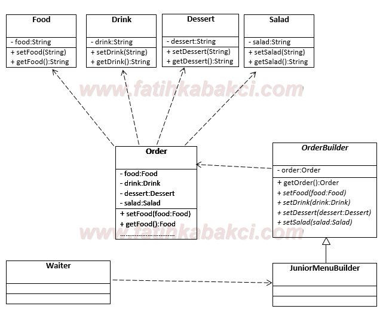

## 1. Creational patterns

### 1.1. Factory Method vs Abstract Factory


__The Factory Method__ is usually categorised by a switch statement where each case returns a different class, using the same root interface so that the calling code never needs to make decisions about the implementation.


``` C#

public ICardValidator GetCardValidator (string cardType)
{
    switch (cardType.ToLower())
    {
        case "visa":
            return new VisaCardValidator();
        case "mastercard":
        case "ecmc":
            return new MastercardValidator();
        default:
            throw new CreditCardTypeException("Do not recognise this type");
    }
}
```

__The Abstract Factory__ is where you have multiple concrete factory classes (not Factory Methods) derived from one interface which may return many different types from different methods. (Like Strategy Pattern)


- Simple Factory Method


``` C#
class CustomerFactory
{
    public static ICustomer GetCustomer(int i)
    {       
        switch (i)
        {
            case 1:
                GoldCustomer goldCustomer = new GoldCustomer();
                goldCustomer.GoldOperation();
                goldCustomer.AddPoints();
                goldCustomer.AddDiscount();
                return goldCustomer;               
            case 2:
                SilverCustomer silverCustomer = new SilverCustomer();
                silverCustomer.SilverOperation();
                silverCustomer.AddPoints();
                silverCustomer.AddDiscount();
                return silverCustomer;
            default: return null;
        }      
    }
}

//Client Code
ICustomer c = CustomerFactory.GetCustomer(someIntegerValue);

```


- Factory Method Pattern


``` C#

public abstract class BaseCustomerFactory
{
    public ICustomer GetCustomer()
    {
        ICustomer myCust = this.CreateCustomer();
        myCust.AddPoints();
        myCust.AddDiscount();
        return myCust;
    }
    public abstract ICustomer CreateCustomer();
}

public class GoldCustomerFactory : BaseCustomerFactory
{
    public override ICustomer CreateCustomer()
    {
        GoldCustomer objCust = new GoldCustomer();
        objCust.GoldOperation();
        return objCust;
    }
}
public class SilverCustomerFactory : BaseCustomerFactory
{
    public override ICustomer CreateCustomer()
    {
        SilverCustomer objCust = new SilverCustomer();
        objCust.SilverOperation();
        return objCust;
    }
}
//Client Code
BaseCustomerFactory c = new GoldCustomerFactory();// Or new SilverCustomerFactory();
ICustomer objCust = c.GetCustomer();


```


- Abstract Factory 


Product Interfaces

``` C#

public interface IProcessor 
{
    void PerformOperation();
}
public interface IHardDisk { void StoreData(); }
public interface IMonitor { void DisplayPicture();}

public class ExpensiveProcessor : IProcessor
{
    public void PerformOperation()
    {
        Console.WriteLine("Operation will perform quickly");
    }
}
public class CheapProcessor : IProcessor
{
    public void PerformOperation()
    {
        Console.WriteLine("Operation will perform Slowly");
    }
}

public class ExpensiveHDD : IHardDisk
{
    public void StoreData()
    {
        Console.WriteLine("Data will take less time to store");
    }
}
public class CheapHDD : IHardDisk
{
    public void StoreData()
    {
        Console.WriteLine("Data will take more time to store");
    }
}

public class HighResolutionMonitor : IMonitor
{
    public void DisplayPicture()
    {
        Console.WriteLine("Picture quality is Best");
    }
}
public class LowResolutionMonitor : IMonitor
{
    public void DisplayPicture()
    {
        Console.WriteLine("Picture quality is Average");
    }
}

```
Factory Interfaces and Classes

``` C#

public interface IMachineFactory
{
    IProcessor GetRam();
    IHardDisk GetHardDisk();
    IMonitor GetMonitor();
}

public class HighBudgetMachine : IMachineFactory
{
    public IProcessor GetRam() { return new ExpensiveProcessor(); }
    public IHardDisk GetHardDisk() { return new ExpensiveHDD(); }
    public IMonitor GetMonitor() { return new HighResolutionMonitor(); }
}
public class LowBudgetMachine : IMachineFactory
{
    public IProcessor GetRam() { return new CheapProcessor(); }
    public IHardDisk GetHardDisk() { return new CheapHDD(); }
    public IMonitor GetMonitor() { return new LowResolutionMonitor(); }
}
//Let's say in future...Ram in the LowBudgetMachine is decided to upgrade then
//first make GetRam in LowBudgetMachine Virtual and create new class as follows

public class AverageBudgetMachine : LowBudgetMachine
{
    public override IProcessor GetRam()
    {
        return new ExpensiveProcessor();
    }
}

```
Usage

``` C#
public class ComputerShop
{
    IMachineFactory category;
    public ComputerShop(IMachineFactory _category)
    {
        category = _category;
    }
    public void AssembleMachine()
    {
        IProcessor processor = category.GetRam();
        IHardDisk hdd = category.GetHardDisk();
        IMonitor monitor = category.GetMonitor();
        //use all three and create machine

        processor.PerformOperation();
        hdd.StoreData();
        monitor.DisplayPicture();
    }
}

```
Client Code

``` C#
//Client Code
IMachineFactory factory = new HighBudgetMachine();// Or new LowBudgetMachine();
ComputerShop shop = new ComputerShop(factory);
shop.AssembleMachine();   
```


### 1.2. Builder
Builder (Kurucu) Tasarım Deseni karmaşık yapıdaki nesnelerin oluşturulmasında, istemcinin nesne tipi belirterek üretimi gerçekleştirilebilmesini sağlamak için kullanılır. Yapı olarak Abstract Factory tasarım desenine benzer.

* Builder: Product nesnesinin oluşturulması için gerekli soyut arayüzü sunar.
* ConcreteBuilder: Product nesnesini oluşturur. Product ile ilişkili temel özellikleride tesis eder ve Product' ın elde edilebilmesi için(istemci tarafından) gerekli arayüzü sunar.
* Director: Builder arayüzünü kullanarak nesne örneklemesini yapar.
* Product: Üretim sonucu ortaya çıkan nesneyi temsil eder. Dahili yapısı(örneğin temel özellikleri) ConcreteBuilder tarafından inşa edilir.





Örnek Kod Burak [Selim Şenyurt Builder Tsarım Deseni](https://www.buraksenyurt.com/post/Tasarc4b1m-Desenleri-Builder) sayfasınan alınmıştır.

``` C#

using System;
 
namespace Builder
{
    // Product class
    public class Pizza
    {
        public string PizzaTipi { get; set; }
        public string Hamur { get; set; }
        public string Sos { get; set; }
 
        public override string ToString()
        {
            return String.Format("{0} {1} {2}", PizzaTipi, Hamur, Sos);
        }
    }
 
    // Builder class
    public abstract class PizzaBuilder
    {
        protected Pizza _pizza;
 
        public Pizza Pizza
        {
            get { return _pizza; }
        }
 
        public abstract void SosuHazirla();
        public abstract void HamuruHazirla();
    }
 
    // ConcreteBuilder class
    public class BaharatliPizzaBuilder
        : PizzaBuilder
    {
        public BaharatliPizzaBuilder()
        {
            _pizza = new Pizza { PizzaTipi = "Baharatlı Baharatlı" };
        }
        public override void SosuHazirla()
        {
            _pizza.Sos = "Acı sos, pepperoni, atom biber";
        }
 
        public override void HamuruHazirla()
        {
            _pizza.Hamur = "İnce Kenar, Kaşarlı";
        }
    }
 
    // ConcreteBuilder Class
    public class DortMevsimPizzaBuilder
        : PizzaBuilder
    {
        public DortMevsimPizzaBuilder()
        {
            _pizza = new Pizza { PizzaTipi = "4 Mevsim" };
        }
        public override void SosuHazirla()
        {
            _pizza.Sos = "Biber, Domates, Peynir, Salam, Sosis";
        }
 
        public override void HamuruHazirla()
        {
            _pizza.Hamur = "Kalın, fesleğenli";
        }
    }
 
    // Director Class
    public class VedenikliKamil
    {
        public void Olustur(PizzaBuilder vBuilder)
        {
            vBuilder.SosuHazirla();
            vBuilder.HamuruHazirla();
        }
    }
 
    // Client class
    class Program
    {
        static void Main(string[] args)
        {
            PizzaBuilder vBuilder;
 
            VedenikliKamil kamil= new VedenikliKamil();
            vBuilder = new BaharatliPizzaBuilder();
             
            kamil.Olustur(vBuilder);
            Console.WriteLine(vBuilder.Pizza.ToString());
 
            vBuilder = new DortMevsimPizzaBuilder();
            kamil.Olustur(vBuilder);
            Console.WriteLine(vBuilder.Pizza.ToString());
        }
    }
}

```


### 1.3. Prototype


Bazı nesnelerin New operatörü ile oluşturulmasının maliyetli (bellek alanı, oluşturulma süreci vs.) olduğu durumlar söz konusu olabilir. İşte bu gibi durumlarda var olan bir nesnenin kopyasının alınması her zaman daha az maliyetli olacak ve bizlere zaman + performans kazandıracaktır.

Nesne yönelimli tarafta da, üretimi pahalı olan nesneler söz konusu olduğunda ve new operatörü ile oluşan maaliyetten kaçınmak istendiğinde, klon nesnelerin üretilmesi yolu tercih edilebilir.


Örnek Kod Burak [Selim Şenyurt Builder Tsarım Deseni](https://buraksenyurt.com/post/Tasarc4b1m-Desenleri-Prototype) sayfasınan alınmıştır.

``` C#
using System;
 
namespace Prototype
{
    // Prototype Class
    abstract class GameScenePrototype
    {
        public abstract GameScenePrototype Clone();
    }
 
    // Concrete Prototype Class A
    class Hero
        :GameScenePrototype
    {
        public int Width { get; set; }
        public int Heigth { get; set; }
        public string Name { get; set; }
        public HeroType Type { get; set; }
 
        public Hero(int width,int heigth,string name,HeroType heroType)
        {
            Width = width;
            Heigth = heigth;
            Name = name;
            Type = heroType;
        }
 
        public override GameScenePrototype Clone()
        {
            return this.MemberwiseClone() as GameScenePrototype;
        }
    }
 
    // Concrete Prototype class B
    class Mine
        :GameScenePrototype
    {
        public double Gravity{ get; set; }
        public MineType Type { get; set; }
 
        public Mine(double gravity,MineType mineType)
        {
            Gravity = gravity;
            Type = mineType;
        }
 
        public override GameScenePrototype Clone()
        {
            return this.MemberwiseClone() as GameScenePrototype;
        }
    }
 
 // Prototype Manager class
    class GameSceneManager
    {
        public List<GameScenePrototype> GameObjects { get; set; }
        public GameSceneManager()
        {
            GameObjects = new List<GameScenePrototype>();
        }
    }
 
    #region Yardımcılar
 
    enum HeroType
    {
        Warrior,
        Employee,
        Archer
    }
 
    enum MineType
    {
        Gold,
        Silver,
        Bronze
    }
 
    #endregion
 
    class Program
    {
        static void Main()
        {
            GameSceneManager manager = new GameSceneManager();
 
            Hero hero1 = new Hero(10,20,"Bıkanyus", HeroType.Archer);
            manager.GameObjects.Add(hero1);
            Hero hero2 = new Hero(15, 35, "Wah!tupus", HeroType.Employee);
            manager.GameObjects.Add(hero2);
 
            Mine mine1 = new Mine(3, MineType.Gold);
            manager.GameObjects.Add(mine1);
            Mine mine2 = new Mine(5, MineType.Silver);
            manager.GameObjects.Add(mine2);
 
            // Var olan Mine ve Hero nesne örneklerinden klonlama yapılır
            manager.GameObjects.Add(mine2.Clone() as Mine);
            manager.GameObjects.Add(hero1.Clone() as Hero);
        }
    }
}
```


### 1.4. Singleton

### 1.5. Lazy initialization


## References

[Software Design Patterns - Wiki](http://www.wikizero.biz/index.php?q=aHR0cHM6Ly9lbi53aWtpcGVkaWEub3JnL3dpa2kvRGVzaWduX3BhdHRlcm5fKGNvbXB1dGVyX3NjaWVuY2Up)


[Nihat Koçyiğit - Kodcu](https://kodcu.com/2014/08/design-patterns-1-giris-factory-ve-abstract-factory-tasarim-kaliplari-2/
)

[CodeProject - Factory Method vs Abstract Factory](https://www.codeproject.com/Articles/716413/Factory-Method-Pattern-vs-Abstract-Factory-Pattern)


[Vivekcek - Factory Method vs Abstract Factory](https://vivekcek.wordpress.com/2013/03/17/simple-factory-vs-factory-method-vs-abstract-factory-by-example/) 


[Burak Selim Şenyurt - Builder Tassarım Deseni](https://www.buraksenyurt.com/post/Tasarc4b1m-Desenleri-Builder)