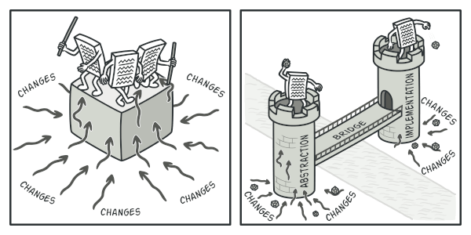
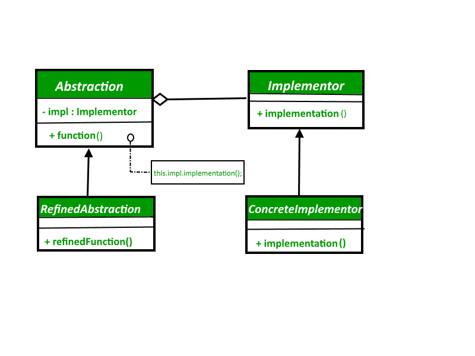

## 2. Structural patterns


Sınıflar arasındaki ilişkileri belirleme önerileri sunar, Nasıl türetilmeli, hangi nesneleri içermeli, sınıflar birbirlerini nasıl bağlı olmalı gibi soruların cevaplarını yanıtlar.

Amaçları itibariyle yapısal kalıplar, sınıflar ve nesnelerin birleştirilerek daha geniş yazılım gruplarının kurulmasına olanak sağlayan öneriler sunar. 

yapısal tasarım kalıpları, varlıklar arasındaki ilişkileri gerçekleştirmenin basit bir yolunu tanımlayarak tasarımı kolaylaştıran tasarım kalıplarıdır.

[İTÜ Bilgişlem Daire Başkanlığı Yapısal (Structural) Tasarım Desenleri](https://bidb.itu.edu.tr/seyir-defteri/blog/2013/09/08/yap%C4%B1sal-kal%C4%B1plar-(structural-patterns))


- Yapısal tasarım desenleri, daha büyük yapılar oluşturmak için sınıfların ve nesnelerin nasıl birleştirilebileceği ile ilgilidir.

- Yapısal tasarım desenleri, ilişkileri tanımlayarak yapıyı basitleştirir.

- Bu örüntüler, sınıfların birbirlerinden nasıl miras aldığı ve diğer sınıflardan nasıl oluştukları üzerine odaklanmaktadır.


### 2.1. Adapter, Wrapper, or Translator

Adaptör kalıp sadece bir sınıfa (class) özel olan arayüzleri diğer sınıflarla uyumlu arayüzler haline getirir. Adaptörler uyumlu olmayan arayüzler sebebiyle birbirleri ile çalışamayan sınıflara da birbirleri ile çalışma imkanı sunarlar.

Farklı interface'lere sahip sınıfların birbiriyle çalışabilmesini sağlamak amacıyla kullanılır. Örnek vermek gerekirse, bir XML dosyasının Document Object Model interface'ini, bir ağaç yapısına dönüştürülmesi için kullanılabilir. 

Faydaları Nedir?

1. Birbiriyle ilişkili olmayan interface'lerin birlikte çalışmasını sağlar. 
2. Kodların yeniden yazılması engeller. 
3. Var olan modül(ler) değiştirilmeden sisteme yeni modüller eklenebilir. 


Bildiğimiz gerçek hayattaki adaptör gibi çalışır.

örneğin Amerika fişlerine uyumlu bir cihazı Türkiye'de kullanamk için kullanığımız adaptör gibi.

Adapter tasarım deseninde 4 temel yapı vardır. Bunlar;

1. Adaptee : Mevcut sisteme uydurulmak istenen nesne.

2. Adapter: Mevcur sisteme uydurma işlemi yapan nesne.

3. Target: İhtiyaç duyulan class veya interface.

4. Client: İşlemleri gerçekleştirdiğimiz ortak sınıf.İstemci , uygulama.


[Kesin Bakılmalı](https://refactoring.guru/design-patterns/adapter)


``` C#


using System;
 
namespace Structural.Adapter
{
  /// <summary>

  /// MainApp startup class for Structural

  /// Adapter Design Pattern.

  /// </summary>

  class MainApp

  {
    /// <summary>

    /// Entry point into console application.

    /// </summary>

    static void Main()
    {
      // Create adapter and place a request

      Target target = new Adapter();
      target.Request();
 
      // Wait for user

      Console.ReadKey();
    }
  }
 
  /// <summary>

  /// The 'Target' class

  /// </summary>

  class Target

  {
    public virtual void Request()
    {
      Console.WriteLine("Called Target Request()");
    }
  }
 
  /// <summary>

  /// The 'Adapter' class

  /// </summary>

  class Adapter : Target

  {
    private Adaptee _adaptee = new Adaptee();
 
    public override void Request()
    {
      // Possibly do some other work

      //  and then call SpecificRequest

      _adaptee.SpecificRequest();
    }
  }
 
  /// <summary>

  /// The 'Adaptee' class

  /// </summary>

  class Adaptee

  {
    public void SpecificRequest()
    {
      Console.WriteLine("Called SpecificRequest()");
    }
  }
}
 
```

### 2.2. Bridge	


Bu tasarım deseni, soyutlama ile gerçekleştirmeyi ayrı sınıf hiyerarşisi içinde ayırmak için kullanılır. Sınıflara daha fazla bir soyutlama ve genişleme imkanı tanır. Desende hem soyutlama kısmı, hem de gerçekleştirme kısmında bir üst sınıfı bulunur. Bu üst sınıfların altındaysa belirli bir sınıf hiyerarşisi bulunur. Bu iki hiyerarşi de birbirlerine bağlıdır. İşte desen, iki kısım arasında köprü gibi bir yapı olarak duran bu bağdan ismini almıştır. Soyutlama kısmında, sistemin daha üst düzey işlemleri bulunur. Gerçekleştirme kısmında ise, bu soyutlama kısmındaki üst düzey işlemlere bağlı daha basit ve bu üst düzey işlemleri detaylandıran işlemler bulunur.  [kaynak](http://www.tasarimdesenleri.com/jsp/tasdesincele/bridge.jsp)


Bir sınıfın yapacağı işlemler belirlenmiş ise ve aynı işi farklı sistemlerde farklı yapılacaksa bu kalıp kullanılır.Bunu da adapter kalıbıyla farklı sistemlerde farklı şekilde kullanılmasını sağlayabiliriz.Köprü oluşumunda abstract factory kalıbı genelde kullanılır.Bu kalıp komplex sınıf yapıların oluşmasına engel olur.Bu da bize kontrolü bize verir.Yani bu şablonla kolay ve esnek yönetilebilir bir sistem sağlar bize.Karmaşık ve bakımı zor olan sistemlerin oluşumunu engeller.


You should typically use the Bridge pattern when[source](https://tutorialedge.net/design-patterns/bridge-design-pattern/):

- You require run-time binding of the implementation.
- both the abstractions and their implementations should be extensible by subclassing.
- changes in the implementation of an abstraction should have no impact on clients; that is, their code should not have to be recompiled
- you want to share an implementation among multiple objects and this fact should be hidden from the client.





Implemantor arayüzü ile operasyonlar tanımlanır ve ConcreteImplemantor lar bu arayüzden türeyerek operasyonları gerçekleştirir. Abstraction abstract sınıfı ise içinde Implemantor arayüzünden referans barındırarak Implemantor daki operasyonları çalıştırır. RefinedAbstraction ise Abstraction u uygulayan gerçek sınıf veya senaryoya göre sınıflardır. Client ise Abstraction ve Implemantor türlerinden nesneleri üreterek yapıyı kullanır.


__Ne zaman kullanılır?__

* Abstractions and implementations should be modified independently.
* Changes in the implementation of an abstraction should have no impact on clients.
* The Bridge pattern is used when a new version of a software or system is brought out, but the older version of the software still running for its existing client. There is no need to change the client code, but the client need to choose which version he wants to use.





__The classes and objects participating in this pattern are:__

- Abstraction   (BusinessObject)
    - defines the abstraction's interface.
    - maintains a reference to an object of type Implementor.
- RefinedAbstraction   (CustomersBusinessObject)
    - extends the interface defined by Abstraction.
- Implementor   (DataObject)
    - defines the interface for implementation classes. This interface doesn't have to correspond exactly to Abstraction's interface; in fact the two interfaces can be quite different. Typically the Implementation interface provides only primitive operations, and Abstraction defines higher-level operations based on these primitives.
- ConcreteImplementor   (CustomersDataObject)
    - implements the Implementor interface and defines its concrete implementation.

[Refactoring Guru- tavsiye olunur](https://refactoring.guru/design-patterns/bridge)

[Kod Kaynak](https://www.dofactory.com/net/bridge-design-pattern)

``` C#
sing System;
 
namespace DoFactory.GangOfFour.Bridge.Structural
{
  /// <summary>

  /// MainApp startup class for Structural

  /// Bridge Design Pattern.

  /// </summary>

  class MainApp

  {
    /// <summary>

    /// Entry point into console application.

    /// </summary>

    static void Main()
    {
      Abstraction ab = new RefinedAbstraction();
 
      // Set implementation and call

      ab.Implementor = new ConcreteImplementorA();
      ab.Operation();
 
      // Change implemention and call

      ab.Implementor = new ConcreteImplementorB();
      ab.Operation();
 
      // Wait for user

      Console.ReadKey();
    }
  }
 
  /// <summary>

  /// The 'Abstraction' class

  /// </summary>

  class Abstraction

  {
    protected Implementor implementor;
 
    // Property

    public Implementor Implementor
    {
      set { implementor = value; }
    }
 
    public virtual void Operation()
    {
      implementor.Operation();
    }
  }
 
  /// <summary>

  /// The 'Implementor' abstract class

  /// </summary>

  abstract class Implementor

  {
    public abstract void Operation();
  }
 
  /// <summary>

  /// The 'RefinedAbstraction' class

  /// </summary>

  class RefinedAbstraction : Abstraction

  {
    public override void Operation()
    {
      implementor.Operation();
    }
  }
 
  /// <summary>

  /// The 'ConcreteImplementorA' class

  /// </summary>

  class ConcreteImplementorA : Implementor

  {
    public override void Operation()
    {
      Console.WriteLine("ConcreteImplementorA Operation");
    }
  }
 
  /// <summary>

  /// The 'ConcreteImplementorB' class

  /// </summary>

  class ConcreteImplementorB : Implementor

  {
    public override void Operation()
    {
      Console.WriteLine("ConcreteImplementorB Operation");
    }
  }
}

```

Sonuç
``` C#
//Output
ConcreteImplementorA Operation
ConcreteImplementorB Operation
```

Gerçek hayat kodu

[Kaynak]()


``` C#
using System;
using System.Collections.Generic;
 
namespace DoFactory.GangOfFour.Bridge.RealWorld
{
  /// <summary>

  /// MainApp startup class for Real-World 

  /// Bridge Design Pattern.

  /// </summary>

  class MainApp

  {
    /// <summary>

    /// Entry point into console application.

    /// </summary>

    static void Main()
    {
      // Create RefinedAbstraction

      Customers customers = new Customers("Chicago");
 
      // Set ConcreteImplementor

      customers.Data = new CustomersData();
 
      // Exercise the bridge

      customers.Show();
      customers.Next();
      customers.Show();
      customers.Next();
      customers.Show();
      customers.Add("Henry Velasquez");
 
      customers.ShowAll();
 
      // Wait for user

      Console.ReadKey();
    }
  }
 
  /// <summary>

  /// The 'Abstraction' class

  /// </summary>

  class CustomersBase

  {
    private DataObject _dataObject;
    protected string group;
 
    public CustomersBase(string group)
    {
      this.group = group;
    }
 
    // Property

    public DataObject Data
    {
      set { _dataObject = value; }
      get { return _dataObject; }
    }
 
    public virtual void Next()
    {
      _dataObject.NextRecord();
    }
 
    public virtual void Prior()
    {
      _dataObject.PriorRecord();
    }
 
    public virtual void Add(string customer)
    {
      _dataObject.AddRecord(customer);
    }
 
    public virtual void Delete(string customer)
    {
      _dataObject.DeleteRecord(customer);
    }
 
    public virtual void Show()
    {
      _dataObject.ShowRecord();
    }
 
    public virtual void ShowAll()
    {
      Console.WriteLine("Customer Group: " + group);
      _dataObject.ShowAllRecords();
    }
  }
 
  /// <summary>

  /// The 'RefinedAbstraction' class

  /// </summary>

  class Customers : CustomersBase

  {
    // Constructor

    public Customers(string group)
      : base(group)
    {
    }
 
    public override void ShowAll()
    {
      // Add separator lines

      Console.WriteLine();
      Console.WriteLine("------------------------");
      base.ShowAll();
      Console.WriteLine("------------------------");
    }
  }
 
  /// <summary>

  /// The 'Implementor' abstract class

  /// </summary>

  abstract class DataObject

  {
    public abstract void NextRecord();
    public abstract void PriorRecord();
    public abstract void AddRecord(string name);
    public abstract void DeleteRecord(string name);
    public abstract void ShowRecord();
    public abstract void ShowAllRecords();
  }
 
  /// <summary>

  /// The 'ConcreteImplementor' class

  /// </summary>

  class CustomersData : DataObject

  {
    private List<string> _customers = new List<string>();
    private int _current = 0;
 
    public CustomersData()
    {
      // Loaded from a database 

      _customers.Add("Jim Jones");
      _customers.Add("Samual Jackson");
      _customers.Add("Allen Good");
      _customers.Add("Ann Stills");
      _customers.Add("Lisa Giolani");
    }
 
    public override void NextRecord()
    {
      if (_current <= _customers.Count - 1)
      {
        _current++;
      }
    }
 
    public override void PriorRecord()
    {
      if (_current > 0)
      {
        _current--;
      }
    }
 
    public override void AddRecord(string customer)
    {
      _customers.Add(customer);
    }
 
    public override void DeleteRecord(string customer)
    {
      _customers.Remove(customer);
    }
 
    public override void ShowRecord()
    {
      Console.WriteLine(_customers[_current]);
    }
 
    public override void ShowAllRecords()
    {
      foreach (string customer in _customers)
      {
        Console.WriteLine(" " + customer);
      }
    }
  }
}

```

Sonuç

``` C#

Output
Jim Jones
Samual Jackson
Allen Good

------------------------
Customer Group: Chicago
Jim Jones
Samual Jackson
Allen Good
Ann Stills
Lisa Giolani
Henry Velasquez
------------------------

```

Diğer bir örnek

[Kaynak](https://www.dotnettricks.com/learn/designpatterns/bridge-design-pattern-dotnet)


```C#
/// <summary>
/// The 'Abstraction' class
/// </summary>
public abstract class Message
{
 public IMessageSender MessageSender { get; set; }
 public string Subject { get; set; }
 public string Body { get; set; }
 public abstract void Send();
}
 
/// <summary>
/// The 'RefinedAbstraction' class
/// </summary>
public class SystemMessage : Message
{
 public override void Send()
 {
 MessageSender.SendMessage(Subject, Body);
 }
}
 
/// <summary>
/// The 'RefinedAbstraction' class
/// </summary>
public class UserMessage : Message
{
 public string UserComments { get; set; }
 
 public override void Send()
 {
 string fullBody = string.Format("{0}\nUser Comments: {1}", Body, UserComments);
 MessageSender.SendMessage(Subject, fullBody);
 }
}
 
/// <summary>
/// The 'Bridge/Implementor' interface
/// </summary>
public interface IMessageSender
{
 void SendMessage(string subject, string body);
}
 
/// <summary>
/// The 'ConcreteImplementor' class
/// </summary>
public class EmailSender : IMessageSender
{
 public void SendMessage(string subject, string body)
 {
 Console.WriteLine("Email\n{0}\n{1}\n", subject, body);
 }
}
 
/// <summary>
/// The 'ConcreteImplementor' class
/// </summary>
public class MSMQSender : IMessageSender
{
 public void SendMessage(string subject, string body)
 {
 Console.WriteLine("MSMQ\n{0}\n{1}\n", subject, body);
 }
}
 
/// <summary>
/// The 'ConcreteImplementor' class
/// </summary>
public class WebServiceSender : IMessageSender
{
 public void SendMessage(string subject, string body)
 {
 Console.WriteLine("Web Service\n{0}\n{1}\n", subject, body);
 }
}
 
/// <summary>
/// Bridge Design Pattern Demo
/// </summary>
class Program
{
 static void Main(string[] args)
 {
 IMessageSender email = new EmailSender();
 IMessageSender queue = new MSMQSender();
 IMessageSender web = new WebServiceSender();
 
 Message message = new SystemMessage();
 message.Subject = "Test Message";
 message.Body = "Hi, This is a Test Message";
 
 message.MessageSender = email;
 message.Send();
 
 message.MessageSender = queue;
 message.Send();
 
 message.MessageSender = web;
 message.Send();
 
 UserMessage usermsg = new UserMessage();
 usermsg.Subject = "Test Message";
 usermsg.Body = "Hi, This is a Test Message";
 usermsg.UserComments = "I hope you are well";
 
 usermsg.MessageSender = email;
 usermsg.Send();
 
 Console.ReadKey();
 }
}

```


### 2.3. Composite

hiyerarşik şekilde tutulması muhtemek sınıfların düzenlenmesinde kullanılır. örnek olarak web ve locak uygulamalarda sıklıkla kullanılan hiyerarşik menüler gibi.

http://www.turkayurkmez.com/composite-design-pattern/

https://buraksenyurt.com/post/Tasarc4b1m-Desenleri-Composite

http://bidb.itu.edu.tr/seyir-defteri/blog/2013/09/08/bile%C5%9Fik-tasar%C4%B1m-kal%C4%B1b%C4%B1-(composite-design-pattern)


http://safakunel.blogspot.com/2013/11/c-composite-tasarm-deseni-pattern.html


### 2.4. Decorator

Decorator tasarım deseni, structural tasarım desenlerinden biridir. Bir nesneye dinamik olarak yeni özellikler eklemek için kullanılır. Kalıtım kullanmadan da bir nesnenin görevlerini artırabileceğimizi gösterir. 

- Bileşenleri


1. Component : Dinamik olarak sorumluklar eklenebilecek olan asıl nesne için sunulan arayüzdür. Interface veya abstract sınıf olarak tasarlanabilir.
2. ConcreteComponent : Sorumlulukların dinamik olarak eklenebilecekleri asıl bileşen sınıflarıdır. Component arayüzünü uyarlarlar ve abstract sınıf olarak tasarlanırlar.
3. Decorator : Decorator tipi hem Component arayüzünü uygular hemde kendi içerisinde Component tipinden bir nesne örneği referansını barındırır. Bu sebepten UML şemasındanda görüldüğü gibi Decorator ve Component arasında bir Aggregation ilişkisi mevcuttur.
4. ConcreteDecorator : Bileşenlere yeni sorumlulukları eklemekle görevli tiptir. Ek işlevler bu tip içerisinde tanımlanan üyelerdir.


Faydaları Nedir?

1. loosely-coupled uygulamalar yapmayı sağlar. 
2. Runtime zamanında(dinamik olarak) bir nesneye yeni özellikler eklenmesini sağlar. 
3. Özellikleri kalıtım yolu dışında composition ve delegation ile de alınabilmesini sağlar. 
4. open-closed prensibinin uygulandığı tasarım desenidir. 


[Refactoring Guru - Güzel Anlatım](https://refactoring.guru/design-patterns/decorator)

[Do Factory](https://www.dofactory.com/net/decorator-design-pattern)


[Kaynak](https://www.dofactory.com/net/decorator-design-pattern)


``` C#
using System;
using System.Collections.Generic;
 
namespace DoFactory.GangOfFour.Decorator.RealWorld
{
  /// <summary>

  /// MainApp startup class for Real-World 

  /// Decorator Design Pattern.

  /// </summary>

  class MainApp

  {
    /// <summary>

    /// Entry point into console application.

    /// </summary>

    static void Main()
    {
      // Create book

      Book book = new Book("Worley", "Inside ASP.NET", 10);
      book.Display();
 
      // Create video

      Video video = new Video("Spielberg", "Jaws", 23, 92);
      video.Display();
 
      // Make video borrowable, then borrow and display

      Console.WriteLine("\nMaking video borrowable:");
 
      Borrowable borrowvideo = new Borrowable(video);
      borrowvideo.BorrowItem("Customer #1");
      borrowvideo.BorrowItem("Customer #2");
 
      borrowvideo.Display();
 
      // Wait for user

      Console.ReadKey();
    }
  }
 
  /// <summary>

  /// The 'Component' abstract class

  /// </summary>

  abstract class LibraryItem

  {
    private int _numCopies;
 
    // Property

    public int NumCopies
    {
      get { return _numCopies; }
      set { _numCopies = value; }
    }
 
    public abstract void Display();
  }
 
  /// <summary>

  /// The 'ConcreteComponent' class

  /// </summary>

  class Book : LibraryItem

  {
    private string _author;
    private string _title;
 
    // Constructor

    public Book(string author, string title, int numCopies)
    {
      this._author = author;
      this._title = title;
      this.NumCopies = numCopies;
    }
 
    public override void Display()
    {
      Console.WriteLine("\nBook ------ ");
      Console.WriteLine(" Author: {0}", _author);
      Console.WriteLine(" Title: {0}", _title);
      Console.WriteLine(" # Copies: {0}", NumCopies);
    }
  }
 
  /// <summary>

  /// The 'ConcreteComponent' class

  /// </summary>

  class Video : LibraryItem

  {
    private string _director;
    private string _title;
    private int _playTime;
 
    // Constructor

    public Video(string director, string title,
      int numCopies, int playTime)
    {
      this._director = director;
      this._title = title;
      this.NumCopies = numCopies;
      this._playTime = playTime;
    }
 
    public override void Display()
    {
      Console.WriteLine("\nVideo ----- ");
      Console.WriteLine(" Director: {0}", _director);
      Console.WriteLine(" Title: {0}", _title);
      Console.WriteLine(" # Copies: {0}", NumCopies);
      Console.WriteLine(" Playtime: {0}\n", _playTime);
    }
  }
 
  /// <summary>

  /// The 'Decorator' abstract class

  /// </summary>

  abstract class Decorator : LibraryItem

  {
    protected LibraryItem libraryItem;
 
    // Constructor

    public Decorator(LibraryItem libraryItem)
    {
      this.libraryItem = libraryItem;
    }
 
    public override void Display()
    {
      libraryItem.Display();
    }
  }
 
  /// <summary>

  /// The 'ConcreteDecorator' class

  /// </summary>

  class Borrowable : Decorator

  {
    protected List<string> borrowers = new List<string>();
 
    // Constructor

    public Borrowable(LibraryItem libraryItem)
      : base(libraryItem)
    {
    }
 
    public void BorrowItem(string name)
    {
      borrowers.Add(name);
      libraryItem.NumCopies--;
    }
 
    public void ReturnItem(string name)
    {
      borrowers.Remove(name);
      libraryItem.NumCopies++;
    }
 
    public override void Display()
    {
      base.Display();
 
      foreach (string borrower in borrowers)
      {
        Console.WriteLine(" borrower: " + borrower);
      }
    }
  }
}
 

```

Sonuç

``` C#

// Book ------
Author: Worley
Title: Inside ASP.NET
# Copies: 10

// Video -----
Director: Spielberg
Title: Jaws
# Copies: 23
Playtime: 92


Making video borrowable:

// Video -----
Director: Spielberg
Title: Jaws
# Copies: 21
Playtime: 92

borrower: Customer #1
borrower: Customer #2

```


### 2.5. Extension object

TODO: içerik gelecek

### 2.6. Facade


 - Good: You can isolate your code from the complexity of a subsystem.
 - Bad: A facade can become a god object coupled to all classes of an app.


[kod Kaynağı](https://www.dofactory.com/net/facade-design-pattern)
``` C#

using System;
 
namespace DoFactory.GangOfFour.Facade.RealWorld
{
  /// <summary>

  /// MainApp startup class for Real-World 

  /// Facade Design Pattern.

  /// </summary>

  class MainApp

  {
    /// <summary>

    /// Entry point into console application.

    /// </summary>

    static void Main()
    {
      // Facade

      Mortgage mortgage = new Mortgage();
 
      // Evaluate mortgage eligibility for customer

      Customer customer = new Customer("Ann McKinsey");
      bool eligible = mortgage.IsEligible(customer, 125000);
 
      Console.WriteLine("\n" + customer.Name +
          " has been " + (eligible ? "Approved" : "Rejected"));
 
      // Wait for user

      Console.ReadKey();
    }
  }
 
  /// <summary>

  /// The 'Subsystem ClassA' class

  /// </summary>

  class Bank

  {
    public bool HasSufficientSavings(Customer c, int amount)
    {
      Console.WriteLine("Check bank for " + c.Name);
      return true;
    }
  }
 
  /// <summary>

  /// The 'Subsystem ClassB' class

  /// </summary>

  class Credit

  {
    public bool HasGoodCredit(Customer c)
    {
      Console.WriteLine("Check credit for " + c.Name);
      return true;
    }
  }
 
  /// <summary>

  /// The 'Subsystem ClassC' class

  /// </summary>

  class Loan

  {
    public bool HasNoBadLoans(Customer c)
    {
      Console.WriteLine("Check loans for " + c.Name);
      return true;
    }
  }
 
  /// <summary>

  /// Customer class

  /// </summary>

  class Customer

  {
    private string _name;
 
    // Constructor

    public Customer(string name)
    {
      this._name = name;
    }
 
    // Gets the name

    public string Name
    {
      get { return _name; }
    }
  }
 
  /// <summary>

  /// The 'Facade' class

  /// </summary>

  class Mortgage

  {
    private Bank _bank = new Bank();
    private Loan _loan = new Loan();
    private Credit _credit = new Credit();
 
    public bool IsEligible(Customer cust, int amount)
    {
      Console.WriteLine("{0} applies for {1:C} loan\n",
        cust.Name, amount);
 
      bool eligible = true;
 
      // Check creditworthyness of applicant

      if (!_bank.HasSufficientSavings(cust, amount))
      {
        eligible = false;
      }
      else if (!_loan.HasNoBadLoans(cust))
      {
        eligible = false;
      }
      else if (!_credit.HasGoodCredit(cust))
      {
        eligible = false;
      }
 
      return eligible;
    }
  }
}
 
 
```
Sonuç

```C#

Ann McKinsey applies for $125,000.00 loan

Check bank for Ann McKinsey
Check loans for Ann McKinsey
Check credit for Ann McKinsey

Ann McKinsey has been Approved
```


### 2.7. Flyweight


Yapısal(Structural) tasarım kalıplarından olan FlyWeight, bellek tüketimini optimize etmek amacıyla kullanılan bir desendir. Aslında detayına inildiğinde son derece zekice tasarlanmış ve pek çok noktada karşımıza çıkabilecek havuz mantığını içeren bir kalıp olduğu anlaşılabilir. Burada önemli olan nokta, bellek tüketiminin çok fazla sayıda nesnenin bir arada ele alınması sırasında ortaya çıkmasıdır. Buna göre söz konusu nesnelerin ortak olan, paylaşılabilen içerikleri ve bunların dışında kendilerine has durumları olduğu takdirde, nesne üretimlerini sürekli tekrar ettirmektense basit bir havuz içerisinden tedarik ettirmek, uygulamanın harcadığı bellek alanlarının optimize edilmesi için yeterli olacaktır. Bu açıdan bakıldığında desenin, paylaşımlı nesneleri efektif olarak kullanabilmek üzerine odaklandığını söyleyebiliriz.[Kaynak : Burak Selim Şenyurt](https://buraksenyurt.com/post/Tasarc4b1m-Desenleri-FlyWeight) 


Bileşenleri
1. Flyweight: Nesnenin ortak özelliklerini tutan interface veya abstract class.
2. ConcreteFlyweight: Flyweight şablonunu uygulayan farklı Nesneler (örneğimizdeki her bir harf)
3. FlyweightFactory: Nesneleri ortak bir noktada tutan ve paylaşımını sağlayan yapı.
4. Client: İstemci uygulama


Problem


Çözüm


[Kaynak : Refactoring Guru](https://refactoring.guru/design-patterns/flyweight)

FlyweightFactory nesnesi içinde Flyweight listesi saklayarak Flyweight nesnesini uygulayan sınıfları saklar ve bir metot ile bu listedeki elemanlara erişim verir. Bu metot parametre olarak aldığı key değeri ile hangi ConcreteFlyweight nesnesinin istenildiğini anlar ve eğer listede bu nesne yoksa üretip bu listeye ekler ve geri döndürür. Client da ConcreteFlyweight nesnelerini diret oluşturmayıp Flyweight nesnesi üzerinden ister. Extrinsic özellikleri farklı olduğundan client bu özellikleri kendisi tutar.


Örneğin ekrana dağınık bir şekilde şekillerin çizileceğini varsayalım her defasından yeni şekil oluşturmaktansa havuzdan alıp basmak gibi. Ya da 5000 satırılık sadece harften oluşan bir yazı için bellekte 5000 nesne üretmek yerine alfabeyi temsilen 29 nesne tutulmuş. Her bir nesne bellekte 1 byte kaplayacağı varsayılırsa 5000 byte'lık bellek tüketimi 29 byte'a düşürülmüş hafifletilmiş oluyor.


``` C#
using System;
using System.Collections;
 
namespace DoFactory.GangOfFour.Flyweight.Structural
{
  /// <summary>

  /// MainApp startup class for Structural 

  /// Flyweight Design Pattern.

  /// </summary>

  class MainApp

  {
    /// <summary>

    /// Entry point into console application.

    /// </summary>

    static void Main()
    {
      // Arbitrary extrinsic state

      int extrinsicstate = 22;
 
      FlyweightFactory factory = new FlyweightFactory();
 
      // Work with different flyweight instances

      Flyweight fx = factory.GetFlyweight("X");
      fx.Operation(--extrinsicstate);
 
      Flyweight fy = factory.GetFlyweight("Y");
      fy.Operation(--extrinsicstate);
 
      Flyweight fz = factory.GetFlyweight("Z");
      fz.Operation(--extrinsicstate);
 
      UnsharedConcreteFlyweight fu = new

        UnsharedConcreteFlyweight();
 
      fu.Operation(--extrinsicstate);
 
      // Wait for user

      Console.ReadKey();
    }
  }
 
  /// <summary>

  /// The 'FlyweightFactory' class

  /// </summary>

  class FlyweightFactory

  {
    private Hashtable flyweights = new Hashtable();
 
    // Constructor

    public FlyweightFactory()
    {
      flyweights.Add("X", new ConcreteFlyweight());
      flyweights.Add("Y", new ConcreteFlyweight());
      flyweights.Add("Z", new ConcreteFlyweight());
    }
 
    public Flyweight GetFlyweight(string key)
    {
      return ((Flyweight)flyweights[key]);
    }
  }
 
  /// <summary>

  /// The 'Flyweight' abstract class

  /// </summary>

  abstract class Flyweight

  {
    public abstract void Operation(int extrinsicstate);
  }
 
  /// <summary>

  /// The 'ConcreteFlyweight' class

  /// </summary>

  class ConcreteFlyweight : Flyweight

  {
    public override void Operation(int extrinsicstate)
    {
      Console.WriteLine("ConcreteFlyweight: " + extrinsicstate);
    }
  }
 
  /// <summary>

  /// The 'UnsharedConcreteFlyweight' class

  /// </summary>

  class UnsharedConcreteFlyweight : Flyweight

  {
    public override void Operation(int extrinsicstate)
    {
      Console.WriteLine("UnsharedConcreteFlyweight: " +
        extrinsicstate);
    }
  }
}
 
        

```

Sonuç


``` C#
ConcreteFlyweight: 21
ConcreteFlyweight: 20
ConcreteFlyweight: 19
UnsharedConcreteFlyweight: 18
```

Gerçek Hayat Kodu 

``` C#
using System;
using System.Collections.Generic;
 
namespace DoFactory.GangOfFour.Flyweight.RealWorld
{
  /// <summary>

  /// MainApp startup class for Real-World 

  /// Flyweight Design Pattern.

  /// </summary>

  class MainApp

  {
    /// <summary>

    /// Entry point into console application.

    /// </summary>

    static void Main()
    {
      // Build a document with text

      string document = "AAZZBBZB";
      char[] chars = document.ToCharArray();
 
      CharacterFactory factory = new CharacterFactory();
 
      // extrinsic state

      int pointSize = 10;
 
      // For each character use a flyweight object

      foreach (char c in chars)
      {
        pointSize++;
        Character character = factory.GetCharacter(c);
        character.Display(pointSize);
      }
 
      // Wait for user

      Console.ReadKey();
    }
  }
 
  /// <summary>

  /// The 'FlyweightFactory' class

  /// </summary>

  class CharacterFactory

  {
    private Dictionary<char, Character> _characters =
      new Dictionary<char, Character>();
 
    public Character GetCharacter(char key)
    {
      // Uses "lazy initialization"

      Character character = null;
      if (_characters.ContainsKey(key))
      {
        character = _characters[key];
      }
      else

      {
        switch (key)
        {
          case 'A': character = new CharacterA(); break;
          case 'B': character = new CharacterB(); break;
          //...

          case 'Z': character = new CharacterZ(); break;
        }
        _characters.Add(key, character);
      }
      return character;
    }
  }
 
  /// <summary>

  /// The 'Flyweight' abstract class

  /// </summary>

  abstract class Character

  {
    protected char symbol;
    protected int width;
    protected int height;
    protected int ascent;
    protected int descent;
    protected int pointSize;
 
    public abstract void Display(int pointSize);
  }
 
  /// <summary>

  /// A 'ConcreteFlyweight' class

  /// </summary>

  class CharacterA : Character

  {
    // Constructor

    public CharacterA()
    {
      this.symbol = 'A';
      this.height = 100;
      this.width = 120;
      this.ascent = 70;
      this.descent = 0;
    }
 
    public override void Display(int pointSize)
    {
      this.pointSize = pointSize;
      Console.WriteLine(this.symbol +
        " (pointsize " + this.pointSize + ")");
    }
  }
 
  /// <summary>

  /// A 'ConcreteFlyweight' class

  /// </summary>

  class CharacterB : Character

  {
    // Constructor

    public CharacterB()
    {
      this.symbol = 'B';
      this.height = 100;
      this.width = 140;
      this.ascent = 72;
      this.descent = 0;
    }
 
    public override void Display(int pointSize)
    {
      this.pointSize = pointSize;
      Console.WriteLine(this.symbol +
        " (pointsize " + this.pointSize + ")");
    }
 
  }
 
  // ... C, D, E, etc.

 
  /// <summary>

  /// A 'ConcreteFlyweight' class

  /// </summary>

  class CharacterZ : Character

  {
    // Constructor

    public CharacterZ()
    {
      this.symbol = 'Z';
      this.height = 100;
      this.width = 100;
      this.ascent = 68;
      this.descent = 0;
    }
 
    public override void Display(int pointSize)
    {
      this.pointSize = pointSize;
      Console.WriteLine(this.symbol +
        " (pointsize " + this.pointSize + ")");
    }
  }
}
 
 

```

Sonuç


``` C# 
A (pointsize 11)
A (pointsize 12)
Z (pointsize 13)
Z (pointsize 14)
B (pointsize 15)
B (pointsize 16)
Z (pointsize 17)
B (pointsize 18)
```

[Kaynak : Do Factory](https://www.dofactory.com/net/flyweight-design-pattern)


[Alttaki kodlar ise Burak Selim Şenyurt'un web sitesinden]

``` C#
using System.Collections.Generic;
using System;
 
namespace FlyWeight
{
    enum SoldierType
    {
        Private,
        Sergeant
    }
 
    // FlyWeight Class
    abstract class Soldier
    {
        #region Intrinsic Fields
 
        // Bütün FlyWeight nesne örnekleri tarafından ortak olan ve paylaşılan veriler
        protected string UnitName;
        protected string Guns;
        protected string Health;
 
        #endregion
 
        #region Extrinsic Fields
 
        // İstemci tarafından değerlendirilip hesaplanan ve MoveTo operasyonua gönderilerek FlyWeight nesne örnekleri tarafından değerlendirilen veriler
        protected int X;
        protected int Y;
 
        #endregion
 
        public abstract void MoveTo(int x, int y);
    }
 
    // Concrete FlyWeight
    class Private
        : Soldier
    {
        public Private()
        {
            // Intrinsict değerler set edilir
            UnitName = "SWAT";
            Guns = "Machine Gun";
            Health = "Good";
        }
        public override void MoveTo(int x, int y)
        {
            // Extrinsic değerler set edilir ve bir işlem gerçekleştirilir
            X = x;
            Y = y;
            Console.WriteLine("Er ({0}:{1}) noktasına hareket etti", X, Y);
        }
    }
 
    // Concrete FlyWeight
    class Sergeant
        : Soldier
    {
        public Sergeant()
        {
            UnitName = "SWAT";
            Guns = "Sword";
            Health = "Good";
        }
        public override void MoveTo(int x, int y)
        {
            X = x;
            Y = y;
            Console.WriteLine("Çavuş ({0}:{1}) noktasına hareket etti",X,Y);
        }
    }
 
    // FlyWeight Factory
    class SoldierFactory
    {
        // Depolama alanı(Havuz).
        // Uygulama ortamında tekrar edecek olan FlyWeight nesne örnekleri depolama alanında basit birer Key ile ifade edilir
        private Dictionary<SoldierType, Soldier> _soldiers;
 
        public SoldierFactory()
        {
            _soldiers = new Dictionary<SoldierType, Soldier>();
        }
 
        public Soldier GetSoldier(SoldierType sType)
        {
            Soldier soldier = null;
 
            // Eğer depolama alanında, parametre olarak gelen Key ile eşleşen bir FlyWeight nesnesi var ise onu çek
            if (_soldiers.ContainsKey(sType))
                soldier = _soldiers[sType];
            else
            {
                // Yoksa Key tipine bakarak uygun FlyWeight nesne örneğini oluştur ve depolama alanına(havuz) ekle
                if (sType == SoldierType.Private)
                    soldier = new Private();
                else if (sType == SoldierType.Sergeant)
                    soldier = new Sergeant();
                _soldiers.Add(sType, soldier);
            }
 
            // Elde edilen FlyWeight nesnesini geri döndür
            return soldier;
        }
    }
 
    class Program
    {
        public static void Main()
        {
            // İstemci için örnek bir FlyWeight nesne örneği dizisi oluşturulur
            SoldierType[] soldiers = { SoldierType.Private, SoldierType.Private, SoldierType.Sergeant, SoldierType.Private, SoldierType.Sergeant };
 
            // FlyWeight Factory nesnesi örneklernir
            SoldierFactory factory = new SoldierFactory();
 
            // Extrinsic değerler set edilir
            int localtionX = 10;
            int locationY = 10;
 
            foreach (SoldierType soldier in soldiers)
            {                
                localtionX += 10;
                locationY += 5;
                // O anki Soldier tipi için MoveTo operasyonu çağırılmadan önce fabrika nesnesinden tedarik edilir
                Soldier sld = factory.GetSoldier(soldier);
                // FlyWeight nesnesi üzerinden talep edilen operasyon çağrısı gerçekleştirilir
                sld.MoveTo(localtionX, locationY);
            }
        }
    }
}
```


### 2.8. Front controller

TODO : içerik gelecek

### 2.9. Marker

TODO: içerik gelecek

### 2.10. Module

Şuan çoğunlukla JavaScript dünyasinda kullanılan bir design pattern.

javascript design patterneleri için en iyi kaynaklardan birine şu adresten ulabilirsiniz. [JavaScript Design Patterns](https://addyosmani.com/resources/essentialjsdesignpatterns/book/)


konuyla ilgili en sade anlatımlardan biri [şu kaynaktan](https://benmarshall.me/javascript-module-design-pattern/) olduğu gibi aldımm ileride Türkçe anlatımını yarım.

The JavaScript Module Design Pattern also keeps things very simple, easy-to-read, use and uses Objects in a very nice way. Even better, it won’t bloat your code with repetitive this and prototype declarations.

[Detaylı Anlatım - Tüm dillerde örnekler mevcut](http://www.wikizero.biz/index.php?q=aHR0cHM6Ly9lbi53aWtpcGVkaWEub3JnL3dpa2kvTW9kdWxlX3BhdHRlcm4)

Bize faydaları nedir.


* Simplifying dependency management
* Code Organization: let us divide up functionality of our application, provide encapsulation
* Offers code reusability
* Decoupling (easing pain in refactoring)
* Code Extensibility

Module yükleme konusunda piyasada iki format var

* AMD Format — Primarily used for JavaScript modules that need to be included in a browser as opposed to server side JavaScript

* CommonJS Format — Primarily used in server side implementations as part of NodeJS applications


Module konusunda en çok kullanılan kütüphaneler

* RequireJS (AMD genellikde client side)
* CommonJS (server side)
* SystemJS

- __Modules in ES6__

Modules in ES6 are very simple to use. Like other usage of modules, ES6 provides a way to export modules so that they can be specified as dependencies to other modules.

__Exporting Modules__
There is more than one way to export modules in ES6.

1. Include the keyword export in your function definition.
``` javascript

export function setName(name) { ... }
export function getName() { ... }
export function logPlayer() { ... }
```
2. Include an export object with the properties you want to be included in the module.

``` javascript
function addResult() { ... }
function updateScoreboard() { ... }
export { addResult, updateScoreboard };
```

__Importing Modules__

There are also different syntaxes you can use to import modules in JavaScript once they have been exported. Below are a few examples of how we would import the modules exported above.

``` javascript
Import an entire module as scoreboard
import * as scoreboard from ‘./scoreboard.js’;
```
This would be equivalent to saying, “import all the properties we exported from scoreboard.js and call the module scoreboard”. Then we can simply call the properties of scoreboard like so:

``` javascript
scoreboard.updateScoreboard();
```
2. Import specific elements of a module
``` javascript
import { getName as getPlayerName, logPlayer } from ‘./player.js’;
```

Klaisk javascript ile module yazımı

__Anonymous Object Literal return__

``` javascript

var Module = (function () {

  var privateMethod = function () {};
  
  return {
    publicMethodOne: function () {
      // I can call `privateMethod()` you know...
    },
    publicMethodTwo: function () {

    },
    publicMethodThree: function () {

    }
  };

})();


// console.log: Object { name: 'Todd' }
myObjLiteral.publicMethodOne();

```

__Augmenting Modules__


So far we’ve created a nice Module, and returned an Object. But what if we wanted to extend our Module, and include another smaller Module, which extends our original Module?

Let’s assume the following code:


``` javascript

var Module = (function () {

  var privateMethod = function () {
    // private
  };

  var someMethod = function () {
    // public
  };

  var anotherMethod = function () {
    // public
  };
  
  return {
    someMethod: someMethod,
    anotherMethod: anotherMethod
  };

})();

```
Let’s imagine it’s part of our application, but by design we’ve decided to not include something into the core of our application, so we could include it as a standalone Module, creating an extension.

So far our Object for Module would look like:

``` javascript
Object {someMethod: function, anotherMethod: function}
```
But what if I want to add our Module extension, so it ends up with another public method, maybe like this:

``` javascript
Object {someMethod: function, anotherMethod: function, extension: function}
```


A third method is now available, but how do we manage it? Let’s create an aptly named ModuleTwo, and pass in our Module namespace, which gives us access to our Object to extend:
``` javascript
var ModuleTwo = (function (Module) {
    
    // access to `Module`
    
})(Module);

```
We could then create another method inside this module, have all the benefits of private scoping/functionality and then return our extension method. My pseudo code could look like this:

``` javascript
var ModuleTwo = (function (Module) {
    
    Module.extension = function () {
        // another method!
    };
    
    return Module;
    
})(Module || {});

```
Module gets passed into ModuleTwo, an extension method is added and then returned again. Our Object is getting thrown about, but that’s the flexibility of JavaScript.

I can then see (through something like Chrome’s Dev Tools) that my initial Module now has a third property:

``` javascript
// Object {someMethod: function, anotherMethod: function, extension: function}
console.log(Module);

```
Another hint here, you’ll notice I’ve passed in Module || {} into my second ModuleTwo, this is incase Module is undefined – we don’t want to cause errors now do we. What this does is instantiate a new Object, and bind our extension method to it, and return it.


[Diğer Bir Module Pattern Tekniği - Revealing Module Design Pattern](https://weblogs.asp.net/dwahlin/techniques-strategies-and-patterns-for-structuring-javascript-code-revealing-module-pattern)


Global scope içerisinde yer almasını istemediğiniz ve kendinden mesul kod blokları yaratmanızı sağlayan bir tasarım kalıbı olan modül tasarım kalıbı ile birbirinden bağımsız fonksiyonellikler tanımlayıp kolaylıkla yönetebilirsiniz. Revealing versiyonu ise sadece küçük bir ayrıntı olarak, modülün kendi context’i içerisinde yapıyor olduğu tanımlamaları global context’e aktarım noktasında küçük bir fark yaratıyor : return ile geri döndürdüğümüz metodları private scope’un kendisinden alıyor. Şimdi modül kalıbına bir örnek üzerinden gözatabiliriz. [KAynak](https://htmlmag.com/article/javascript-ile-yazilim-gelistirmede-isinizi-kolaylastiracak-araclar-tasarim-kaliplari-bolum2)


``` javascript

/**
 * global.js
 * Global tanımlamalarımızı yaptığımızı düşündüğümüz bir javascript 
 * dosyası olduğunu varsayarak modüllerimizi tanımlayacağımız bir dizi 
 * olarak bu dosyada MODULES adlı dizi tanımlıyoruz.
 */

var MODULES = MODULES || [];
/** 
 * models/Module.js
 * Modüllerimizin referans yaratımını gerçekleştireceğimiz 
 * nesneyi ayrı bir dosyada tutuyoruz.
 */

var Module = function (name, context) {
   this.name = name;
   this.context = context;
}
/**
 * register.js
 * register metodumuz, modül adı ve context adı altında iki property’si olan 
 * Module nesnesinden aldığı her modül referansını MODULES dizimize 
 * set etme işlemini gerçekleştirecek.
 */

var register = (function () {
    return {
        module : function (module) {
            MODULES.push(new Module(module.name, module.context));
        }  
    }
})();
/**
 * init.js
 * init metodumuz ile aslında yarattığımız ancak çalıştırmadığımız 
 * diğer bir deyişle init etmediğimiz modülleri gerçeklemeye yarayacak. 
 * İsmini verdiğimiz her modül başlatılabilecek ve içerisindeki 
 * context bloğu çalıştırılacak.
 */

var init = (function () {
    return {
        module : function (moduleName) {
            for (var counter = 0, len = MODULES.length; counter < len; counter++) {
                if (MODULES[counter]['name'] === moduleName) {
                MODULES[counter]['context']();
            }
        }
    }
}
})();
/**
 * app.js
 * “testModule” adlı modülümü context’i ile birlikte set ediyoruz.
 */

register.module(new Module('testModule', function () {
   console.log('testModule initialized.');
}));

// Ve bu modülü ismini vererek çalıştırıyoruz
init.module(‘testModule’);


```


__jQuery Plugin Module Design Pattern__


[Jquery Plugin](https://learn.jquery.com/plugins/)

[Jquery Code Organization and RequireJS and Deferreds](https://learn.jquery.com/code-organization/)

[Videolu anlatım](http://gregfranko.com/blog/modular-jquery-plugins/)

[Güzel Anlatım](https://www.smashingmagazine.com/2011/10/essential-jquery-plugin-patterns/)

[Kendi Plugin ninizi nassıl yazarsınız](https://blog.teamtreehouse.com/writing-your-own-jquery-plugins)

[Türkçe plugin nasıl yazılır](http://beltslib.net/jquery-eklentisi-yazmak.html)


- __C# Module Orneği__

Tanımlama - kullanım (implementation) altta

``` C#
using System;
using System.IO;
using System.Text;

namespace Consoles {

  public sealed class MainModule {
    private static MainModule Singleton = null;
    public InputStream input = null;
    public OutputStream output = null;
    public ErrorStream error = null;

    // ...

    public MainModule () {
      // does nothing on purpose !!!
    }

    // ...

    public static MainModule GetSingleton() {
      if (MainModule.Singleton == null)
      {
         MainModule.Singleton = new MainModule();
      }

      return MainModule.Singleton;
    }

    // ...

    public void Prepare() {
      //System.WriteLine("console::prepare();");

      this.input  = new InputStream();
      this.output = new OutputStream();
      this.error  = new ErrorStream();
    }
    
    public void Unprepare() {
      this.output = null;
      this.input  = null;
      this.error  = null;
    
      //System.WriteLine("console::unprepare();");
    }
    
    // ...
  
    public void PrintNewLine() {
      System.Console.WriteLine("");
    }
  
    public void PrintString(String Value) {
      System.Console.Write(Value);
    }
  
    public void PrintInteger(Integer Value) {
      System.Console.Write(Value);
    }
  
    public void PrintBoolean(Boolean Value) {
      System.Console.Write(Value);
    }
    
    public void ScanNewLine() {
      // to-do: ...
    }
    
    public void ScanString(String Value) {
      // to-do: ...
    }
  
    public void ScanInteger(Integer Value) {
      // to-do: ...
    }
  
    public void ScanBoolean(Boolean Value) {
      // to-do: ...
    }
    
    // ...
  
  }
}
```


Implemenatation

``` C#
class ConsoleDemo {
    public static Consoles.MainModule Console = null;
   
    public static void Prepare()
    {
      Console = Consoles.MainModule.GetSingleton();
   
      Console.Prepare();
    }
   
    public static void Unprepare()
    {
      Console.Unprepare();
    }
   
    public static void Execute()
    {
      Console.PrintString("Hello World");
      Console.PrintNewLine();
      Console.ScanNewLine();
    }
   
    public static void Main()
    {
      Prepare();
      Execute(args);
      Unprepare();
    }
  }

```


### 2.11. Proxy


Proxy tasarım deseni çalışma maliyeti yüksek işlemlerin olduğu yapılarda, web servisi kullanılan yapılarda, remoting uygulamalarında, operasyonun gerçekleştirilmesinden önce hazırlık yapılması veya ön işlem yapılması durumlarında kullanılır. Uygulanışı basit bir tasarım desenidir. 


Yaratılması pahalı bir çok işlem yapan bir nesneyi taklit eden bir başka nesnenin kullanılmasıdır. Örneğin bir nesne yarattığımızda veya bir nesnenin bir yordamını çağırdığımızda, bu çağırım bellekte çok yer tutan daha başka bir çok nesne yaratabilir veya ağa bağlanma, veritabanından büyük bir veri alma gibi pahalı işlemler yapabilir. Fakat uygulamanın akışına göre, bu işlemleri gerçekten yapmaya ihtiyaç olmayabilir. İşte bu durumlarda, bu pahalı işlemlerden doğan zaman ve kaynak kayıplarını önlemek için özdeş nesne kullanılır. Gerçekten bu pahalı işlem çağırılırsa, gerçek nesne oluşturulup, bu pahalı işlemler ihtiyaç olduğunda yapılır. Bu tasarım deseni kullanılarak, sisteme yük getiren gereksiz pahalı işlemler önlenir, böylece sistem daha hızlı ve sağlıklı hale gelir.


Ne zaman Kullanılır? [Kaynak](http://www.codesenior.com/tutorial/Vekil-Proxy-Tasarim-Deseni)

1. Remote nesne kullanmak istediğimizde kullanılır.(Remote proxy, farklı adres uzayında bulunan bir nesneye lokal temsilci sağlar) 
2. Masraflı nesnelerin ihtiyaç duyulduğunda yaratılmasını sağlamak için(Örneğin resim yüklenmeden önce yükleniyor yazısı göstermek için. Bazı resimlerin boyutu büyük olduğu için yüklenmesi geç olabilmektedir. Burada belirtilen masraflı ifadesi büyük resim nesnesini temsil eder) kullanılır. Bu tarz proxy'lere virtual proxy denir. 
3. Client'ın yetkisine göre işlem yapılıp yapılmamasını belirlemek için kullanılır. (Protection proxy) 


Üç farklı durumda Proxy D.P. kullanılır.

1. Remote(Uzak) Proxy : Remote(uzak) bir nesne kullanılacağı durumlarda kullanılabilir. Uzaktaki nesneye local bir temsilci sağlar ve gerekli kontrolleri yapmamıza olanak tanır.
2. Virtual Proxy : Üretimi yahut kullanımı maliyetli nesnelerin oluşturulması veya kullanılması için tercih edilir. Buna örnek olarak genelde herkesin dillendirdiği resim yükleme işlevini verebiliriz. Yüksek boyutlu bir resmin boyutundan dolayı geç yüklenmesi durumunda verilen -yükleniyor- mesajı ve ardından yükleme işlemi bittiği anda resmin gösterilmesinde kullanılabilir.
3. Protection Proxy : Yetkilendirme yahut login durumlarında kullanılabilir.


Proxy desenini uygularken bu üç duruma genel olarak aşağıdaki terminolojiyle hareket edilecektir.

1. Client:  İstemcidir.
2. Subject: İstemcinin tek bir tip ile çalışmasını sağlayacak olan Interface yahut abstract class’ımızdır. Real Subject ve Proxy nesnelerimizin türediği yapıdır.
3. Real Subject:  O anki işin asıl çalışmasını gerçekleştirecek olan gerçek nesnemizdir.
4. Proxy : Vekil sınıfımızdır. İçerisinde Real Subject referansını taşıyarak istemcinin isteklerine cevap verecektir. Doğal olarak istemci gerçek nesneye dolaylı yoldan Proxy üzerinden erişebilecektir.


``` C#
using System;
 
namespace DoFactory.GangOfFour.Proxy.Structural
{
  /// <summary>

  /// MainApp startup class for Structural

  /// Proxy Design Pattern.

  /// </summary>

  class MainApp

  {
    /// <summary>

    /// Entry point into console application.

    /// </summary>

    static void Main()
    {
      // Create proxy and request a service

      Proxy proxy = new Proxy();
      proxy.Request();
 
      // Wait for user

      Console.ReadKey();
    }
  }
 
  /// <summary>

  /// The 'Subject' abstract class

  /// </summary>

  abstract class Subject

  {
    public abstract void Request();
  }
 
  /// <summary>

  /// The 'RealSubject' class

  /// </summary>

  class RealSubject : Subject

  {
    public override void Request()
    {
      Console.WriteLine("Called RealSubject.Request()");
    }
  }
 
  /// <summary>

  /// The 'Proxy' class

  /// </summary>

  class Proxy : Subject

  {
    private RealSubject _realSubject;
 
    public override void Request()
    {
      // Use 'lazy initialization'

      if (_realSubject == null)
      {
        _realSubject = new RealSubject();
      }
 
      _realSubject.Request();
    }
  }
}
 
```
Sonuç

``` C#
//Called RealSubject.Request()
```
[Kaynak](https://www.dofactory.com/net/proxy-design-pattern)


Gerçek hayat örneği

``` C#

using System;
 
namespace DoFactory.GangOfFour.Proxy.RealWorld
{
  /// <summary>

  /// MainApp startup class for Real-World 

  /// Proxy Design Pattern.

  /// </summary>

  class MainApp

  {
    /// <summary>

    /// Entry point into console application.

    /// </summary>

    static void Main()
    {
      // Create math proxy

      MathProxy proxy = new MathProxy();
 
      // Do the math

      Console.WriteLine("4 + 2 = " + proxy.Add(4, 2));
      Console.WriteLine("4 - 2 = " + proxy.Sub(4, 2));
      Console.WriteLine("4 * 2 = " + proxy.Mul(4, 2));
      Console.WriteLine("4 / 2 = " + proxy.Div(4, 2));
 
      // Wait for user

      Console.ReadKey();
    }
  }
 
  /// <summary>

  /// The 'Subject interface

  /// </summary>

  public interface IMath

  {
    double Add(double x, double y);
    double Sub(double x, double y);
    double Mul(double x, double y);
    double Div(double x, double y);
  }
 
  /// <summary>

  /// The 'RealSubject' class

  /// </summary>

  class Math : IMath

  {
    public double Add(double x, double y) { return x + y; }
    public double Sub(double x, double y) { return x - y; }
    public double Mul(double x, double y) { return x * y; }
    public double Div(double x, double y) { return x / y; }
  }
 
  /// <summary>

  /// The 'Proxy Object' class

  /// </summary>

  class MathProxy : IMath

  {
    private Math _math = new Math();
 
    public double Add(double x, double y)
    {
      return _math.Add(x, y);
    }
    public double Sub(double x, double y)
    {
      return _math.Sub(x, y);
    }
    public double Mul(double x, double y)
    {
      return _math.Mul(x, y);
    }
    public double Div(double x, double y)
    {
      return _math.Div(x, y);
    }
  }
}


```

Sonuç

``` C#

//4 + 2 = 6
//4 - 2 = 2
//4 * 2 = 8
//4 / 2 = 2

```
[Kaynak](https://www.dofactory.com/net/proxy-design-pattern)


### 2.12. Twin

TODO: içerik gelecek