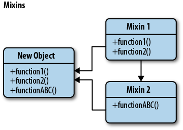

## Mixin


__Javascript__

Mixins are a language concept that allows a programmer to inject some code into a class. Mixin programming is a style of software development, in which units of functionality are created in a class and then mixed in with other classes. 

Javascript gibi protoype yapsına sahip dillerde inheritance olmadığı için bir objeyi extend etme yönetmidir.





örneğin

``` javascript
var myMixins = {

  moveUp: function(){
    console.log( "move up" );
  },

  moveDown: function(){
    console.log( "move down" );
  },

  stop: function(){
    console.log( "stop! in the name of love!" );
  }

};


// We can then easily extend the prototype of existing constructor functions to include this behavior using a helper such as the Underscore.js _.extend() method:

// A skeleton carAnimator constructor
function carAnimator(){
  this.moveLeft = function(){
    console.log( "move left" );
  };
}

// A skeleton personAnimator constructor
function personAnimator(){
  this.moveRandomly = function(){ /*..*/ };
}

// Extend both constructors with our Mixin
_.extend( carAnimator.prototype, myMixins );
_.extend( personAnimator.prototype, myMixins );

// Create a new instance of carAnimator
var myAnimator = new carAnimator();
myAnimator.moveLeft();
myAnimator.moveDown();
myAnimator.stop();

// Outputs:
// move left
// move down
// stop! in the name of love!


```

örneğin Dart dili aynı işi şue şekilde yapar

``` Dart
class B extends A with M {}

```

ECMA Script 5 

``` javascript
// mixin
let sayHiMixin = {
  sayHi() {
    alert(`Hello ${this.name}`);
  },
  sayBye() {
    alert(`Bye ${this.name}`);
  }
};

// usage:
class User {
  constructor(name) {
    this.name = name;
  }
}

// copy the methods
Object.assign(User.prototype, sayHiMixin);

// now User can say hi
new User("Dude").sayHi(); // Hello Dude!
```


__CSS__


A mixin lets you make groups of CSS declarations that you want to reuse throughout your site. You can even pass in values to make your mixin more flexible. A good use of a mixin is for vendor prefixes. Here's an example for transform.


``` SCSS
@mixin transform($property) {
  -webkit-transform: $property;
  -ms-transform: $property;
  transform: $property;
}

.box { @include transform(rotate(30deg)); }

```


__Python__


Code that is shared among objects without being part of a concrete base class.


[Kaynak](https://www.ianlewis.org/en/mixins-and-python)

Python supports a simple type of multiple inheritance which allows the creation of Mixins. Mixins are a sort of class that is used to "mix in" extra properties and methods into a class. This allows you to create classes in a compositional style.


``` Python
class Mixin1(object):
    def test(self):
        print "Mixin1"

class Mixin2(object):
    def test(self):
        print "Mixin2"

class MyClass(BaseClass, Mixin1, Mixin2):
    pass

```


However, in Python the class hierarchy is defined right to left, so in this case the Mixin2 class is the base class, extended by Mixin1 and finally by BaseClass. This is usually fine because many times the mixin classes don't override each other's, or the base class' methods. But if you do override methods or properties in your mixins this can lead to unexpected results because the priority of how methods are resolved is from left to right.


Sonuç

```Python
obj = MyClass()
obj.test()
# Mixin1

```

The correct way to use mixins is like in the reverse order:

```Python
class MyClass(Mixin2, Mixin1, BaseClass):
    pass
```

This kind of looks counter-intuitive at first because most people would read a top-down class hierarchy from left to right but if you include the class you are defining, you can read correctly up the class hierarchy (MyClass => Mixin2 => Mixin1 => BaseClass. If you define your classes this way you won't have to many conflicts and run into too many bugs.

``` Python
obj = MyClass()
obj.test()
#Mixin2

```


- A Full Example of Python Mixins
This post would be incomplete without a full example of using Python mixins!


``` Python
class WalkerMixin:
    @property
    def max_speed(self):
        return 1


class RunnerMixin:
    @property
    def max_speed(self):
        return 4


class FlierMixin:
    @property
    def max_speed(self):
        return 10


class SortaFastHero(RunnerMixin):
    """This hero can run, which is better than walking."""
    pass


class CuriouslySlowHero(WalkerMixin, FlierMixin):
    """The order of this class's parents made her curiously slow!"""
    pass


class FastestHero(FlierMixin, RunnerMixin):
    """The fastest hero can fly, of course."""
    pass


class Board:
    """An imaginary game board that doesn't do anything."""

    def move(self, piece, actions_spent):
        """Move a piece on the board.

        ``piece`` should be movable
        ``actions_spent`` is the number of actions taken to move

        """
        # Fictitious piece-moving machinery here
        return actions_spent * piece.max_speed


def main():
    board = Board()
    rows = (
        ('Hero', 'Total spaces moved'),
        ('a sorta fast hero', board.move(SortaFastHero(), 2)),
        ('a curiously slow hero', board.move(CuriouslySlowHero(), 2)),
        ('the fastest hero', board.move(FastestHero(), 2))
    )
    print('\n')
    for description, movement in rows:
        print("\t{:<22} {:>25}".format(description, movement))


if __name__ == '__main__':
    main()

```

Sonuç

``` Python

#Hero                          Total spaces moved
#a sorta fast hero                              8
#a curiously slow hero                          2
#the fastest hero                              20

```