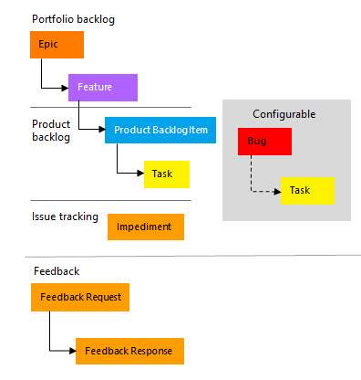
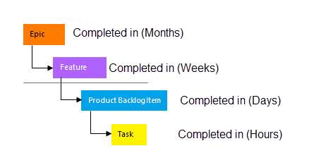
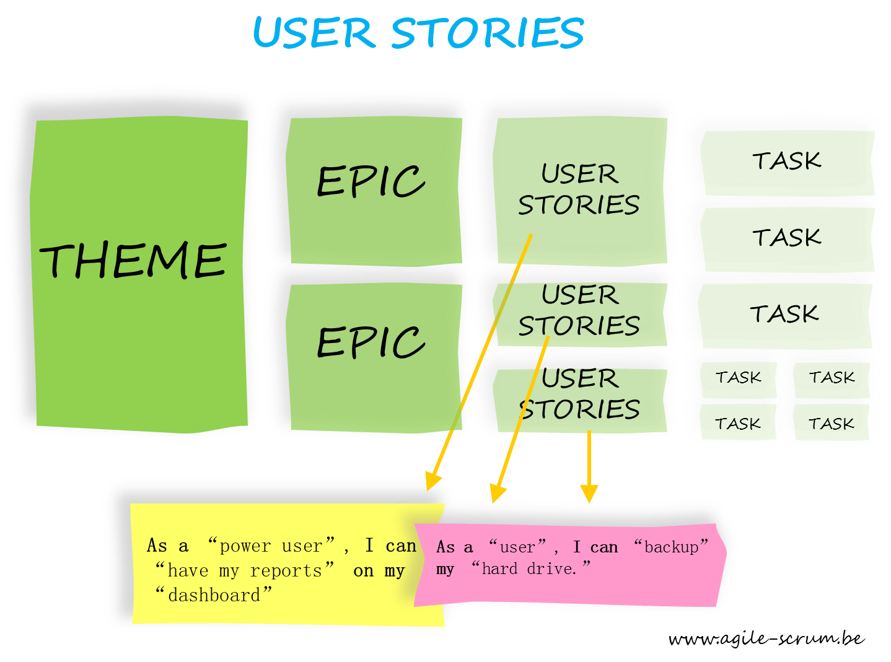
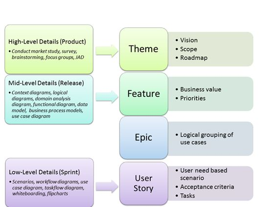
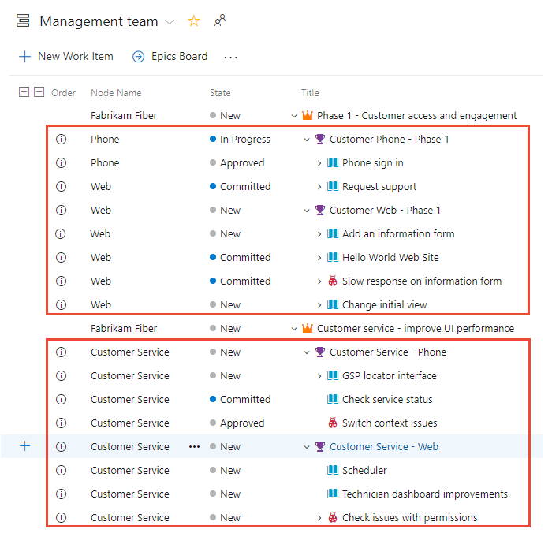
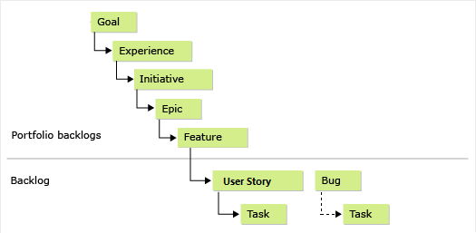

#### Agile ve Scrum Süreçleri

- [Agile Süreci ve Scrum](http://www.defnesarlioglu.com/agile-sureci-ve-scrum/)

- [Scrum Roller ve Sorumluluklar - Yılmaz Cihan](http://www.yilmazcihan.com/scrum-roller-ve-sorumluluklar/)

- [Kanban](http://www.yilmazcihan.com/kanban-metodunun-ilkeleri/)

- [Kanban vs Scrum](http://www.yilmazcihan.com/scrum-ve-kanban-arasindaki-benzerlikler-ve-farkliliklar/)

- [Scrum Master Gelişim Programı - Cihan Yılmaz](http://www.yilmazcihan.com/download/scrum-master-gelisim-programi-kitapcigi/)

- [7 Maddede Scrum Çatısı - ListeList](https://listelist.com/scrum-framework-scrum-catisi/amp/)

- [https://listelist.com/scrum-framework-scrum-catisi/amp/](https://listelist.com/cevik-agile-retrospektif-teknikleri/
)

- [https://listelist.com/cevik-agile-retrospektif-teknikleri/
](Etkili Toplantılar İçin 5 Çevik (Agile) Retrospektif Tekniği)

- [https://listelist.com/ayakta-toplanti/
](7 Soruyla Günlük Ayakta Toplantının (Daily Stand-Up Meeting) İncelikleri)

- [5 Soruda Kanban](https://listelist.com/kanban-nedir/)

- [6 Maddede Product Owner](https://listelist.com/6-maddede-urun-sahibi-product-owner-kimdir-ne-yapar/)

- [Başarılı Agile Koçlarının Özellikleri](https://listelist.com/basarili-cevik-koclarin-ozellikleri/
)

- [5 Maddede Scrum Master](https://listelist.com/scrum-master-kimdir-ne-yapar/
)

- [Kullanıcı Hikayesi Detaylandirma - İklim Dilara](http://www.ilkimdilara.com/kullanici-hikayesi-detaylandirma-yontemleri/)

- [Kullanıcı Hikayesi Detaylandırma](https://blog.kloia.com/kullanıcı-hikayesi-detaylandırma-yöntemleri-893680a03a31)

- 

#### User Story Kavramı ve örnekleri

Bu terimlerin kafada iyi oturması lazım. Linkleri takip ediniz. Şekilleri inceleyiniz.
Herşey user Sory ama kapsamına göre farklı isimler alıyor.

Theme --> Epic --> Feature --> Backlog Item --> Task/Bug

3 adet çeviri kitap için Yılmaz Cihan'a teşekkürler. [kaynak](http://www.yilmazcihan.com/ceviri-kitaplarim/)

- [Scrum Klavuzu](http://www.yilmazcihan.com/scrum-kilavuzu/)

- [Scrum Klavuzu Kitap Linki](https://github.com/muratcabuk/Notes/blob/master/scrum-guide-tr.pdf)

- [link](https://www.pem360.com/blog/Agile/Theme-Konu-User-Story-Kullanici-Hikayesi-ve-Epic-Destan-Kavramlari/213) 

- [link](http://www.ilkimdilara.com/kullanici-hikayesi/)

- [link](https://docs.ca.com/en-us/ca-agile-central/saas/writing-great-user-story)

- [link](https://sherpa.blog/makale/use-case-mi-user-story-mi)

Feature Epic Backlog Item Zaman ayrımı

User Story (Kullanıcı Hikayesi), developer ın bir iterasyonda yapabileceği belli bir iş değeri olan iş parçalarıdır.

Doğru yazılmış user story ler aşağıdaki kriterleri sağlamalıdır. (ingilzice kısaltması INVEST). googla translate e yapıştırığ bakabilirsiniz

- __Independent__ 	We want to be able to develop in any sequence.
- __Negotiable__ 	Avoid too much detail; keep them flexible so the team can adjust how much of the story to implement.
- __Valuable__ 	Users or customers get some value from the story.
- __Estimatable__ 	The team must be able to use them for planning.
- __Small__ 	Large stories are harder to estimate and plan. By the time of iteration planning, the story should be able to be designed, coded, and tested within the iteration.
- __Testable__ 	Document acceptance criteria, or the definition of done for the story, which lead to test cases.

genellikle şu kalıp kullanılarak yazılır ve kim, ne ve ne için sorularına cevap verir.

As a <user type>, I want to <function> so that <benefit> .

....... kişisi olarak,..........nedenle, ........... istiyorum.

#### Çok eksik yazılmış ne olduğu belli olmayan örnek 

- A team member can view iteration status. 

#### Fazla detaylı yazılmış örnek

- A team member can view a table of stories with rank , name, size, package , owner and status.
- A team member can click a red button to expand the table to include detail, which lists all the tasks, with rank, name, estimate, owner, status.

#### Doğru yazılmış örnekler

- As a consumer, I want shopping cart functionality to easily purchase items online.
- As an executive, I want to generate a report to understand which departments need to improve their productivity.
- A team member can view the iteration's stories and their status with main fields.
- A team member can view the current burndown chart on the status page, and can click it for a larger view.
- A team member can view or hide the tasks under the stories.
- A team member can edit a task from the iteration status page.
- Students can purchase monthly parking passes online.
- Parking passes can be paid via credit cards.
- Parking passes can be paid via PayPal.
- Professors can input student marks.
- Students can obtain their current seminar schedule.
- Students can order official transcripts.
- Students can only enroll in seminars for which they have prerequisites.
- Transcripts will be available online via a standard browser.

Karşılaştırmalı örnek tavsiye olunur: [Link](https://tech.gsa.gov/guides/user_story_example/)

#### Azure DevOps 

Define Feature and Epic: 

[link](https://docs.microsoft.com/tr-tr/azure/devops/boards/backlogs/define-features-epics?view=vsts&tabs=new-nav)

Create a Backlog :[link](https://docs.microsoft.com/en-us/azure/devops/boards/backlogs/create-your-backlog?view=vsts&tabs=new-nav)

Portfolio Management : [link](https://docs.microsoft.com/en-us/azure/devops/boards/plans/portfolio-management?view=vsts&tabs=new-nav)

[İş Analistinin Bilmesi Gerekenler](http://www.ilkimdilara.com/agile-is-analistinin-bilmesi-gereken-teknikler/)

#### Kitaplar

Agile ı Anlamak

İki katı işi yarı zamanda yapma sanatı

İleri Seviye Konular  : 
	
SCRUM: Usta Sorulara Uzman Cevaplar

#### Videolar

[Türkçe güzel video](https://www.youtube.com/watch?v=slZ9iA4JH40)

[Bilgisayar Kavramları Agile Methodogy](https://www.youtube.com/watch?v=nHv3-VtiP38&list=PLh9ECzBB8tJOmOydGaV7xr9h13ooEjBkV&index=23)

- XP Planning Game [Bilgisayar Kavramları XP 1](https://www.youtube.com/watch?v=o5s0ZgQUMVQ&list=PLh9ECzBB8tJOmOydGaV7xr9h13ooEjBkV&index=24)

- XP Diğer kavramlar[Bilgisayar Kavramları XP 2](https://www.youtube.com/watch?v=3uDrW74xiPk&list=PLh9ECzBB8tJOmOydGaV7xr9h13ooEjBkV&index=25)

- SCRUM [Bilgisayar Kavramları - SCRUM](https://www.youtube.com/watch?v=Lk7N1zd7Mv8&list=PLh9ECzBB8tJOmOydGaV7xr9h13ooEjBkV&index=26)

#### Sınav Hazırlık

- https://erkancinko.wordpress.com/2015/04/20/professional-scrum-master-i-psm-i-sertifikasi-hakkinda/

- https://erkancinko.wordpress.com/tag/psm-1/

- http://www.yildirimmustafa.com/2015/07/scrum-psm-1-sertifikasi-almak/

- https://www.linkedin.com/pulse/csm-ve-psm-i-sertifikalar%C4%B1-kar%C5%9F%C4%B1la%C5%9Ft%C4%B1rmas%C4%B1-suha-selcuk

- http://www.emrebuyukkurkcu.com/psm-i-sertifika-hazirlik-rehberi/

- http://www.burakavci.com.tr/2016/11/professional-scrum-master.html

- https://www.selsoft.academy/course/agile101-temel-seviye-agilescrum-ve-professional-scrum-master-i-psm-i-sinavina-hazirlik-egitimi/

- http://www.gozdeberberoglu.com/2018/01/12/professional-scrum-master-1-psm-1-sinavina-hazirlik/

### HAzırlık Sorular

- https://www.thescrummaster.co.uk/professional-scrum-master-i-psm-i-practice-assessment

- http://jaganinfo.com/blog/professional-scrum-master-exam-questions-answers-psm1/

