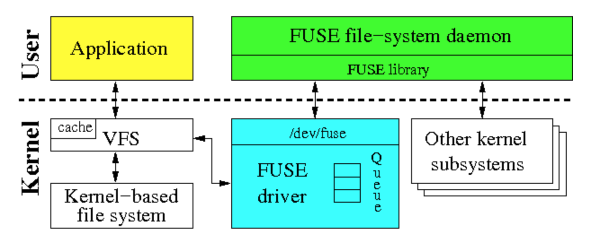
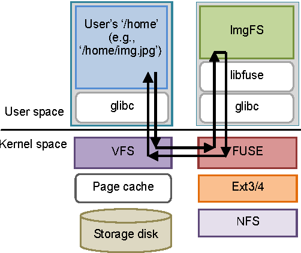
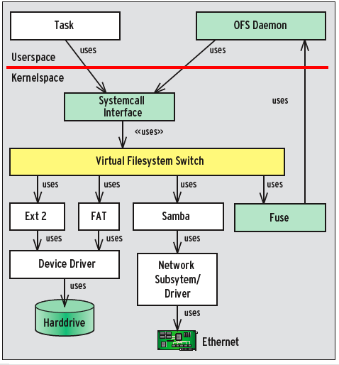

### FUSE (File System in User Space – Kullanıcı Uzayı Dosya Sistemi)

Dosya sistemi(File system); bilgisayara ait verilerin ve dosyaların fiziksel donanım üzerinde depolanmasını ve bu verilere erişimi sağlayan sistemdir. Dosya sistemi fiziksel donanım (hard disk, CD, DVD, flash bellek) üzerinde çalışarak işletim sisteminin bu verilere erişmesini ve bu veriler üzerinde değişiklik yapabilmesini sağlar.

İşletim sistemi, mevcut sanal hafızayı temel olarak iki bölüm halinde kullanmaktadır. Bunlardan birincisi işletim sisteminin kendisi olan çekirdek, çekirdek uzantıları olan uygulamalar ve birçok aygıt sürücüsünün çalıştığı sanal hafızadır. Bu hafıza alanı kernel space (çekirdek uzayı) olarak adlandırılmaktadır. Kullanıcı uzayı (User Space) ise çekirdek uzayı dışında kalan sanal hafızaya verilen isimdir.

FUSE (File System in User Space – Kullanıcı uzayı dosya sistemi) ise; arkaplanında yüklenebilir çekirdek modülü çalışan, kullanıcı uzayında dosya sistemi tanımlamaya imkan veren bir yapıdır. FUSE’un en önemli özelliği; ayrıcalıklı olmayan kullanıcıların (root harici kullanıcılar) farklı dosya sistemine sahip verileri kendi dosya sistemlerine güvenli bir şekilde bağlamalarına (mount) imkan sağlamasıdır. Normal şartlarda bu işlemler çekirdek arayüzü üzerinden yapılmaktadır.

FUSE sistemi temel olarak 3 parçadan oluşmaktadır. Bunlar: "fuse.ko" çekirdek modülü, "lib.fuse" kütüphanesi ve "fusermount" aracıdır. Bu yapılar ile kullanıcı uzayında çalışan uygulamaların lib.fuse kütüphanesi aracılığıyla fuse.ko çekirdek modülüyle haberleşmesi ve bu çekirdek modülünün sanal dosya sistemi üzerinden bağlanmak istenen dosya sistemine erişmesi sağlanmaktadır. Bu yapı aşağıdaki şemada görülmektedir.

### SSHFS

Scp, sftp, rysnc araçları kullanıcı hesaplarındaki dosyaların kolayca ve güvenilir şekilde kopyalanabilmelerini sağlar. Bu dosyaların kopyalanmadan dosya sistemine dahil edilebilmeleri NFS, OpenAFS veya Samba gibi protokoller aracılığıyla mümkün olabilmektedir. Ancak ağ üzerinde çalışan bu dosya sistemlerinin sahip oldukları en büyük dezavantaj, yapılandırılabilmeleri için yönetici yetkilerine sahip olunması gerekliliğidir. SSHFS ise yönetici yetkileri gerektirmeden güvenli bir şekilde dosyaların dosya sistemine bağlanabilmesini sağlamaktadır. Bu özelliğin kullanılabilmesi için uzak sistemde SFTP özelliğine sahip güncel bir SSH sunucunun olması yeterlidir. Modern SSH sunucularının tamamının bu özelliklere sahip olduğu düşünüldüğünde SSHFS’in kullanılabilmesi için FUSE paketiyle birlikte ilgili SSHFS paketinin sisteme yüklenmesi yeterli olmaktadır.

### POSIX, (Portable Operating System Interface for Unix, ˈpɒzɪks) UNIX için Taşınabilir İşletim Sistemi Arabirimi.

Bir işletim sistemi hizmeti kümesi tanımlayan Elektrik ve Elektronik Mühendisleri Enstitüsü (IEEE) standardı. POSIX standardını kullanan programlar bir sistemden diğerine kolayca taşınabilir. POSIX, UNIX sistem hizmetlerine dayanır, ancak başka işletim sistemleri tarafından da geliştirilebilecek biçimde oluşturulmuştur.

İşletim sistemleri kısmen veya tamamen POSIX'le uyumlu olabilirler. Bu, POSIX standartlarına kısmen veya tamamen uymalarından kaynaklanmaktadır. Sertifikalı ürünler, IEEE'nin POSIX sertifikalı Web siteleri (İng. POSIX-Certification-Website) sahifesinde zikredilir.
