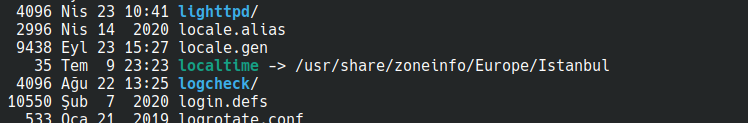

### Ceph Hardway Installation 

- Video: https://www.youtube.com/watch?v=mgC488kLFuk&t=2s
- örnek kurulum : https://www.server-world.info/en/note?os=CentOS_8&p=ceph15&f=1
- Dokuman: https://docs.ceph.com/en/latest/install/index_manual/#deploy-a-cluster-manually
- https://docs.ceph.com/en/latest/install/manual-deployment/


### Ceph Cluster Componenets

Components of Ceph storage cluster

The basic components of a Ceph storage cluster

- Monitors: A Ceph Monitor (ceph-mon) maintains maps of the cluster state, including the monitor map, manager map, the OSD map, and the CRUSH map
- Ceph OSDs: A Ceph OSD (object storage daemon, ceph-osd) stores data, handles data replication, recovery, rebalancing, and provides some monitoring information to Ceph Monitors and Managers by checking other Ceph OSD Daemons for a heartbeat. At least 3 Ceph OSDs are normally required for redundancy and high availability.
- MDSs: A Ceph Metadata Server (MDS, ceph-mds) stores metadata on behalf of the Ceph Filesystem (i.e., Ceph Block Devices and Ceph Object Storage do not use MDS). Ceph Metadata Servers allow POSIX file system users to execute basic commands (like,ls, find etc.) without placing an enormous burden on the Ceph Storage Cluster.\
- Managers: A Ceph Manager daemon (ceph-mgr) is responsible for keeping track of runtime metrics and the current state of the Ceph cluster, including storage utilization, current performance metrics, and system load.


### Başlamadan Önce


eğer azure da ortamı kurmak isterseniz azure-ansible klasöründeki ansible playbook larını çalıştırabilirsiniz.

bu sistem 3 ceph makinası, 1 load balancer ve tet edebilmek için ayrıca 2 windows makimnası ayağa kalddıracaktır.

- bütün makinalara ssh ile bağlanabilişyor olmak lazım. Cluster için kullanılacak 3 makinada extradan takılmış 3 adet disk olması lazım. 

- Azure sitemde biz 3 adet klasik disk takmış olacağız.

- bütün makinlarda ceph in kurulu olduğudna emin olmalıyız. Ubuntu için kurulum. [kaynak](https://docs.ceph.com/en/latest/install/get-packages/#configure-repositories-manually)

    1. aşağıdaki paketleri yüklüyoruz.
    ``` 
    $ sudo apat install ibaio1 libsnappy1 libcurl3 curl libgoogle-perftools4 google-perftools  libleveldb1
    ```


    2. keyleri indirip paketlerimi verify etmek için kullanıyoruz.
    ```
    $ wget -q -O- 'https://download.ceph.com/keys/release.asc' | sudo apt-key add -
    ```
    3. repository ekliyoruz

    ```
    # ubuntu varsiyonumuzu öğreniyoruz ve altta {codename} kısmını silip versiyonu yazıyoruz.
    $ lsb_release -sc

    $ sudo apt-add-repository 'deb https://download.ceph.com/debian-octopus/ {codename} main'
    ```
    4. daha sonra alttaki komutla componentleri yüklüyoruz

    ```
    $ sudo apt install ceph
    ```

tamamen manule yüklemek isitoyrsak ozaman [şu sayfayı](https://docs.ceph.com/en/latest/install/get-packages/#download-packages-manually) ziyaret ediniz.

paketi indirip kurabiliriz.
```
wget -q https://download.ceph.com/debian-{release}/pool/main/c/ceph/ceph_{version}{distro}_{arch}.deb
```


### Monitor Kurulumu 


- [kaynak 1](https://docs.ceph.com/en/latest/install/manual-deployment/#monitor-bootstrapping)


**Başlamadan Önce**

Bir monitörü (teorik olarak bir Ceph Storage Cluster) önyüklemek birkaç şey gerekli:
- **Unique Identifier:** fsid, küme için benzersiz birtanımlayıcıdır ve Ceph Depolama Kümesinin esas olarak Ceph DosyaSistemi için olduğu günlerdeki Dosya Sistemi Kimliği anlamınagelir. Ceph artık yerel interfaceleri, blok aygıtlarını (blockdevices) ve nesne depolama (object storage) ağ geçidiarayüzlerini de destekliyor, bu nedenle fsid biraz yanlışisimlendiriyor.
- **Cluster Name:**  Ceph clusterlerının, boşluksuz basit birdize olan bir küme adı vardır. Varsayılan küme adı ceph'dir,ancak farklı bir küme adı belirtebilirsiniz. Varsayılan kümeadını geçersiz kılmak, özellikle birden fazla küme ile çalışırkenve hangi kümeyle çalıştığınızı açıkça anlamanız gerektiğindekullanışlıdır.
Örneğin, çok bölgeli bir yapılandırmada birden çok kümeçalıştırdığınızda, küme adı (ör. Us-west, us-east) geçerli CLIoturumu için kümeyi tanımlar. Not: Küme adını komut satırıarayüzünde tanımlamak için, Ceph yapılandırma dosyasını kümeadıyla belirtin (ör. Ceph.conf, us-west.conf, us-east.conf, vb.).Ayrıca CLI kullanımına (ceph --cluster {küme-adı}) bakın.
- **Monitor Name (mon):**  Bir küme içindeki her monitörörneğinin benzersiz bir adı vardır. Genel uygulamada, CephMonitor adı ana bilgisayar adıdır (her ana bilgisayar için birCeph Monitor önerilir. Ayrıca Ceph Monitörler ile Ceph OSDDaemonlarının karıştırılmaması önerilir). Kısa ana bilgisayaradını ana bilgisayar adı -s ile alabilirsiniz.
- **Monitor Map:** Monitörleri önyüklemek için  bir monitörharitası oluşturmanız gerektirir. İzleme haritası, fsid, küme adı(veya varsayılanı kullanır) ve en az bir ana bilgisayar adı ve IPadresini gerektirir.
- **Monitor Keyring:**  Monitörler birbirleriyle gizli biranahtar aracılığıyla iletişim kurar. Bir monitör sırrı ile biranahtarlık oluşturmalı ve bunu ilk monitörleri önyüklerkensağlamalısınız.
- **Administrator Keyring:** ceph CLI araçlarını kullanmak içinbir client.admin kullanıcısına sahip olmanız gerekir. Bu nedenle,yönetici kullanıcı ve anahtarlığı oluşturmanız ve ayrıca clientadmin kullanıcısını monitör anahtarlığına eklemeniz gerekir.


1. ceph i kurduğumuzda /etc/ceph klasörü altında ceph.conf idiye bir doya oluşmuş olmalı. Bu dosyaya unique identifier, monitor node ların hostnameleri, public network ip lerimizi ve ip adreslerini ekliyoruz.

unique identifier oluşturmak için uuidgen komutunu çalıştırabiliriz.

```
[global]
fsid = {cluster-id} örn a7f64266-0894-4f1e-a635-d0aeaca0e993
mon initial members = {hostname}[, {hostname}]
mon host = {ip-address}[, {ip-address}] örn 192.168.56.101, 192.168.56.102, 192.168.56.1013  
public network = {network}[, {network}] örn 192.1.68.56.0/24
```

dosyasyı save leyip çıkıyoruz.


2. Node 1 üzerinde işlemleri yapıp bazılarını diğer node lara kopyalaycağız bazılarını ise bütün node larda yapıyor olacağız.

monitor secret key oluşturuyoruz.

node1 de 

```
$ sudo ceph-authtool --create-keyring /tmp/ceph.mon.keyring --gen-key -n mon. --cap mon 'allow *'
```
daha sonra yine node 1 de admin key ouşturuyoruz. client.admin user oluştuyoruz ve ve bu keyring e ekliyoruz.

```
$ sudo ceph-authtool --create-keyring /etc/ceph/ceph.client.admin.keyring --gen-key -n client.admin --cap mon 'allow *' --cap osd 'allow *' --cap mds 'allow *' --cap mgr 'allow *'
```
yine node1 de bu sefer osd keyring i ve client.bootstrap-osd user  ıoluşturup bu key e ekliyoruz.

,,,
$ sudo ceph-authtool --create-keyring /var/lib/ceph/bootstrap-osd/ceph.keyring --gen-key -n client.bootstrap-osd --cap mon 'profile bootstrap-osd' --cap mgr 'allow r'
,,,

daha sonra yine node1 de oluşturulan bu key leri ceph.mon.keyring e ekliyoruz.

```
$ sudo ceph-authtool /tmp/ceph.mon.keyring --import-keyring /etc/ceph/ceph.client.admin.keyring
$ sudo ceph-authtool /tmp/ceph.mon.keyring --import-keyring /var/lib/ceph/bootstrap-osd/ceph.keyring
```

node 1 de ceph.mon.keyring in sahibini ceph:ceph olarak değiştiriyoruz.

```
$ sudo chown ceph:ceph /tmp/ceph.mon.keyring
```
node 1 de hostname şer ve host ip adresleri kullarnark  monitor map oluştururyoruz ve bunu /tmp/monmap olarak saklıyoruz.

```
# $ monmaptool --create --add {hostname} {ip-address} --fsid {uuid} /tmp/monmap
# örneğin
$ monmaptool --create --add node1 192.168.56.101 -add node2 192.168.56.102 node3 192.168.56.103 --fsid a7f64266-0894-4f1e-a635-d0aeaca0e993 /tmp/monmap

```

daha sonra /tmp/nomap dosyasını bütün node lara kopyalıyoruz.

```
$ scp /tmp/nomap adminuser@node2:/tmp
$ scp /tmp/nomap adminuser@node3:/tmp
```


daha sonra ceph.client.admin.keyring dosyasını kopyalıyoruz

```
$ scp /etc/ceph/ceph.client.admin.keyring adminuser@node2:/etc/ceph/
$ scp /etc/ceph/ceph.client.admin.keyring adminuser@node3:/etc/ceph/
```

daha sonra ceph.mon.keyring dosyasını kopyalıyoruz

```
$ scp /tmp/ceph.mon.keyring adminuser@node2:/tmp/
$ scp /tmp/ceph.mon.keyring adminuser@node3:/tmp/
```

3. bütün node larda monitor default data kalsörünü oluşturuyoruz. ve temp klasöründe oluşturduğumuz monitop map ve keyring i taşıyorz.


node 1 için örnek

```
# sudo mkdir /var/lib/ceph/mon/{cluster-name}-{hostname}
$ sudo -u ceph mkdir /var/lib/ceph/mon/ceph-node1

# sudo -u ceph ceph-mon [--cluster {cluster-name}] --mkfs -i {hostname} --monmap /tmp/monmap --keyring /tmp/ceph.mon.keyring
$ sudo -u ceph ceph-mon --mkfs -i node1 --monmap /tmp/monmap --keyring /tmp/ceph.mon.keyring
```

bütün node larda yapıyoruz.


bütün node larda aşağudaki komutla store.db nin olıştuğundan emin oluyoruz.

```
$ ls /var/lib/ceph/mon/ceph-node1
```

4. bütün node larda ceph.cpnf dosyasının aşağıdaki gibi olduğudan emin oluyoruz.


```
[global]
fsid = {cluster-id}
mon initial members = {hostname}[, {hostname}]
mon host = {ip-address}[, {ip-address}]
public network = {network}[, {network}]
cluster network = {network}[, {network}]
auth cluster required = cephx
auth service required = cephx
auth client required = cephx
osd journal size = {n}
osd pool default size = {n}  # Write an object n times.
osd pool default min size = {n} # Allow writing n copies in a degraded state.
osd pool default pg num = {n}
osd pool default pgp num = {n}
osd crush chooseleaf type = {n}
```

örnek 

```
[global]
fsid = {cluster-id} örn a7f64266-0894-4f1e-a635-d0aeaca0e993
mon initial members = {hostname}[, {hostname}] örn nde1, node2, node3
mon host = {ip-address}[, {ip-address}] örn 192.168.56.101, 192.168.56.102, 192.168.56.1013  
public network = {network}[, {network}] örn 192.1.68.56.0/24
auth cluster required = cephx
auth service required = cephx
auth client required = cephx
osd journal size = 1024
osd pool default size = 3
osd pool default min size = 2
osd pool default pg num = 333
osd pool default pgp num = 333
osd crush chooseleaf type = 1
```

5. bütün nod elarda monitor ü başlatıyoruz


node1 için örnek
```
$ sudo systemctl start ceph-mon@node1
```

6. daha sonra monitorun çalıştığını doğruluyoruz

```
$ sudo ceph -s

# sonuç tek node olsaydı aşağıdaki gibi bir sonuç çıkacaktı. ancka bizde 3 tane olduğu için service sayısı 3 tane olacak.

cluster:
  id:     a7f64266-0894-4f1e-a635-d0aeaca0e993
  health: HEALTH_OK

services:
  mon: 1 daemons, quorum node1
  mgr: node1(active)
  osd: 0 osds: 0 up, 0 in

data:
  pools:   0 pools, 0 pgs
  objects: 0 objects, 0 bytes
  usage:   0 kB used, 0 kB / 0 kB avail
  pgs:


```


### Ceph Manager Kurulumu


https://docs.ceph.com/en/latest/mgr/administrator/#manual-setup

1. bütün node larda manager daemon için authentication key oluşturuyoruz.


node1 için örnek

```
$ ceph auth get-or-create mgr.node1 mon 'allow profile mgr' osd 'allow *' mds 'allow *'
```

bu komutu çalıştırdığımızda köşeli parantezlerle başlayan 2 sarırlık key oluşmuş olacak.

bu 2 satırı her node da managerın node hostneme adı ile uyumlu dosyaya kaydediyoruz.

node1 için örnek
```
$ sudo -u ceph mkdir /var/lib/ceph/mgr/ceph-node1
$ sudo -u ceph nano /var/lib/ceph/mgr/ceph-node1/keyring

# daha sonra 2 satırı bu dosyaya yapıştırıp kaydediyoruz
```

daha sonra resmi dökümana göre alttaki komutu çalıştırıp manager daemon u başlatıyoruz

```
$ ceph-mgr -i node1
$ ceph status

# sonuç

mgr active: node1

```

video ya göre aşağıdaki komıtu çalıştırıyoruz

```
$ ceph mon enable-msgr2
$ systemctl restart ceph-mgr@node1
```

2. daha sonra ntpdate yükleyerek sitemin saatini ayarlıyoruz. alternatifi  Chrony. burada amaç tam olarak bütün makinlarda saatin ve saat diliminin aynı olduğundan  emin olmak.


kendi bilgisayarımızda /etc/localtime a baktığımızda aşağıdaki sonucu görebiliriz.




```
$ sudo apt install ntpdate

# etcd saat için bir dosya oluşturutoruz

$ bunun için reginal settingslerde yer alan bölge ülke ve il isimlerinden birini /etc/localtime üzerine kopyalıyoruz. örneğin alttaki komut yukarıda kendi bilgisayarımızdda olan ayarı sunucularda da yapmış olacak. ancak bence en doğrusu zaten sunucular ayağa kaltığında bulundukları yerin ayaralrını kopyalaması.

$ cp /etc/localtime /usr/share/zoneinfo/Europe/Istanbul


```
3. son olarak alttaki komutla cluster ıtest ediyoruz

```
$ ceph -s

# sonuç oalrak ü adet mon 3 adet mgr nin ayakta olduğunu olduğunu görmeliyiz.
```


bu arada manager üzerine bir çok module kurmak mümkün. örneğin web ui dashboard için alttaki linke bakılabilir. 


detaylı konfigürasyonlarıda içeren link


https://docs.ceph.com/en/latest/mgr/dashboard/#enabling

```
$ ceph mgr module enable dashboard
$ ceph mgr module ls
$ ceph mgr services

```

monitorler başlamadna önce dashboar ayarlarıda yapılırsa restart durumlarında problem yaşsanmaz. /etc/ceph/ceph.conf dosyasında aşağıdaki ayar eklenebilir.

```
[mon]
    mgr initial modules = dashboard balancer
```


Daha bir çok module var.


- Dashboard module
- Ceph RESTful API
- Alerts module
- DiskPrediction module
- Local pool module
- RESTful module
- Zabbix module
- Prometheus module
- Influx module
- Hello module
- Telegraf module
- Telemetry module
- Iostat module
- Crash module
- Insights module
- Orchestrator module
- Rook module

### OSD leri Eklemek

1. öncelikle node1 üzerindeki bootstrap-osd kalsörü altındaki ceph.keyring i diğer node lara kopyalıyoruz.

eğer bu madde de sorun yaşanırsa [şu linke](https://docs.ceph.com/en/latest/install/manual-deployment/#long-form) bakılmalıdır. keyring olmayabilir ve yeniden oluşturulması gerekebilir. linkteki madde 4 e bakınız.

node1 de iken
```
$ scp /var/lib/ceph/bootstrap-osd/ceph.keyring adminuser@node2:/var/lib/ceph/bootstrap-osd/

$ scp /var/lib/ceph/bootstrap-osd/ceph.keyring adminuser@node3:/var/lib/ceph/bootstrap-osd/

```
2. daha sonra makinlarımızda (node larda) takılı olan ekstra diski OSD olarak ayarlıyoruz.

bunun için bütün nodelarda _fdisk -l_ komutu ile dislerimizin listesini alıyoruz.

büyük ihtimalle /dev/sdb olan sonradan takılan ektra disktir.

OSD yi create ediyoruz

node1 de iken alttaki komutu çalıştırıyoruz. aynısını bütün node larda yapıyoruz.

```
$ sudo ceph-volume lvm create --data /dev/sdb
```
 komutlar çalıştırıldıklarında osd lere sırasıyla 0,1.2 etc şeklinde id ler verildiğini görebiliriz.

 bütün node larda hangi OSD idsi var onunla OSD yi restart ediyoruz.

örneğin node1 de OSD id si 0 dı

```
$ sudo systemctl restart ceph-osd@0
```

3. volume listesi alınabilir

```
$ sudo ceph-volume lvm list
```


### Metadata Server (MDS) Kurulumu

Kaynak: https://docs.ceph.com/en/latest/install/manual-deployment/#adding-mds

1. aşağıdaki komutlar 3 node da da çalıştırılır.


node1 örneği
```
$ sudo -u ceph mkdir -p /var/lib/ceph/mds/ceph-node1 -p

$ ceph-authtool --create-keyring /var/lib/ceph/mds/ceph-node1/keyring --gen-key -n mds.node-1

# ceph auth add mds.{id} osd "allow rwx" mds "allow" mon "allow profile mds" -i /var/lib/ceph/mds/{cluster}-{id}/keyring yani alttaki


$ ceph auth add mds.node1 osd "allow rwx" mds "allow" mon "allow profile mds" -i /var/lib/ceph/mds/ceph-node1/keyring


$ sudo systemctl restart ceph-mds@node1

```


2. yukarıda node1 de çalıştırılşan komutlar node2 ve 3 için de çalıştırılır. 


3. bütün node larda /etc/ceph/ceph.conf dosyasına en alta  alttaki satırlar eklenir.


```

[mds.node1]
host = node1

[mds.node2]
host = node2

[mds.node3]
host = node3


```

4. daha sonra bütün servisler bütün node larda  baştan başlatırlır.

node1 örneği
```
$ sudo systemctl restart ceph-mon@node1
$ sudo systemctl restart ceph-mgr@node1
$ sudo systemctl restart ceph-mds@node1
$ sudo systemctl restart ceph-osd@0

```

5. daha sonra cluster check edilir

```
$ ceph mds stat
$ ceph -s
```


buraya kadar resimdeki en alt katmanı oluşturmuş olduk


şimdi bu clusterın üstüne object (amazon s3), block (disk) ve file storage (nfs, smb) kurulabilir


### Monitor/OSD Eklemek ve Silmek İçin

- https://docs.ceph.com/en/latest/rados/operations/add-or-rm-mons/#adding-removing-monitors

- https://docs.ceph.com/en/latest/rados/operations/add-or-rm-osds/


### Orchestrator CLI

kaynak : https://docs.ceph.com/en/latest/mgr/orchestrator/

bu module orchestration modulu için command line interface (cli) sunar.

```
$ ceph orch status
$ ceph orch host ls

# OSD cerate eer
$ ceph orch daemon add osd <host>:device1,device2

```

### Ceph Orchestrator ile Ceph componentlerinin yönetimi

**Orchestration CLI** : https://docs.ceph.com/en/latest/mgr/orchestrator/#orchestrator-cli

- ODS : https://docs.ceph.com/en/latest/cephadm/install/#deploy-osds
- MDS: https://docs.ceph.com/en/latest/cephadm/install/#deploy-mdss
- RGW: https://docs.ceph.com/en/latest/cephadm/install/#deploy-rgws
- Deploying NFS ganesha: https://docs.ceph.com/en/latest/cephadm/install/#deploying-nfs-ganesha


### Kurulan Ceph Cluster ın Yönetimi

https://docs.ceph.com/en/latest/rados/#ceph-storage-cluster


### Files System Yönetimi

https://docs.ceph.com/en/latest/cephfs/

örneğin

```
$ ceph fs volume create <fs name>

```
The Ceph Orchestrator (yukarıda bahsi geçen cli) will automatically create and configure MDS for your file system if the back-end deployment technology supports it (see Orchestrator deployment table). Otherwise, please deploy MDS manually as needed.

Finally, to mount CephFS on your client nodes, see Mount CephFS: Prerequisites page. Additionally, a command-line shell utility is available for interactive access or scripting via the cephfs-shell.

### Ceph Block Device (RBD)

https://docs.ceph.com/en/latest/rbd/

Ceph’s block devices deliver high performance with vast scalability to kernel modules, or to KVMs such as QEMU, and cloud-based computing systems like OpenStack and CloudStack that rely on libvirt and QEMU to integrate with Ceph block devices. You can use the same cluster to operate the Ceph RADOS Gateway, the Ceph File System, and Ceph block devices simultaneously.

block device pool oluşturmak için daha önce pool cereate edilmelidir.bunun için [şu sayfayı](https://docs.ceph.com/en/latest/rados/operations/pools/#create-a-pool) ziyaret ediniz.

```
$ rbd pool init <pool-name>
```

eğer block device kullanıcı tanımlanmadıysa sadece admin ler ulaşabilir.

```
$ ceph auth get-or-create client.{ID} mon 'profile rbd' osd 'profile {profile name} [pool={pool-name}][, profile ...]' mgr 'profile rbd [pool={pool-name}]'
```

daha sonra image oluşturmak için

```
$ rbd create --size {megabytes} {pool-name}/{image-name}
```


devamı için kesin bakılmalı

https://docs.ceph.com/en/latest/rbd/rados-rbd-cmds/


### Ceph Object Gateway ()

https://docs.ceph.com/en/latest/radosgw/


---

**Recommendations**

- https://docs.ceph.com/en/latest/start/hardware-recommendations/ (hardware recommendations)
- https://access.redhat.com/documentation/en-us/red_hat_ceph_storage/3/html/red_hat_ceph_storage_hardware_selection_guide/recommended-minimum-hardware-requirements-for-the-red-hat-ceph-storage-dashboard-hardware 

---


- http://bulutwiki.ulakbim.gov.tr/index.php/CEPH_Kurulumu (özellikle parametereler içişn okunmalıdır)
- https://huseyincotuk.com/2018/12/02/ceph-bluestore/ (bluestore nedir)
- https://huseyincotuk.com/2017/12/03/ceph-turkiye-4-meetup-istanbul-ceph-kurulumu/ 
- https://huseyincotuk.com/2017/11/27/ceph-turkiye-3-meetup-ankara-ceph-tasariminda-dikkat-edilecek-hususlar/
- https://huseyincotuk.com/2017/10/15/ceph-turkiye-2-meetup-istanbul-ceph-yapitaslari-ceph-mimarisi-openstack-entegrasyonu/
- https://huseyincotuk.com/2017/06/12/ceph-tasariminda-dikkat-edilmesi-gereken-hususlar/(metin metin olarak güzel hazırlanmış)
- https://ichi.pro/tr/ceph-deneyimimizden-3-vaka-215980997403943
- https://ceph.io/geen-categorie/crushmap-example-of-a-hierarchical-cluster-map/ (crush map le alakalı güzel bi yazı)
- https://sohilladhani.wordpress.com/2016/03/29/how-i-managed-to-deploy-a-2-node-ceph-cluster/ (2 node cluster naıl kurulur, ancak quarom için tavsiye edilmiyor.)
- https://www.rajtechtips.com/2014/06/create-2-node-ceph-storage-cluster/ (2 node cluster - ayarlartı öğrenmek için güzel örnek)

- https://medium.com/@balderscape/setting-up-a-virtual-single-node-ceph-storage-cluster-d86d6a6c658e (tek makina  üzerine cluster kurulumu. ceph 15 octobus ile)
- https://medium.com/@balderscape/how-to-set-up-samba-to-share-a-ceph-filesystem-with-active-directory-access-control-ee96e172b67b (active disrectoey control ile ceph storage ı samba ile paylaşmak)

**red hat resmi sayfası - detaylı ve anlaşılır anlatım**
- https://access.redhat.com/documentation/en-us/red_hat_ceph_storage/4/
- https://access.redhat.com/documentation/en-us/red_hat_ceph_storage/1.3/html/installation_guide_for_ubuntu/index
- 


**iki bölümlük yazoı dizisi**
- https://www.linkedin.com/pulse/red-hat-ceph-storage-asiye-yigit/
- https://www.linkedin.com/pulse/ceph-storage-b%C3%B6l%C3%BCm-2-asiye-yigit/


### Faydalı Linkler
- https://vmknowledge.wordpress.com/2016/01/14/ceph-komutlar-1/
- https://vmknowledge.wordpress.com/category/storage/ceph/
- https://www.youtube.com/watch?v=OFBGeP4WVLw
- https://www.youtube.com/watch?v=2uPhxGXe9gQ
- https://www.youtube.com/watch?v=3cLgCTHLFWc
- https://youtu.be/61b12Y8cMSg?t=1379 (yaşanan zorlukjlara değinmiş)
