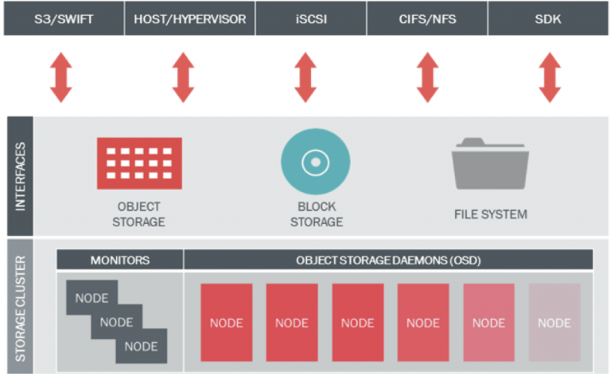
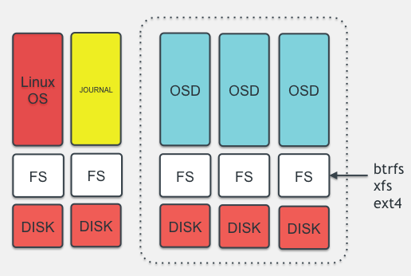
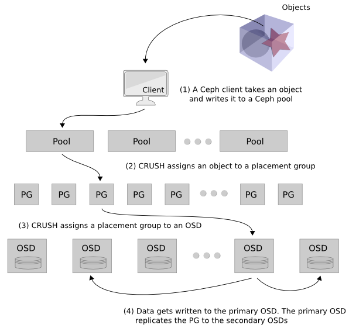
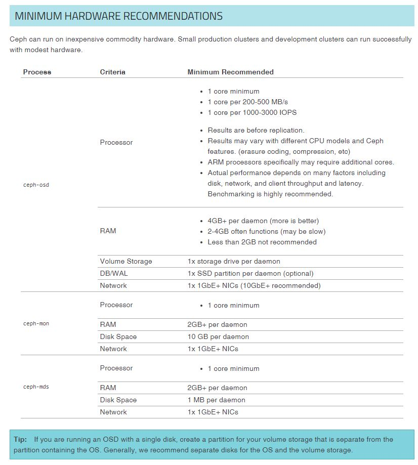

https://blog.storagecraft.com/object-storage-systems/
https://ubuntu.com/blog/what-are-the-different-types-of-storage-block-object-and-file
https://cloudian.com/blog/object-storage-vs-block-storage/
https://www.druva.com/blog/object-storage-versus-block-storage-understanding-technology-differences/

gluster
ceph
minio

https://bidb.itu.edu.tr/seyir-defteri/blog/2013/09/06/linux-dosya-sistemleri

https://www.technopat.net/2018/05/31/linux-dosya-sistemlerini-anlamak-ext4-ve-otesi/


https://www.cozumpark.com/proxmox-6-0-ile-hyper-converged-sistem-kurulumu/


# CEPH
kaynak: https://huseyincotuk.com/2017/06/06/ceph-mimarisi-ceph-uzerinde-veri-yerlesimi/

### Ceph Mimarisi

Ceph daha önce özetlendiği üzere nesne tabanlı ve blok depolama ile dosya sistemi türündeki depolama ortamlarının tamamını bir arada sunan ve bu amaçla 5 temel bileşenden oluşan açık kaynak kodlu bir depolama çözümüdür. Bu 5 bileşen aşağıda açıklanmıştır:

- Ceph OSD (Object Storage Daemon): OSD bileşenleri veriyi nesne halinde tutmakla yükümlüdür. Verinin kopyalar halinde (replikasyon) tutulmasını yönetir. Disk ekleme/çıkarma işlemleri sonrasında verinin depolama ortamı üzerinde yeniden yapılandırılarak gerekli kopyaların oluşturulmasını ve diskler üzerinde dengeli olarak dağıtılmasını sağlar. Ayrıca monitör sunucularına disklerin durumu ile ilgili bilgi sağlar. Önerilen yapıda her disk için ayrı bir OSD kullanılması önemli konulardan birisidir.

- Ceph MON (Monitor):  Monitör bileşenleri tüm depolama ortamının sağlıklı çalışmasını takip amacıyla haritasını tutar. MAP ismi verilen bu haritalar arasında OSD Map, Monitor Map, PG Map ve CRUSH Map bulunur. Monitör bileşenleri diğer tüm bileşenlerden durum bilgilerini alarak haritayı çıkarır ve bunu diğer monitör ve OSD bileşenleri ile paylaşır. Ceph istemcileri bir okuma veya yazma yapacağı zaman yazacağı OSD ve PG’leri belirledikten sonra bu OSD’lerin çalışır durumda olup olmadığına bakar. İlk belirlenen erişilebilir durumda değilse duruma göre 2. veya 3. OSD kullanılır. Burada belirlenen OSD sayısı replikasyon sayısına bağlıdır.

- Ceph RGW (Rados Gateway): RGW, Ceph’in doğrudan nesne tabanlı depolama ortamına erişmeye olanak veren API servisini sağlayan bileşendir. Bu API Amazon S3 ve OpenStack Swift API ile uyumludur.

- Ceph RBD (Rados Block Device): RBD, Ceph’in nesne tabanlı depolama altyapısı üzerinde çalışan ve sanal sunucular, fiziksel sunucular ve diğer istemcilere blok tabanlı depolama sağlayan katmanıdır. OpenStack ve CloudStack desteği bulunur. Ticari çözümlerin sunduğu snapshot, thin-provisioning ve compression gibi özellikleri destekler.
- 
- Ceph FS (File System): Ceph’in nesne tabanlı depolama altyapısını kullanarak istemcilere POSIX uyumlu dosya sistemi vermesini sağlayan katmanıdır. Linux kernel üzerinde CephFS mount etmek üzere hali hazırda destek bulunduğu gibi alternatif olarak FUSE kullanılarak da mount işlemi yapılabilir. Diğer bileşenlerin aksine CephFS çalışmak için bir metadata sunucusuna ihtiyaç duyar.
Aşağıdaki resimde bu bileşenler gösterilmekte olup monitör sunucuları ve OSD sunucuları ile eğer ihtiyaç duyuluyorsa  RGW sunucuları ve metadata sunucuları eklenerek aşağıdaki servisler sağlanabilir.



OSD katmanını biraz daha anlaşılabilir hale getirmek için aşağıdaki resimdeki yapıya dikkat çekilebilir. Depolamanın yapıldığı OSD sunucuları üzerinde işletim sisteminin çalıştığı  bir disk ya da disk grubu bulunur. Bu resmin en solunda bulunan ilk sutünda görülmektedir. Alt katmandaki disk ext3, ext4, xfs gibi bir dosya sistemi ile formatlanarak üzerine işletim sistemi kurulur. Bu tüm sunuculardaki klasik kullanım şeklidir. Yanındaki sütunda sarı renk ile gösterilen journal ise OSD servislerinde çalışan mekanik disklere (SAS, SATA veya NL-SAS gibi) önbellek (cache) olarak bağlanmak üzere tasarlanan ve SSD üzerinde çalışan bir yapıdır. SSD disklerin yüksek yazma hızı ve IOPS performansından faydalanılarak yapılan yazma isteklerini karşılayarak sıralı (sequential) hale getirir. Bu disk üzerinde belirlenen süre boyunca önbelleklenen veri sıralı halde daha hızlı bir şekilde diske yazılır, böylece okunurken de sıralı biçimde daha hızlı okunur. OSD servislerine bağlı mekanik diskler ise resmin sağında yer alan ve kesikli çizgi ile çevrelenen alanda gösterilmektedir. Burada da diskler ext4, xfs veya btrfs gibi dosya sistemi ile formatlanarak OSD servislerine bağlanır. OSD servisi veriyi sunucu üzerine OSD servisleri ile mount edilen bu disklere nesneler halinde yazar.



### Ceph Üzerinde Veri Yerleşimi

Ceph üzerindeki veri yerleşimini anlamak için önce Ceph tarafından kullanılan bazı temel yapı taşlarını anlamak gerekmektedir. Bunlardan bu aşamada gerekli olanlar aşağıda özetlenmiştir:

- Veri Havuzu (Pool): Verileri birbirinden mantıksal olarak ayırmak üzere tasarlanmış, içerisinde imajları barındıran üst seviye bileşenlerdir. Her veri havuzu oluşturulurken veri miktarı ile doğru orantılı olarak belirlenen yerleşim grubu sayısı ile birlikte oluşturulur.

- İmajlar (Images): Veri havuzlarının içerisinde yer alan ve blok depolama kullanmak üzere kullanılan bileşenlerdir.

- Yerleşim Grubu (Placement Group-PG): Verileri gruplamak üzere OSD ve veri havuzları arasında kullanılan yapı taşlarıdır. OSD başına PG ortalamasının 100-150 civarı olması önerilmektedir. OSD başına PG sayısının 300’ü geçmesi sakıncalı bulunmaktadır.

- Kural Grubu (Ruleset): Ceph’in kullandığı CRUSH algoritmasına ait haritanın (CRUSH Map) veriyi özel tanımlar ile hiyerarşik yapıda dağıtmasına izin vermek için kullandığı kurallardır. Varsayılan olarak hiyerarşik yapıda Region/DC/Room/Pod/PDU/Row/Rack/Chassis/Host/OSD olarak tanımlanan sırada örneğin farklı disk tiplerinden farklı veri havuzları oluşturarak (SSD’ler için ayrı, SAS’lar için ayrı, SATA’lar için ayrı) bu kurallar vasıtasıyla ilgili veri havuzlarının ilgili disk gruplarını kullanması sağlanır.

Buna göre herhangi bir istemci bir veri yazma talebinde bulunduğu zaman aşağıdaki resimdeki sıra ile yazılacak alan belirlenir ve replika sayısına göre kopya çıkarılır.



- Öncelikle istemci tarafından yazılacak veri belirlenir ve Ceph üzerinde bulunan bir veri havuzuna yazma talebi yapılır.
- CRUSH algoritması çalıştırılarak istemcinin yazması gereken PG ataması yapılır. Bu esnada herhangi bir metadata sunucusuna veya başka bir lookup tablosuna bakılmaz.
- CRUSH algoritması ayrıca kullanılacak PG’yi bir OSD ile eşler. Böylece istemci veriyi birincil olarak belirlenen PG dolayısıyla  OSD üzerine yazar.
- CRUSH tarafından belirlenen birincil OSD’ye yazma işlemi tamamlanınca, verinin kopyası replika sayısına bağlı olarak diğer OSD’lere yazılır. Örneğin replika sayısı 3 ise birincil OSD’ye yazılan veri 2 ayrı OSD’ye daha kopyalanır. Bu OSD’ler varsayılan CRUSH map ayarlarında farklı sunucular üzerinde olacak şekilde ayarlanmıştır. Tüm kopyalar yazıldıktan sonra istemciye yazma işleminin başarılı olduğu bilgisi verilir.

### CRUSH Algoritması

CRUSH (Controlled Replication Under Scalable Hashing), Ceph üzerinde verinin nereye yazılıp nereden okunacağını bir hesaplama yaparak belirleyen ve hem istemci hem de sunucularda bulunan, bu sayede veri lokasyonu için ikinci bir işlem gerektirmeyen bir algoritmadır. Daha önce bahsedildiği gibi Ceph bu yaklaşım sayesinde yüksek ölçeklere rahatlıkla çıkabilmektedir.

Aslında basite indirgenecek olursa hash işlemine benzer bir hesaplama ile verinin yerleşimi hesaplanır. Bunu bir örnek ile açıklayalım. Elimizdeki “huseyin” nesnesini “cotuk” isimli veri havuzuna yazmak isteyelim. “Cotuk” isimli veri havuzunun kimliği (ID) 5 olsun. Depolama ünitemizde de toplam 32768 PG olsun. Bu durumda:

kaynak : https://huseyincotuk.com/2017/06/06/ceph-mimarisi-ceph-uzerinde-veri-yerlesimi/

- “Huseyin” isimli nesnenin hash’i alınır. hash(‘huseyin’) = 0x894513ce
- PG sayısı ile modulo işlemine tabi tutulur: 0x894513ce mod 32768 = 0x13CE
- Yazılacak veri havuzunun kimliği alınır: 5
- Bulunan iki değer birleştirilerek PG elde edilir. 5.13CE

Ceph bu placement group (PG)’yi kullanarak aktif küme haritası (cluster map) ve kuralları dahil ederek kullanılacak OSD’leri hesaplar.

CRUSH(‘5.13CE’) = [ 7, 26, 16 ]

Burada OSD.7 birincil, OSD.26 ikincil ve OSD.16 üçüncül OSD olarak belirlenmiş olur. Daha önce bahsedildiği gibi buradaki sayı replika sayısına bağlıdır.

Arka planda algortima, depolama ünitesinin nasıl organize edildiğini (cihaz lokasyonları, hiyerarşik dizilişleri, v.b.) bilmesi gerekir. Tüm bu tanımlar CRUSH map ile yapılır.

CRUSH map rolü ve sorumlulukları aşağıdaki gibidir:

- Her hiyerarşik yapı için tanımlanan kurallarla birlikte Ceph’in veriyi nasıl saklayacağını belirler.
- Çok aşamalı olabileceği gibi en az bir düğüm ve yaprak hiyerarşisine sahip olmalıdır.
- Hiyerarşideki her düğüm sepet (bucket) olarak adlandırılır ve her sepetin bir tipi vardır.
- Verileri tutan nesneler disklere verilebilecek ağırlıklara disklere dağıtılır.
- İhtiyaca göre istenilen esneklikte hiyerarşik yapı tanımlanabilir. Tek kısıt en alttaki yaprak ismi verilen düğümler OSD’leri temsil etmelidir. Ayrıca her yaprak düğüm bir sunucuya ya da başka bir tipteki sepete bağlı olmalıdır.
  
Örnek bir CRUSH map hiyerarşisi aşağıda gösterilmiştir.

```
Ceph bu placement group (PG)’yi kullanarak aktif küme haritası (cluster map) ve kuralları dahil ederek kullanılacak OSD’leri hesaplar.

CRUSH(‘5.13CE’) = [ 7, 26, 16 ]

Burada OSD.7 birincil, OSD.26 ikincil ve OSD.16 üçüncül OSD olarak belirlenmiş olur. Daha önce bahsedildiği gibi buradaki sayı replika sayısına bağlıdır.

Arka planda algortima, depolama ünitesinin nasıl organize edildiğini (cihaz lokasyonları, hiyerarşik dizilişleri, v.b.) bilmesi gerekir. Tüm bu tanımlar CRUSH map ile yapılır.

CRUSH map rolü ve sorumlulukları aşağıdaki gibidir:

Her hiyerarşik yapı için tanımlanan kurallarla birlikte Ceph’in veriyi nasıl saklayacağını belirler.
Çok aşamalı olabileceği gibi en az bir düğüm ve yaprak hiyerarşisine sahip olmalıdır.
Hiyerarşideki her düğüm sepet (bucket) olarak adlandırılır ve her sepetin bir tipi vardır.
Verileri tutan nesneler disklere verilebilecek ağırlıklara disklere dağıtılır.
İhtiyaca göre istenilen esneklikte hiyerarşik yapı tanımlanabilir. Tek kısıt en alttaki yaprak ismi verilen düğümler OSD’leri temsil etmelidir. Ayrıca her yaprak düğüm bir sunucuya ya da başka bir tipteki sepete bağlı olmalıdır.
Örnek bir CRUSH map hiyerarşisi aşağıda gösterilmiştir.
```

Bu örnekte 5 adet Ceph OSD sunucusunda hem SSD tipinde hem de NL-SAS tipinde diskler bulunmaktadır. Bu diskler farklı yaprak (leaf) düğümler şeklinde tanımlanıp ilgili sunuculara eklenmiştir.

Ayrıca tanımlanan kurallar da aşağıdaki gibidir:

```
# ceph osd crush rule list
[
   "hdds",
   "ssds"
]
```

Buradaki kuralların CRUSH map içindeki kök (root) düğümler olduğu dikkatten kaçmamalıdır. Bu kuralların detaylarına bakıldığında ise birisinin kimliğinin 0, diğerinin 1 olduğu görülecektir.   

```
# ceph osd crush rule dump hdds
{
   "rule_id": 0,
   "rule_name": "hdds",
   "ruleset": 0,
   "type": 1,
   "min_size": 1,
   "max_size": 10,
   "steps": [
       {
           "op": "take",
           "item": -1,
           "item_name": "hdds"
       },
       {
           "op": "chooseleaf_firstn",
           "num": 0,
           "type": "host"
       },
       {
           "op": "emit"
       }
   ]
}
```

```
# ceph osd crush rule dump ssds
{
   "rule_id": 1,
   "rule_name": "ssds",
   "ruleset": 1,
   "type": 1,
   "min_size": 1,
   "max_size": 10,
   "steps": [
       {
           "op": "take",
           "item": -7,
           "item_name": "ssds"
       },
       {
           "op": "chooseleaf_firstn",
           "num": 0,
           "type": "host"
       },
       {
           "op": "emit"
       }
   ]
}


```


Herhangi bir veri havuzunun ilgili disk grubunu kullanması için bir atama yapılması gerekmektedir.  Şimdi her biri 100 PG’den oluşan bench_hdd ve bench_ssd isimli veri havuzlarını oluşturarak birisini SSD diskleri, diğerini NL-SAS diskleri kullanacak şekilde ayarlayalım.


```
#ceph osd pool create bench_hdd 100 100
#ceph osd pool set bench_hdd crush_ruleset 0
#ceph osd pool create bench_ssd 100 100
#ceph osd pool set bench_ssd crush_ruleset 1
```
İlgili kural setlerine yapılan atama ile artık bu veri havuzları oluşturulan bu disk gruplarını kullanacaktır. Yani bench_hdd veri havuzu kural 0 ile belirtilen ve “hdds” isimli kök düğüm altında kalan tüm sunuculardaki OSD’leri kullanacak, bench_ssd veri havuzu ise kural 1 ile belirtilen ve “ssds” isimli kök düğüm altında kalan tüm sunuculardaki OSD’leri kullanacaktır.


### Architecture

- https://huseyincotuk.com/2017/06/06/ceph-mimarisi-ceph-uzerinde-veri-yerlesimi/
- https://docs.ceph.com/docs/giant/architecture/ (detaylı incelenmeli)
- https://www.youtube.com/watch?v=OFBGeP4WVLw (Ceph Temelleri ve CRUSH MAP Yönetimi)
- https://javiermunhoz.com/blog/2016/02/26/ceph-a-free-unified-distributed-storage-system.html
- https://cephturkiye.com/#baslangi
- https://www.youtube.com/watch?v=OFBGeP4WVLw (Ceph Temelleri ve CRUSH MAP Yönetim
- https://www.youtube.com/watch?v=Vdg27qbzQSM   (32. dakikadan sonrasını kesin izle)

### Recommendation
https://docs.ceph.com/docs/master/start/hardware-recommendations/



https://access.redhat.com/documentation/en-us/red_hat_ceph_storage/1.3/html/hardware_guide/minimum_recommendations

- disk seçimi : https://huseyincotuk.com/2018/12/19/ceph-ssd-nvme-disk-secimi/

### AUTHORIZATON & AUTHENTİCATION

- https://docs.ceph.com/docs/master/radosgw/keycloak/
- https://docs.ceph.com/docs/master/radosgw/ldap-auth/
- https://docs.ceph.com/docs/master/radosgw/vault/
- https://docs.ceph.com/docs/master/radosgw/mfa/


### Installation


There are three services that form the backbone of the cluster

- monitors (ceph-mon) maintain maps of the cluster state and are also responsible for managing authentication between daemons and clients
- managers (ceph-mgr) are responsible for keeping track of runtime metrics and the current state of the Ceph cluster
- object storage daemons (ceph-osd) store data, handle data replication, recovery, rebalancing, and provide some monitoring information
Additionally, we can add further parts to the cluster to support different storage solutions

- metadata servers (ceph-mds) store metadata on behalf of the Ceph Filesystem
- rados gateway (ceph-rgw) is an HTTP server for interacting with a Ceph Storage Cluster that provides interfaces compatible with OpenStack Swift and Amazon S3.


- https://kifarunix.com/setup-three-node-ceph-storage-cluster-on-ubuntu-18-04/
- https://www.youtube.com/watch?v=UyWZvJ-FWyM (kurulum)
- https://www.youtube.com/watch?v=lvnqqTv9eO4  (kurulum
- https://www.cloudeos.com/topluluk/basit-ceph-storage-kurulum
- https://computingforgeeks.com/how-to-deploy-ceph-storage-cluster-on-ubuntu-18-04-lts/
- https://kifarunix.com/setup-three-node-ceph-storage-cluster-on-ubuntu-18-04/
- https://www.youtube.com/watch?v=OFBGeP4WVLw (Ceph Temelleri ve CRUSH MAP Yönetimi)


### Kubernetes


ceph rook ile kubernetesd entegrasyonu

https://medium.com/devopsturkiye/rook-nedir-rook-ile-kubernetes-ortam%C4%B1n%C4%B1za-ceph-storage-entegrasyonu-cabd699d568e

https://www.cloudeos.com/topluluk/bilgi-bankasi/isletim-sistemleri/linux/ubuntu


Rook Cephin kurlumunu kubernetes cluster üzerindeki diskleri kulnarak yapıyor. 

yada ceph ayrıca kurlup disk olarak da bağlanabilir.
https://github.com/kubernetes/examples/tree/master/volumes/cephfs/

https://github.com/kubernetes/examples


### TroubleShooting
- https://www.youtube.com/watch?v=OFBGeP4WVLw (Ceph Temelleri ve CRUSH MAP Yönetimi)


# GLUSTER

__Gluster: scalable file storage with object capabilities__

The differences, of course, are more nuanced than this, based on they way each program handles the data it stores.

Ceph uses object storage, which means it stores data in binary objects spread out across lots of computers. It builds a private cloud system with OpenStack technology, and users can mix unstructured and structured data in the same system.

Gluster uses block storage, which stores a set of data in chunks on open space in connected Linux computers. It builds a highly scalable system with access to more traditional storage and file transfer protocols, and can scale quickly and without a single point of failure. That means you can store huge amounts of older data without losing accessibility or security. An April 2014 study by IOP Science showed that Gluster outperformed Ceph, but still showed some instabilities that resulted in partial or total data loss.


Ceph is an object-based system, meaning it manages stored data as objects rather than as a file hierarchy, spreading binary data across the cluster. Similar object storage methods are used by Facebook to store images and Dropbox to store client files. In general, object storage supports massive unstructured data, so it’s perfect for large-scale data storage. The system is maintained by a network of daemons in the form of cluster monitors, metadata servers, and journaled storage. These combine to make Ceph capable but more complex than the competition.


GlusterFS, better known as Gluster, is a more traditional file store. It’s easy to set up, and a properly-compiled build can be used on any system that has a folder. The flexibility and ease of use is a major advantage of the system. While it can scale to enormous capacities, performance tends to quickly degrade. It’s best suited for large average file sizes (greater than 4 MB) and sequential access. A cluster can spread across physical, virtual, and cloud servers, allowing for flexible storage virtualization.
