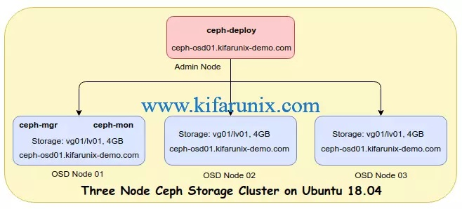
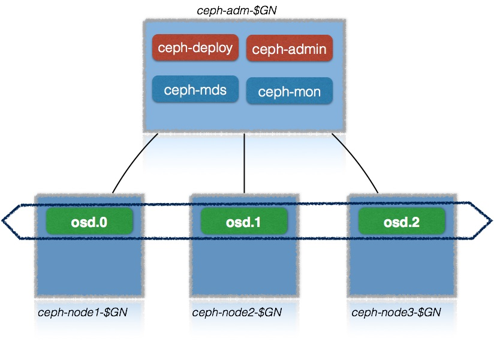
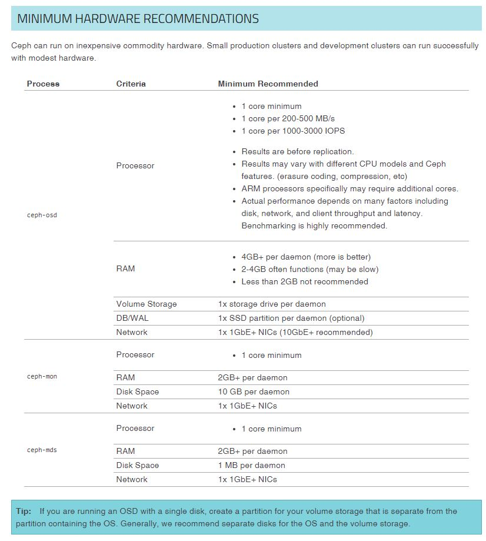

### Intro

ansible ile octobus ceph 15 kurulumu ancak tam destek olmadığında denemiştim tam çalışmadı. yeni versiyon için installation4 klasörüne bakınız.

şuna benzer bir yapı kurmaya çalışcağız.

görüldüğü üzere monitoring ve manager ı il makinaya koyuyoruz normalde bunlarda ayrı makinlarda cluster olarak kurulmalıydı

şimsdilik sadece disklerin replicası için osd deyi 3 adet kuruyoruz.

### minimum requirements

yani 4 makinaya ihtiyaç var

- https://medium.com/@bkayranci/ceph-7c16b983fbde

- https://kifarunix.com/setup-three-node-ceph-storage-cluster-on-ubuntu-18-04/
- https://computingforgeeks.com/how-to-deploy-ceph-storage-cluster-on-ubuntu-18-04-lts/

- https://github.com/infn-bari-school/cloud-storage-tutorials/wiki/Ceph-cluster-installation-(jewel-on-Ubuntu-xenial)

- https://www.marksei.com/how-to-install-ceph-with-ceph-ansible/

- https://kruschecompany.com/ceph-ansible/

- https://computingforgeeks.com/how-to-deploy-ceph-storage-cluster-on-ubuntu-18-04-lts/ 

- https://www.objectif-libre.com/en/blog/2019/01/31/migrating-to-containerized-ceph-on-ubuntu-18-04-a-feedba

- https://access.redhat.com/documentation/en-us/red_hat_ceph_storage/3/html/installation_guide_for_red_hat_enterprise_linux/deploying-red-hat-ceph-storage

### Ceph cluster için gerekenler (ubuntu 18.04 için)

- Systemd (kurulu zaten)
- Podman or Docker for running containers (bunu kuracağız)
- Time synchronization (such as chrony or NTP) (chrony kuracağız)
- LVM2 for provisioning storage devices (kurulu zaten)

