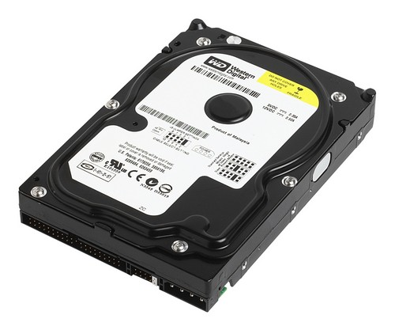
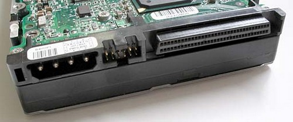
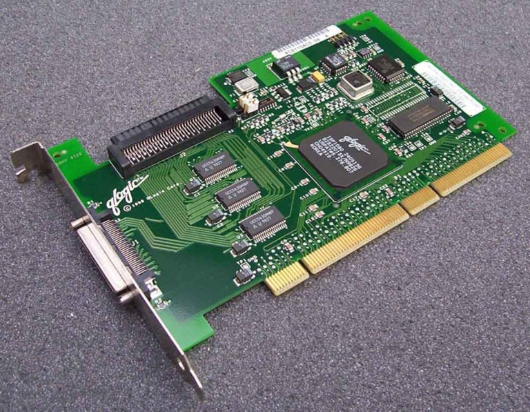
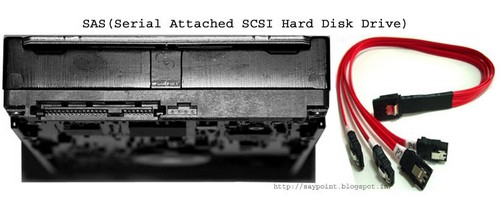

### PATA (IDE)

Paralel ileri teknoloji eklentisi anlamına gelmektedir. Bu kelime ATA, IDE, ATAPI olarak ta birçok yerde geçmektedir. Paralel olarak veri iletimine sahiptir. Sahip olunan arabirim CDROM, DVDROM ve HDD ler içinde aynıdır. 40 ve 80 iletkenli kablo(ribbon kablo) ile anakarta bağlanır.

### SATA (Serial ATA)

Seri olarak veri alışverişine imkan veren PATA’dan sonra çıkartılan bir arabirimdir. İletişim için ATA komut setini kullanmaktadır. Haberleşme tek yönlü yapıdadır. Seri iletimi yapısından dolayı kablo iletken sayısı azdır. Band genişliği daha fazla ve kablo boyutları uzun ve incedir. SATA disk kullanımının diğer bir avantajı da kablonun az yer kaplaması dolayısı ile hava sirkülasyonun daha az engel olmasıdır. SATA larda kendi aralarında ayrılmaktadır. SATA2 hard diskinin  SATA 1’hard diskine göre anakart ve sistem ile haberleşme yolu teorik olarak iki kat fazladır. Ama bu performansın da 2 kat fazla olduğu anlamına gelmez çünkü bu noktadaki en büyük kısıt hard diskinin dönme ve hard diskin kafasının okuma hızıdır. SATA ve PATA disklerin arasında seçim yaparken dikkat edilecek bir husus kasa güç soket yapısı olacaktır. Kasamızı PATA uyumlu seçip disk ve DVD sürücüleri SATA seçtiğimizde güç kabloları konusunda sıkıntı yaşayabiliriz.

### SCSI

Daha çok sunucularda kullanılan disklerdir. Disklerinin dönüş hızları ve performansları çok yüksektir. Bu yüzden fiyatları ev kullanımı için uygun değildir. SCSI arabirimi disklerin dışında birçok farklı donanım (tarayıcı, DVDROM…) ile de beraber çalışabilir. Seri ve paralel çalışan tipleri vardır.

SCSI (Small Computer System Interface) bilgisayarlar tarafından çevre birimlerini anakarta bağlamak için kullanılan bir paralel arabirim standardıdır. Türkçe Küçük Bilgisayar Sistemi Arabirimi olarak bilinen bu iç donanım birimi SKAZİ diye okunmaktadır. SCSI çeşitli donanımsal aygıtları anakarta bağlar. Örneğin bunlar sabit diskler, optik sürücüler, tarayıcılar gibi birimler olabilir. Bir SCSI kartı anakartın PCI yuvasına yerleştirilir. Eğer bir SCSI kartı satın almaya karar verdiyseniz kullanacağınız ankarta uyumlu olup olmadığını kontrol etmenizde fayda var.

SCSI kart kullanılmasının nedeni çok yüksek hızda veri aktarımı (okuma/yazma) yapabilmesidir. Hatta bir çok sunucu/server ssteminde kullanılmaktadır. SCSI sürücüler sunucu kullanımında hem hız hem güç bakımından da tercih sebepleri arasındadır. Bunun en büyük sebebi SCSI kartının kendi işlemci çipinin bulunması ve SCSI sürücülerin günün her saatinde çalışmaya göre tasarlanmış olmasıdır. Ayrıca SCSI kartı kullanımında büyük bir avantajlardan bir diğeri de kart başına 15 cihaza kadar bağlantı sağlayabilmesidir.

### iSCSI nedir ?

iSCSI , SCSI tabanlı depolama komutlarını, ağ yapısının her yerinden gönderebilen bir protokoldür (Bunun için LAN yapısı veya VPN bağlantı kullanabilir). iSCSI servisi, hayali bir hard disk belirler (Bir hard disk illüzyonu oluşturur) ve lokal bir bilgisayar üzerinden görülebilir. Bu sayede yerel bilgisayarın işletim sistemi tarafından yönetilebilir. Gerçekte ise yeni eklenen disk,  sanal disk gibi işlev yapar. Yönetilen işletim sistemine donanımsal bir ekleme gerektirmez. "Synology Disk Station" üzerinde bulunan HDD'leri kullanır. (ki onlardan da iSCSI için ayrılan bölüm sanallaştırılmış bir paylaşım olarak yapıya dağılır). Bu sanal disk varolan ağ yapısından idare edilebilir.  

**iSCSI Kullanmanın Faydaları:**

Donanımsal maliyetten uzaklaşmak  ve yöneticiler dışındaki kullanıcı gruplarına (yetkileri kadar özgürlük esasına dayanan bir mekanizma ile) yetkiler atamak kolaylaşır. "Active Directory" olmayan mimairlerde kullanıcı HDD'lerini yönetmek mümkün değildir. iSCSI yardımı ile tek merkez kavramlı bir yönetim sağlandığı gibi veri güvenliği garanti edilmiş olur. iSCSI geliştirilmeye açık bir mimari olduğu için hem önemi hem de kullanımı her geçen gün artmakla birlikte, gelecekte göz kamaştıracak yenilikler de beklenmektedir.

### SAS

Paralel SCSI yapısının seri versiyonudur. Dört ve daha fazla kanalı birlikte kontrol edebilen noktadan noktaya iletişim mimarisine sahiptir. Çift yönlü iletişim kanallarına sahiptir. SAS yapısı SATA diskleri desteklemektedir fakat tersi yani SATA kanallar SAS disklerini desteklememektedir. Kablo iletken sayısı ve konektör yapıları paralel SCSI ya göre oldukça düşüktür.

### VMware ESXi Nedir ? Kullanım Alanları

Vmware yazılım firmasına ait bir ürün olan ESXi nedir ? Esxi fiziksel bilgisayarı sanallaştırma yapmak amacı ile kullanılan en yaygın sistemlerden birisidir. Kendisi işletim sistemi mantığı ile çalışır alternatiflerinin bir çoğu çalışan bir işletim sistemi üzerine program gibi yüklenir ve sonrasında sanallaştırma yapılır fakat esxi kendi başına bir işletim sistemidir.
