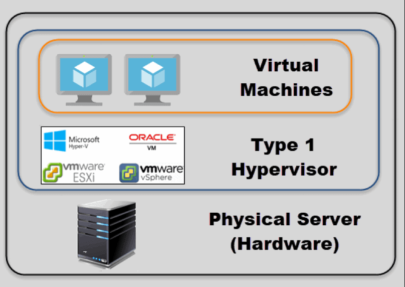
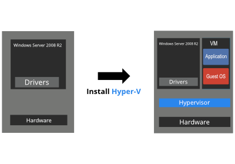
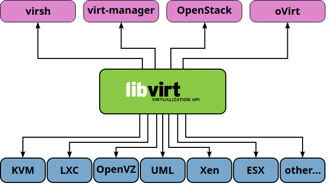

# Hypervisor

buradaki anlarım daha çok altta bahsi geçen type 2 hypervisor tanımı gibidir.

Hypervisor, sanallaştırmayı mümkün kılan önemli bir yazılım parçasıdır. Konuk makineleri (Guest) ve üzerinde çalıştıkları işletim sistemini gerçek donanımdan özetler.

Hypervisor ler, CPU / İşlemciler, RAM ve diğer fiziksel kaynakları oluşturduğunuz sanal makinelerden ayıran bir sanallaştırma katmanı oluşturur.

Bir Hypervisor kurduğumuz makineye Host ve üstlerinde çalışan sanal makinelere de konuk (guest) makina denir.

Hypervisor, konuk makinelerin kullanabilmesi için mevcut kaynakları taklit eder. Bis sanal konuk (guest) sistem hypervisor yarıdımıyla host makina üzerinde çalıştırıldığında fiziksel donanımın kendiş emrinde olduğunu zanneder. Yani hakikaten fiziksel makina üzerinde çalıştığını zanneder. 

Bir sanal makinenin (guest) bakış açısından, fiziksel ve sanallaştırılmış ortam arasında hiçbir fark yoktur. Konuk (guest) makineler, hipervizörün onları sanal bir ortamda oluşturduğunu  veya kaynak paylaştıklarını bilmez. 

iki tür hypervisor vardır. Birde Kernel üzerinde çalışanlar var.

- Type 1 Hypervisor (metal veya native)
- Type 2 Hypervisor (hosted hypervisors)
- Kernel Based Hypervisors

## Type 1 Hypervisor

direk olarak hardware üzerine kurulurlar arada bir işletim sistemi yoktur. 

Örnek olarak 

- ProxMox
- AntsleOS, 
- Microsoft Hyper-V ve Xbox One system software, 
- Nutanix AHV, 
- XCP-ng, 
- Oracle VM Server for SPARC, 
- Oracle VM Server for x86, 
- POWER Hypervisor ve VMware ESXi (formerly ESX) ve 
- Xen

proxmox avusturya merkezli bir firma. Ubuntu LTS kernele i baz alarak web tabanlı bir sanallaştırma sunmaktadır. ayrıca üzerinde stoarage ve nmetwork yönteimi de bulunmakatsır. storage sistemi olarak gluster ve ceph i de desteklemektedir. High Available olarak da çalışmaktadır. Enterprise desteği bulunmaktadır. Ayrıca açık kaynak olarak sunduğu sistem bütün özellikleri kapsamaktadır. Perl diliyle yazılmıştır.

Hyper-V is a Type 1 hypervisor. Even though Hyper-V runs as a Windows Server role, it is still considered to be a bare metal, native hypervisor. The key difference between Hyper-V and a Type 2 hypervisor is that Hyper-V uses hardware-assisted virtualization. In other words, virtualization is supported at the CPU level by Intel VT or by AMD-V. This allows Hyper-V virtual machines to communicate directly with the server hardware, allowing virtual machines to perform far better than a Type 2 hypervisor would allow.

## Type 2 Hypervisor

öncelikle bir işletim sisteminin yüklenmiş olmasına ihtiyaç duyarlar. işletim sistemi üzerinde çalışarak host işlerim sistemi ile sanal konuk (guest) işlerim sistemlerini soyutlarlar.

örneğin  
- Parallels Desktop for Mac, 
- QEMU, 
- VirtualBox, 
- VMware Player ve 
- VMware Workstation.

### Kernel Based

Ancak herzaman bu ayrım net olmamaktadır. örneğin (Linux) Kernel-based Virtual Machine (KVM) ve FreeBSD bhyve birer  kernel module'ler dir ve üzerinde çalıştıkları işlerim sistemini bire type 1 Hypervisor şekline getirirler.  

## Wiki Sayfası

bütün sanallaştırmaların karşılaştırması var.

https://en.wikipedia.org/wiki/Comparison_of_platform_virtualization_software

### libvirt

şuan projenin sahibi Red Hat'dir

Farklı virtualization araçları için bir orchestration aracıdır. Bu araçları soyutlayarak API üzerinden yöntim sağlar (KVM, Xen, VMware ESXi, QEMU).

birçok uygulamada kullanılmuştır.

https://libvirt.org/apps.html

- Command line tools (vagrant-libvirt: libvirt üzerinde vagrant yönetimi sağlar)
- Configuration Management
- Continuous Integration 
- Conversion
- Desktop applications (virt-manager, virt-viewer)
- Infrastructure as a Service (openstack)
- Libraries
- Monitoring
- Web applications (Kimchi: html5 üzerinden KVM yönetimi )
- 

bu uygulamalardan biri de virt-Manager'dır.

desteklediği hypervisorlar (Hypervisor drivers)

- LXC - Linux Containers
- OpenVZ
- QEMU
- Test - Used for testing
- VirtualBox
- VMware ESX
- VMware Workstation/Player
- Xen
- Microsoft Hyper-V
- Virtuozzo
- Bhyve - The BSD Hypervisor

ayrıca Storage ve Secret driverları da vardır. 

Storage Drivers

- LXC - Linux Containers
- OpenVZ
- QEMU
- Test - Used for testing
- VirtualBox
- VMware ESX
- VMware Workstation/Player
- Xen
- Microsoft Hyper-V
- Virtuozzo
- Bhyve - The BSD Hypervisor

### Virt-Manager

Sahibi Red Hat'dir.

libvirt üzerinden sanal makinaları yönetmeyi amaçlamaktadır. Temel de KVM içindir ancak Xen ve LXC' i de yötebilmektedir.

https://virt-manager.org/

### KVM

KVM ubuntu üzerinde kurulumu: https://help.ubuntu.com/community/KVM/Installation

macOS Mojave KVM via virt-manager: https://www.youtube.com/watch?v=4pDe01q6Adg

Hight Available KVM: https://www.golinuxcloud.com/setup-kvm-ha-cluster-pacemaker-gui-centos-8/

